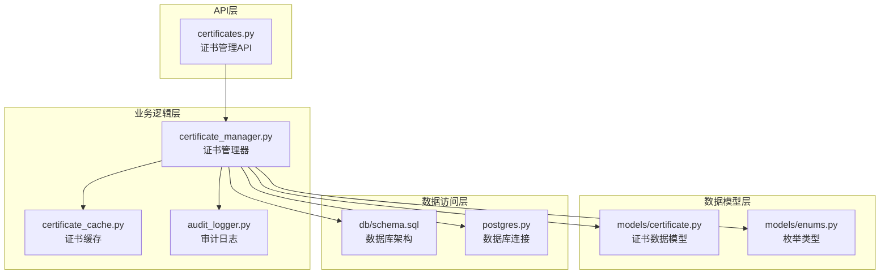
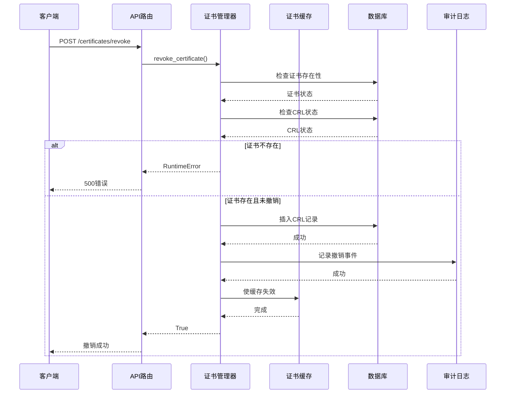
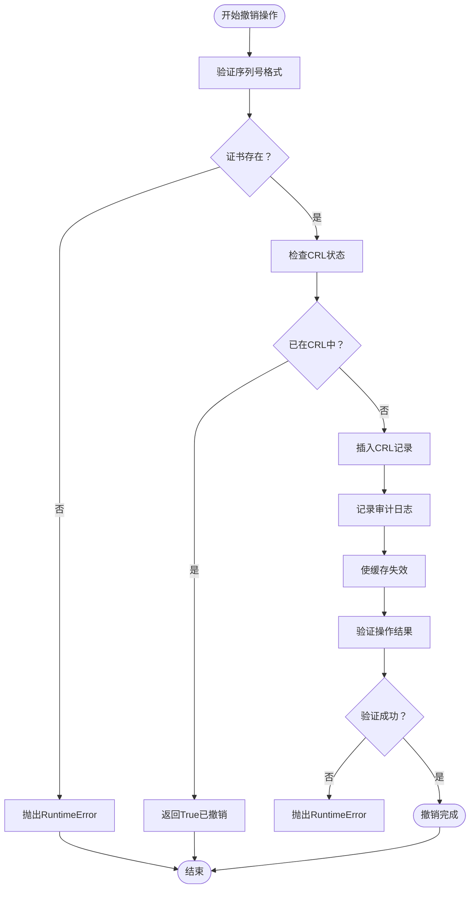
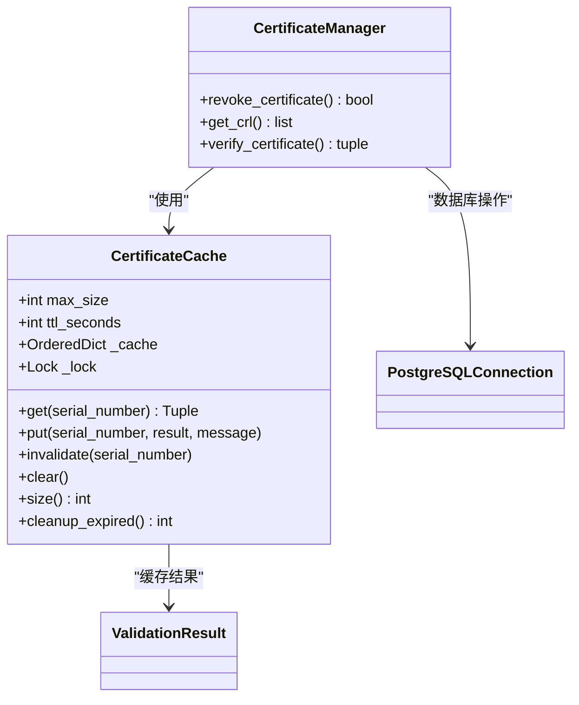
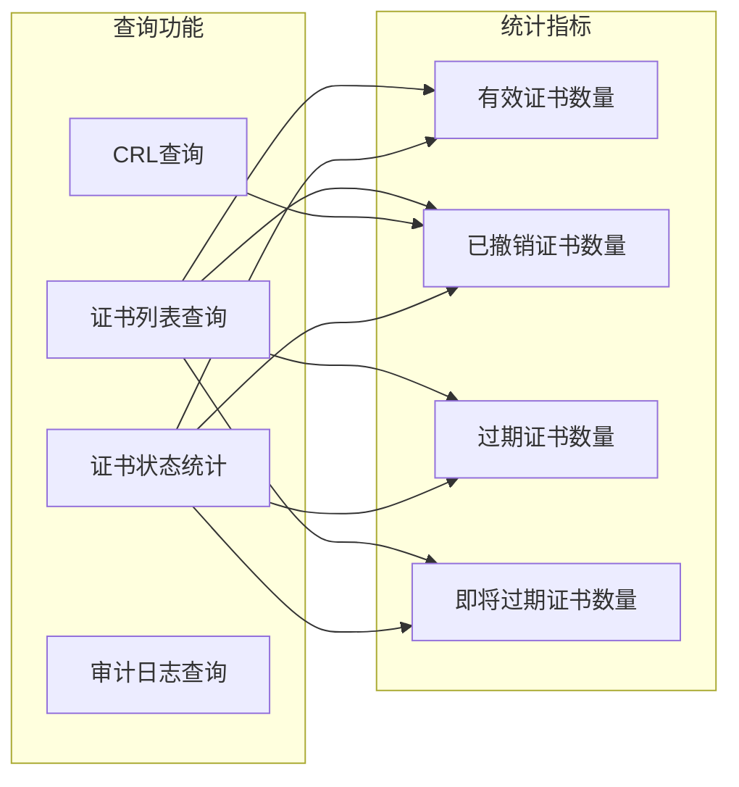
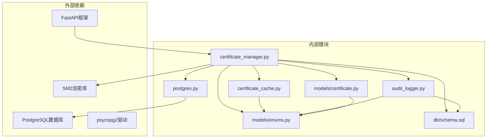

# 证书撤销管理

<cite>
**本文档引用的文件**
- [certificate_manager.py](file://src/certificate_manager.py)
- [certificate_cache.py](file://src/certificate_cache.py)
- [models/certificate.py](file://src/models/certificate.py)
- [models/enums.py](file://src/models/enums.py)
- [audit_logger.py](file://src/audit_logger.py)
- [api/routes/certificates.py](file://src/api/routes/certificates.py)
- [db/schema.sql](file://db/schema.sql)
- [postgres.py](file://src/db/postgres.py)
- [test_crl_management.py](file://tests/test_crl_management.py)
- [test_certificate_manager.py](file://tests/test_certificate_manager.py)
</cite>

## 目录
1. [简介](#简介)
2. [项目结构](#项目结构)
3. [核心组件](#核心组件)
4. [架构概览](#架构概览)
5. [详细组件分析](#详细组件分析)
6. [依赖关系分析](#依赖关系分析)
7. [性能考虑](#性能考虑)
8. [故障排除指南](#故障排除指南)
9. [结论](#结论)

## 简介

证书撤销管理是车联网安全通信网关系统中的关键功能模块，负责维护和管理数字证书的生命周期。本系统基于SM2算法实现，提供完整的证书撤销管理功能，包括撤销原因记录、CRL列表更新和审计日志记录。

系统采用分层架构设计，通过API路由层、业务逻辑层和数据访问层的清晰分离，确保了撤销操作的原子性和一致性。所有撤销操作都会自动更新CRL列表，并记录详细的审计日志，支持实时监控和合规审计。

## 项目结构

证书撤销管理相关的代码分布在以下主要模块中：

**图表来源**
- [certificates.py:1-390](file://src/api/routes/certificates.py#L1-L390)
- [certificate_manager.py:1-734](file://src/certificate_manager.py#L1-L734)
- [certificate_cache.py:1-156](file://src/certificate_cache.py#L1-L156)

**章节来源**
- [certificates.py:1-390](file://src/api/routes/certificates.py#L1-L390)
- [certificate_manager.py:1-734](file://src/certificate_manager.py#L1-L734)

## 核心组件

### 证书撤销管理器

证书撤销管理器是撤销功能的核心实现，提供了完整的撤销流程控制：

- **撤销操作**：将证书序列号添加到CRL列表
- **前置条件验证**：检查证书存在性和有效性
- **后置条件验证**：确保撤销操作的原子性
- **缓存失效**：撤销后立即清除相关缓存

### 证书缓存系统

采用LRU（最近最少使用）缓存策略，提供高性能的证书验证加速：

- **缓存容量**：10,000个条目
- **TTL设置**：5分钟
- **线程安全**：使用锁机制保证并发安全
- **智能失效**：撤销时自动失效相关条目

### 审计日志系统

完整的审计跟踪机制，记录所有重要操作：

- **事件类型**：CERTIFICATE_ISSUED、CERTIFICATE_REVOKED
- **详细信息**：包含操作详情和IP地址
- **持久化存储**：支持JSON和CSV格式导出
- **查询功能**：支持按时间、类型、结果等条件过滤

**章节来源**
- [certificate_manager.py:334-430](file://src/certificate_manager.py#L334-L430)
- [certificate_cache.py:13-156](file://src/certificate_cache.py#L13-L156)
- [audit_logger.py:26-242](file://src/audit_logger.py#L26-L242)

## 架构概览

证书撤销管理系统的整体架构采用分层设计，确保各层职责清晰分离：

**图表来源**
- [certificates.py:277-359](file://src/api/routes/certificates.py#L277-L359)
- [certificate_manager.py:334-430](file://src/certificate_manager.py#L334-L430)

系统采用以下设计原则：

1. **单一职责原则**：每个组件专注于特定功能
2. **开闭原则**：对扩展开放，对修改封闭
3. **依赖倒置原则**：高层模块不依赖低层模块
4. **接口隔离原则**：提供清晰的接口定义

## 详细组件分析

### 撤销操作流程

撤销操作是一个严格的五步流程，确保操作的原子性和一致性：

**图表来源**
- [certificate_manager.py:368-429](file://src/certificate_manager.py#L368-L429)

### 缓存失效机制

撤销后的缓存失效是确保系统一致性的关键机制：

**图表来源**
- [certificate_cache.py:13-156](file://src/certificate_cache.py#L13-L156)
- [certificate_manager.py:334-430](file://src/certificate_manager.py#L334-L430)

### 错误处理策略

系统实现了完善的错误处理机制，涵盖各种异常情况：

| 错误类型 | 触发条件 | 处理方式 | 审计记录 |
|---------|---------|---------|---------|
| 证书不存在 | 数据库查询无结果 | 抛出RuntimeError | 记录CERTIFICATE_REVOKED失败 |
| 重复撤销 | 证书已在CRL中 | 返回True（视为成功） | 记录重复撤销尝试 |
| 数据库连接错误 | 连接超时或中断 | 抛出RuntimeError | 记录数据库错误 |
| 格式验证失败 | 序列号长度超过64字符 | 抛出ValueError | 记录格式验证失败 |

**章节来源**
- [certificate_manager.py:368-429](file://src/certificate_manager.py#L368-L429)
- [test_certificate_manager.py:721-757](file://tests/test_certificate_manager.py#L721-L757)

### 查询和统计功能

系统提供多种查询和统计功能，支持证书状态的实时监控：

**图表来源**
- [certificates.py:81-152](file://src/api/routes/certificates.py#L81-L152)
- [certificate_manager.py:432-471](file://src/certificate_manager.py#L432-L471)

## 依赖关系分析

证书撤销管理系统的主要依赖关系如下：

**图表来源**
- [certificate_manager.py:1-18](file://src/certificate_manager.py#L1-L18)
- [postgres.py:1-53](file://src/db/postgres.py#L1-L53)

系统的关键依赖特性：

1. **数据库依赖**：完全依赖PostgreSQL的ACID特性
2. **加密依赖**：依赖SM2算法的数字签名能力
3. **框架依赖**：基于FastAPI的异步处理能力
4. **缓存依赖**：依赖内存缓存的高性能特性

**章节来源**
- [certificate_manager.py:1-18](file://src/certificate_manager.py#L1-L18)
- [postgres.py:1-53](file://src/db/postgres.py#L1-L53)

## 性能考虑

### 缓存策略

系统采用多级缓存策略提升性能：

- **证书验证缓存**：LRU缓存，10,000条目，5分钟TTL
- **CRL缓存**：应用启动时加载，定期刷新
- **数据库连接池**：复用数据库连接减少开销

### 并发处理

系统通过以下机制保证并发安全性：

- **线程锁**：缓存操作使用互斥锁
- **数据库事务**：撤销操作在事务中执行
- **原子操作**：CRL插入和审计记录的原子性

### 监控指标

系统提供以下性能监控指标：

- **缓存命中率**：评估缓存效果
- **数据库响应时间**：监控数据库性能
- **API响应延迟**：监控接口性能
- **内存使用情况**：监控缓存占用

## 故障排除指南

### 常见问题及解决方案

| 问题类型 | 症状 | 可能原因 | 解决方案 |
|---------|------|---------|---------|
| 撤销失败 | 返回False | 证书不存在 | 检查证书序列号 |
| 重复撤销 | 抛出RuntimeError | 数据库约束冲突 | 检查CRL状态 |
| 缓存不一致 | 验证结果异常 | 缓存未失效 | 手动清理缓存 |
| 审计日志缺失 | 审计记录不完整 | 数据库连接失败 | 检查数据库配置 |

### 调试工具

系统提供以下调试工具：

1. **证书状态检查**：验证证书当前状态
2. **CRL同步检查**：确认CRL与数据库一致性
3. **缓存状态监控**：查看缓存使用情况
4. **审计日志查询**：搜索特定事件记录

### 最佳实践

1. **定期备份**：定期备份数据库和审计日志
2. **监控告警**：设置性能和错误监控告警
3. **容量规划**：根据业务量规划缓存和数据库容量
4. **安全加固**：定期更新密钥和安全配置

**章节来源**
- [test_crl_management.py:1-400](file://tests/test_crl_management.py#L1-L400)
- [test_certificate_manager.py:1-200](file://tests/test_certificate_manager.py#L1-L200)

## 结论

证书撤销管理系统通过精心设计的架构和完善的错误处理机制，为车联网安全通信提供了可靠的证书生命周期管理能力。系统的主要优势包括：

1. **高可靠性**：通过原子性操作和事务处理确保数据一致性
2. **高性能**：多级缓存和优化的数据库查询提升性能
3. **可审计性**：完整的审计日志记录支持合规要求
4. **可扩展性**：模块化设计支持功能扩展和性能优化

系统在证书撤销管理方面达到了行业标准，能够满足车联网场景下的安全和性能要求。通过持续的监控和优化，系统将继续为车联网安全通信提供可靠保障。