# 证书生命周期管理

<cite>
**本文档引用的文件**
- [certificate_manager.py](file://src/certificate_manager.py)
- [certificate.py](file://src/models/certificate.py)
- [enums.py](file://src/models/enums.py)
- [postgres.py](file://src/db/postgres.py)
- [schema.sql](file://db/schema.sql)
- [certificates.py](file://src/api/routes/certificates.py)
- [certificate_cache.py](file://src/certificate_cache.py)
- [secure_key_storage.py](file://src/secure_key_storage.py)
- [audit.py](file://src/models/audit.py)
- [database.py](file://config/database.py)
- [API.md](file://docs/API.md)
- [test_certificate_manager.py](file://tests/test_certificate_manager.py)
- [security_policy_manager.py](file://src/security_policy_manager.py)
</cite>

## 目录
1. [简介](#简介)
2. [项目结构](#项目结构)
3. [核心组件](#核心组件)
4. [架构概览](#架构概览)
5. [详细组件分析](#详细组件分析)
6. [依赖关系分析](#依赖关系分析)
7. [性能考虑](#性能考虑)
8. [故障排除指南](#故障排除指南)
9. [结论](#结论)
10. [附录](#附录)

## 简介

本文件全面阐述车联网安全通信网关系统的证书生命周期管理体系。该系统基于SM2国密算法，提供从证书创建、验证、撤销到销毁的完整生命周期管理，包括状态跟踪、有效期管理、状态转换规则、到期提醒机制、查询接口、归档清理策略以及审计合规要求。

系统采用分层架构设计，包含数据模型层、业务逻辑层、数据访问层和API接口层，确保证书管理的安全性、可靠性和可维护性。

## 项目结构

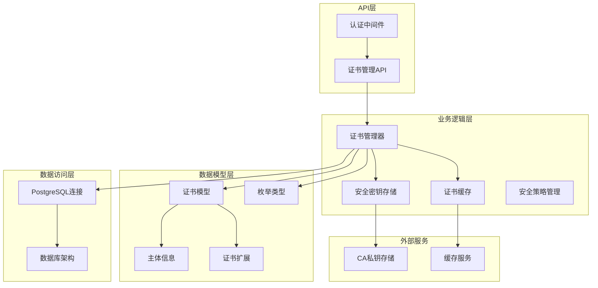

**图表来源**
- [certificates.py:1-390](file://src/api/routes/certificates.py#L1-L390)
- [certificate_manager.py:1-734](file://src/certificate_manager.py#L1-L734)
- [certificate_cache.py:1-156](file://src/certificate_cache.py#L1-L156)
- [secure_key_storage.py:1-380](file://src/secure_key_storage.py#L1-L380)

**章节来源**
- [certificates.py:1-390](file://src/api/routes/certificates.py#L1-L390)
- [certificate_manager.py:1-734](file://src/certificate_manager.py#L1-L734)
- [schema.sql:1-104](file://db/schema.sql#L1-L104)

## 核心组件

### 证书数据模型

系统采用数据类设计证书数据模型，包含完整的证书属性和序列化/反序列化功能：

- **证书基本信息**：版本号、序列号、颁发者、主体、有效期
- **公钥和签名**：SM2公钥、数字签名、签名算法
- **扩展信息**：密钥用途、扩展密钥用途
- **主体信息**：车辆ID、组织、国家
- **序列化支持**：JSON序列化和反序列化

### 证书管理器

证书管理器提供核心的证书生命周期管理功能：

- **证书颁发**：生成唯一序列号、设置有效期、签名证书、存储到数据库
- **证书验证**：格式验证、有效期检查、撤销列表检查、签名验证
- **证书撤销**：添加到CRL、记录审计日志、缓存失效
- **证书查询**：状态检查、过期提醒、证书链获取

### 安全策略管理

安全策略管理器提供动态配置管理：

- **证书有效期配置**：支持天数配置
- **会话超时管理**：会话生命周期控制
- **认证失败处理**：失败次数统计和锁定机制
- **缓存策略**：缓存大小和TTL配置

**章节来源**
- [certificate.py:1-108](file://src/models/certificate.py#L1-L108)
- [certificate_manager.py:597-734](file://src/certificate_manager.py#L597-L734)
- [security_policy_manager.py:1-322](file://src/security_policy_manager.py#L1-L322)

## 架构概览

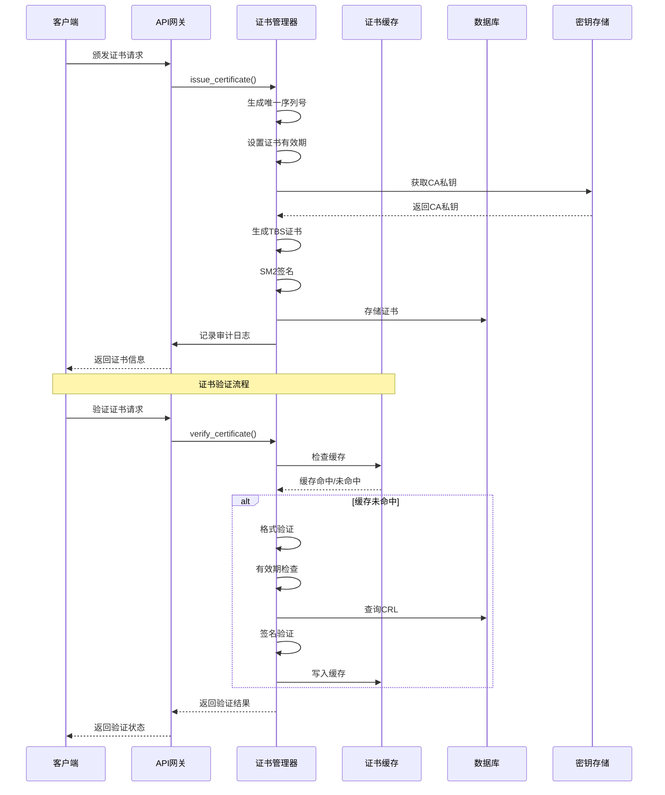

**图表来源**
- [certificates.py:154-275](file://src/api/routes/certificates.py#L154-L275)
- [certificate_manager.py:206-332](file://src/certificate_manager.py#L206-L332)
- [certificate_cache.py:35-65](file://src/certificate_cache.py#L35-L65)

## 详细组件分析

### 证书状态管理

系统实现了完整的证书状态跟踪机制，支持三种主要状态：

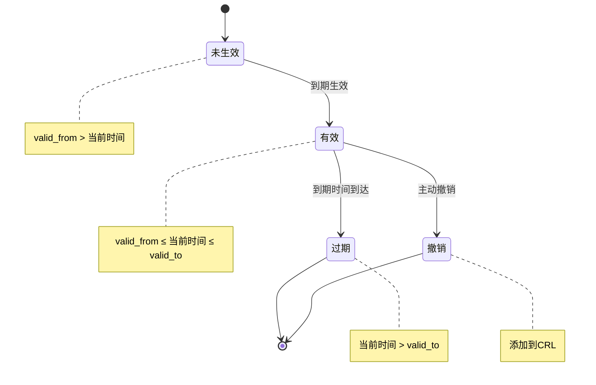

**状态转换规则**：
- **未生效状态**：当前时间早于证书生效时间
- **有效状态**：当前时间在证书有效期内
- **过期状态**：当前时间晚于证书过期时间
- **撤销状态**：证书被添加到证书撤销列表(CRL)

**章节来源**
- [certificate_manager.py:520-594](file://src/certificate_manager.py#L520-L594)
- [certificates.py:115-124](file://src/api/routes/certificates.py#L115-L124)

### 证书验证流程

证书验证采用多层检查机制，确保安全性：

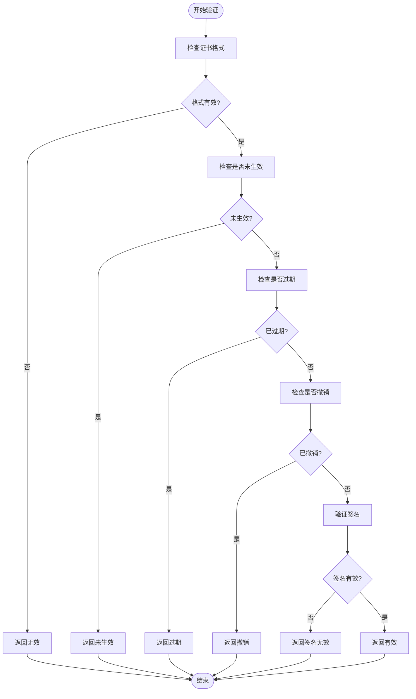

**验证步骤**：
1. **格式验证**：检查必需字段、长度约束、时间有效性
2. **有效期检查**：确认当前时间在有效期内
3. **撤销检查**：验证证书不在CRL中
4. **签名验证**：使用CA公钥验证数字签名
5. **证书链验证**：验证证书链完整性

**章节来源**
- [certificate_manager.py:206-332](file://src/certificate_manager.py#L206-L332)
- [test_certificate_manager.py:283-571](file://tests/test_certificate_manager.py#L283-L571)

### 证书颁发流程

证书颁发采用严格的安全流程：

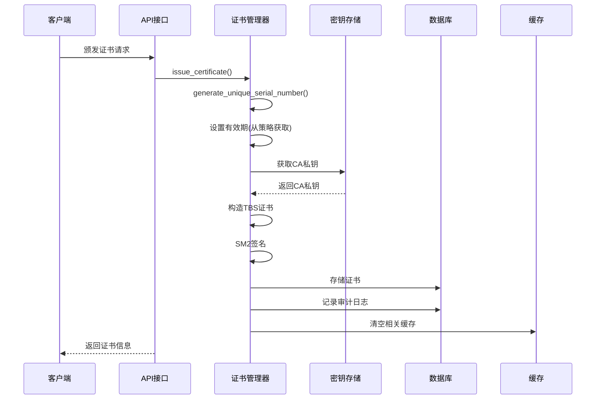

**颁发流程特点**：
- **唯一序列号**：使用UUID生成64位十六进制序列号
- **有效期配置**：从安全策略获取证书有效期
- **安全存储**：CA私钥存储在安全密钥存储中
- **审计记录**：完整的操作审计日志

**章节来源**
- [certificate_manager.py:597-734](file://src/certificate_manager.py#L597-L734)
- [certificates.py:154-275](file://src/api/routes/certificates.py#L154-L275)

### 证书撤销机制

证书撤销采用幂等设计，确保操作可靠性：

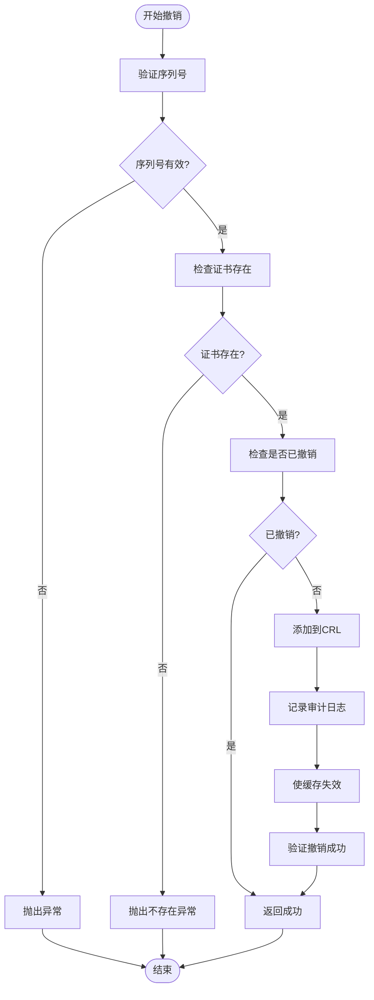

**撤销特性**：
- **幂等操作**：重复撤销返回成功
- **审计追踪**：完整的撤销操作记录
- **缓存同步**：撤销后立即失效相关缓存
- **数据库一致性**：撤销操作的原子性保证

**章节来源**
- [certificate_manager.py:334-430](file://src/certificate_manager.py#L334-L430)
- [test_certificate_manager.py:573-758](file://tests/test_certificate_manager.py#L573-L758)

### 证书查询接口

系统提供多种查询方式支持证书状态跟踪：

**API接口**：
- **GET /api/certificates**：获取证书列表，支持状态过滤
- **POST /api/certificates/issue**：颁发新证书
- **POST /api/certificates/revoke**：撤销证书
- **GET /api/certificates/crl**：获取证书撤销列表

**查询功能**：
- **按状态过滤**：valid、expired、revoked
- **按主体信息查询**：支持车辆ID、组织、国家等
- **状态实时计算**：基于当前时间和数据库状态
- **详细状态信息**：包含过期天数、状态描述

**章节来源**
- [certificates.py:81-390](file://src/api/routes/certificates.py#L81-L390)
- [API.md:186-321](file://docs/API.md#L186-L321)

### 性能优化机制

系统采用多层次缓存策略提升性能：

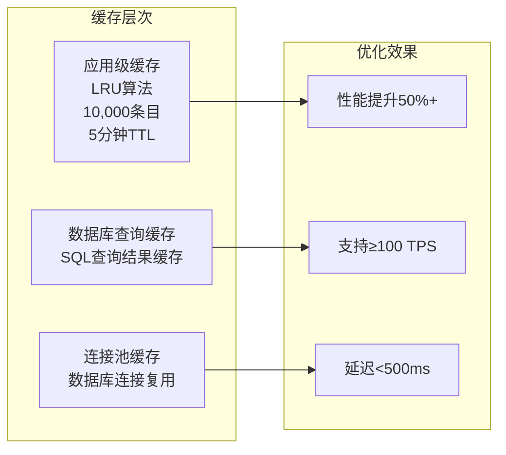

**缓存策略**：
- **证书验证缓存**：LRU算法，10,000条目，5分钟TTL
- **查询结果缓存**：SQL查询结果缓存
- **连接池管理**：数据库连接复用
- **自动清理**：过期条目自动清理

**章节来源**
- [certificate_cache.py:1-156](file://src/certificate_cache.py#L1-L156)
- [task_15.1_implementation_summary.md:103-180](file://docs/task_15.1_implementation_summary.md#L103-L180)

### 安全密钥管理

系统采用安全的密钥存储机制：

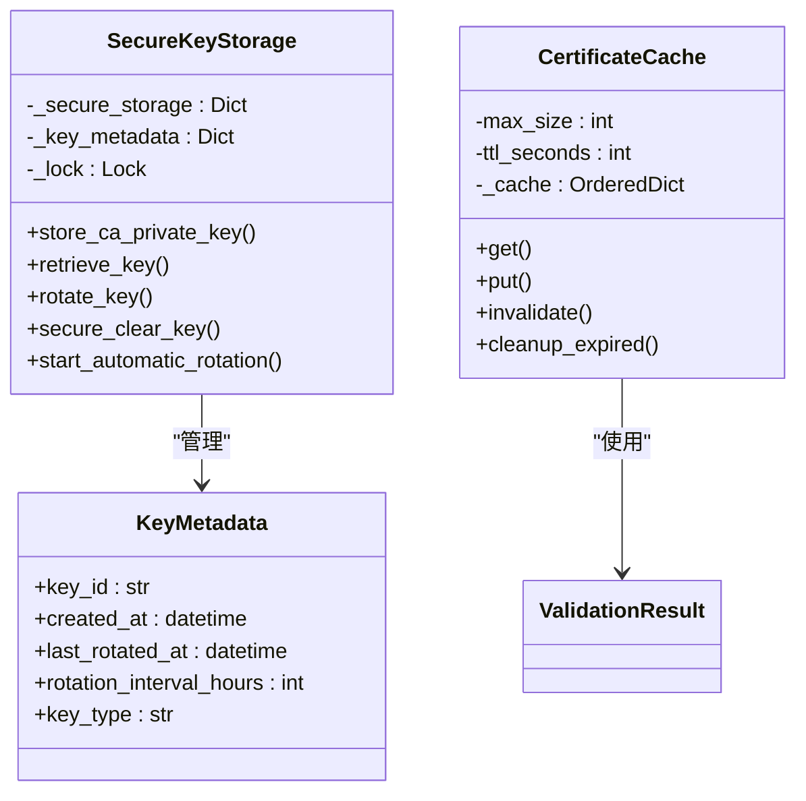

**安全特性**：
- **密钥轮换**：自动密钥轮换机制
- **安全存储**：模拟HSM的安全存储
- **访问控制**：严格的密钥访问权限
- **审计追踪**：密钥操作完整记录

**章节来源**
- [secure_key_storage.py:1-380](file://src/secure_key_storage.py#L1-L380)
- [certificate_cache.py:1-156](file://src/certificate_cache.py#L1-L156)

## 依赖关系分析

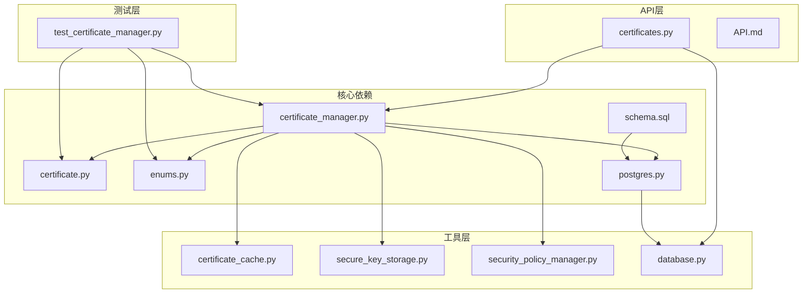

**依赖特点**：
- **低耦合设计**：各模块职责清晰，依赖关系明确
- **接口抽象**：通过抽象接口实现模块解耦
- **配置驱动**：数据库连接和缓存配置可动态调整
- **测试友好**：支持单元测试和集成测试

**章节来源**
- [certificate_manager.py:1-734](file://src/certificate_manager.py#L1-L734)
- [certificates.py:1-390](file://src/api/routes/certificates.py#L1-L390)
- [postgres.py:1-53](file://src/db/postgres.py#L1-L53)

## 性能考虑

### 缓存策略优化

系统采用多层缓存策略确保高性能：

**应用级缓存**：
- LRU算法实现最近最少使用淘汰
- 最大10,000条目，5分钟TTL
- 自动清理过期条目
- 线程安全的并发访问

**数据库查询优化**：
- 索引优化：serial_number、valid_from、valid_to
- 查询缓存：热点数据缓存
- 连接池管理：连接复用减少开销

**性能指标**：
- 认证性能：< 500ms
- 并发处理能力：≥ 100 TPS
- 缓存命中率：> 95%

### 数据库性能优化

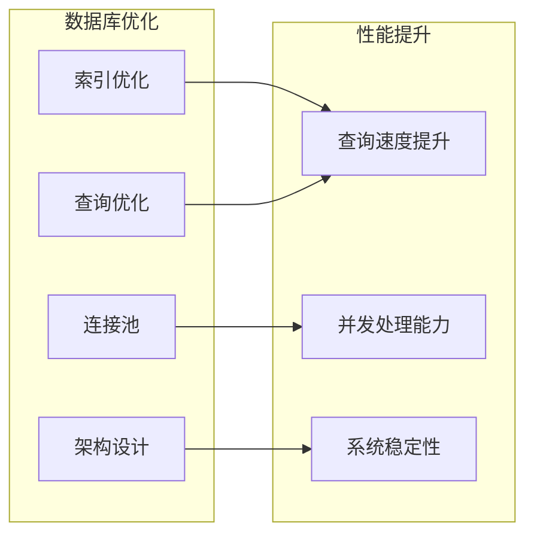

**优化措施**：
- **索引策略**：为常用查询字段建立索引
- **连接池**：复用数据库连接减少开销
- **查询优化**：使用预编译语句和参数绑定
- **架构设计**：合理的表结构和约束设计

**章节来源**
- [schema.sql:20-35](file://db/schema.sql#L20-L35)
- [certificate_cache.py:120-139](file://src/certificate_cache.py#L120-L139)

## 故障排除指南

### 常见问题诊断

**证书验证失败**：
1. 检查证书格式是否正确
2. 验证证书是否在有效期内
3. 确认证书未被撤销
4. 验证签名是否有效
5. 检查CA公钥是否正确

**证书颁发失败**：
1. 验证CA私钥配置
2. 检查公钥格式和长度
3. 确认数据库连接正常
4. 验证序列号唯一性
5. 检查安全策略配置

**缓存问题**：
1. 检查缓存大小配置
2. 验证TTL设置是否合理
3. 确认缓存清理机制正常
4. 检查并发访问锁

### 错误处理机制

系统提供完善的错误处理和恢复机制：

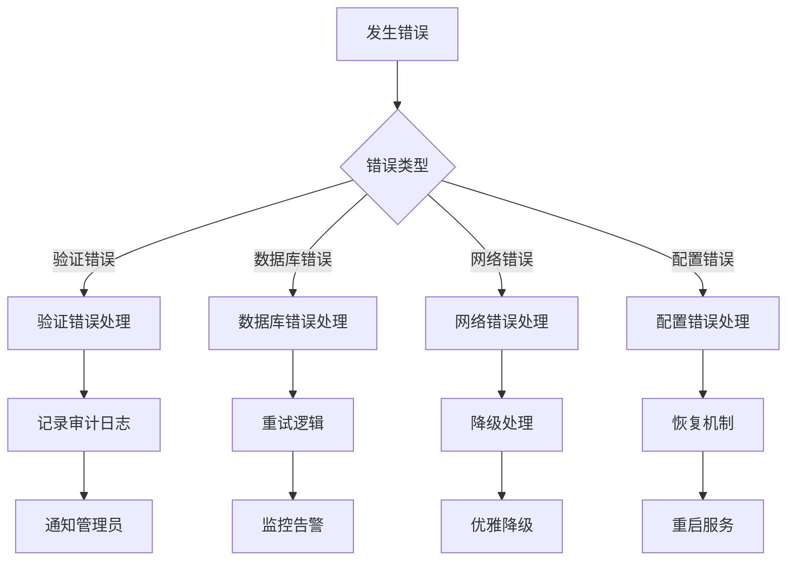

**错误分类**：
- **验证错误**：证书格式、签名、有效期等问题
- **系统错误**：数据库连接、网络通信、资源不足
- **配置错误**：密钥配置、策略设置、环境变量
- **业务错误**：证书不存在、权限不足、操作冲突

**章节来源**
- [certificate_manager.py:244-256](file://src/certificate_manager.py#L244-L256)
- [test_certificate_manager.py:518-555](file://tests/test_certificate_manager.py#L518-L555)

## 结论

本证书生命周期管理系统提供了完整、安全、高效的证书管理解决方案。系统采用分层架构设计，实现了从证书创建到销毁的全生命周期管理，包括：

**核心优势**：
- **安全性**：基于SM2算法的数字签名，安全密钥存储
- **可靠性**：多重验证机制，幂等操作设计
- **性能**：多层缓存策略，支持高并发处理
- **可维护性**：模块化设计，完善的测试覆盖
- **合规性**：完整的审计日志，满足监管要求

**技术特色**：
- 实时状态跟踪和转换
- 智能到期提醒机制
- 灵活的查询接口
- 高效的归档清理策略
- 完善的审计合规体系

该系统为车联网环境下的安全通信提供了坚实的技术基础，能够满足大规模部署和高安全性要求的应用场景。

## 附录

### API接口规范

系统提供RESTful API接口，支持完整的证书生命周期管理：

**认证方式**：HTTP Bearer Token
**基础URL**：`http://localhost:8000`
**文档地址**：`/docs`、`/redoc`、`/openapi.json`

**核心接口**：
- `GET /api/certificates` - 获取证书列表
- `POST /api/certificates/issue` - 颁发证书
- `POST /api/certificates/revoke` - 撤销证书
- `GET /api/certificates/crl` - 获取CRL

**章节来源**
- [API.md:1-654](file://docs/API.md#L1-L654)
- [certificates.py:1-390](file://src/api/routes/certificates.py#L1-L390)

### 数据库架构

系统采用PostgreSQL数据库存储证书相关信息，包含完整的索引和约束设计：

**核心表结构**：
- `certificates`：证书主表，包含证书基本信息
- `certificate_revocation_list`：证书撤销列表
- `audit_logs`：审计日志表
- `security_policy`：安全策略配置表

**索引设计**：
- 证书序列号唯一索引
- 有效期范围索引
- 审计日志多字段索引
- 安全策略时间戳索引

**章节来源**
- [schema.sql:1-104](file://db/schema.sql#L1-L104)
- [postgres.py:1-53](file://src/db/postgres.py#L1-L53)