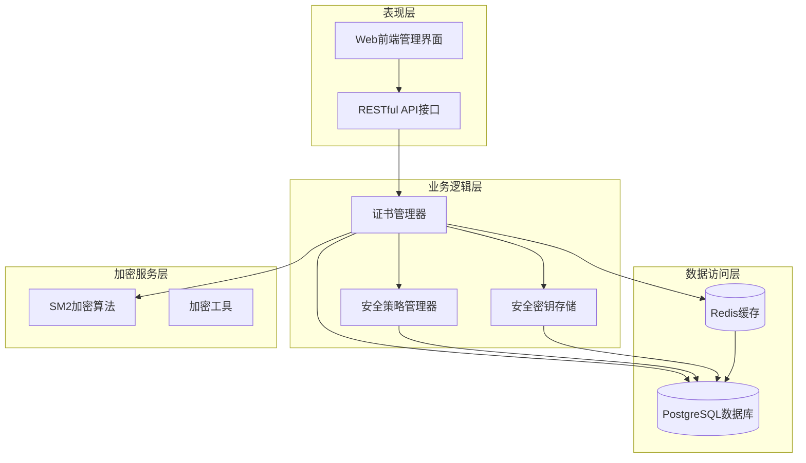
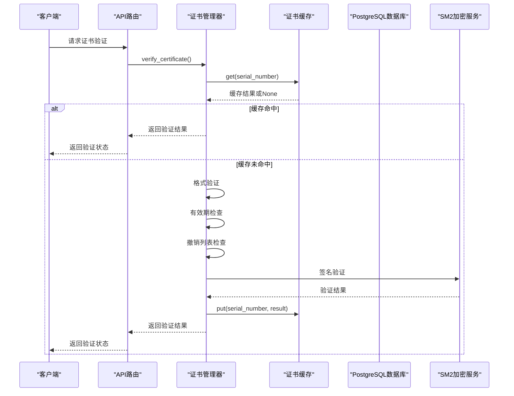
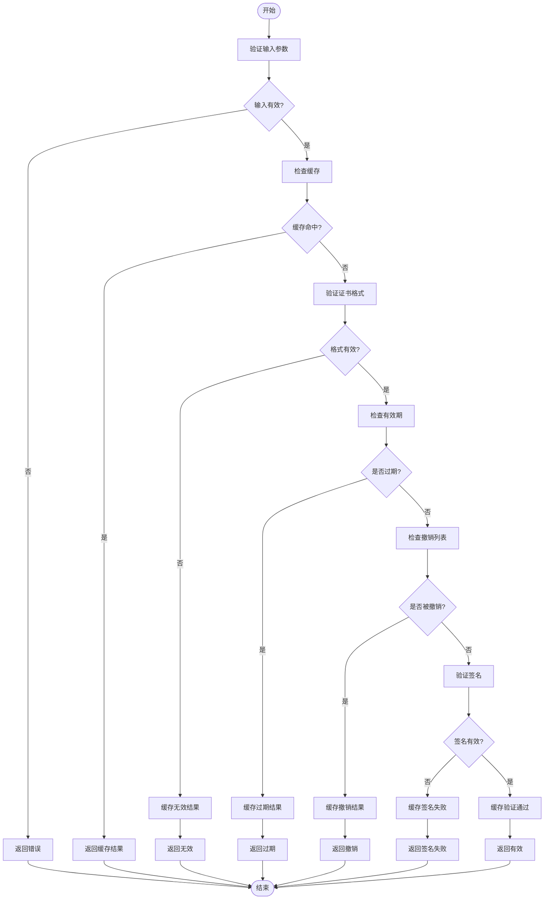
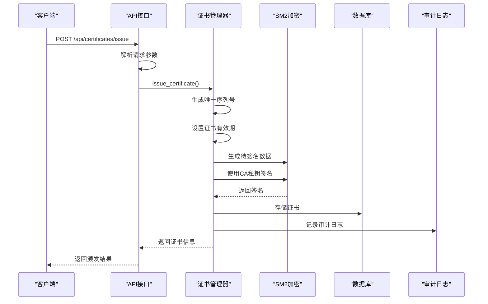
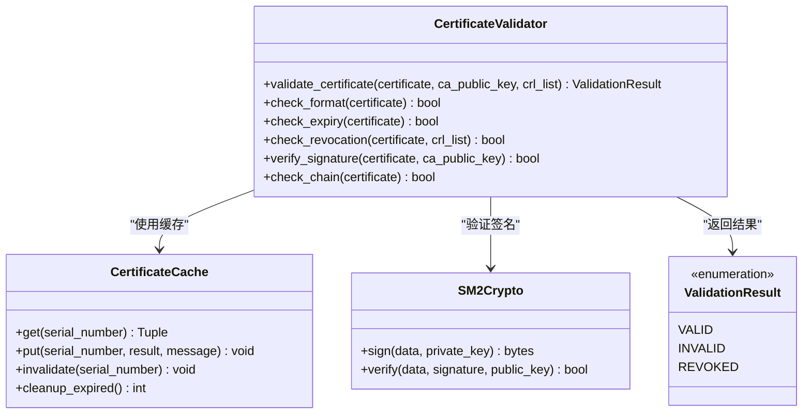
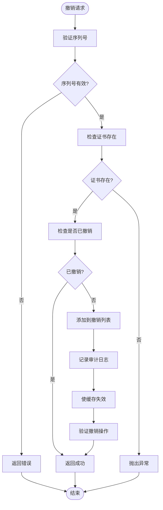
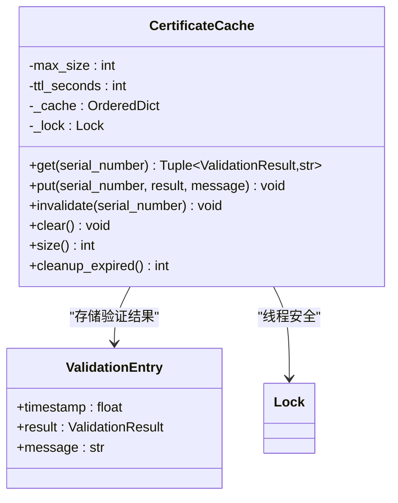
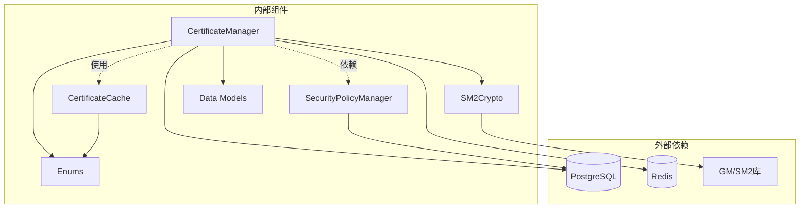
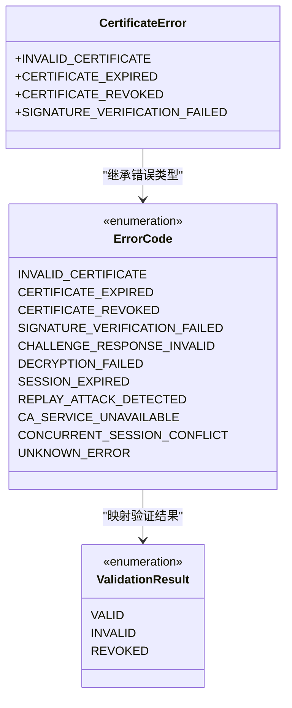

# 证书管理服务

<cite>
**本文档引用的文件**
- [certificate_manager.py](file://src/certificate_manager.py)
- [certificate_cache.py](file://src/certificate_cache.py)
- [certificate.py](file://src/models/certificate.py)
- [certificates.py](file://src/api/routes/certificates.py)
- [enums.py](file://src/models/enums.py)
- [sm2.py](file://src/crypto/sm2.py)
- [schema.sql](file://db/schema.sql)
- [CertificateManagement.jsx](file://web/src/pages/CertificateManagement.jsx)
- [certificates.js](file://web/src/api/certificates.js)
- [test_certificate_manager.py](file://tests/test_certificate_manager.py)
- [test_certificate_cache.py](file://tests/test_certificate_cache.py)
- [security_policy_manager.py](file://src/security_policy_manager.py)
</cite>

## 目录
1. [简介](#简介)
2. [项目结构](#项目结构)
3. [核心组件](#核心组件)
4. [架构概览](#架构概览)
5. [详细组件分析](#详细组件分析)
6. [依赖关系分析](#依赖关系分析)
7. [性能考量](#性能考量)
8. [故障排除指南](#故障排除指南)
9. [结论](#结论)
10. [附录](#附录)

## 简介

证书管理服务是车联网安全通信网关系统的核心组件，负责实现完整的证书生命周期管理。该服务基于国密SM2算法，提供证书颁发、验证、撤销和状态检查等核心功能，同时具备高效的缓存机制和完善的错误处理能力。

本服务采用FastAPI框架构建RESTful API接口，支持Web前端管理界面，具备高可用性和可扩展性。系统通过PostgreSQL数据库存储证书信息，使用Redis进行缓存管理，并通过审计日志确保所有操作的可追溯性。

## 项目结构

证书管理服务采用分层架构设计，主要包含以下层次：



**图表来源**
- [certificate_manager.py:1-734](file://src/certificate_manager.py#L1-L734)
- [certificates.py:1-390](file://src/api/routes/certificates.py#L1-L390)
- [certificate_cache.py:1-156](file://src/certificate_cache.py#L1-L156)

**章节来源**
- [certificate_manager.py:1-734](file://src/certificate_manager.py#L1-L734)
- [certificates.py:1-390](file://src/api/routes/certificates.py#L1-L390)

## 核心组件

### 证书管理器 (CertificateManager)

证书管理器是系统的核心业务逻辑组件，提供完整的证书生命周期管理功能：

- **证书颁发**: 支持SM2算法的证书签发，包含序列号生成、有效期设置、签名验证等功能
- **证书验证**: 实现多步骤验证流程，包括格式检查、有效期验证、撤销列表检查、签名验证等
- **证书撤销**: 提供证书撤销功能，支持撤销原因记录和缓存失效
- **证书状态检查**: 提供详细的证书状态信息，包括有效期剩余天数、状态描述等

### 证书缓存 (CertificateCache)

证书缓存采用LRU（最近最少使用）算法，显著提升验证性能：

- **缓存策略**: LRU淘汰策略，最大容量10,000条记录
- **TTL设置**: 默认5分钟缓存时间，过期自动清理
- **线程安全**: 使用Lock确保多线程环境下的数据一致性
- **失效机制**: 支持按证书序列号精确失效和批量清理

### 数据模型 (CertificateModels)

系统定义了完整的证书数据模型，确保数据结构的一致性和完整性：

- **Certificate**: 数字证书实体，包含版本、序列号、颁发者、主题、有效期等字段
- **SubjectInfo**: 证书主体信息，包含车辆ID、组织、国家等
- **CertificateExtensions**: 证书扩展信息，支持密钥用途和扩展密钥用途定义

**章节来源**
- [certificate_manager.py:206-331](file://src/certificate_manager.py#L206-L331)
- [certificate_cache.py:13-156](file://src/certificate_cache.py#L13-L156)
- [certificate.py:54-108](file://src/models/certificate.py#L54-L108)

## 架构概览

证书管理服务采用微服务架构，各组件职责清晰，耦合度低：



**图表来源**
- [certificate_manager.py:206-331](file://src/certificate_manager.py#L206-L331)
- [certificate_cache.py:35-93](file://src/certificate_cache.py#L35-L93)

### 数据流图



**图表来源**
- [certificate_manager.py:267-331](file://src/certificate_manager.py#L267-L331)

**章节来源**
- [certificate_manager.py:206-331](file://src/certificate_manager.py#L206-L331)
- [certificate_cache.py:13-156](file://src/certificate_cache.py#L13-L156)

## 详细组件分析

### 证书颁发流程

证书颁发是系统的核心功能之一，采用严格的安全验证流程：



**图表来源**
- [certificate_manager.py:597-733](file://src/certificate_manager.py#L597-L733)
- [certificates.py:154-274](file://src/api/routes/certificates.py#L154-L274)

#### 发放流程关键特性

1. **唯一序列号生成**: 使用UUID4生成64字符十六进制序列号，确保全球唯一性
2. **有效期管理**: 支持配置证书有效期，系统默认365天
3. **签名验证**: 使用SM2算法进行数字签名，确保证书不可伪造
4. **审计追踪**: 所有证书颁发操作都会记录到审计日志

**章节来源**
- [certificate_manager.py:597-733](file://src/certificate_manager.py#L597-L733)
- [certificates.py:154-274](file://src/api/routes/certificates.py#L154-L274)

### 证书验证机制

证书验证采用多层防护机制，确保证书的真实性和有效性：



**图表来源**
- [certificate_manager.py:206-331](file://src/certificate_manager.py#L206-L331)
- [certificate_cache.py:13-156](file://src/certificate_cache.py#L13-L156)
- [sm2.py:206-265](file://src/crypto/sm2.py#L206-L265)

#### 验证流程详解

1. **格式验证**: 检查证书必需字段的存在性和格式正确性
2. **有效期检查**: 确认证书当前处于有效期内
3. **撤销列表检查**: 验证证书未被加入撤销列表
4. **签名验证**: 使用CA公钥验证证书签名的有效性
5. **证书链验证**: 确认证书由可信CA签发

**章节来源**
- [certificate_manager.py:206-331](file://src/certificate_manager.py#L206-L331)
- [certificate_cache.py:13-156](file://src/certificate_cache.py#L13-L156)

### 证书撤销管理

证书撤销功能提供灵活的证书生命周期管理：



**图表来源**
- [certificate_manager.py:334-430](file://src/certificate_manager.py#L334-L430)

#### 撤销特性

1. **幂等操作**: 支持重复撤销请求，避免重复操作
2. **审计追踪**: 所有撤销操作都会记录详细信息
3. **缓存同步**: 自动失效相关缓存条目
4. **状态一致性**: 确保数据库状态与缓存状态一致

**章节来源**
- [certificate_manager.py:334-430](file://src/certificate_manager.py#L334-L430)

### 缓存机制设计

证书缓存采用高性能的LRU策略，优化验证性能：



**图表来源**
- [certificate_cache.py:13-156](file://src/certificate_cache.py#L13-L156)

#### 缓存策略

1. **LRU淘汰**: 最近最少使用的条目优先被淘汰
2. **TTL过期**: 默认5分钟过期时间，防止陈旧数据影响安全
3. **容量限制**: 最大10,000条记录，平衡内存使用和性能
4. **线程安全**: 使用Lock确保并发访问的数据一致性

**章节来源**
- [certificate_cache.py:13-156](file://src/certificate_cache.py#L13-L156)

## 依赖关系分析

证书管理服务的依赖关系清晰，各组件职责明确：



**图表来源**
- [certificate_manager.py:1-18](file://src/certificate_manager.py#L1-L18)
- [certificate_cache.py:1-11](file://src/certificate_cache.py#L1-L11)
- [sm2.py:1-9](file://src/crypto/sm2.py#L1-L9)

### 组件耦合度分析

- **低耦合设计**: 各组件通过明确定义的接口交互，减少相互依赖
- **单一职责**: 每个组件专注于特定功能，便于维护和测试
- **可替换性**: 加密算法、数据库、缓存等组件可独立替换
- **扩展性**: 新增功能时不需要修改现有组件代码

**章节来源**
- [certificate_manager.py:1-18](file://src/certificate_manager.py#L1-L18)
- [certificate_cache.py:1-11](file://src/certificate_cache.py#L1-L11)

## 性能考量

证书管理服务在设计时充分考虑了性能优化：

### 缓存性能优化

1. **LRU缓存**: 10,000条记录容量，5分钟TTL，平衡性能和准确性
2. **线程安全**: 使用Lock确保并发环境下的数据一致性
3. **内存管理**: 自动清理过期条目，防止内存泄漏
4. **快速查找**: 使用OrderedDict实现O(1)级别的缓存查找

### 数据库性能优化

1. **索引优化**: 证书序列号和有效期索引，提升查询性能
2. **批量操作**: 支持批量查询和更新操作
3. **连接池**: 复用数据库连接，减少连接开销
4. **事务管理**: 合理使用事务确保数据一致性

### 加密性能优化

1. **算法选择**: 使用SM2算法，在保证安全性的同时提升性能
2. **密钥管理**: 支持安全密钥存储，避免密钥泄露风险
3. **批量处理**: 支持批量证书验证，提升整体性能

## 故障排除指南

### 常见错误类型

系统定义了完整的错误枚举类型，便于错误诊断和处理：



**图表来源**
- [enums.py:6-18](file://src/models/enums.py#L6-L18)

#### 错误处理策略

1. **输入验证**: 所有API请求都经过严格的参数验证
2. **异常捕获**: 使用try-catch机制捕获和处理异常
3. **审计记录**: 所有错误操作都会记录到审计日志
4. **用户友好**: 向用户提供清晰的错误信息

### 调试技巧

1. **日志分析**: 通过审计日志追踪问题发生的时间和上下文
2. **缓存检查**: 使用缓存清理功能排除缓存导致的问题
3. **数据库查询**: 直接查询数据库确认数据状态
4. **网络诊断**: 检查API接口的响应时间和错误码

**章节来源**
- [enums.py:6-56](file://src/models/enums.py#L6-L56)
- [certificate_manager.py:244-256](file://src/certificate_manager.py#L244-L256)

## 结论

证书管理服务是一个设计精良、功能完整的安全基础设施组件。系统采用现代化的架构设计，具备以下优势：

1. **安全性**: 基于SM2算法的数字证书管理，确保通信安全
2. **高性能**: LRU缓存机制和优化的数据库设计
3. **可维护性**: 清晰的分层架构和完善的测试覆盖
4. **可扩展性**: 模块化设计支持功能扩展和性能优化
5. **可观测性**: 完善的审计日志和监控机制

该服务为车联网生态系统提供了可靠的证书管理基础，支持大规模部署和高并发访问，是构建安全车联网应用的重要基础设施。

## 附录

### API使用指南

#### 证书颁发接口

**请求路径**: `POST /api/certificates/issue`

**请求参数**:
- `vehicle_id`: 车辆标识符 (必填)
- `organization`: 组织名称 (可选，默认: "Vehicle Manufacturer")
- `country`: 国家代码 (可选，默认: "CN")
- `public_key`: 十六进制格式的SM2公钥 (必填)

**响应格式**:
```json
{
  "serial_number": "证书序列号",
  "version": 3,
  "issuer": "颁发者信息",
  "subject": "证书主体",
  "valid_from": "ISO格式日期时间",
  "valid_to": "ISO格式日期时间",
  "public_key": "十六进制公钥",
  "signature": "十六进制签名",
  "signature_algorithm": "SM2",
  "extensions": {},
  "message": "操作结果描述"
}
```

#### 证书撤销接口

**请求路径**: `POST /api/certificates/revoke`

**请求参数**:
- `serial_number`: 证书序列号 (必填)
- `reason`: 撤销原因 (可选)

**响应格式**:
```json
{
  "success": true,
  "message": "撤销操作结果描述"
}
```

#### CRL查询接口

**请求路径**: `GET /api/certificates/crl`

**响应格式**:
```json
{
  "total": 0,
  "revoked_certificates": []
}
```

### 最佳实践建议

1. **密钥管理**: 使用安全密钥存储服务管理CA私钥
2. **缓存策略**: 根据业务需求调整缓存容量和TTL设置
3. **监控告警**: 建立完善的监控体系，及时发现异常情况
4. **备份恢复**: 定期备份数据库，制定灾难恢复计划
5. **安全审计**: 定期审查审计日志，发现潜在安全风险

### 安全考虑

1. **密钥保护**: CA私钥必须妥善保管，建议使用硬件安全模块(HSM)
2. **传输安全**: 所有API通信必须使用HTTPS协议
3. **权限控制**: 实施最小权限原则，限制API访问权限
4. **输入验证**: 对所有用户输入进行严格验证和过滤
5. **日志保护**: 审计日志应防止篡改和删除