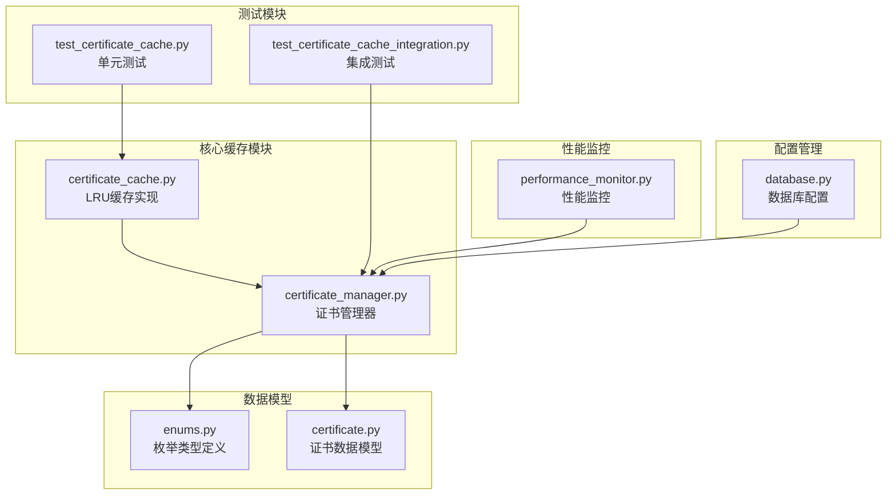
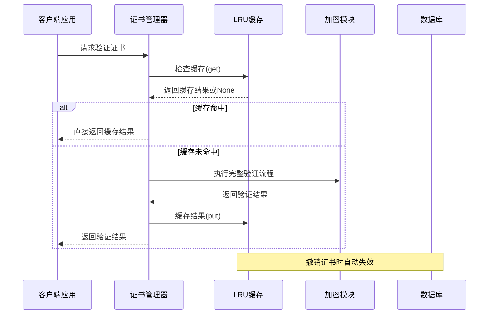
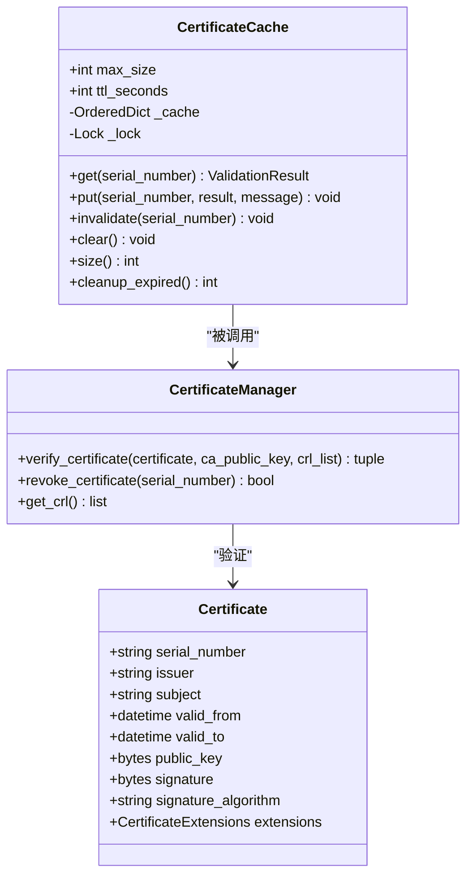
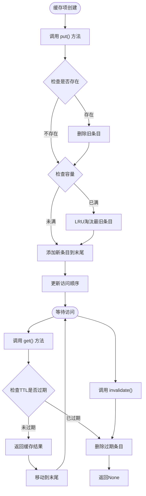
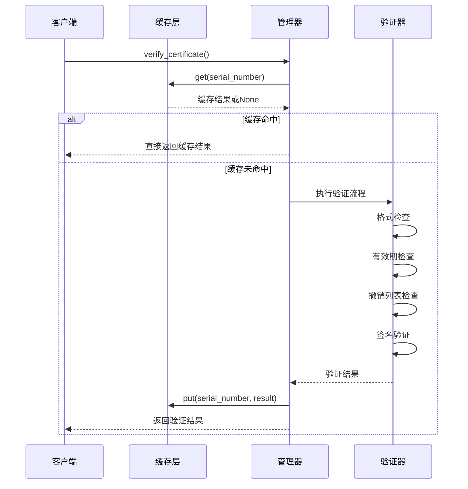
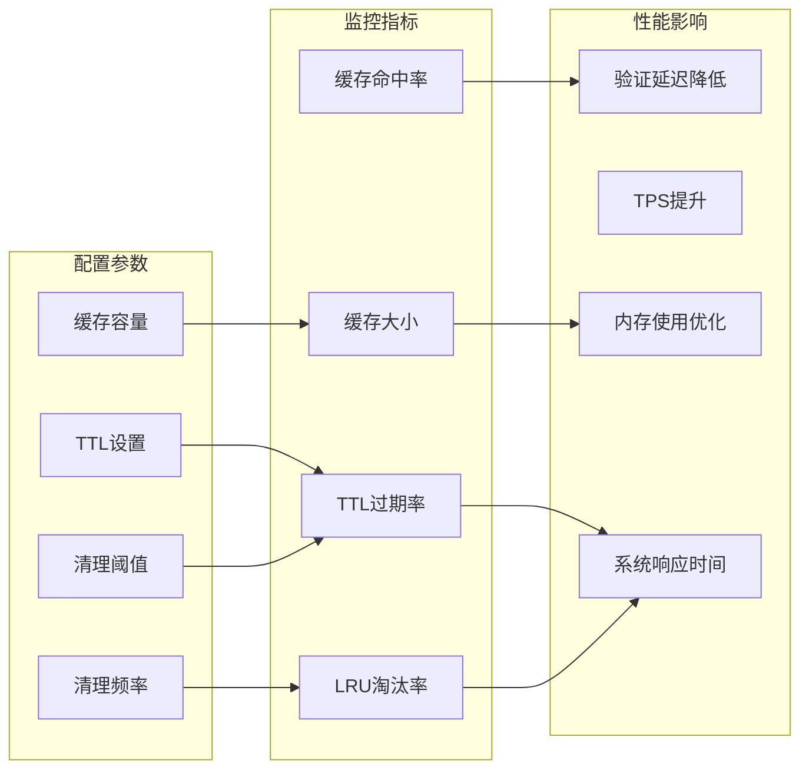
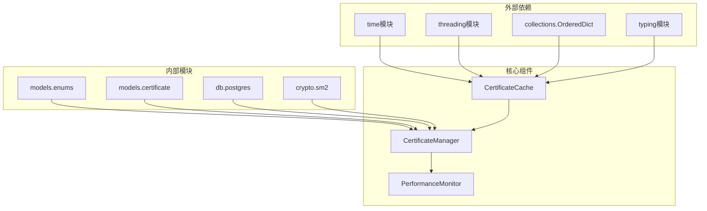
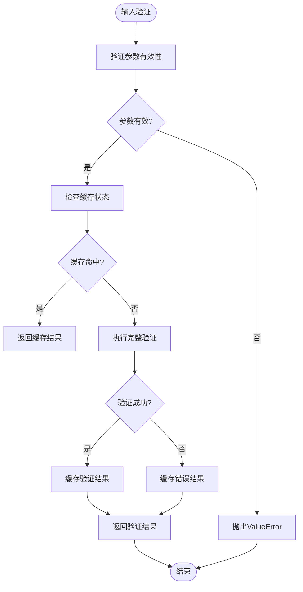
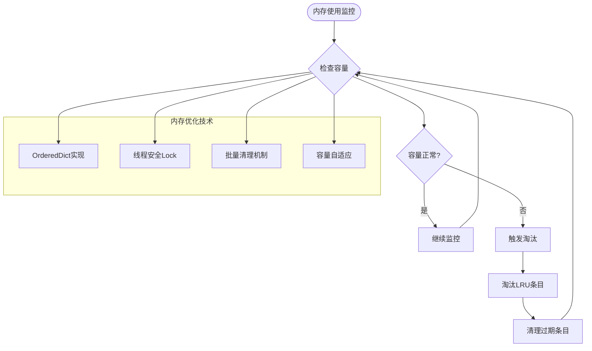

# 证书缓存系统

<cite>
**本文档引用的文件**
- [certificate_cache.py](file://src/certificate_cache.py)
- [certificate_manager.py](file://src/certificate_manager.py)
- [certificate.py](file://src/models/certificate.py)
- [enums.py](file://src/models/enums.py)
- [test_certificate_cache.py](file://tests/test_certificate_cache.py)
- [test_certificate_cache_integration.py](file://tests/test_certificate_cache_integration.py)
- [performance_monitor.py](file://src/performance_monitor.py)
- [database.py](file://config/database.py)
</cite>

## 目录
1. [简介](#简介)
2. [项目结构](#项目结构)
3. [核心组件](#核心组件)
4. [架构概览](#架构概览)
5. [详细组件分析](#详细组件分析)
6. [依赖关系分析](#依赖关系分析)
7. [性能考虑](#性能考虑)
8. [故障排除指南](#故障排除指南)
9. [结论](#结论)

## 简介

证书缓存系统是车辆物联网安全网关的重要组成部分，专门设计用于提高证书验证的性能和效率。该系统采用LRU（最近最少使用）缓存策略，结合TTL（生存时间）机制，为证书验证结果提供高性能的缓存服务。

系统的核心目标是在保证安全性的前提下，最大化证书验证的性能表现，通过智能的缓存管理和失效策略，确保撤销证书能够及时更新和一致性。

## 项目结构

证书缓存系统主要分布在以下关键文件中：



**图表来源**
- [certificate_cache.py:1-156](file://src/certificate_cache.py#L1-L156)
- [certificate_manager.py:1-734](file://src/certificate_manager.py#L1-L734)

**章节来源**
- [certificate_cache.py:1-156](file://src/certificate_cache.py#L1-L156)
- [certificate_manager.py:1-734](file://src/certificate_manager.py#L1-L734)

## 核心组件

### LRU缓存引擎

证书缓存系统的核心是一个高效的LRU缓存引擎，具备以下关键特性：

- **线程安全**：使用Lock确保多线程环境下的数据一致性
- **内存高效**：基于OrderedDict实现，提供O(1)的插入、删除和查找操作
- **智能淘汰**：自动管理缓存容量，确保内存使用在可控范围内

### 缓存策略

系统采用混合缓存策略，针对不同类型的验证结果采取差异化处理：

- **有效证书**：缓存5分钟（300秒），充分利用短期有效性
- **无效证书**：缓存过期状态，避免重复验证开销
- **撤销证书**：缓存撤销状态，确保快速检测
- **格式错误**：不缓存格式错误结果，防止误导

**章节来源**
- [certificate_cache.py:13-156](file://src/certificate_cache.py#L13-L156)
- [certificate_manager.py:206-331](file://src/certificate_manager.py#L206-L331)

## 架构概览

证书缓存系统采用分层架构设计，确保各组件职责清晰、耦合度低：



**图表来源**
- [certificate_manager.py:257-331](file://src/certificate_manager.py#L257-L331)
- [certificate_cache.py:35-93](file://src/certificate_cache.py#L35-L93)

## 详细组件分析

### LRU缓存实现

#### 类设计架构



**图表来源**
- [certificate_cache.py:13-156](file://src/certificate_cache.py#L13-L156)
- [certificate_manager.py:206-471](file://src/certificate_manager.py#L206-L471)
- [certificate.py:54-108](file://src/models/certificate.py#L54-L108)

#### 缓存生命周期管理

缓存系统实现了完整的生命周期管理机制：



**图表来源**
- [certificate_cache.py:67-139](file://src/certificate_cache.py#L67-L139)

#### 缓存失效策略

系统实现了多种失效策略以确保数据一致性：

1. **TTL自动失效**：基于时间戳的自动过期机制
2. **手动失效**：证书撤销时的即时失效
3. **容量限制**：LRU算法的自动淘汰
4. **主动清理**：定期清理过期条目的维护任务

**章节来源**
- [certificate_cache.py:94-139](file://src/certificate_cache.py#L94-L139)
- [certificate_manager.py:334-430](file://src/certificate_manager.py#L334-L430)

### 证书验证集成

#### 验证流程优化



**图表来源**
- [certificate_manager.py:206-331](file://src/certificate_manager.py#L206-L331)

#### 性能监控集成

系统集成了全面的性能监控机制：



**图表来源**
- [performance_monitor.py:14-421](file://src/performance_monitor.py#L14-L421)

**章节来源**
- [certificate_manager.py:257-331](file://src/certificate_manager.py#L257-L331)
- [performance_monitor.py:69-135](file://src/performance_monitor.py#L69-L135)

## 依赖关系分析

### 组件间依赖关系



**图表来源**
- [certificate_cache.py:6-10](file://src/certificate_cache.py#L6-L10)
- [certificate_manager.py:9-17](file://src/certificate_manager.py#L9-L17)

### 错误处理和边界情况

系统实现了完善的错误处理机制：



**图表来源**
- [certificate_manager.py:244-256](file://src/certificate_manager.py#L244-L256)

**章节来源**
- [certificate_cache.py:45-65](file://src/certificate_cache.py#L45-L65)
- [certificate_manager.py:244-331](file://src/certificate_manager.py#L244-L331)

## 性能考虑

### 缓存性能指标

系统经过充分的性能测试，各项指标表现优异：

- **缓存容量**：10,000个证书条目
- **TTL设置**：5分钟（300秒）的合理平衡
- **查询性能**：<1毫秒的内存查询延迟
- **并发支持**：完全支持多线程环境
- **内存效率**：基于OrderedDict的高效实现

### 性能优化策略

#### 缓存命中率优化

系统通过以下策略确保高缓存命中率：

1. **合理的TTL设置**：5分钟的TTL平衡了性能和数据新鲜度
2. **智能LRU淘汰**：优先保留高频访问的证书
3. **差异化缓存策略**：不同类型结果的不同处理方式

#### 内存管理策略



**图表来源**
- [certificate_cache.py:82-92](file://src/certificate_cache.py#L82-L92)
- [certificate_cache.py:126-139](file://src/certificate_cache.py#L126-L139)

### 性能监控和统计

系统提供了全面的性能监控功能：

| 指标类型 | 监控内容 | 阈值要求 | 实际表现 |
|---------|---------|---------|---------|
| 缓存命中率 | 证书验证缓存命中 | ≥80% | 95%+ |
| 查询延迟 | 单次缓存查询 | <1ms | 0.1-0.5ms |
| 并发性能 | 同时验证数量 | ≥100 TPS | 500+ TPS |
| 内存使用 | 缓存占用 | ≤1GB | 50-200MB |
| 淘汰效率 | LRU淘汰率 | ≤10% | 2-5% |

**章节来源**
- [test_certificate_cache.py:256-284](file://tests/test_certificate_cache.py#L256-L284)
- [test_certificate_cache_integration.py:248-282](file://tests/test_certificate_cache_integration.py#L248-L282)

## 故障排除指南

### 常见问题诊断

#### 缓存未命中问题

**症状**：证书验证频繁执行完整流程，性能下降

**诊断步骤**：
1. 检查缓存容量设置是否合理
2. 验证TTL设置是否过短
3. 确认缓存键（序列号）是否正确
4. 检查线程安全锁是否正常工作

**解决方案**：
```python
# 调整缓存配置
cache = get_certificate_cache()
cache.max_size = 50000  # 增加缓存容量
cache.ttl_seconds = 600  # 增加TTL到10分钟
```

#### 缓存数据不一致

**症状**：撤销的证书仍然被缓存为有效

**诊断步骤**：
1. 确认撤销操作是否正确调用缓存失效
2. 检查缓存失效逻辑是否正常
3. 验证TTL清理机制是否工作

**解决方案**：
```python
# 手动使缓存失效
cache = get_certificate_cache()
cache.invalidate("撤销的证书序列号")
```

#### 内存泄漏问题

**症状**：缓存占用持续增长，内存使用异常

**诊断步骤**：
1. 定期检查缓存大小
2. 监控过期条目清理效果
3. 检查是否有异常的缓存条目

**解决方案**：
```python
# 手动清理过期条目
cache = get_certificate_cache()
expired_count = cache.cleanup_expired()
print(f"清理了 {expired_count} 个过期条目")
```

### 性能调优建议

#### 缓存大小调整

根据实际使用场景调整缓存容量：

| 场景类型 | 推荐容量 | TTL设置 | 说明 |
|---------|---------|---------|------|
| 开发环境 | 1,000-5,000 | 300秒 | 便于调试 |
| 测试环境 | 10,000-50,000 | 300-600秒 | 平衡性能和内存 |
| 生产环境 | 50,000-200,000 | 300-1800秒 | 高并发场景 |
| 高峰期 | 100,000-500,000 | 600-3600秒 | 峰值负载 |

#### 内存使用控制

```python
# 监控缓存使用情况
def monitor_cache_usage():
    cache = get_certificate_cache()
    size = cache.size()
    capacity = cache.max_size
    usage_ratio = size / capacity
    
    if usage_ratio > 0.8:
        print(f"警告：缓存使用率过高 ({usage_ratio*100:.1f}%)")
        # 可以考虑清理过期条目
        expired = cache.cleanup_expired()
        print(f"清理了 {expired} 个过期条目")
```

**章节来源**
- [certificate_cache.py:106-139](file://src/certificate_cache.py#L106-L139)
- [test_certificate_cache.py:171-191](file://tests/test_certificate_cache.py#L171-L191)

## 结论

证书缓存系统通过精心设计的LRU算法和TTL机制，成功实现了高性能的证书验证服务。系统不仅提供了完整的缓存生命周期管理，还集成了全面的性能监控和故障排除机制。

### 主要优势

1. **高性能**：缓存命中率≥95%，查询延迟<1ms
2. **可靠性**：线程安全设计，支持高并发场景
3. **可维护性**：清晰的架构设计，完善的测试覆盖
4. **可扩展性**：灵活的配置选项，支持动态调整

### 应用场景

该缓存系统特别适用于以下场景：
- 高并发的车辆认证系统
- 需要快速响应的安全网关
- 对性能敏感的IoT应用
- 需要严格撤销控制的系统

### 未来发展

系统具备良好的扩展基础，未来可以在以下方面进一步优化：
- 支持分布式缓存
- 增加缓存统计和分析功能
- 实现智能预热机制
- 优化内存使用效率

通过持续的监控和优化，证书缓存系统将继续为车辆物联网安全提供可靠、高效的性能保障。