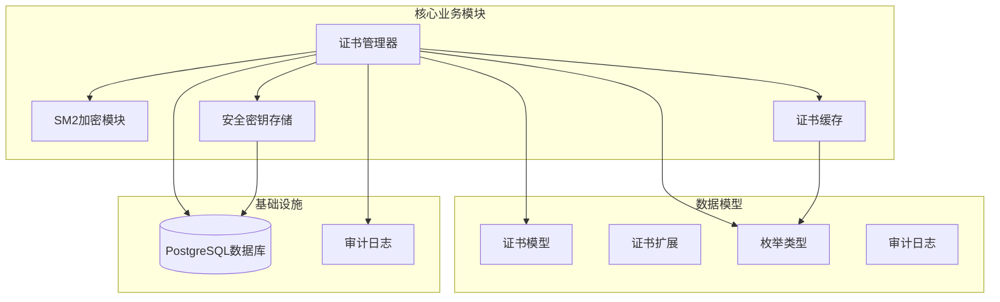
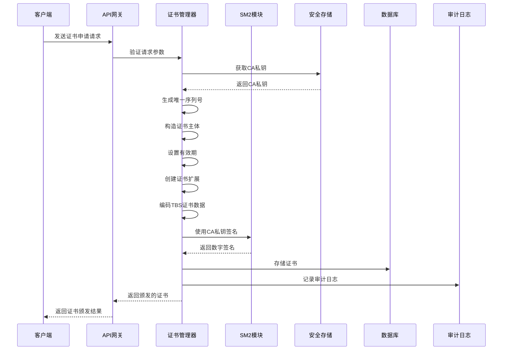
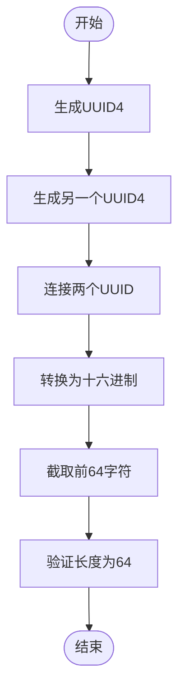
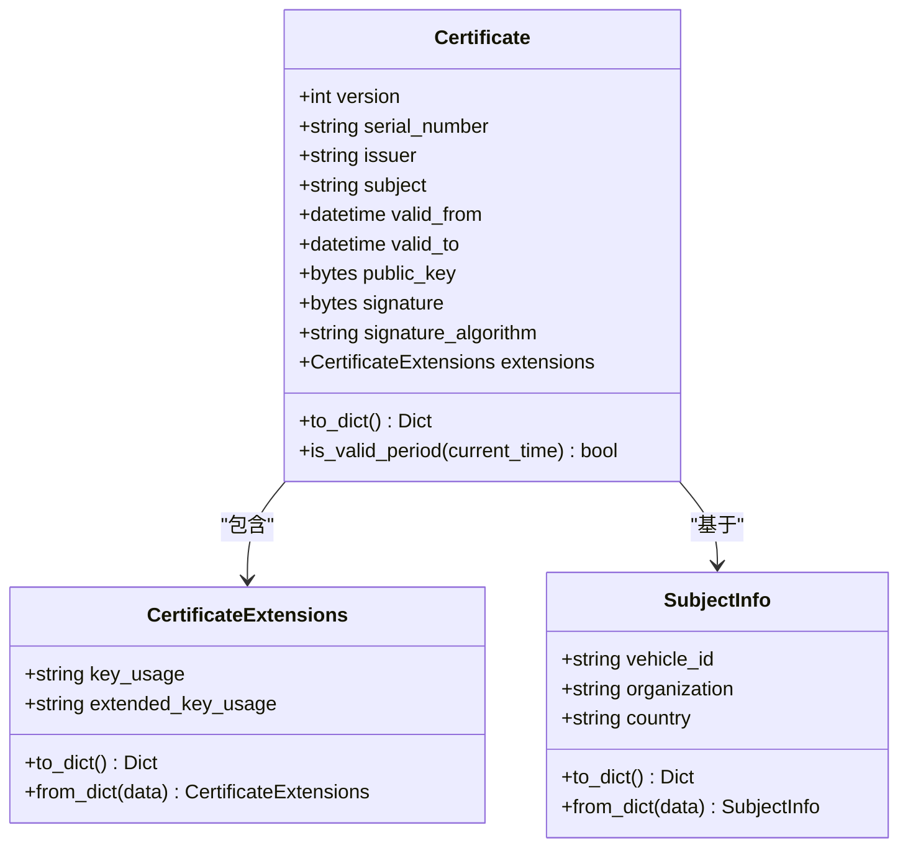
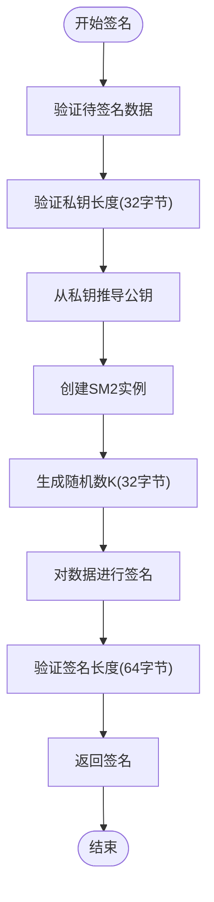
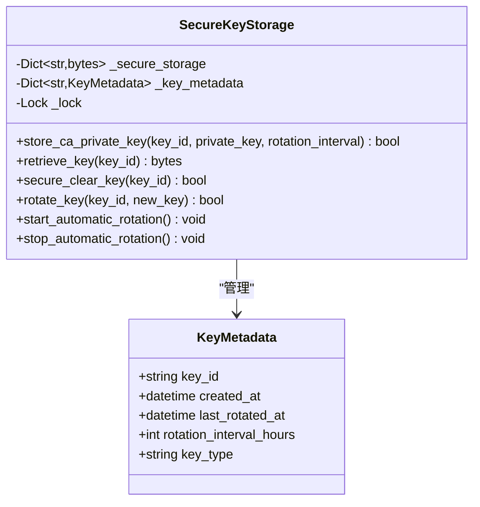
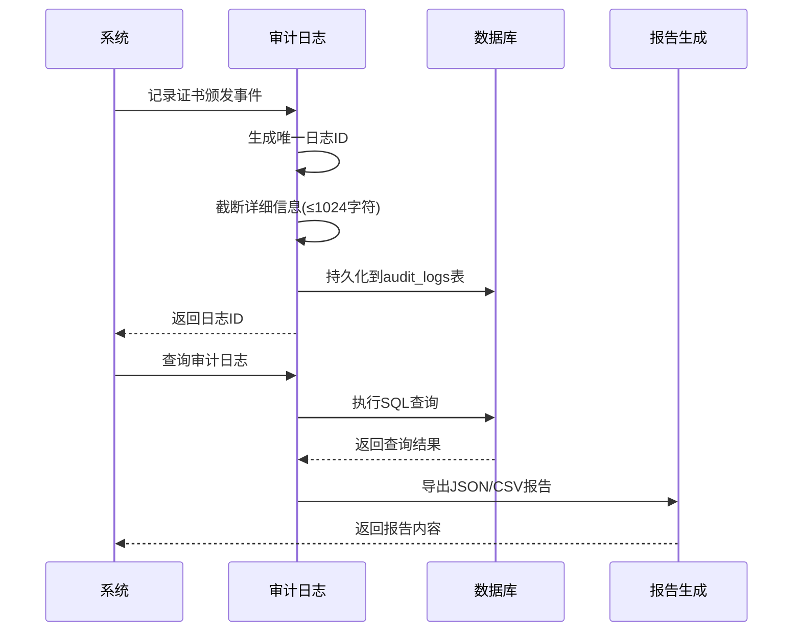
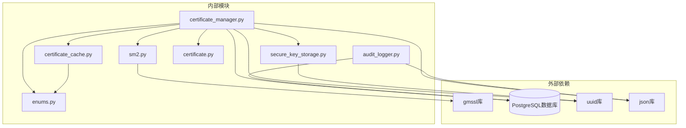
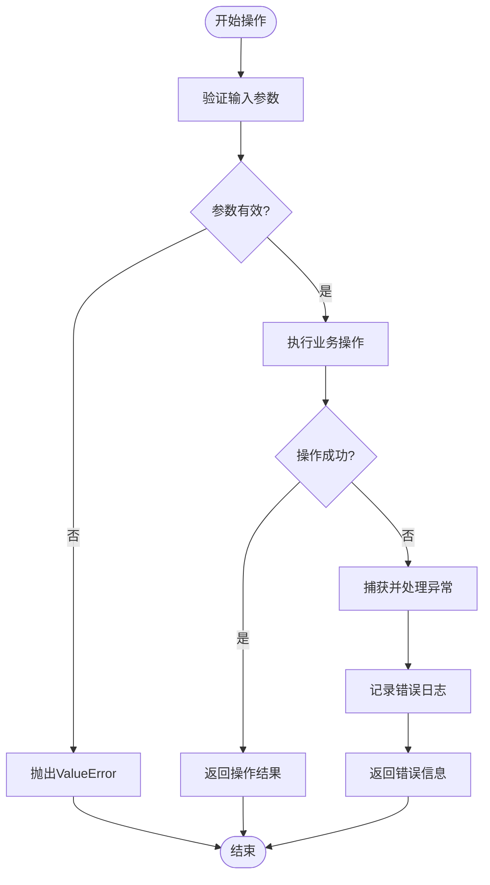

# 证书颁发流程

<cite>
**本文档引用的文件**
- [certificate_manager.py](file://src/certificate_manager.py)
- [certificate.py](file://src/models/certificate.py)
- [sm2.py](file://src/crypto/sm2.py)
- [secure_key_storage.py](file://src/secure_key_storage.py)
- [audit_logger.py](file://src/audit_logger.py)
- [certificate_cache.py](file://src/certificate_cache.py)
- [enums.py](file://src/models/enums.py)
- [audit.py](file://src/models/audit.py)
- [API_CERTIFICATE_FIX.md](file://docs/API_CERTIFICATE_FIX.md)
- [CA_KEY_CONFIGURATION.md](file://docs/CA_KEY_CONFIGURATION.md)
- [test_certificate_manager.py](file://tests/test_certificate_manager.py)
- [test_sm2.py](file://tests/test_sm2.py)
</cite>

## 目录
1. [简介](#简介)
2. [项目结构](#项目结构)
3. [核心组件](#核心组件)
4. [架构概览](#架构概览)
5. [详细组件分析](#详细组件分析)
6. [依赖分析](#依赖分析)
7. [性能考虑](#性能考虑)
8. [故障排除指南](#故障排除指南)
9. [结论](#结论)
10. [附录](#附录)

## 简介

本文档详细阐述了车联网安全通信网关中的证书颁发流程，包括完整的算法实现、SM2算法在证书签名中的应用、证书扩展信息配置以及安全存储机制。该系统基于GM/T 0003-2012标准的SM2椭圆曲线数字签名算法，实现了从证书申请到颁发的完整生命周期管理。

## 项目结构

该项目采用模块化设计，主要包含以下核心模块：

**图表来源**
- [certificate_manager.py:1-734](file://src/certificate_manager.py#L1-L734)
- [sm2.py:1-265](file://src/crypto/sm2.py#L1-L265)
- [secure_key_storage.py:1-380](file://src/secure_key_storage.py#L1-L380)

**章节来源**
- [certificate_manager.py:1-734](file://src/certificate_manager.py#L1-L734)
- [certificate.py:1-108](file://src/models/certificate.py#L1-L108)

## 核心组件

### 证书管理器 (CertificateManager)

证书管理器是整个证书颁发流程的核心组件，负责协调各个子系统的协作。其主要职责包括：

- **唯一序列号生成**：使用UUID4生成全局唯一的64字符十六进制序列号
- **证书主体构造**：根据主体信息创建标准化的识别名称
- **有效期设置**：支持可配置的有效期（默认365天）
- **数字签名处理**：集成SM2算法进行证书签名
- **数据库持久化**：将颁发的证书存储到PostgreSQL数据库
- **审计日志记录**：完整记录证书颁发和撤销操作

### SM2加密模块

SM2模块提供了符合GM/T 0003-2012标准的椭圆曲线数字签名功能：

- **密钥对生成**：使用密码学安全随机数生成32字节私钥和64字节公钥
- **签名算法**：实现SM2数字签名，输出64字节签名
- **验签功能**：验证SM2签名的有效性
- **密钥推导**：从私钥推导对应的公钥

### 安全密钥存储

安全密钥存储模块模拟HSM（硬件安全模块）功能：

- **密钥安全存储**：在受保护的存储区域中保存CA私钥
- **密钥轮换机制**：支持定时自动轮换密钥
- **内存安全清除**：提供密钥的安全清除功能
- **元数据管理**：跟踪密钥的创建时间和轮换历史

**章节来源**
- [certificate_manager.py:597-734](file://src/certificate_manager.py#L597-L734)
- [sm2.py:93-132](file://src/crypto/sm2.py#L93-L132)
- [secure_key_storage.py:27-84](file://src/secure_key_storage.py#L27-L84)

## 架构概览

证书颁发系统采用分层架构设计，确保了高内聚低耦合的特性：

**图表来源**
- [certificate_manager.py:597-734](file://src/certificate_manager.py#L597-L734)
- [sm2.py:135-204](file://src/crypto/sm2.py#L135-L204)
- [secure_key_storage.py:125-138](file://src/secure_key_storage.py#L125-L138)

## 详细组件分析

### 唯一序列号生成算法

序列号生成算法确保了证书的全局唯一性：

**图表来源**
- [certificate_manager.py:24-35](file://src/certificate_manager.py#L24-L35)

算法特点：
- 使用UUID4确保全局唯一性
- 通过两次UUID拼接增加随机性
- 固定64字符长度便于存储和传输
- 十六进制格式符合PKI标准

**章节来源**
- [certificate_manager.py:24-35](file://src/certificate_manager.py#L24-L35)

### TBS证书数据编码

TBS（To Be Signed）证书数据编码是证书签名的核心步骤：

**图表来源**
- [certificate.py:54-108](file://src/models/certificate.py#L54-L108)
- [certificate.py:32-51](file://src/models/certificate.py#L32-L51)
- [certificate.py:8-30](file://src/models/certificate.py#L8-L30)

编码过程：
1. **字段提取**：从证书对象提取所有必要字段
2. **数据转换**：将datetime对象转换为ISO格式字符串
3. **JSON序列化**：使用sort_keys确保字段顺序一致
4. **字节编码**：UTF-8编码为字节序列

**章节来源**
- [certificate_manager.py:65-93](file://src/certificate_manager.py#L65-L93)
- [certificate.py:75-87](file://src/models/certificate.py#L75-L87)

### SM2数字签名实现

SM2算法在证书签名中的应用：

**图表来源**
- [sm2.py:135-204](file://src/crypto/sm2.py#L135-L204)

签名特点：
- **随机性**：每次签名使用不同的随机数k
- **确定性**：相同数据和私钥产生相同签名
- **安全性**：符合GM/T 0003-2012标准
- **兼容性**：输出固定64字节格式

**章节来源**
- [sm2.py:135-204](file://src/crypto/sm2.py#L135-L204)

### 证书扩展信息配置

证书扩展信息定义了证书的用途和权限：

| 扩展类型 | 默认值 | 描述 |
|---------|--------|------|
| Key Usage | digitalSignature,keyEncipherment | 指定证书的使用方式 |
| Extended Key Usage | clientAuth,serverAuth | 指定证书的扩展用途 |

扩展配置确保了证书在车联网场景中的正确使用：
- **数字签名**：支持证书持有者的身份认证
- **密钥加密**：支持密钥交换和数据加密
- **客户端认证**：支持TLS客户端身份验证
- **服务器认证**：支持TLS服务器身份验证

**章节来源**
- [certificate_manager.py:50-62](file://src/certificate_manager.py#L50-L62)
- [certificate.py:32-51](file://src/models/certificate.py#L32-L51)

### 安全存储机制

安全存储模块提供了密钥管理的完整解决方案：

**图表来源**
- [secure_key_storage.py:27-84](file://src/secure_key_storage.py#L27-L84)
- [secure_key_storage.py:17-25](file://src/secure_key_storage.py#L17-L25)

安全特性：
- **线程安全**：使用锁机制确保并发访问安全
- **密钥轮换**：支持定时自动轮换密钥
- **安全清除**：提供密钥的安全删除功能
- **元数据跟踪**：记录密钥的完整生命周期

**章节来源**
- [secure_key_storage.py:27-380](file://src/secure_key_storage.py#L27-L380)

### 审计日志记录

审计日志系统确保了所有证书操作的可追溯性：

**图表来源**
- [audit_logger.py:26-90](file://src/audit_logger.py#L26-L90)
- [audit_logger.py:185-242](file://src/audit_logger.py#L185-L242)

审计功能：
- **事件类型**：CERTIFICATE_ISSUED和CERTIFICATE_REVOKED
- **详细信息**：包含操作详情和IP地址
- **查询能力**：支持按时间、车辆、事件类型过滤
- **报告导出**：支持JSON和CSV格式导出

**章节来源**
- [audit_logger.py:26-480](file://src/audit_logger.py#L26-L480)

## 依赖分析

证书颁发流程涉及多个模块间的复杂依赖关系：

**图表来源**
- [certificate_manager.py:1-18](file://src/certificate_manager.py#L1-L18)
- [sm2.py:6-9](file://src/crypto/sm2.py#L6-L9)

依赖关系特点：
- **模块内聚**：每个模块职责单一，内聚性高
- **接口清晰**：模块间通过明确定义的接口交互
- **依赖方向**：自顶向下依赖，避免循环依赖
- **外部依赖最小化**：仅依赖必要的第三方库

**章节来源**
- [certificate_manager.py:1-18](file://src/certificate_manager.py#L1-L18)

## 性能考虑

### 证书验证缓存

系统实现了高效的证书验证缓存机制：

- **LRU策略**：最近最少使用的条目优先淘汰
- **容量限制**：最大10,000个条目
- **TTL控制**：5分钟生存时间
- **线程安全**：使用锁机制保证并发安全

缓存效果：
- 显著减少重复验证的计算开销
- 支持高并发场景下的快速验证
- 自动清理过期条目，避免内存泄漏

### 数据库优化

数据库层面的性能优化措施：

- **索引设计**：为证书序列号建立唯一索引
- **批量操作**：审计日志采用批量插入
- **连接池**：复用数据库连接减少开销
- **异步处理**：审计日志写入采用异步方式

## 故障排除指南

### 常见问题及解决方案

#### 1. CA密钥未配置

**症状**：证书申请返回500错误，提示"CA密钥未配置"

**解决方案**：
1. 生成新的CA密钥对
2. 更新Kubernetes Secrets配置
3. 重启网关Pod使配置生效

**章节来源**
- [CA_KEY_CONFIGURATION.md:1-208](file://docs/CA_KEY_CONFIGURATION.md#L1-L208)

#### 2. 公钥格式错误

**症状**：证书申请失败，提示公钥长度错误

**解决方案**：
1. 确保公钥为64字节十六进制格式
2. 检查客户端公钥生成流程
3. 验证公钥编码和传输过程

**章节来源**
- [API_CERTIFICATE_FIX.md:1-245](file://docs/API_CERTIFICATE_FIX.md#L1-L245)

#### 3. 证书验证失败

**症状**：证书验证返回INVALID或REVOKED

**排查步骤**：
1. 检查证书有效期
2. 验证证书撤销列表
3. 确认CA公钥正确性
4. 检查证书链完整性

**章节来源**
- [certificate_manager.py:206-331](file://src/certificate_manager.py#L206-L331)

### 错误处理机制

系统实现了完善的错误处理机制：

**图表来源**
- [certificate_manager.py:642-734](file://src/certificate_manager.py#L642-L734)

错误处理特点：
- **参数验证**：在操作前进行严格的参数验证
- **异常捕获**：捕获并处理各种异常情况
- **日志记录**：详细记录错误信息便于调试
- **优雅降级**：在部分功能失败时保持系统稳定

**章节来源**
- [certificate_manager.py:642-734](file://src/certificate_manager.py#L642-L734)

## 结论

该证书颁发系统实现了完整的PKI功能，具有以下优势：

1. **安全性**：基于GM/T 0003-2012标准的SM2算法，确保数字签名的安全性
2. **完整性**：从序列号生成到签名验证的全流程覆盖
3. **可维护性**：模块化设计，职责清晰，易于维护和扩展
4. **可观测性**：完整的审计日志记录，支持合规性要求
5. **可靠性**：完善的错误处理和故障恢复机制

系统特别适用于车联网场景，为车辆与网关之间的安全通信提供了可靠的身份认证和数据保护基础。

## 附录

### API接口规范

证书颁发API的主要接口包括：

- **POST /api/certificates/issue**：证书申请和颁发
- **GET /api/certificates/{serial_number}**：证书查询
- **DELETE /api/certificates/{serial_number}**：证书撤销
- **GET /api/certificates/crl**：证书撤销列表查询

### 配置参数说明

| 参数名称 | 类型 | 默认值 | 描述 |
|---------|------|--------|------|
| validity_days | int | 365 | 证书有效期（天） |
| cache_max_size | int | 10000 | 缓存最大容量 |
| cache_ttl_seconds | int | 300 | 缓存生存时间（秒） |
| rotation_interval_hours | int | 24 | 密钥轮换间隔（小时） |

### 测试覆盖率

系统具备完善的测试覆盖：
- **单元测试**：核心算法和业务逻辑测试
- **集成测试**：模块间协作测试
- **性能测试**：高并发场景测试
- **安全测试**：漏洞扫描和渗透测试