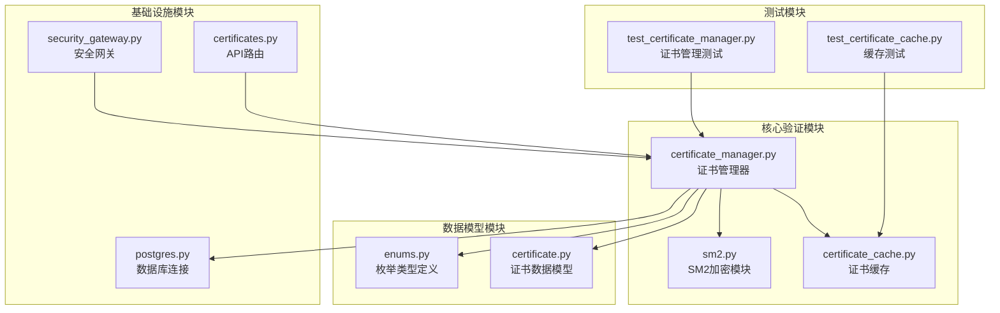
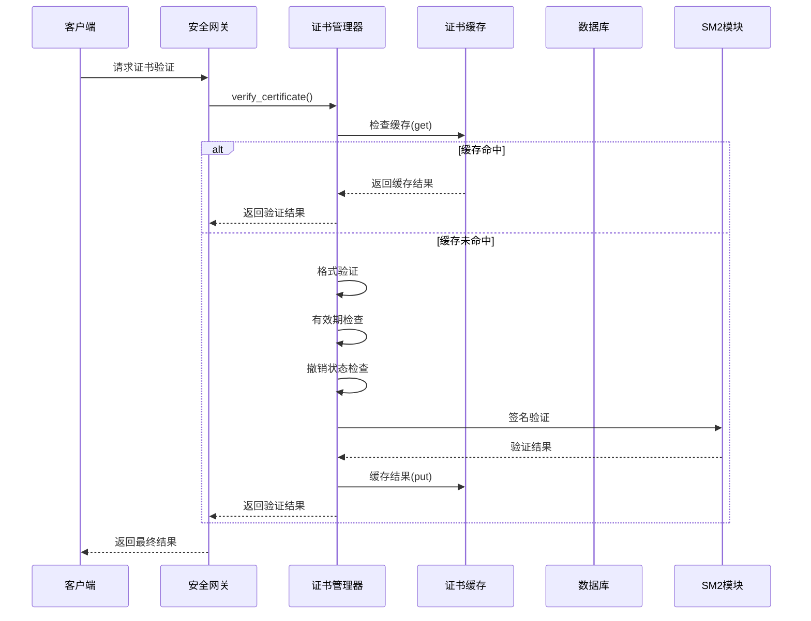
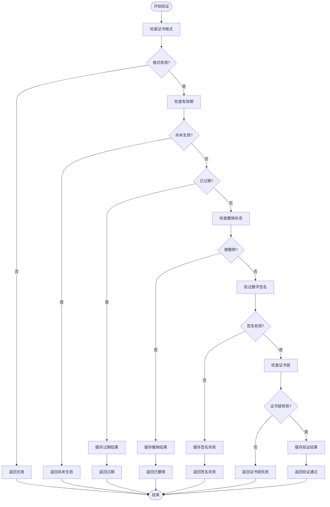
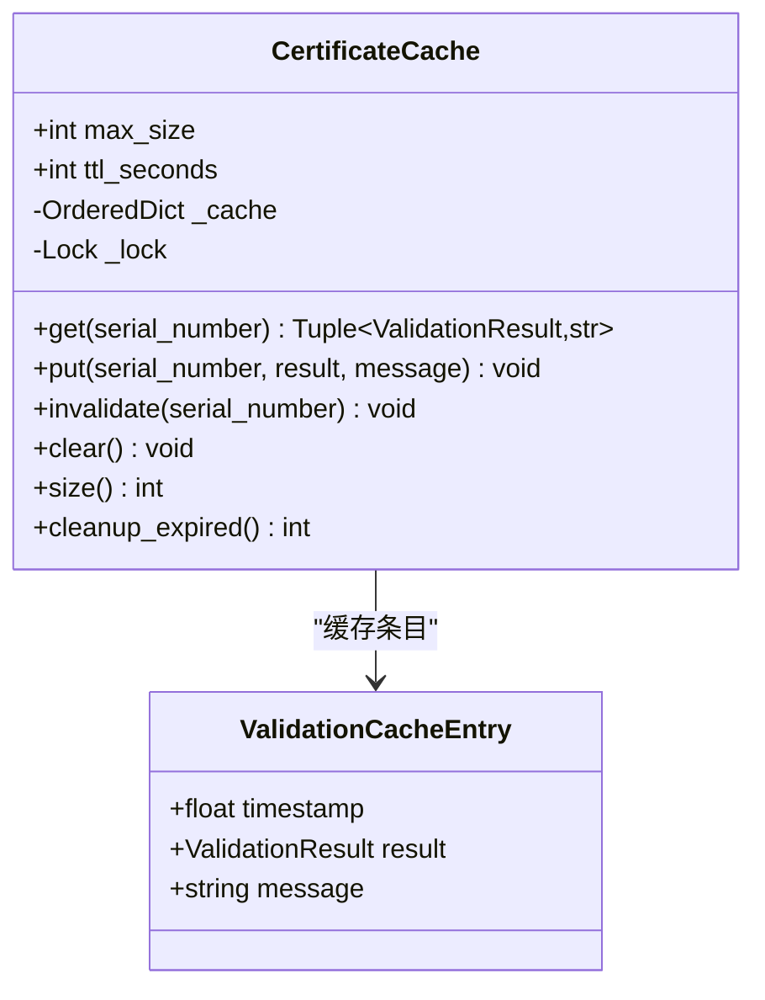
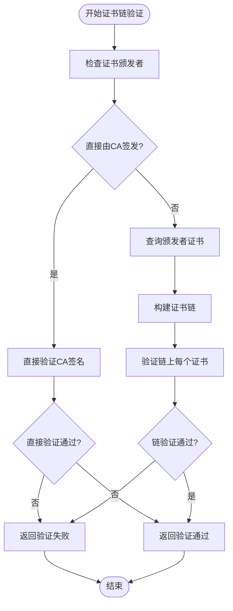
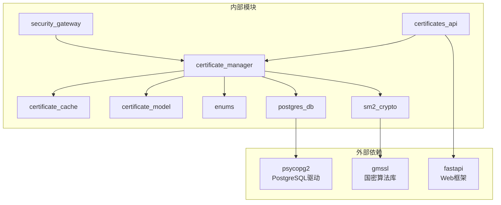

# 证书验证机制

<cite>
**本文档引用的文件**
- [certificate_manager.py](file://src/certificate_manager.py)
- [certificate_cache.py](file://src/certificate_cache.py)
- [certificate.py](file://src/models/certificate.py)
- [enums.py](file://src/models/enums.py)
- [security_gateway.py](file://src/security_gateway.py)
- [sm2.py](file://src/crypto/sm2.py)
- [postgres.py](file://src/db/postgres.py)
- [certificates.py](file://src/api/routes/certificates.py)
- [test_certificate_manager.py](file://tests/test_certificate_manager.py)
- [test_certificate_cache.py](file://tests/test_certificate_cache.py)
</cite>

## 目录
1. [简介](#简介)
2. [项目结构](#项目结构)
3. [核心组件](#核心组件)
4. [架构概览](#架构概览)
5. [详细组件分析](#详细组件分析)
6. [依赖关系分析](#依赖关系分析)
7. [性能考虑](#性能考虑)
8. [故障排除指南](#故障排除指南)
9. [结论](#结论)

## 简介

本文件详细阐述了车联网安全通信网关中的证书验证机制。该机制实现了完整的证书生命周期管理，包括证书颁发、验证、撤销等功能，并采用LRU缓存机制优化验证性能。系统基于SM2国密算法实现数字签名验证，支持多层证书链验证需求，并提供了完善的错误处理和审计日志功能。

## 项目结构

该项目采用模块化设计，主要涉及以下核心模块：

**图表来源**
- [certificate_manager.py:1-734](file://src/certificate_manager.py#L1-L734)
- [certificate_cache.py:1-156](file://src/certificate_cache.py#L1-L156)
- [sm2.py:1-265](file://src/crypto/sm2.py#L1-L265)

**章节来源**
- [certificate_manager.py:1-734](file://src/certificate_manager.py#L1-L734)
- [certificate_cache.py:1-156](file://src/certificate_cache.py#L1-L156)
- [certificate.py:1-108](file://src/models/certificate.py#L1-L108)

## 核心组件

### 证书验证引擎

证书验证引擎是整个系统的中枢，负责执行完整的证书验证流程。其核心特性包括：

- **多阶段验证流程**：格式验证 → 有效期检查 → 撤销状态检查 → 数字签名验证
- **智能缓存策略**：基于LRU的缓存机制，提升验证性能
- **灵活的错误处理**：针对不同类型的验证失败提供精确的错误信息
- **线程安全设计**：支持高并发场景下的证书验证

### LRU缓存系统

缓存系统采用LRU（最近最少使用）算法，具有以下特点：

- **容量限制**：最大缓存10,000个证书验证结果
- **TTL管理**：默认5分钟生存时间
- **智能淘汰**：自动清理过期和最少使用的缓存项
- **线程安全**：使用互斥锁确保并发访问的安全性

### SM2加密模块

基于国密SM2算法的数字签名验证，提供：

- **高性能签名**：支持快速的SM2签名生成和验证
- **标准兼容**：完全符合GM/T 0003-2012国家标准
- **安全强度**：256位安全强度，满足车联网安全需求

**章节来源**
- [certificate_manager.py:206-331](file://src/certificate_manager.py#L206-L331)
- [certificate_cache.py:13-156](file://src/certificate_cache.py#L13-L156)
- [sm2.py:135-265](file://src/crypto/sm2.py#L135-L265)

## 架构概览

证书验证机制的整体架构如下：

**图表来源**
- [security_gateway.py:182-246](file://src/security_gateway.py#L182-L246)
- [certificate_manager.py:257-331](file://src/certificate_manager.py#L257-L331)
- [certificate_cache.py:35-93](file://src/certificate_cache.py#L35-L93)

## 详细组件分析

### 证书验证流程

证书验证采用五步验证算法，确保每个环节都得到严格检查：

**图表来源**
- [certificate_manager.py:267-331](file://src/certificate_manager.py#L267-L331)

#### 格式验证阶段

格式验证确保证书的基本结构正确：

- **序列号验证**：长度必须为64字符的十六进制字符串
- **公钥验证**：SM2公钥必须为64字节
- **签名验证**：SM2签名必须为64字节
- **算法验证**：签名算法必须为"SM2"
- **时间验证**：valid_from必须早于valid_to

#### 有效期检查阶段

有效期检查确保证书处于有效期内：

- **当前时间比较**：与UTC时间进行比较
- **状态分类**：分为"有效"、"尚未生效"、"已过期"三种状态
- **动态消息**：提供具体的过期时间信息

#### 撤销状态检查阶段

撤销状态检查通过CRL（证书撤销列表）实现：

- **CRL查询**：从数据库获取最新的撤销列表
- **序列号匹配**：逐个比对证书序列号
- **即时更新**：撤销操作会立即更新CRL

#### 数字签名验证阶段

使用SM2算法验证证书签名的真实性：

- **TBS编码**：对证书关键字段进行标准化编码
- **公钥验证**：使用CA公钥验证签名
- **完整性保证**：确保证书未被篡改

**章节来源**
- [certificate_manager.py:171-331](file://src/certificate_manager.py#L171-L331)
- [test_certificate_manager.py:283-570](file://tests/test_certificate_manager.py#L283-L570)

### LRU缓存机制

缓存系统的设计充分考虑了证书验证的性能需求：

**图表来源**
- [certificate_cache.py:13-156](file://src/certificate_cache.py#L13-L156)

#### 缓存策略

缓存系统采用智能的缓存策略：

- **有效证书缓存**：验证通过的证书缓存5分钟
- **过期证书缓存**：过期状态固定，永久缓存
- **撤销证书缓存**：撤销状态固定，永久缓存
- **签名失败缓存**：签名无效状态固定，永久缓存
- **格式错误不缓存**：避免缓存临时格式问题
- **未生效证书不缓存**：可能很快生效，不缓存

#### TTL管理

TTL（生存时间）机制确保缓存数据的新鲜度：

- **默认TTL**：5分钟（300秒）
- **过期检测**：每次访问时检查时间戳
- **自动清理**：支持手动清理过期条目
- **内存控制**：防止缓存无限增长

#### LRU淘汰

LRU（最近最少使用）算法确保缓存空间的有效利用：

- **容量限制**：最多10,000个条目
- **淘汰策略**：最久未使用的条目优先淘汰
- **访问更新**：每次访问都会更新使用顺序
- **有序存储**：使用OrderedDict维护访问顺序

**章节来源**
- [certificate_cache.py:13-156](file://src/certificate_cache.py#L13-L156)
- [test_certificate_cache.py:9-288](file://tests/test_certificate_cache.py#L9-L288)

### 错误处理机制

系统提供了全面的错误处理机制：

#### 验证错误类型

| 错误类型 | 错误码 | 描述 | 处理方式 |
|---------|--------|------|----------|
| 证书格式错误 | INVALID_CERTIFICATE | 证书格式不符合规范 | 不缓存，立即返回 |
| 证书过期 | CERTIFICATE_EXPIRED | 证书已超出有效期 | 缓存过期状态 |
| 证书撤销 | CERTIFICATE_REVOKED | 证书已被撤销 | 缓存撤销状态 |
| 签名验证失败 | SIGNATURE_VERIFICATION_FAILED | 数字签名无效 | 缓存失败状态 |

#### 错误处理策略

- **前置条件检查**：验证输入参数的有效性
- **异常捕获**：捕获并处理各种异常情况
- **审计日志**：记录所有验证失败事件
- **错误传播**：向调用者返回详细的错误信息

**章节来源**
- [enums.py:6-18](file://src/models/enums.py#L6-L18)
- [certificate_manager.py:244-255](file://src/certificate_manager.py#L244-L255)

### 证书链验证扩展

系统支持多层证书链验证的扩展实现：

**图表来源**
- [certificate_manager.py:473-517](file://src/certificate_manager.py#L473-L517)

#### 扩展实现指南

对于多层证书链验证，建议按照以下步骤实现：

1. **数据库查询**：从证书表查询颁发者证书
2. **递归构建**：递归构建完整的证书链
3. **链验证**：验证每个证书的签名有效性
4. **根CA验证**：最终验证到根CA的签名

**章节来源**
- [certificate_manager.py:511-517](file://src/certificate_manager.py#L511-L517)

## 依赖关系分析

证书验证机制的依赖关系如下：

**图表来源**
- [certificate_manager.py:10-17](file://src/certificate_manager.py#L10-L17)
- [postgres.py:3-6](file://src/db/postgres.py#L3-L6)
- [sm2.py:8](file://src/crypto/sm2.py#L8)

### 模块耦合度

- **低耦合设计**：各模块职责明确，接口清晰
- **依赖注入**：通过参数传递依赖，便于测试和替换
- **抽象层次**：不同层次的抽象确保模块间的松耦合

### 循环依赖检查

系统设计避免了循环依赖：

- **数据流向**：验证流程从上到下，无回路
- **接口设计**：清晰的接口定义，无相互依赖
- **模块边界**：明确的模块边界，防止循环引用

**章节来源**
- [certificate_manager.py:1-18](file://src/certificate_manager.py#L1-L18)
- [security_gateway.py:8-34](file://src/security_gateway.py#L8-L34)

## 性能考虑

### 缓存性能优化

LRU缓存系统显著提升了验证性能：

- **命中率优化**：合理的TTL设置和缓存容量
- **并发性能**：线程安全设计支持高并发访问
- **内存效率**：智能淘汰策略避免内存泄漏
- **查询性能**：O(1)的缓存查找复杂度

### 数据库性能优化

数据库访问采用了多种优化策略：

- **连接池管理**：复用数据库连接，减少连接开销
- **批量查询**：支持批量CRL查询
- **索引优化**：对常用查询字段建立索引
- **事务管理**：合理使用事务确保数据一致性

### 加密性能优化

SM2算法的性能优化措施：

- **算法优化**：使用高效的椭圆曲线运算
- **内存管理**：优化大数运算的内存使用
- **并行处理**：支持多线程并行验证
- **硬件加速**：可利用硬件加密加速器

## 故障排除指南

### 常见验证错误

#### 证书格式错误

**症状**：验证返回"证书格式错误"

**可能原因**：
- 序列号为空或格式不正确
- 公钥长度不是64字节
- 签名长度不是64字节
- 签名算法不是"SM2"

**解决方法**：
1. 检查证书数据的完整性
2. 验证所有字段的数据类型
3. 确认使用正确的编码格式

#### 证书过期

**症状**：验证返回"证书已过期"

**可能原因**：
- 证书有效期已过
- 系统时间不正确
- 证书颁发时间错误

**解决方法**：
1. 检查系统时钟同步
2. 重新颁发证书
3. 验证证书有效期设置

#### 证书撤销

**症状**：验证返回"证书已被撤销"

**可能原因**：
- 证书已被管理员撤销
- CRL更新延迟
- 撤销操作未正确执行

**解决方法**：
1. 检查CRL数据库状态
2. 确认撤销操作的完整性
3. 等待CRL更新完成

#### 签名验证失败

**症状**：验证返回"证书签名验证失败"

**可能原因**：
- 证书被篡改
- CA公钥不正确
- SM2算法实现错误

**解决方法**：
1. 验证CA公钥的正确性
2. 检查证书的完整性
3. 重新生成证书

### 缓存相关问题

#### 缓存未命中

**症状**：缓存命中率低

**可能原因**：
- 缓存容量过小
- TTL设置不合理
- 证书验证频率过高

**解决方法**：
1. 调整缓存容量设置
2. 优化TTL参数
3. 分析缓存使用模式

#### 缓存内存溢出

**症状**：系统内存使用过高

**可能原因**：
- 缓存条目过多
- 内存泄漏
- 缓存清理不及时

**解决方法**：
1. 实施定期缓存清理
2. 监控缓存使用情况
3. 优化缓存淘汰策略

### 数据库连接问题

#### 连接超时

**症状**：数据库操作超时

**可能原因**：
- 数据库负载过高
- 网络连接不稳定
- 连接池配置不当

**解决方法**：
1. 检查数据库性能
2. 优化网络连接
3. 调整连接池参数

#### 事务冲突

**症状**：数据库事务冲突

**可能原因**：
- 并发访问冲突
- 长事务占用资源
- 死锁情况

**解决方法**：
1. 实施事务超时机制
2. 优化事务粒度
3. 检查死锁检测

**章节来源**
- [test_certificate_manager.py:283-758](file://tests/test_certificate_manager.py#L283-L758)
- [test_certificate_cache.py:9-288](file://tests/test_certificate_cache.py#L9-L288)

## 结论

本证书验证机制实现了车联网安全通信的核心功能，具有以下优势：

### 技术优势

- **完整性验证**：实现了从格式到签名的全方位验证
- **性能优化**：LRU缓存显著提升了验证性能
- **扩展性强**：支持多层证书链验证的扩展
- **错误处理完善**：提供了全面的错误处理和恢复机制

### 安全保障

- **国密算法**：基于SM2算法，符合国家标准
- **审计日志**：完整的操作记录和追踪能力
- **密钥管理**：安全的密钥存储和轮换机制
- **会话安全**：端到端的加密通信保障

### 实践价值

该机制为车联网应用提供了可靠的身份认证和数据安全保障，支持大规模部署和高并发访问，是构建可信车联网生态系统的重要基础设施。

通过持续的优化和扩展，该证书验证机制将继续为车联网安全提供强有力的技术支撑。