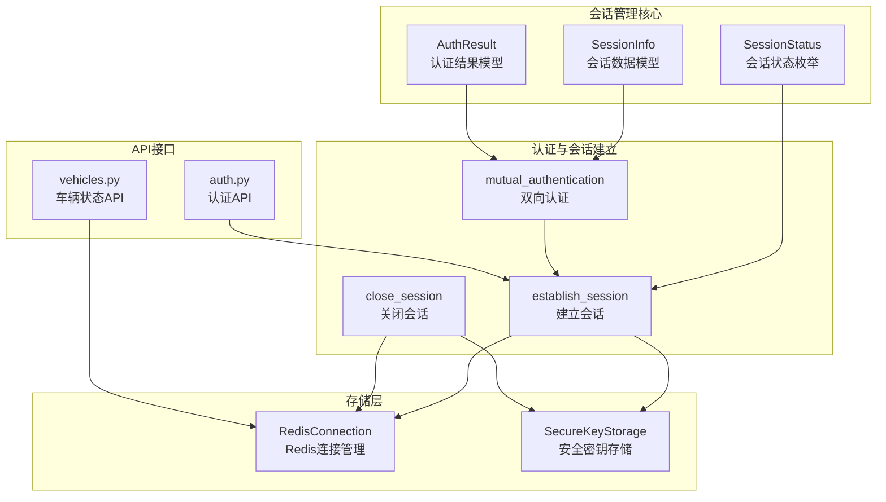
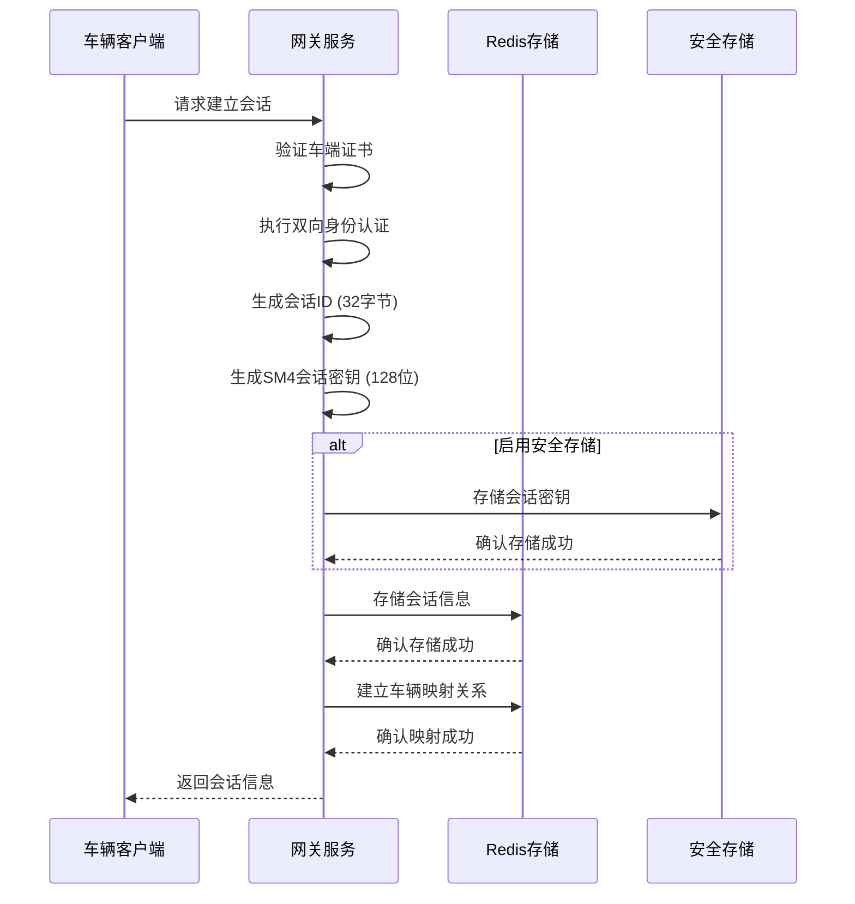
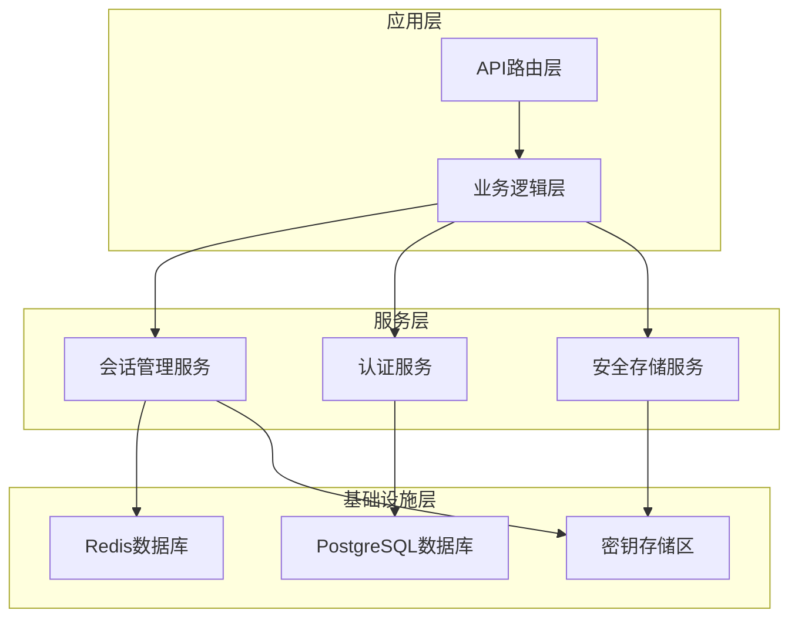
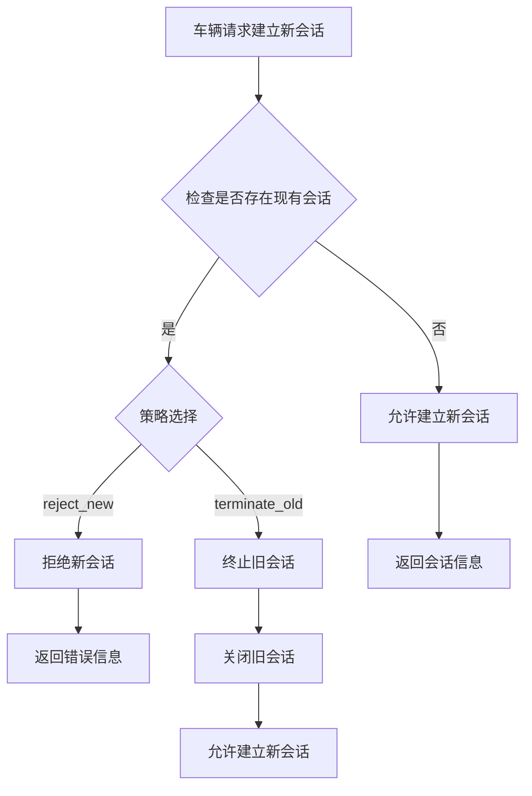
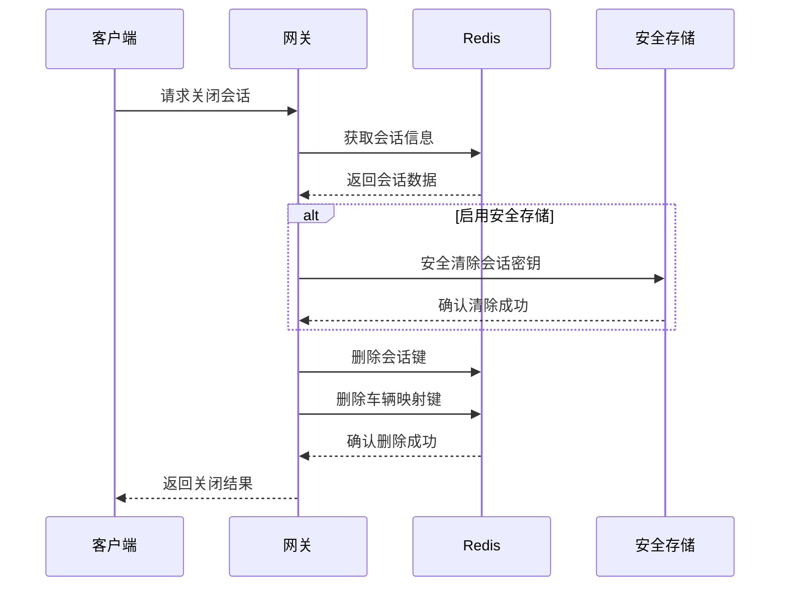
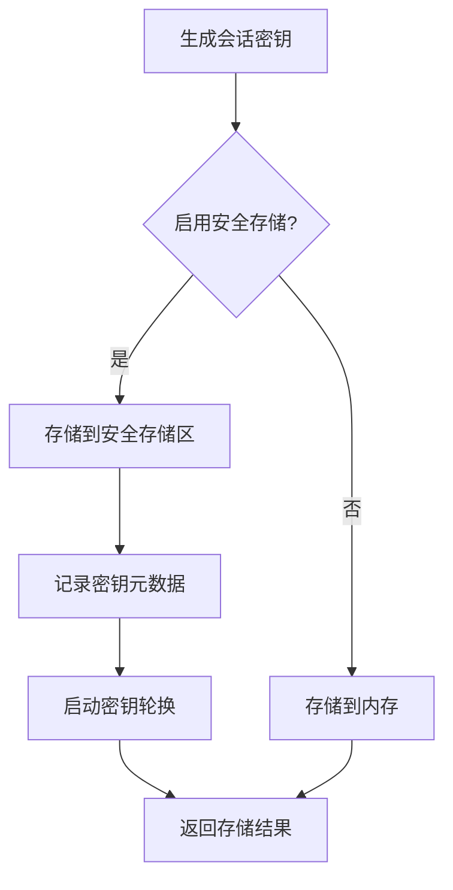
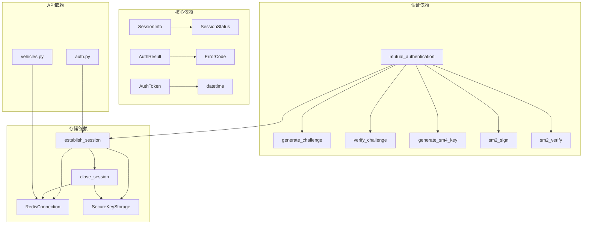

# 会话管理系统

<cite>
**本文档引用的文件**
- [session.py](file://src/models/session.py)
- [authentication.py](file://src/authentication.py)
- [redis_client.py](file://src/db/redis_client.py)
- [secure_key_storage.py](file://src/secure_key_storage.py)
- [enums.py](file://src/models/enums.py)
- [security_gateway.py](file://src/security_gateway.py)
- [sm4.py](file://src/crypto/sm4.py)
- [auth.py](file://src/api/routes/auth.py)
- [vehicles.py](file://src/api/routes/vehicles.py)
- [test_session_timeout.py](file://examples/test_session_timeout.py)
</cite>

## 目录
1. [简介](#简介)
2. [项目结构](#项目结构)
3. [核心组件](#核心组件)
4. [架构概览](#架构概览)
5. [详细组件分析](#详细组件分析)
6. [依赖关系分析](#依赖关系分析)
7. [性能考虑](#性能考虑)
8. [故障排除指南](#故障排除指南)
9. [结论](#结论)

## 简介

会话管理系统是车联网安全通信网关的核心组件，负责管理车辆与网关之间的安全通信会话。该系统实现了完整的会话生命周期管理，包括会话建立、状态管理、冲突处理、安全存储和过期清理等功能。

系统采用SM2/SM4国密算法进行身份认证和数据加密，使用Redis作为会话存储，结合安全密钥存储机制确保会话密钥的安全性。通过双重保护机制（主动注销和被动清理）确保车辆在线状态的准确性。

## 项目结构

会话管理系统主要分布在以下模块中：



**图表来源**
- [session.py:1-104](file://src/models/session.py#L1-L104)
- [authentication.py:196-480](file://src/authentication.py#L196-L480)
- [redis_client.py:1-79](file://src/db/redis_client.py#L1-L79)
- [secure_key_storage.py:27-380](file://src/secure_key_storage.py#L27-L380)

**章节来源**
- [session.py:1-104](file://src/models/session.py#L1-L104)
- [authentication.py:196-480](file://src/authentication.py#L196-L480)
- [redis_client.py:1-79](file://src/db/redis_client.py#L1-L79)
- [secure_key_storage.py:27-380](file://src/secure_key_storage.py#L27-L380)

## 核心组件

### 会话数据模型

会话管理系统的核心数据模型包括三个主要类：

#### SessionInfo - 会话信息
- **会话ID生成**：使用32字节随机数生成唯一标识符
- **会话密钥**：支持128位和256位SM4密钥
- **状态管理**：ACTIVE、EXPIRED、REVOKED三种状态
- **时间控制**：建立时间、过期时间和最后活动时间

#### AuthToken - 认证令牌
- **令牌内容**：包含车辆ID、权限集合和签名
- **有效期控制**：24小时有效期
- **签名验证**：使用网关私钥签名

#### AuthResult - 认证结果
- **成功路径**：返回令牌和会话密钥
- **失败路径**：返回错误码和错误信息
- **统一格式**：支持序列化和反序列化

**章节来源**
- [session.py:37-104](file://src/models/session.py#L37-L104)
- [enums.py:28-33](file://src/models/enums.py#L28-L33)

### 会话建立流程

会话建立是一个多步骤的复杂过程，确保安全性和完整性：



**图表来源**
- [authentication.py:366-480](file://src/authentication.py#L366-L480)
- [secure_key_storage.py:86-124](file://src/secure_key_storage.py#L86-L124)
- [redis_client.py:31-49](file://src/db/redis_client.py#L31-L49)

**章节来源**
- [authentication.py:366-480](file://src/authentication.py#L366-L480)
- [sm4.py:11-46](file://src/crypto/sm4.py#L11-L46)

## 架构概览

会话管理系统采用分层架构设计，确保各组件职责清晰：



**图表来源**
- [security_gateway.py:37-128](file://src/security_gateway.py#L37-L128)
- [authentication.py:196-364](file://src/authentication.py#L196-L364)

系统架构特点：
- **模块化设计**：各组件职责明确，便于维护和扩展
- **安全隔离**：敏感数据存储在安全隔离区
- **高可用性**：Redis集群支持和自动故障转移
- **可观测性**：完整的审计日志和监控指标

## 详细组件分析

### 会话状态管理

会话状态管理是系统的核心功能之一，确保会话的完整生命周期：

#### 状态转换图

```mermaid
stateDiagram-v2
[*] --> ACTIVE
ACTIVE --> EXPIRED : 超时或手动关闭
ACTIVE --> REVOKED : 管理员撤销
EXPIRED --> [*]
REVOKED --> [*]
note right of ACTIVE : 建立时间 : 2024-01-01 10 : 00 : 00<br/>过期时间 : 2024-01-01 10 : 00 : 00 + 24h
note right of EXPIRED : 会话超时或手动清理
note right of REVOKED : 管理员手动撤销
```

#### 时间控制机制

系统实现了多层次的时间控制机制：

1. **会话建立时间**：记录会话创建的确切时间
2. **过期时间控制**：默认24小时有效期
3. **最后活动时间**：每次交互后自动更新
4. **Redis TTL机制**：作为最后的兜底保护

**章节来源**
- [session.py:67-69](file://src/models/session.py#L67-L69)
- [authentication.py:432-434](file://src/authentication.py#L432-L434)

### 会话冲突处理策略

系统提供了两种会话冲突处理策略：

#### reject_new - 拒绝新会话

当同一车辆尝试建立多个并发会话时，系统会拒绝新的会话请求：



#### terminate_old - 终止旧会话

系统会自动终止现有的会话，允许新的会话建立：

**章节来源**
- [authentication.py:599-661](file://src/authentication.py#L599-L661)

### 会话关闭和过期清理机制

会话关闭和过期清理是确保系统资源及时释放的重要机制：

#### 会话关闭流程



#### 过期清理机制

系统采用了双重清理机制：

1. **Redis自动清理**：基于TTL的自动过期删除
2. **主动清理**：定期扫描和清理过期会话

**章节来源**
- [authentication.py:483-552](file://src/authentication.py#L483-L552)
- [authentication.py:554-597](file://src/authentication.py#L554-L597)

### 安全存储机制

安全存储机制确保会话密钥的安全性：

#### 密钥存储流程



#### 密钥轮换机制

系统实现了自动密钥轮换功能：

1. **定时轮换**：基于配置的轮换间隔
2. **安全清除**：轮换前安全清除旧密钥
3. **元数据管理**：跟踪密钥创建和轮换时间

**章节来源**
- [secure_key_storage.py:234-314](file://src/secure_key_storage.py#L234-L314)

## 依赖关系分析

会话管理系统涉及多个组件间的复杂依赖关系：



**图表来源**
- [authentication.py:196-364](file://src/authentication.py#L196-L364)
- [redis_client.py:8-79](file://src/db/redis_client.py#L8-L79)
- [secure_key_storage.py:27-380](file://src/secure_key_storage.py#L27-L380)

**章节来源**
- [authentication.py:196-364](file://src/authentication.py#L196-L364)
- [redis_client.py:8-79](file://src/db/redis_client.py#L8-L79)
- [secure_key_storage.py:27-380](file://src/secure_key_storage.py#L27-L380)

## 性能考虑

会话管理系统在设计时充分考虑了性能优化：

### Redis性能优化

1. **连接池管理**：复用Redis连接减少连接开销
2. **批量操作**：使用pipeline减少网络往返
3. **TTL优化**：合理设置过期时间避免频繁扫描

### 内存管理

1. **密钥安全清除**：防止内存中的敏感数据泄露
2. **对象池**：复用认证令牌和会话对象
3. **垃圾回收**：及时释放不再使用的会话数据

### 并发处理

1. **线程安全**：使用锁保护共享资源
2. **异步操作**：非阻塞的会话清理操作
3. **限流机制**：防止恶意的会话请求攻击

## 故障排除指南

### 常见问题及解决方案

#### 会话建立失败

**问题症状**：认证成功但会话建立失败

**可能原因**：
1. Redis连接异常
2. 安全存储不可用
3. 会话ID生成冲突

**解决步骤**：
1. 检查Redis服务状态
2. 验证安全存储权限
3. 查看会话ID唯一性

#### 会话冲突处理

**问题症状**：新会话被拒绝或旧会话被终止

**解决步骤**：
1. 检查冲突处理策略配置
2. 验证Redis键值对状态
3. 查看会话映射关系

#### 会话过期清理

**问题症状**：会话频繁过期或清理不及时

**解决步骤**：
1. 检查Redis TTL设置
2. 验证会话活动时间更新
3. 查看清理任务执行情况

**章节来源**
- [test_session_timeout.py:1-304](file://examples/test_session_timeout.py#L1-L304)

### 监控和调试

系统提供了完善的监控和调试功能：

1. **审计日志**：记录所有会话相关事件
2. **性能指标**：监控会话建立和清理性能
3. **错误追踪**：定位会话管理中的问题

## 结论

会话管理系统通过精心设计的架构和实现，提供了安全、可靠、高性能的会话管理能力。系统的主要优势包括：

1. **安全性**：采用国密算法和安全存储机制
2. **可靠性**：双重保护机制确保会话状态准确
3. **可扩展性**：模块化设计支持功能扩展
4. **可观测性**：完整的审计日志和监控体系

通过遵循最佳实践和性能优化建议，系统能够满足车联网场景下的严格要求，为车辆与网关之间的安全通信提供坚实的基础。