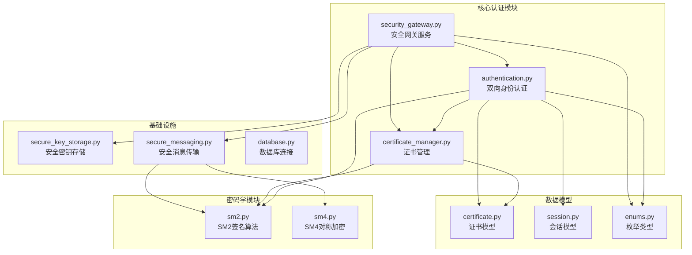
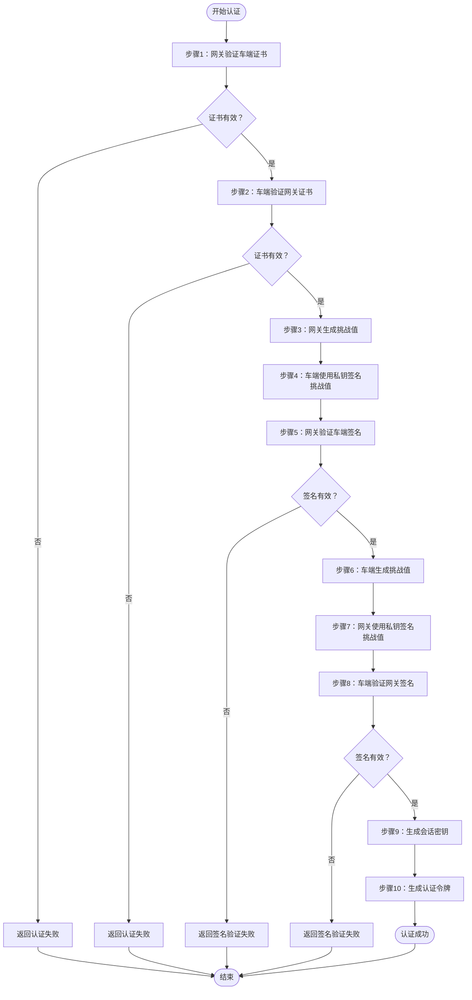
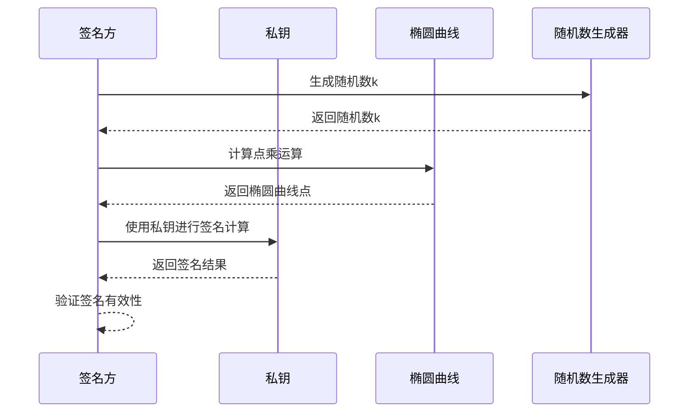
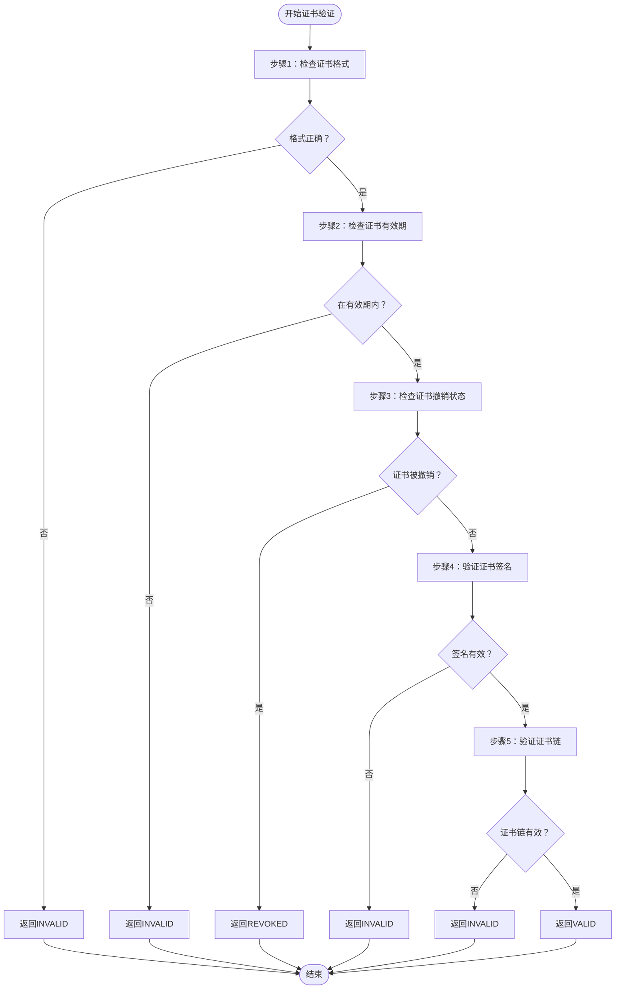
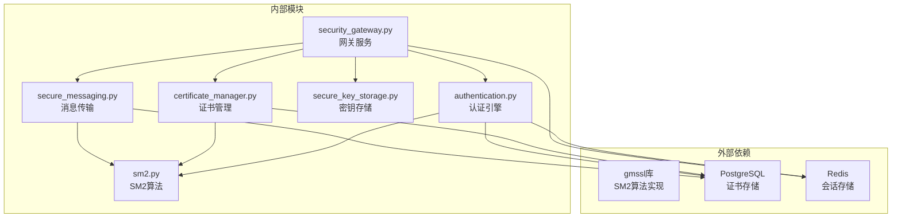
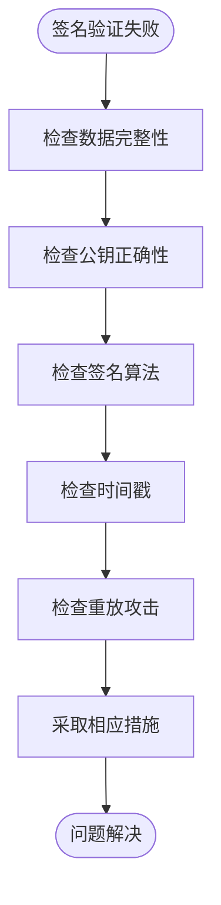

# 双向身份认证

<cite>
**本文档引用的文件**
- [authentication.py](file://src/authentication.py)
- [security_gateway.py](file://src/security_gateway.py)
- [sm2.py](file://src/crypto/sm2.py)
- [certificate_manager.py](file://src/certificate_manager.py)
- [certificate.py](file://src/models/certificate.py)
- [session.py](file://src/models/session.py)
- [enums.py](file://src/models/enums.py)
- [secure_key_storage.py](file://src/secure_key_storage.py)
- [secure_messaging.py](file://src/secure_messaging.py)
- [test_authentication.py](file://tests/test_authentication.py)
- [test_sm2.py](file://tests/test_sm2.py)
- [security_gateway_demo.py](file://examples/security_gateway_demo.py)
- [TROUBLESHOOTING.md](file://docs/TROUBLESHOOTING.md)
</cite>

## 目录
1. [简介](#简介)
2. [项目结构](#项目结构)
3. [核心组件](#核心组件)
4. [架构概览](#架构概览)
5. [详细组件分析](#详细组件分析)
6. [依赖分析](#依赖分析)
7. [性能考虑](#性能考虑)
8. [故障排查指南](#故障排查指南)
9. [结论](#结论)

## 简介

本文档详细介绍了车云双向身份认证系统的完整实现，基于SM2椭圆曲线数字签名算法，实现了符合中国国家密码标准的车端与网关之间的双向认证机制。系统采用挑战-响应机制，结合证书验证和签名验证，确保通信双方的身份真实性。

该系统支持：
- SM2椭圆曲线数字签名的完整实现
- 车端证书验证和网关证书验证
- 挑战-响应认证流程
- 会话密钥生成和令牌管理
- 安全密钥存储和轮换机制
- 完善的错误处理和审计日志

## 项目结构



**图表来源**
- [authentication.py:1-662](file://src/authentication.py#L1-L662)
- [security_gateway.py:1-800](file://src/security_gateway.py#L1-L800)
- [sm2.py:1-265](file://src/crypto/sm2.py#L1-L265)

**章节来源**
- [authentication.py:1-662](file://src/authentication.py#L1-L662)
- [security_gateway.py:1-800](file://src/security_gateway.py#L1-L800)

## 核心组件

### SM2椭圆曲线数字签名模块

SM2模块提供了完整的椭圆曲线数字签名实现，符合GM/T 0003-2012国家标准：

- **密钥对生成**：使用密码学安全随机数生成器生成32字节私钥和64字节公钥
- **签名算法**：实现SM2签名算法，输出64字节签名
- **验签算法**：验证SM2签名的有效性
- **椭圆曲线运算**：实现点加法和点乘运算

### 双向身份认证引擎

认证引擎实现了完整的Algorithm 1流程：

1. **车端证书验证**：验证车端证书的有效性和完整性
2. **网关证书验证**：验证网关证书的有效性和完整性  
3. **挑战值生成**：生成32字节随机挑战值
4. **签名验证**：验证双方的挑战响应
5. **令牌生成**：生成包含权限信息的认证令牌

### 安全网关服务

安全网关作为系统的核心服务，集成了所有认证和通信功能：

- **证书颁发**：为车辆颁发符合标准的数字证书
- **证书验证**：验证证书的有效性和撤销状态
- **会话管理**：建立、维护和清理安全会话
- **消息传输**：提供安全的数据传输和验证功能

**章节来源**
- [sm2.py:1-265](file://src/crypto/sm2.py#L1-L265)
- [authentication.py:196-364](file://src/authentication.py#L196-L364)
- [security_gateway.py:37-800](file://src/security_gateway.py#L37-L800)

## 架构概览

```mermaid
sequenceDiagram
participant V as 车辆客户端
participant SG as 安全网关
participant CA as CA证书颁发机构
participant DB as 数据库
participant RS as Redis存储
Note over V,SG : 双向身份认证流程
V->>SG : 连接请求(携带车端证书)
SG->>DB : 查询CRL(证书撤销列表)
SG->>SG : 验证车端证书
alt 证书验证失败
SG-->>V : 认证失败
exit
end
SG->>SG : 生成挑战值
SG->>V : 挑战值请求
V->>V : 使用私钥签名挑战值
V-->>SG : 挑战响应
SG->>SG : 验证车端签名
alt 签名验证失败
SG-->>V : 认证失败
exit
end
V->>V : 生成挑战值
V->>V : 使用私钥签名挑战值
V-->>SG : 挑战响应
SG->>SG : 验证网关签名
alt 签名验证失败
SG-->>V : 认证失败
exit
end
SG->>SG : 生成会话密钥
SG->>SG : 生成认证令牌
SG->>RS : 存储会话信息
SG-->>V : 认证成功
Note over V,SG : 会话建立完成
```

**图表来源**
- [authentication.py:196-364](file://src/authentication.py#L196-L364)
- [security_gateway.py:289-438](file://src/security_gateway.py#L289-L438)

## 详细组件分析

### Algorithm 1：双向身份认证实现

Algorithm 1定义了完整的车云双向认证流程，系统严格按照该算法实现：



**图表来源**
- [authentication.py:196-364](file://src/authentication.py#L196-L364)

#### 车端证书验证流程

车端证书验证包含多个验证步骤：

1. **证书格式验证**：检查证书字段的完整性和格式正确性
2. **有效期检查**：验证证书是否在有效期内
3. **撤销状态检查**：查询证书撤销列表确认证书未被撤销
4. **签名验证**：使用CA公钥验证证书签名的有效性

#### 网关证书验证流程

网关证书验证遵循相同的验证原则，确保网关身份的真实性。

#### 挑战-响应机制

挑战-响应机制确保双方都拥有对应的私钥：

1. **第一轮挑战**：网关生成32字节随机挑战值，发送给车端
2. **车端响应**：车端使用私钥对挑战值进行SM2签名
3. **网关验证**：网关使用车端公钥验证签名的有效性
4. **第二轮挑战**：车端生成32字节随机挑战值，发送给网关
5. **网关响应**：网关使用私钥对挑战值进行SM2签名
6. **车端验证**：车端使用网关公钥验证签名的有效性

#### 令牌生成和会话建立

认证成功后，系统执行以下操作：

1. **会话密钥生成**：生成16字节或32字节的SM4会话密钥
2. **认证令牌创建**：包含车辆ID、时间戳、权限信息的JSON数据
3. **令牌签名**：使用网关私钥对令牌进行SM2签名
4. **会话存储**：将会话信息存储到Redis中

**章节来源**
- [authentication.py:90-364](file://src/authentication.py#L90-L364)
- [certificate_manager.py:206-331](file://src/certificate_manager.py#L206-L331)

### SM2椭圆曲线数字签名应用

SM2算法在认证过程中的应用：

#### 私钥签名过程



**图表来源**
- [sm2.py:135-204](file://src/crypto/sm2.py#L135-L204)

#### 公钥验证过程

公钥验证使用相同的椭圆曲线数学原理，但方向相反：

1. **数据重组**：将消息头、载荷、时间戳和nonce按发送时的顺序重组
2. **签名验证**：使用发送方公钥验证SM2签名的有效性
3. **完整性检查**：确保数据在传输过程中未被篡改

**章节来源**
- [sm2.py:135-265](file://src/crypto/sm2.py#L135-L265)

### 证书管理系统

证书管理系统提供了完整的生命周期管理：

#### 证书颁发流程

1. **序列号生成**：使用UUID生成全局唯一的证书序列号
2. **有效期设置**：设置证书的生效时间和过期时间
3. **证书主体构造**：构建证书的主体信息和扩展字段
4. **TBS证书编码**：将证书关键字段编码为字节序列
5. **CA签名**：使用CA私钥对TBS证书进行SM2签名
6. **数据库存储**：将证书信息存储到PostgreSQL数据库

#### 证书验证算法

证书验证遵循Algorithm 5的完整流程：



**图表来源**
- [certificate_manager.py:206-331](file://src/certificate_manager.py#L206-L331)

**章节来源**
- [certificate_manager.py:597-734](file://src/certificate_manager.py#L597-L734)
- [certificate.py:1-108](file://src/models/certificate.py#L1-L108)

### 会话管理机制

会话管理系统提供了完整的会话生命周期管理：

#### 会话建立流程

1. **车辆ID验证**：确保车辆ID与认证令牌中的ID匹配
2. **令牌有效期检查**：验证认证令牌未过期
3. **会话ID生成**：生成32字节的唯一会话ID
4. **会话密钥生成**：生成16字节或32字节的SM4会话密钥
5. **安全存储**：将会话密钥存储到安全存储区
6. **Redis存储**：将会话信息存储到Redis中

#### 会话冲突处理

系统支持两种会话冲突处理策略：

1. **拒绝新会话**：当检测到同一车辆的并发会话时，拒绝新的会话请求
2. **终止旧会话**：自动终止现有的会话，允许新的会话建立

#### 会话清理机制

系统提供了多种会话清理方式：

1. **主动清理**：定期扫描并删除过期的会话
2. **被动清理**：利用Redis的TTL机制自动清理过期会话
3. **手动清理**：提供API接口手动清理特定会话

**章节来源**
- [authentication.py:366-597](file://src/authentication.py#L366-L597)
- [session.py:1-104](file://src/models/session.py#L1-L104)

### 安全密钥存储

安全密钥存储模块模拟了硬件安全模块(HSM)的功能：

#### 密钥存储机制

1. **安全隔离**：密钥存储在模拟的安全存储区域中
2. **内存保护**：会话密钥在内存中安全存储
3. **访问控制**：提供受控的密钥访问接口
4. **元数据管理**：跟踪密钥的创建时间、轮换时间等信息

#### 密钥轮换机制

系统支持自动密钥轮换：

1. **定时轮换**：根据配置的时间间隔自动轮换密钥
2. **安全清除**：轮换前安全清除旧密钥
3. **新密钥生成**：根据密钥类型生成新的密钥
4. **元数据更新**：更新密钥的轮换时间信息

**章节来源**
- [secure_key_storage.py:1-380](file://src/secure_key_storage.py#L1-L380)

## 依赖分析



**图表来源**
- [authentication.py:1-21](file://src/authentication.py#L1-L21)
- [security_gateway.py:6-34](file://src/security_gateway.py#L6-L34)

### 模块间耦合关系

系统采用了良好的模块化设计，各模块间的耦合关系清晰：

1. **低耦合高内聚**：每个模块都有明确的职责边界
2. **接口清晰**：模块间通过明确定义的接口进行交互
3. **依赖方向单一**：数据流向清晰，避免循环依赖
4. **可测试性强**：每个模块都可以独立进行单元测试

### 外部依赖管理

系统对外部依赖进行了有效管理：

1. **密码学库**：使用gmssl库提供SM2算法实现
2. **数据库连接**：使用PostgreSQL进行持久化存储
3. **缓存系统**：使用Redis提供高性能缓存和会话存储
4. **配置管理**：通过环境变量管理数据库连接配置

**章节来源**
- [authentication.py:1-21](file://src/authentication.py#L1-L21)
- [security_gateway.py:6-34](file://src/security_gateway.py#L6-L34)

## 性能考虑

### 认证性能优化

系统在设计时充分考虑了性能因素：

1. **证书验证缓存**：使用LRU缓存提高证书验证性能
2. **异步操作**：数据库操作采用异步方式减少等待时间
3. **连接池管理**：数据库连接使用连接池提高复用效率
4. **内存优化**：敏感数据在内存中安全存储，避免磁盘I/O

### 并发处理能力

系统支持高并发场景：

1. **线程安全**：所有共享资源都使用锁机制保证线程安全
2. **无阻塞设计**：关键操作避免长时间阻塞
3. **资源限制**：通过配置限制最大并发连接数
4. **负载均衡**：支持多实例部署实现水平扩展

### 存储性能优化

1. **Redis优化**：使用合适的TTL和内存配置
2. **数据库索引**：为常用查询字段建立索引
3. **批量操作**：支持批量证书查询和更新
4. **数据压缩**：对存储的数据进行适当的压缩

## 故障排查指南

### 常见认证失败场景

#### 证书相关问题

| 问题类型 | 症状 | 可能原因 | 解决方案 |
|---------|------|----------|----------|
| 证书过期 | 认证失败，错误码INVALID_CERTIFICATE | 证书有效期已过 | 重新颁发证书 |
| 证书撤销 | 认证失败，错误码CERTIFICATE_REVOKED | 证书被撤销 | 检查撤销原因并重新颁发 |
| 签名验证失败 | 认证失败，错误码SIGNATURE_VERIFICATION_FAILED | 证书签名无效 | 验证CA公钥和证书格式 |
| 格式错误 | 认证失败，证书格式无效 | 证书字段缺失或格式错误 | 检查证书生成流程 |

#### 签名验证失败



**图表来源**
- [TROUBLESHOOTING.md:131-166](file://docs/TROUBLESHOOTING.md#L131-L166)

#### 会话相关问题

| 问题类型 | 症状 | 可能原因 | 解决方案 |
|---------|------|----------|----------|
| 会话过期 | 会话失效，需要重新认证 | 会话超时或手动清理 | 重新建立会话 |
| 重放攻击 | 检测到重放攻击 | 消息被重放或Nonce追踪故障 | 检查Nonce机制和时间同步 |
| 内存泄漏 | 内存使用持续增长 | 会话清理不及时或连接泄漏 | 检查清理机制和连接管理 |

### 调试和监控

系统提供了完善的调试和监控功能：

1. **审计日志**：记录所有认证事件和错误信息
2. **性能指标**：监控认证延迟、吞吐量等关键指标
3. **错误分类**：按照错误类型进行分类统计
4. **实时告警**：对异常情况进行实时告警

### 最佳实践建议

1. **定期检查**：定期检查证书状态和系统健康状况
2. **备份策略**：建立完整的数据备份和恢复策略
3. **监控告警**：设置合理的监控阈值和告警机制
4. **容量规划**：根据业务增长进行容量规划和扩容

**章节来源**
- [TROUBLESHOOTING.md:1-399](file://docs/TROUBLESHOOTING.md#L1-L399)

## 结论

车云双向身份认证系统基于SM2椭圆曲线数字签名算法，实现了符合中国国家密码标准的车端与网关之间的安全认证机制。系统具有以下特点：

1. **安全性高**：采用SM2算法和SM4加密，符合国家密码标准
2. **功能完整**：实现了完整的双向认证流程和会话管理
3. **可扩展性好**：模块化设计支持功能扩展和性能优化
4. **可靠性强**：完善的错误处理和故障恢复机制
5. **可维护性佳**：清晰的代码结构和完善的测试覆盖

系统通过挑战-响应机制和证书验证，确保了通信双方身份的真实性，为车联网应用提供了坚实的安全基础。同时，系统的设计充分考虑了性能和可扩展性，能够满足大规模部署的需求。