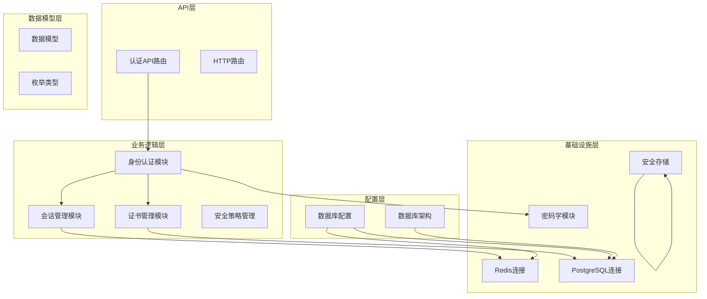
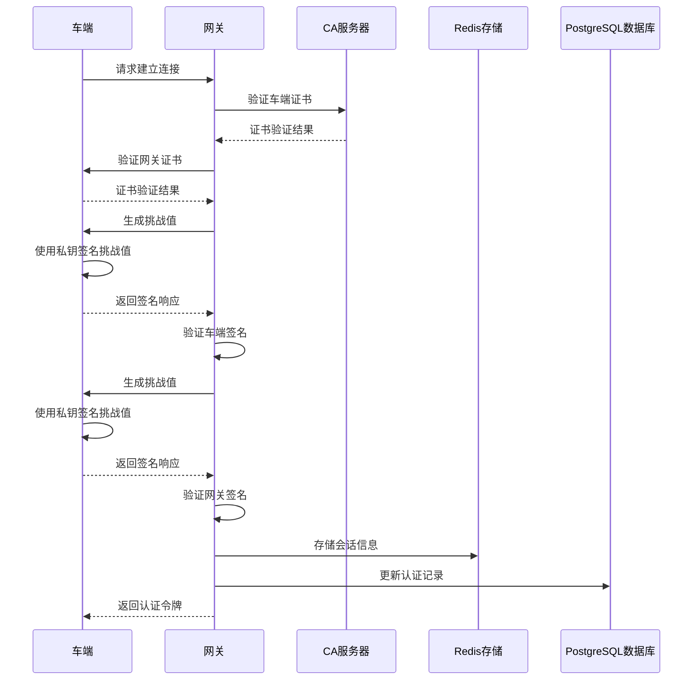
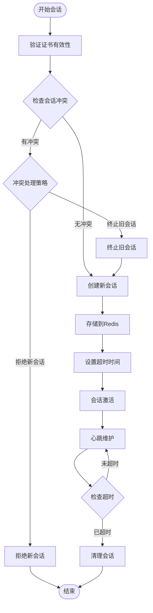
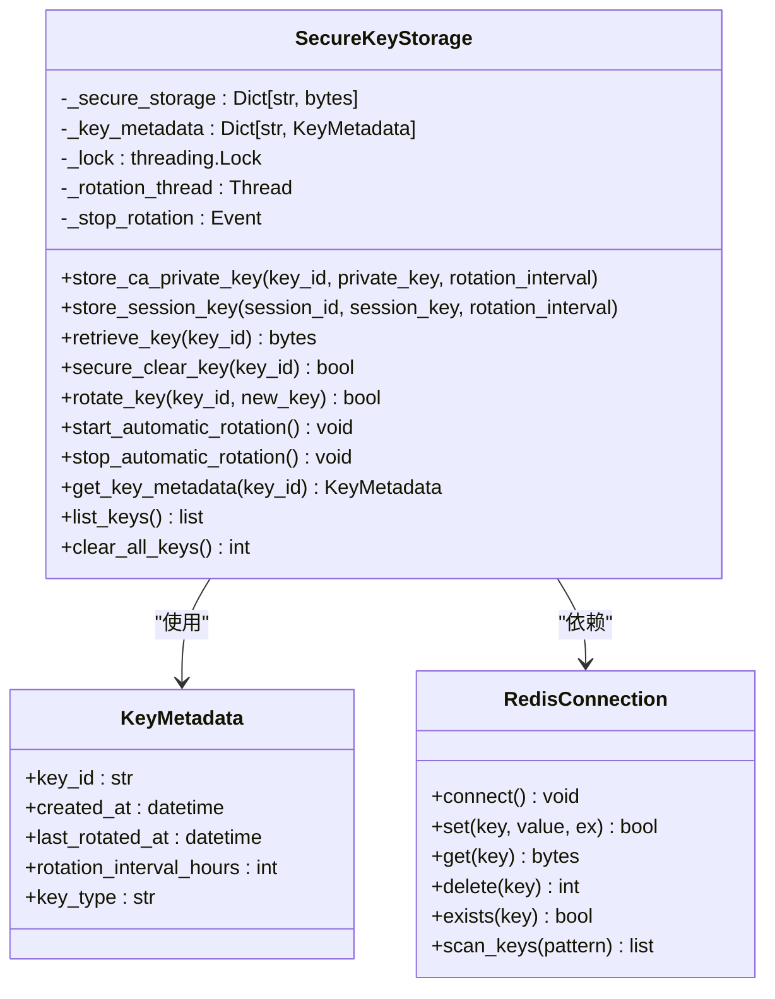
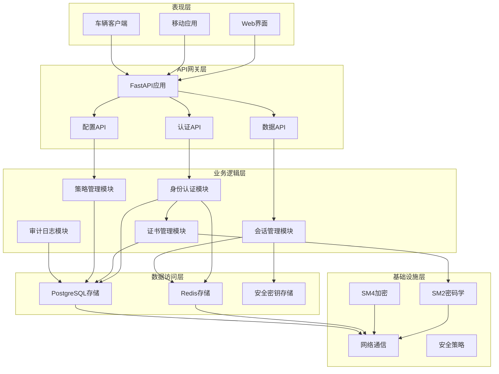
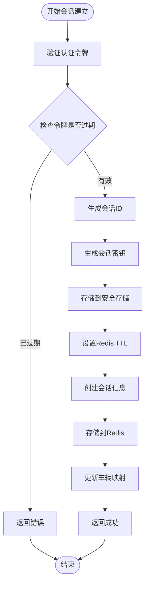
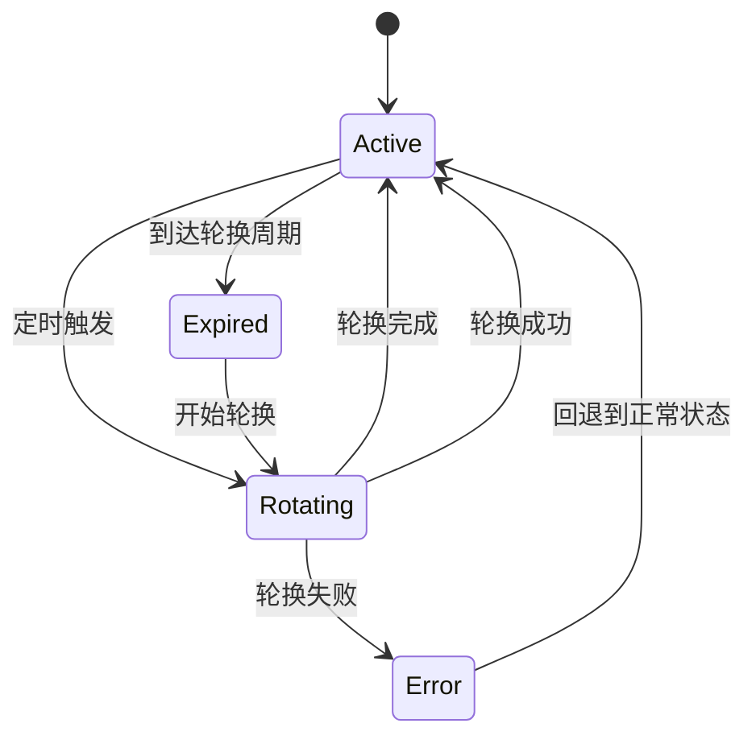
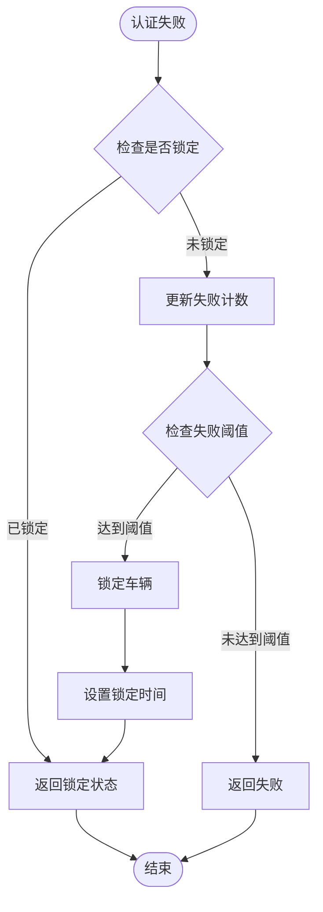
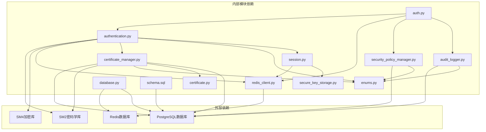

# 身份认证服务

<cite>
**本文档引用的文件**
- [authentication.py](file://src/authentication.py)
- [session.py](file://src/models/session.py)
- [redis_client.py](file://src/db/redis_client.py)
- [secure_key_storage.py](file://src/secure_key_storage.py)
- [certificate_manager.py](file://src/certificate_manager.py)
- [enums.py](file://src/models/enums.py)
- [certificate.py](file://src/models/certificate.py)
- [auth.py](file://src/api/routes/auth.py)
- [security_policy_manager.py](file://src/security_policy_manager.py)
- [audit_logger.py](file://src/audit_logger.py)
- [database.py](file://config/database.py)
- [schema.sql](file://db/schema.sql)
- [test_authentication.py](file://tests/test_authentication.py)
- [test_session_timeout.py](file://examples/test_session_timeout.py)
</cite>

## 目录
1. [简介](#简介)
2. [项目结构](#项目结构)
3. [核心组件](#核心组件)
4. [架构概览](#架构概览)
5. [详细组件分析](#详细组件分析)
6. [依赖关系分析](#依赖关系分析)
7. [性能考虑](#性能考虑)
8. [故障排除指南](#故障排除指南)
9. [结论](#结论)
10. [附录](#附录)

## 简介

身份认证服务是一个基于国密算法的车联网安全通信系统，实现了车云双向身份认证、会话管理和安全密钥存储功能。该系统采用SM2椭圆曲线公钥密码算法进行证书签名和验证，使用SM4对称加密算法进行数据加密，通过Redis实现高性能的会话存储和管理。

系统的核心特性包括：
- **双向身份认证**：车端和云平台相互验证对方的身份和证书有效性
- **会话生命周期管理**：完整的会话建立、维护、冲突处理和清理机制
- **安全密钥管理**：基于安全存储区的密钥存储、轮换和安全清除
- **认证失败锁定**：防止暴力破解攻击的智能锁定机制
- **并发会话控制**：支持多种并发会话处理策略
- **审计日志**：完整的操作审计和合规性记录

## 项目结构

该项目采用模块化设计，主要分为以下几个层次：



**图表来源**
- [authentication.py:1-662](file://src/authentication.py#L1-L662)
- [auth.py:1-685](file://src/api/routes/auth.py#L1-L685)
- [redis_client.py:1-79](file://src/db/redis_client.py#L1-L79)

**章节来源**
- [authentication.py:1-662](file://src/authentication.py#L1-L662)
- [auth.py:1-685](file://src/api/routes/auth.py#L1-L685)
- [database.py:1-50](file://config/database.py#L1-L50)

## 核心组件

### 身份认证模块

身份认证模块是整个系统的核心，实现了车云双向身份认证的完整流程：



**图表来源**
- [authentication.py:196-360](file://src/authentication.py#L196-L360)

### 会话管理模块

会话管理模块负责会话的全生命周期管理，包括建立、维护、冲突处理和清理：



**图表来源**
- [authentication.py:366-552](file://src/authentication.py#L366-L552)
- [authentication.py:599-662](file://src/authentication.py#L599-L662)

### 安全存储模块

安全存储模块提供了密钥的安全存储和管理功能：



**图表来源**
- [secure_key_storage.py:27-380](file://src/secure_key_storage.py#L27-L380)
- [redis_client.py:8-79](file://src/db/redis_client.py#L8-L79)

**章节来源**
- [authentication.py:1-662](file://src/authentication.py#L1-L662)
- [session.py:1-104](file://src/models/session.py#L1-L104)
- [secure_key_storage.py:1-380](file://src/secure_key_storage.py#L1-L380)

## 架构概览

系统采用分层架构设计，确保了高内聚、低耦合和良好的可扩展性：



**图表来源**
- [auth.py:1-685](file://src/api/routes/auth.py#L1-L685)
- [authentication.py:1-662](file://src/authentication.py#L1-L662)
- [certificate_manager.py:1-734](file://src/certificate_manager.py#L1-L734)

## 详细组件分析

### 双向身份认证实现

双向身份认证是系统的核心安全机制，确保车端和云平台相互验证对方的身份和证书有效性。

#### 认证流程详解

```mermaid
sequenceDiagram
participant Vehicle as 车端
participant Gateway as 网关
participant CA as CA服务器
participant Redis as Redis存储
Note over Vehicle,Gateway : 第一步：证书验证阶段
Gateway->>CA : 验证车端证书有效性
CA-->>Gateway : 返回证书验证结果
alt 证书验证失败
Gateway-->>Vehicle : 返回认证失败
exit
end
Vehicle->>CA : 验证网关证书有效性
CA-->>Vehicle : 返回证书验证结果
alt 证书验证失败
Vehicle-->>Gateway : 返回认证失败
exit
end
Note over Vehicle,Gateway : 第二步：挑战响应阶段
Gateway->>Vehicle : 生成32字节随机挑战值
Vehicle->>Vehicle : 使用SM2私钥对挑战值签名
Vehicle-->>Gateway : 返回64字节签名响应
Gateway->>Gateway : 使用车端公钥验证签名
alt 签名验证失败
Gateway-->>Vehicle : 返回认证失败
exit
end
Note over Vehicle,Gateway : 第三步：网关验证阶段
Vehicle->>Gateway : 生成32字节随机挑战值
Gateway->>Gateway : 使用SM2私钥对挑战值签名
Gateway-->>Vehicle : 返回64字节签名响应
Vehicle->>Vehicle : 使用网关公钥验证签名
alt 签名验证失败
Vehicle-->>Gateway : 返回认证失败
exit
end
Note over Vehicle,Gateway : 第四步：会话建立阶段
Vehicle->>Vehicle : 生成16字节SM4会话密钥
Gateway->>Gateway : 生成认证令牌
Gateway->>Redis : 存储会话信息
Gateway-->>Vehicle : 返回认证令牌和会话密钥
```

**图表来源**
- [authentication.py:196-360](file://src/authentication.py#L196-L360)

#### 认证参数验证

系统对所有认证参数进行了严格的验证，确保安全性：

| 参数类型 | 验证要求 | 长度/格式 | 验证目的 |
|---------|---------|----------|----------|
| 挑战值 | 随机性 | 32字节 | 防止重放攻击 |
| SM2签名 | 有效性 | 64字节 | 确保证书真实性 |
| SM4密钥 | 随机性 | 16或32字节 | 确保加密强度 |
| 证书 | 有效性 | PEM格式 | 验证身份合法性 |
| 令牌 | 签名 | SM2签名 | 防止伪造 |

**章节来源**
- [authentication.py:23-88](file://src/authentication.py#L23-L88)
- [authentication.py:90-194](file://src/authentication.py#L90-L194)

### 会话管理机制

会话管理模块提供了完整的会话生命周期管理功能：

#### 会话建立流程



**图表来源**
- [authentication.py:366-480](file://src/authentication.py#L366-L480)

#### 会话冲突处理策略

系统支持两种并发会话处理策略：

| 策略名称 | 处理方式 | 适用场景 | 优缺点 |
|---------|---------|---------|--------|
| 拒绝新会话 | 新会话建立失败，保持现有会话 | 高可靠性场景 | 优点：简单可靠；缺点：可能丢失新会话 |
| 终止旧会话 | 关闭现有会话，允许新会话建立 | 高可用性场景 | 优点：最大化资源利用率；缺点：可能中断现有会话 |

**章节来源**
- [authentication.py:599-662](file://src/authentication.py#L599-L662)
- [security_policy_manager.py:298-310](file://src/security_policy_manager.py#L298-L310)

### 安全密钥存储

安全密钥存储模块提供了密钥的安全存储和管理功能：

#### 密钥轮换机制



**图表来源**
- [secure_key_storage.py:234-288](file://src/secure_key_storage.py#L234-L288)

#### 密钥存储策略

系统采用多层安全策略保护密钥：

1. **物理隔离**：密钥存储在安全存储区，不以明文形式存在
2. **内存保护**：使用线程锁确保多线程环境下的安全性
3. **自动轮换**：定期轮换密钥，减少密钥泄露风险
4. **安全清除**：密钥使用完毕后安全清除，防止内存泄露

**章节来源**
- [secure_key_storage.py:1-380](file://src/secure_key_storage.py#L1-L380)

### 认证失败锁定机制

系统实现了智能的认证失败锁定机制，防止暴力破解攻击：

#### 锁定策略



**图表来源**
- [security_policy_manager.py:169-231](file://src/security_policy_manager.py#L169-L231)

#### 锁定参数配置

| 参数名称 | 默认值 | 最小值 | 最大值 | 说明 |
|---------|--------|--------|--------|------|
| 最大失败次数 | 5次 | 3次 | 10次 | 触发锁定的失败次数阈值 |
| 锁定持续时间 | 5分钟 | 1分钟 | 60分钟 | 锁定状态持续时间 |
| 超时容忍度 | 5分钟 | 1分钟 | 10分钟 | 时间戳差异容忍范围 |

**章节来源**
- [security_policy_manager.py:19-57](file://src/security_policy_manager.py#L19-L57)
- [security_policy_manager.py:169-231](file://src/security_policy_manager.py#L169-L231)

### 审计日志系统

审计日志系统提供了完整的操作审计和合规性记录功能：

#### 审计事件类型

系统支持多种类型的审计事件：

| 事件类型 | 描述 | 触发条件 |
|---------|------|----------|
| 认证成功 | 车辆认证成功 | 双向认证通过 |
| 认证失败 | 车辆认证失败 | 认证过程中的任何失败 |
| 数据加密 | 数据传输加密 | 加密数据传输 |
| 数据解密 | 数据传输解密 | 解密数据传输 |
| 证书颁发 | 证书签发 | 新证书创建 |
| 证书撤销 | 证书撤销 | 证书吊销操作 |
| 会话建立 | 会话创建 | 新会话建立 |
| 会话关闭 | 会话关闭 | 会话终止 |

**章节来源**
- [audit_logger.py:26-480](file://src/audit_logger.py#L26-L480)
- [enums.py:35-56](file://src/models/enums.py#L35-L56)

## 依赖关系分析

系统的依赖关系呈现清晰的分层结构：



**图表来源**
- [authentication.py:1-662](file://src/authentication.py#L1-L662)
- [auth.py:1-685](file://src/api/routes/auth.py#L1-L685)
- [database.py:1-50](file://config/database.py#L1-L50)

**章节来源**
- [authentication.py:1-662](file://src/authentication.py#L1-L662)
- [auth.py:1-685](file://src/api/routes/auth.py#L1-L685)
- [database.py:1-50](file://config/database.py#L1-L50)

## 性能考虑

系统在设计时充分考虑了性能优化：

### 缓存策略

1. **证书验证缓存**：使用LRU缓存提高证书验证性能
2. **会话信息缓存**：Redis存储提供高速访问
3. **策略配置缓存**：安全策略定期缓存，减少数据库查询

### 并发处理

1. **线程安全**：使用线程锁保护共享资源
2. **异步操作**：审计日志记录采用异步方式
3. **连接池**：数据库连接使用连接池管理

### 内存管理

1. **密钥安全清除**：使用多层覆盖确保密钥完全清除
2. **对象复用**：重用数据库连接和Redis连接
3. **垃圾回收**：及时释放不再使用的对象

## 故障排除指南

### 常见问题及解决方案

#### 认证失败问题

| 问题现象 | 可能原因 | 解决方案 |
|---------|---------|---------|
| 证书验证失败 | 证书过期或被撤销 | 检查证书有效期和CRL列表 |
| 签名验证失败 | 私钥不匹配或数据损坏 | 验证密钥对一致性 |
| 挑战响应超时 | 网络延迟或超时设置过短 | 调整超时参数 |
| 会话冲突 | 并发会话策略配置不当 | 修改并发会话策略 |

#### 性能问题

| 问题现象 | 可能原因 | 解决方案 |
|---------|---------|---------|
| 认证响应慢 | 数据库查询性能不足 | 优化数据库索引和查询 |
| 会话存储慢 | Redis性能瓶颈 | 增加Redis实例或优化配置 |
| 审计日志写入慢 | 数据库写入压力大 | 调整审计日志级别或增加数据库资源 |

#### 安全问题

| 问题现象 | 可能原因 | 解决方案 |
|---------|---------|---------|
| 密钥泄露风险 | 密钥存储不安全 | 使用安全存储区并定期轮换 |
| 重放攻击 | 挑战值重复使用 | 确保挑战值的随机性和一次性使用 |
| 并发会话冲突 | 策略配置不当 | 根据业务需求调整并发策略 |

**章节来源**
- [test_authentication.py:1-520](file://tests/test_authentication.py#L1-L520)
- [test_session_timeout.py:1-304](file://examples/test_session_timeout.py#L1-L304)

## 结论

身份认证服务是一个设计完善的车联网安全通信系统，具有以下特点：

### 技术优势

1. **安全性强**：采用国密算法，提供企业级安全保护
2. **可靠性高**：完整的错误处理和异常恢复机制
3. **可扩展性好**：模块化设计，易于功能扩展
4. **性能优异**：多层缓存和优化策略

### 应用价值

1. **合规性强**：满足车联网行业安全标准
2. **易用性好**：提供完整的API和工具支持
3. **运维友好**：完善的监控和审计功能
4. **成本效益**：开源免费，降低部署成本

### 发展前景

随着车联网技术的不断发展，该系统将继续演进，支持更多安全特性和业务场景，为企业数字化转型提供坚实的安全基础。

## 附录

### API使用示例

#### 认证流程示例

```python
# 车辆端认证示例
from src.authentication import mutual_authentication
from src.models.certificate import Certificate

# 准备认证参数
vehicle_cert = Certificate(...)  # 车辆证书
gateway_cert = Certificate(...)  # 网关证书
vehicle_private_key = b"..."    # 车辆私钥
gateway_private_key = b"..."    # 网关私钥
ca_public_key = b"..."          # CA公钥

# 执行双向认证
result = mutual_authentication(
    vehicle_cert,
    gateway_cert,
    vehicle_private_key,
    gateway_private_key,
    ca_public_key
)

if result.success:
    # 认证成功，获取令牌和会话密钥
    token = result.token
    session_key = result.session_key
    print("认证成功")
else:
    # 认证失败，获取错误信息
    error_code = result.error_code
    error_message = result.error_message
    print(f"认证失败: {error_message}")
```

#### 会话管理示例

```python
# 会话建立示例
from src.authentication import establish_session
from src.models.session import AuthToken

# 准备会话参数
vehicle_id = "VEHICLE_001"
auth_token = AuthToken(...)  # 认证令牌

# 建立会话
session_info = establish_session(
    vehicle_id,
    auth_token
)

print(f"会话ID: {session_info.session_id}")
print(f"会话状态: {session_info.status}")
```

### 配置参考

#### 数据库配置

```python
# PostgreSQL配置
POSTGRES_HOST=localhost
POSTGRES_PORT=5432
POSTGRES_DB=vehicle_iot_gateway
POSTGRES_USER=postgres
POSTGRES_PASSWORD=your_password

# Redis配置
REDIS_HOST=localhost
REDIS_PORT=6379
REDIS_DB=0
REDIS_PASSWORD=your_password
```

#### 安全策略配置

```python
# 安全策略参数
SESSION_TIMEOUT=86400      # 会话超时时间（秒）
MAX_AUTH_FAILURES=5        # 最大认证失败次数
LOCKOUT_DURATION=300       # 锁定持续时间（秒）
CONCURRENT_STRATEGY=reject_new  # 并发会话策略
```