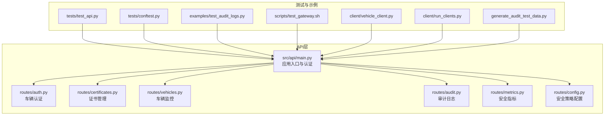
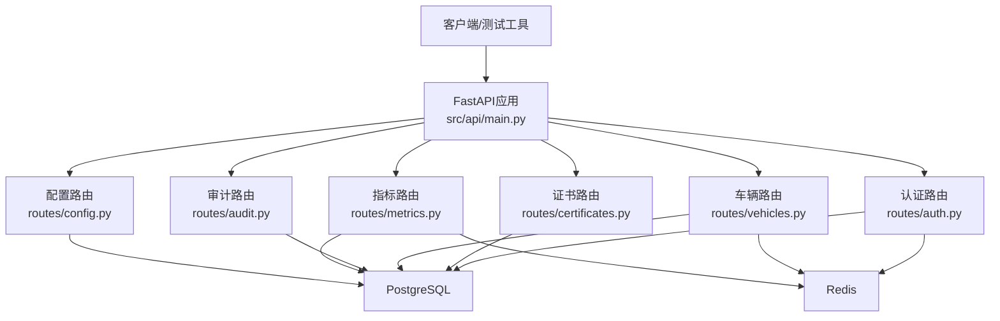
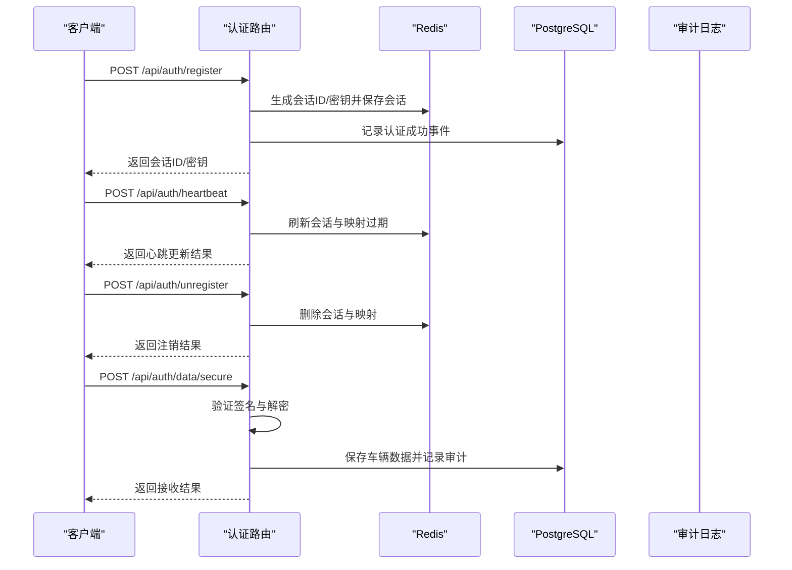
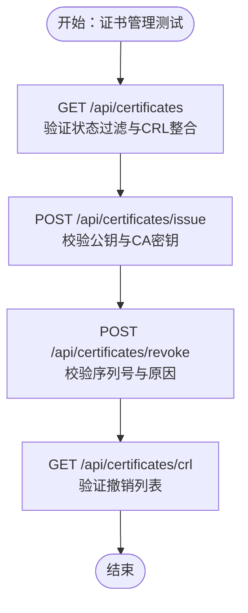
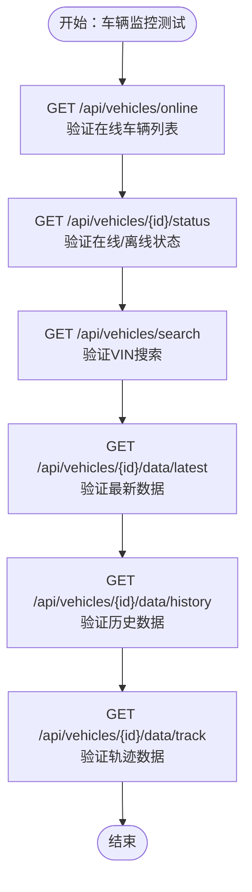
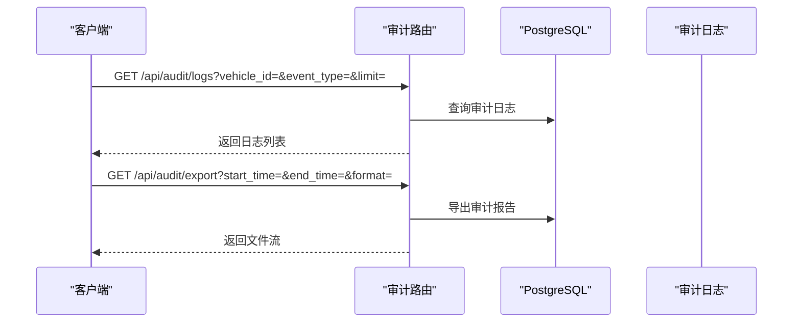
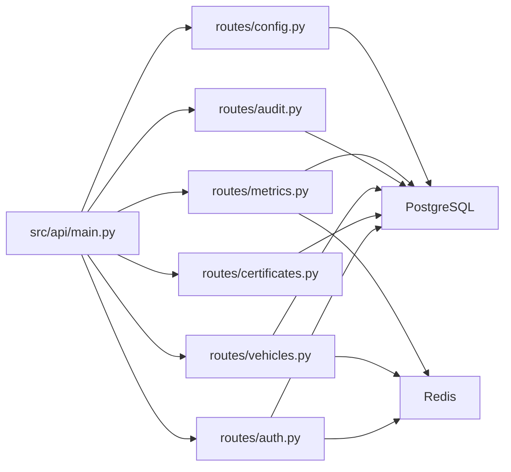

# API测试

<cite>
**本文引用的文件**
- [API.md](file://docs/API.md)
- [main.py](file://src/api/main.py)
- [auth.py](file://src/api/routes/auth.py)
- [certificates.py](file://src/api/routes/certificates.py)
- [vehicles.py](file://src/api/routes/vehicles.py)
- [audit.py](file://src/api/routes/audit.py)
- [metrics.py](file://src/api/routes/metrics.py)
- [config.py](file://src/api/routes/config.py)
- [test_api.py](file://tests/test_api.py)
- [conftest.py](file://tests/conftest.py)
- [test_audit_logs.py](file://examples/test_audit_logs.py)
- [vehicle_client.py](file://client/vehicle_client.py)
- [run_clients.py](file://client/run_clients.py)
- [test_gateway.sh](file://scripts/test_gateway.sh)
- [generate_audit_test_data.py](file://generate_audit_test_data.py)
</cite>

## 目录
1. [简介](#简介)
2. [项目结构](#项目结构)
3. [核心组件](#核心组件)
4. [架构总览](#架构总览)
5. [详细组件分析](#详细组件分析)
6. [依赖分析](#依赖分析)
7. [性能考虑](#性能考虑)
8. [故障排查指南](#故障排查指南)
9. [结论](#结论)
10. [附录](#附录)

## 简介
本文件面向车联网安全通信网关的API测试，提供系统化的RESTful API测试方法论与实践指南。内容覆盖HTTP请求测试、响应验证与状态码检查；API测试分类（功能、性能、安全）；测试环境配置与测试数据准备；典型API测试用例设计（认证、证书管理、车辆监控、审计日志等）；自动化脚本编写与执行；以及错误处理、超时与重试机制。

## 项目结构
网关采用FastAPI提供RESTful API，路由按功能域拆分，测试与示例脚本位于tests与examples目录，客户端模拟器位于client目录，文档位于docs目录。

图示来源
- [main.py:105-108](file://src/api/main.py#L105-L108)
- [auth.py:1-685](file://src/api/routes/auth.py#L1-L685)
- [certificates.py:1-390](file://src/api/routes/certificates.py#L1-L390)
- [vehicles.py:1-447](file://src/api/routes/vehicles.py#L1-L447)
- [audit.py:1-191](file://src/api/routes/audit.py#L1-L191)
- [metrics.py:1-237](file://src/api/routes/metrics.py#L1-L237)
- [config.py:1-173](file://src/api/routes/config.py#L1-L173)
- [test_api.py:1-101](file://tests/test_api.py#L1-L101)
- [conftest.py:1-95](file://tests/conftest.py#L1-L95)
- [test_audit_logs.py:1-381](file://examples/test_audit_logs.py#L1-L381)
- [vehicle_client.py:1-809](file://client/vehicle_client.py#L1-L809)
- [run_clients.py:1-289](file://client/run_clients.py#L1-L289)
- [test_gateway.sh:1-115](file://scripts/test_gateway.sh#L1-L115)
- [generate_audit_test_data.py:1-206](file://generate_audit_test_data.py#L1-L206)

章节来源
- [main.py:105-108](file://src/api/main.py#L105-L108)
- [API.md:1-654](file://docs/API.md#L1-L654)

## 核心组件
- 认证与令牌校验：HTTP Bearer Token，开发环境默认令牌可通过环境变量配置。
- 车辆认证与会话：注册、心跳、注销、安全数据接收与普通数据接收。
- 证书管理：查询、颁发、撤销、CRL查询。
- 车辆监控：在线车辆、状态、搜索、最新/历史/轨迹数据。
- 审计日志：查询、导出。
- 安全指标：实时与历史指标。
- 安全策略配置：查询与更新。

章节来源
- [main.py:49-74](file://src/api/main.py#L49-L74)
- [auth.py:70-230](file://src/api/routes/auth.py#L70-L230)
- [certificates.py:81-390](file://src/api/routes/certificates.py#L81-L390)
- [vehicles.py:38-447](file://src/api/routes/vehicles.py#L38-L447)
- [audit.py:39-191](file://src/api/routes/audit.py#L39-L191)
- [metrics.py:39-237](file://src/api/routes/metrics.py#L39-L237)
- [config.py:64-173](file://src/api/routes/config.py#L64-L173)

## 架构总览
API采用模块化路由设计，统一认证中间件，各功能域独立路由，数据访问通过PostgreSQL与Redis连接器实现。

图示来源
- [main.py:94-102](file://src/api/main.py#L94-L102)
- [auth.py:94-103](file://src/api/routes/auth.py#L94-L103)
- [certificates.py:98-107](file://src/api/routes/certificates.py#L98-L107)
- [vehicles.py:50-57](file://src/api/routes/vehicles.py#L50-L57)
- [metrics.py:123-130](file://src/api/routes/metrics.py#L123-L130)

## 详细组件分析

### 认证API测试
- 目标：验证令牌校验、车辆注册、心跳、注销、安全数据接收。
- 关键端点与行为
  - 令牌校验：verify_token读取环境变量API_TOKEN进行校验。
  - 注册：生成会话ID与会话密钥，保存会话与车辆映射，记录审计事件。
  - 心跳：刷新会话与车辆映射过期时间。
  - 注销：删除会话与映射。
  - 安全数据接收：验证SM2签名与SM4解密，保存至数据库并记录审计事件。
- 测试要点
  - 未授权访问：403/401。
  - 会话有效性：404（会话不存在或过期）。
  - 数据格式与签名验证：400（格式错误/验证失败）。
  - 审计事件完整性：认证成功/失败、数据传输成功/失败均应记录。

图示来源
- [auth.py:70-230](file://src/api/routes/auth.py#L70-L230)
- [auth.py:232-330](file://src/api/routes/auth.py#L232-L330)
- [auth.py:332-540](file://src/api/routes/auth.py#L332-L540)

章节来源
- [auth.py:70-230](file://src/api/routes/auth.py#L70-L230)
- [auth.py:232-330](file://src/api/routes/auth.py#L232-L330)
- [auth.py:332-540](file://src/api/routes/auth.py#L332-L540)

### 证书管理API测试
- 目标：验证证书列表、颁发、撤销、CRL查询。
- 关键端点与行为
  - 列表：支持按状态过滤，结合CRL确定有效状态。
  - 颁发：解析公钥、加载CA密钥、颁发证书并记录审计事件。
  - 撤销：根据序列号撤销并记录审计事件。
  - CRL：返回当前撤销列表。
- 测试要点
  - 公钥格式与长度校验：400。
  - CA密钥配置：500。
  - 审计事件：颁发/撤销成功/失败均应记录。

图示来源
- [certificates.py:81-152](file://src/api/routes/certificates.py#L81-L152)
- [certificates.py:154-275](file://src/api/routes/certificates.py#L154-L275)
- [certificates.py:277-360](file://src/api/routes/certificates.py#L277-L360)
- [certificates.py:362-390](file://src/api/routes/certificates.py#L362-L390)

章节来源
- [certificates.py:81-152](file://src/api/routes/certificates.py#L81-L152)
- [certificates.py:154-275](file://src/api/routes/certificates.py#L154-L275)
- [certificates.py:277-360](file://src/api/routes/certificates.py#L277-L360)
- [certificates.py:362-390](file://src/api/routes/certificates.py#L362-L390)

### 车辆监控API测试
- 目标：验证在线车辆、状态查询、搜索、最新/历史/轨迹数据。
- 关键端点与行为
  - 在线车辆：扫描会话键，过滤最近活跃车辆。
  - 状态查询：根据会话判断在线/离线。
  - 搜索：按VIN关键字匹配。
  - 数据查询：最新、历史、轨迹。
- 测试要点
  - 会话超时清理：离线判定与会话删除。
  - 数据库查询：404（无数据）。
  - Redis键空间扫描与过期时间维护。

图示来源
- [vehicles.py:38-99](file://src/api/routes/vehicles.py#L38-L99)
- [vehicles.py:102-182](file://src/api/routes/vehicles.py#L102-L182)
- [vehicles.py:184-238](file://src/api/routes/vehicles.py#L184-L238)
- [vehicles.py:241-317](file://src/api/routes/vehicles.py#L241-L317)
- [vehicles.py:319-386](file://src/api/routes/vehicles.py#L319-L386)
- [vehicles.py:388-447](file://src/api/routes/vehicles.py#L388-L447)

章节来源
- [vehicles.py:38-99](file://src/api/routes/vehicles.py#L38-L99)
- [vehicles.py:102-182](file://src/api/routes/vehicles.py#L102-L182)
- [vehicles.py:184-238](file://src/api/routes/vehicles.py#L184-L238)
- [vehicles.py:241-317](file://src/api/routes/vehicles.py#L241-L317)
- [vehicles.py:319-386](file://src/api/routes/vehicles.py#L319-L386)
- [vehicles.py:388-447](file://src/api/routes/vehicles.py#L388-L447)

### 审计日志API测试
- 目标：验证日志查询、导出与事件类型。
- 关键端点与行为
  - 查询：支持时间范围、车辆ID、事件类型、操作结果过滤。
  - 导出：支持JSON/CSV格式下载。
  - 事件类型：认证成功/失败、数据传输、证书操作等。
- 测试要点
  - 事件类型枚举校验：400。
  - 导出格式校验：400。
  - 审计事件完整性：查询结果与导出文件一致性。

图示来源
- [audit.py:39-125](file://src/api/routes/audit.py#L39-L125)
- [audit.py:127-191](file://src/api/routes/audit.py#L127-L191)

章节来源
- [audit.py:39-125](file://src/api/routes/audit.py#L39-L125)
- [audit.py:127-191](file://src/api/routes/audit.py#L127-L191)

### 安全指标API测试
- 目标：验证实时与历史安全指标。
- 关键端点与行为
  - 实时：统计在线车辆、认证成功率、失败次数、数据传输量、签名失败、安全异常。
  - 历史：按小时聚合指标。
- 测试要点
  - 时间窗口与聚合逻辑：边界值与空数据处理。
  - Redis与PostgreSQL联合查询的准确性。

章节来源
- [metrics.py:39-149](file://src/api/routes/metrics.py#L39-L149)
- [metrics.py:151-237](file://src/api/routes/metrics.py#L151-L237)

### 安全策略配置API测试
- 目标：验证策略查询与更新。
- 关键端点与行为
  - 查询：返回当前策略配置。
  - 更新：参数范围校验、并发策略枚举校验、持久化。
- 测试要点
  - 参数范围与策略枚举：400。
  - 数据库持久化：500。

章节来源
- [config.py:64-106](file://src/api/routes/config.py#L64-L106)
- [config.py:108-173](file://src/api/routes/config.py#L108-L173)

## 依赖分析
- 认证依赖：HTTP Bearer令牌校验。
- 数据依赖：PostgreSQL用于审计、证书、车辆数据；Redis用于会话与在线状态缓存。
- 测试依赖：pytest、TestClient、requests、mock Redis。

图示来源
- [main.py:94-102](file://src/api/main.py#L94-L102)
- [auth.py:94-103](file://src/api/routes/auth.py#L94-L103)
- [certificates.py:98-107](file://src/api/routes/certificates.py#L98-L107)
- [vehicles.py:50-57](file://src/api/routes/vehicles.py#L50-L57)
- [metrics.py:123-130](file://src/api/routes/metrics.py#L123-L130)

章节来源
- [main.py:94-102](file://src/api/main.py#L94-L102)
- [conftest.py:82-95](file://tests/conftest.py#L82-L95)

## 性能考虑
- 速率限制：认证端点、查询端点、写入端点分别限制请求频率，超限返回429。
- Redis键扫描：在线车辆列表扫描需注意键数量规模，建议配合过期策略与批量清理。
- PostgreSQL聚合：历史指标按小时聚合，避免大范围全表扫描。
- 客户端压力测试：使用多客户端脚本模拟高并发数据上报，观察响应时间与错误率。

章节来源
- [API.md:625-634](file://docs/API.md#L625-L634)
- [vehicles.py:54-87](file://src/api/routes/vehicles.py#L54-L87)
- [metrics.py:177-223](file://src/api/routes/metrics.py#L177-L223)
- [run_clients.py:62-108](file://client/run_clients.py#L62-L108)

## 故障排查指南
- 未授权访问
  - 现象：403/401。
  - 排查：确认Authorization头与API_TOKEN配置。
- 会话相关错误
  - 现象：404（会话不存在/过期）。
  - 排查：检查Redis会话键是否存在与过期时间。
- 数据格式与签名验证失败
  - 现象：400（格式错误/验证失败）。
  - 排查：检查SM2签名与SM4密钥长度、Nonce与时间戳。
- 审计日志缺失
  - 现象：查询不到审计事件。
  - 排查：确认审计事件是否记录、数据库连接与权限、导出格式与时间范围。
- 性能瓶颈
  - 现象：响应缓慢或429。
  - 排查：降低请求频率、优化查询条件、检查数据库索引与Redis键数量。

章节来源
- [main.py:67-73](file://src/api/main.py#L67-L73)
- [auth.py:369-372](file://src/api/routes/auth.py#L369-L372)
- [auth.py:405-428](file://src/api/routes/auth.py#L405-L428)
- [audit.py:74-84](file://src/api/routes/audit.py#L74-L84)
- [API.md:625-634](file://docs/API.md#L625-L634)

## 结论
本文提供了针对车联网安全通信网关的RESTful API测试方法与实践，覆盖认证、证书、车辆监控、审计日志、指标与配置等核心领域。通过明确的测试分类、环境配置、用例设计与自动化脚本，可系统性保障API的功能正确性、性能稳定性与安全合规性。

## 附录

### API测试方法与工具
- HTTP请求测试
  - 使用cURL或Python requests发送GET/POST/PUT/DELETE请求，设置Authorization头与Content-Type。
  - 示例参考：[API.md:568-623](file://docs/API.md#L568-L623)
- 响应验证与状态码检查
  - 200/201成功、400参数错误、401/403未授权/禁止、404资源不存在、500服务器错误、429速率限制。
  - 参考：[API.md:453-462](file://docs/API.md#L453-L462)
- 自动化测试框架
  - pytest + TestClient：单元与集成测试。
  - requests：端到端API测试。
  - 参考：[test_api.py:1-101](file://tests/test_api.py#L1-L101)，[conftest.py:1-95](file://tests/conftest.py#L1-L95)

章节来源
- [API.md:453-462](file://docs/API.md#L453-L462)
- [test_api.py:1-101](file://tests/test_api.py#L1-L101)
- [conftest.py:1-95](file://tests/conftest.py#L1-L95)

### API测试分类
- 功能测试
  - 验证各端点的输入输出、业务流程与错误处理。
  - 参考：[test_api.py:13-97](file://tests/test_api.py#L13-L97)
- 性能测试
  - 速率限制与并发场景验证，使用多客户端脚本模拟高负载。
  - 参考：[run_clients.py:62-108](file://client/run_clients.py#L62-L108)，[API.md:625-634](file://docs/API.md#L625-L634)
- 安全测试
  - 令牌校验、数据签名与加密、会话超时与锁定策略。
  - 参考：[main.py:49-74](file://src/api/main.py#L49-L74)，[auth.py:105-126](file://src/api/routes/auth.py#L105-L126)

章节来源
- [test_api.py:13-97](file://tests/test_api.py#L13-L97)
- [run_clients.py:62-108](file://client/run_clients.py#L62-L108)
- [main.py:49-74](file://src/api/main.py#L49-L74)
- [auth.py:105-126](file://src/api/routes/auth.py#L105-L126)

### 测试环境配置与测试数据准备
- 环境变量
  - API_TOKEN：默认令牌，开发环境使用。
  - CA密钥：证书颁发所需。
  - 参考：[main.py:65-66](file://src/api/main.py#L65-L66)，[certificates.py:197-209](file://src/api/routes/certificates.py#L197-L209)
- 测试数据生成
  - 使用示例脚本生成审计日志测试数据。
  - 参考：[generate_audit_test_data.py:1-206](file://generate_audit_test_data.py#L1-L206)
- 自动化脚本
  - 快速测试脚本：健康检查、单次/连续数据传输。
  - 参考：[test_gateway.sh:1-115](file://scripts/test_gateway.sh#L1-L115)

章节来源
- [main.py:65-66](file://src/api/main.py#L65-L66)
- [certificates.py:197-209](file://src/api/routes/certificates.py#L197-L209)
- [generate_audit_test_data.py:1-206](file://generate_audit_test_data.py#L1-L206)
- [test_gateway.sh:1-115](file://scripts/test_gateway.sh#L1-L115)

### API测试用例设计
- 认证API
  - 用例：未授权访问、注册成功/失败、心跳更新、注销。
  - 参考：[auth.py:70-230](file://src/api/routes/auth.py#L70-L230)，[auth.py:232-330](file://src/api/routes/auth.py#L232-L330)
- 证书管理API
  - 用例：证书列表过滤、颁发公钥格式校验、撤销序列号校验、CRL查询。
  - 参考：[certificates.py:81-152](file://src/api/routes/certificates.py#L81-L152)，[certificates.py:154-275](file://src/api/routes/certificates.py#L154-L275)，[certificates.py:277-360](file://src/api/routes/certificates.py#L277-L360)，[certificates.py:362-390](file://src/api/routes/certificates.py#L362-L390)
- 车辆监控API
  - 用例：在线车辆列表、状态查询、搜索、最新/历史/轨迹数据。
  - 参考：[vehicles.py:38-99](file://src/api/routes/vehicles.py#L38-L99)，[vehicles.py:102-182](file://src/api/routes/vehicles.py#L102-L182)，[vehicles.py:184-238](file://src/api/routes/vehicles.py#L184-L238)，[vehicles.py:241-317](file://src/api/routes/vehicles.py#L241-L317)，[vehicles.py:319-386](file://src/api/routes/vehicles.py#L319-L386)，[vehicles.py:388-447](file://src/api/routes/vehicles.py#L388-L447)
- 审计日志API
  - 用例：按事件类型/车辆ID/时间范围查询、导出JSON/CSV。
  - 参考：[audit.py:39-125](file://src/api/routes/audit.py#L39-L125)，[audit.py:127-191](file://src/api/routes/audit.py#L127-L191)，[test_audit_logs.py:23-381](file://examples/test_audit_logs.py#L23-L381)
- 安全指标API
  - 用例：实时指标统计、历史指标聚合。
  - 参考：[metrics.py:39-149](file://src/api/routes/metrics.py#L39-L149)，[metrics.py:151-237](file://src/api/routes/metrics.py#L151-L237)
- 安全策略配置API
  - 用例：查询策略、更新策略（参数范围与枚举校验）。
  - 参考：[config.py:64-106](file://src/api/routes/config.py#L64-L106)，[config.py:108-173](file://src/api/routes/config.py#L108-L173)

章节来源
- [auth.py:70-230](file://src/api/routes/auth.py#L70-L230)
- [auth.py:232-330](file://src/api/routes/auth.py#L232-L330)
- [certificates.py:81-152](file://src/api/routes/certificates.py#L81-L152)
- [certificates.py:154-275](file://src/api/routes/certificates.py#L154-L275)
- [certificates.py:277-360](file://src/api/routes/certificates.py#L277-L360)
- [certificates.py:362-390](file://src/api/routes/certificates.py#L362-L390)
- [vehicles.py:38-99](file://src/api/routes/vehicles.py#L38-L99)
- [vehicles.py:102-182](file://src/api/routes/vehicles.py#L102-L182)
- [vehicles.py:184-238](file://src/api/routes/vehicles.py#L184-L238)
- [vehicles.py:241-317](file://src/api/routes/vehicles.py#L241-L317)
- [vehicles.py:319-386](file://src/api/routes/vehicles.py#L319-L386)
- [vehicles.py:388-447](file://src/api/routes/vehicles.py#L388-L447)
- [audit.py:39-125](file://src/api/routes/audit.py#L39-L125)
- [audit.py:127-191](file://src/api/routes/audit.py#L127-L191)
- [test_audit_logs.py:23-381](file://examples/test_audit_logs.py#L23-L381)
- [metrics.py:39-149](file://src/api/routes/metrics.py#L39-L149)
- [metrics.py:151-237](file://src/api/routes/metrics.py#L151-L237)
- [config.py:64-106](file://src/api/routes/config.py#L64-L106)
- [config.py:108-173](file://src/api/routes/config.py#L108-L173)

### API测试自动化脚本编写与执行
- pytest测试
  - 使用TestClient与自定义fixture（Mock Redis）。
  - 参考：[test_api.py:1-101](file://tests/test_api.py#L1-L101)，[conftest.py:1-95](file://tests/conftest.py#L1-L95)
- 端到端测试
  - 使用requests与示例脚本验证审计日志。
  - 参考：[test_audit_logs.py:1-381](file://examples/test_audit_logs.py#L1-L381)
- 快速集成测试
  - 使用脚本触发客户端模拟器进行单次/连续数据传输。
  - 参考：[test_gateway.sh:1-115](file://scripts/test_gateway.sh#L1-L115)，[vehicle_client.py:726-774](file://client/vehicle_client.py#L726-L774)

章节来源
- [test_api.py:1-101](file://tests/test_api.py#L1-L101)
- [conftest.py:1-95](file://tests/conftest.py#L1-L95)
- [test_audit_logs.py:1-381](file://examples/test_audit_logs.py#L1-L381)
- [test_gateway.sh:1-115](file://scripts/test_gateway.sh#L1-L115)
- [vehicle_client.py:726-774](file://client/vehicle_client.py#L726-L774)

### 错误处理、超时与重试机制
- 错误处理
  - 统一错误响应格式与HTTP状态码。
  - 参考：[API.md:443-462](file://docs/API.md#L443-L462)
- 超时处理
  - 客户端请求设置timeout；会话超时通过Redis TTL与策略管理器控制。
  - 参考：[vehicle_client.py:144-145](file://client/vehicle_client.py#L144-L145)，[auth.py:128-130](file://src/api/routes/auth.py#L128-L130)
- 重试机制
  - 建议在客户端脚本中对临时性错误（网络抖动、服务瞬时不可用）进行指数退避重试。
  - 参考：[vehicle_client.py:634-635](file://client/vehicle_client.py#L634-L635)

章节来源
- [API.md:443-462](file://docs/API.md#L443-L462)
- [vehicle_client.py:144-145](file://client/vehicle_client.py#L144-L145)
- [auth.py:128-130](file://src/api/routes/auth.py#L128-L130)
- [vehicle_client.py:634-635](file://client/vehicle_client.py#L634-L635)