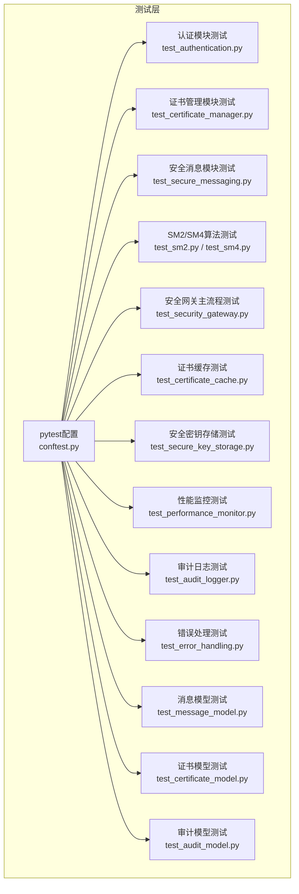
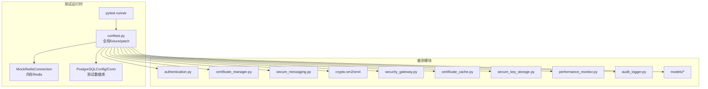
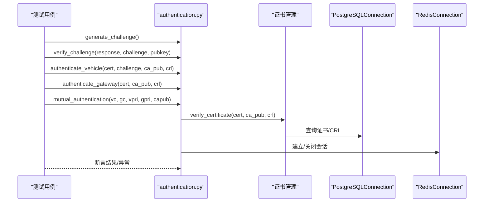
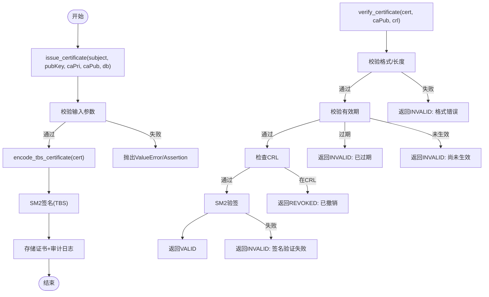
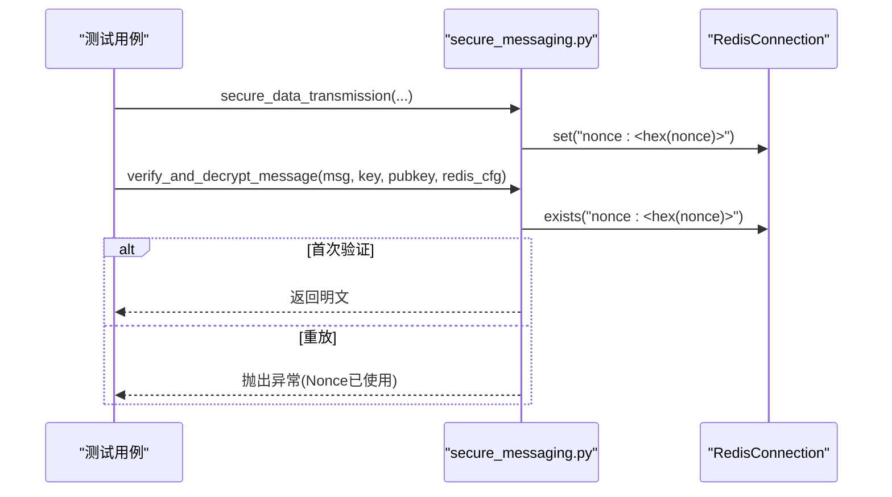
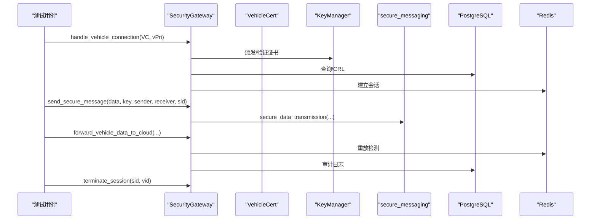
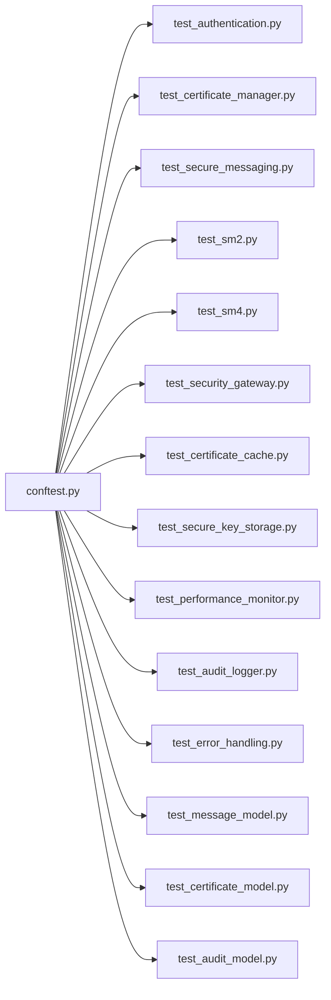

# 单元测试

<cite>
**本文引用的文件**
- [tests/conftest.py](file://tests/conftest.py)
- [tests/test_authentication.py](file://tests/test_authentication.py)
- [tests/test_certificate_manager.py](file://tests/test_certificate_manager.py)
- [tests/test_secure_messaging.py](file://tests/test_secure_messaging.py)
- [tests/test_sm2.py](file://tests/test_sm2.py)
- [tests/test_sm4.py](file://tests/test_sm4.py)
- [tests/test_security_gateway.py](file://tests/test_security_gateway.py)
- [tests/test_certificate_cache.py](file://tests/test_certificate_cache.py)
- [tests/test_secure_key_storage.py](file://tests/test_secure_key_storage.py)
- [tests/test_performance_monitor.py](file://tests/test_performance_monitor.py)
- [tests/test_audit_logger.py](file://tests/test_audit_logger.py)
- [tests/test_error_handling.py](file://tests/test_error_handling.py)
- [tests/test_message_model.py](file://tests/test_message_model.py)
- [tests/test_certificate_model.py](file://tests/test_certificate_model.py)
- [tests/test_audit_model.py](file://tests/test_audit_model.py)
</cite>

## 目录
1. [引言](#引言)
2. [项目结构](#项目结构)
3. [核心组件](#核心组件)
4. [架构总览](#架构总览)
5. [详细组件分析](#详细组件分析)
6. [依赖分析](#依赖分析)
7. [性能考虑](#性能考虑)
8. [故障排查指南](#故障排查指南)
9. [结论](#结论)
10. [附录](#附录)

## 引言
本文件面向车联网安全通信网关项目的单元测试，系统阐述测试设计原则、pytest框架使用方法、各核心模块的测试用例设计与编写规范，并提供异常与边界条件测试策略、测试数据准备与环境隔离最佳实践。目标是帮助开发者与测试工程师高效构建高质量、可维护、可扩展的单元测试体系。

## 项目结构
测试目录采用“按模块分层”的组织方式，覆盖认证、证书管理、安全消息、加密算法、网关主流程、缓存、密钥存储、性能监控、审计日志、错误处理以及各类数据模型的单元测试。pytest通过conftest集中配置全局fixture与Mock，确保测试隔离与可重复性。

图示来源
- [tests/conftest.py:1-95](file://tests/conftest.py#L1-L95)
- [tests/test_authentication.py:1-520](file://tests/test_authentication.py#L1-L520)
- [tests/test_certificate_manager.py:1-758](file://tests/test_certificate_manager.py#L1-L758)
- [tests/test_secure_messaging.py:1-183](file://tests/test_secure_messaging.py#L1-L183)
- [tests/test_sm2.py:1-258](file://tests/test_sm2.py#L1-L258)
- [tests/test_sm4.py:1-260](file://tests/test_sm4.py#L1-L260)
- [tests/test_security_gateway.py:1-1154](file://tests/test_security_gateway.py#L1-L1154)
- [tests/test_certificate_cache.py:1-288](file://tests/test_certificate_cache.py#L1-L288)
- [tests/test_secure_key_storage.py:1-313](file://tests/test_secure_key_storage.py#L1-L313)
- [tests/test_performance_monitor.py:1-483](file://tests/test_performance_monitor.py#L1-L483)
- [tests/test_audit_logger.py:1-1275](file://tests/test_audit_logger.py#L1-L1275)
- [tests/test_error_handling.py:1-693](file://tests/test_error_handling.py#L1-L693)
- [tests/test_message_model.py:1-494](file://tests/test_message_model.py#L1-L494)
- [tests/test_certificate_model.py:1-183](file://tests/test_certificate_model.py#L1-L183)
- [tests/test_audit_model.py:1-200](file://tests/test_audit_model.py#L1-L200)

章节来源
- [tests/conftest.py:1-95](file://tests/conftest.py#L1-L95)

## 核心组件
- 认证模块：挑战-响应、车端/网关认证、双向认证、会话建立/关闭、冲突处理、过期清理。
- 证书管理：序列号生成、DN构造、扩展生成、TBS编码、证书颁发、验证、撤销。
- 安全消息：报文封装、时间戳、nonce、签名、加解密、重放攻击检测。
- 加密算法：SM2签名/验签、SM4加解密，含长度校验、随机性与往返一致性。
- 网关主流程：证书颁发/验证/撤销、认证、会话管理、安全报文收发、数据转发、审计日志。
- 缓存与密钥：证书验证缓存（LRU+TTL）、安全密钥存储（增删改查、轮换、自动轮换、线程安全）。
- 性能监控：认证、加解密、签名验签、会话建立/查询的延迟、吞吐、TPS、并发统计。
- 审计日志：事件记录、查询过滤、详细信息截断、持久化容错。
- 错误处理：证书验证失败、签名失败、会话过期、重放攻击、加解密失败、CA服务不可用、审计日志记录。
- 数据模型：消息头、安全报文、证书、审计日志的序列化/反序列化与有效性校验。

章节来源
- [tests/test_authentication.py:1-520](file://tests/test_authentication.py#L1-L520)
- [tests/test_certificate_manager.py:1-758](file://tests/test_certificate_manager.py#L1-L758)
- [tests/test_secure_messaging.py:1-183](file://tests/test_secure_messaging.py#L1-L183)
- [tests/test_sm2.py:1-258](file://tests/test_sm2.py#L1-L258)
- [tests/test_sm4.py:1-260](file://tests/test_sm4.py#L1-L260)
- [tests/test_security_gateway.py:1-1154](file://tests/test_security_gateway.py#L1-L1154)
- [tests/test_certificate_cache.py:1-288](file://tests/test_certificate_cache.py#L1-L288)
- [tests/test_secure_key_storage.py:1-313](file://tests/test_secure_key_storage.py#L1-L313)
- [tests/test_performance_monitor.py:1-483](file://tests/test_performance_monitor.py#L1-L483)
- [tests/test_audit_logger.py:1-1275](file://tests/test_audit_logger.py#L1-L1275)
- [tests/test_error_handling.py:1-693](file://tests/test_error_handling.py#L1-L693)
- [tests/test_message_model.py:1-494](file://tests/test_message_model.py#L1-L494)
- [tests/test_certificate_model.py:1-183](file://tests/test_certificate_model.py#L1-L183)
- [tests/test_audit_model.py:1-200](file://tests/test_audit_model.py#L1-L200)

## 架构总览
pytest通过conftest集中管理Redis/Mock数据库连接、全局配置与自动注入fixture，确保所有模块测试在隔离环境中运行，避免跨用例污染。

图示来源
- [tests/conftest.py:1-95](file://tests/conftest.py#L1-L95)

## 详细组件分析

### 认证模块测试
- 设计原则：覆盖挑战生成/验证、车端/网关认证、双向认证、会话生命周期、冲突策略、过期清理。
- 断言方法：长度校验、类型校验、业务结果布尔值、异常类型与消息匹配。
- Mock对象：使用patch替换数据库/证书验证逻辑，确保独立可控。
- 边界与异常：无效长度、过期令牌、车辆ID不匹配、无效策略、Redis连接异常。

图示来源
- [tests/test_authentication.py:1-520](file://tests/test_authentication.py#L1-L520)

章节来源
- [tests/test_authentication.py:1-520](file://tests/test_authentication.py#L1-L520)

### 证书管理模块测试
- 设计原则：序列号唯一性、DN格式、扩展默认值、TBS编码确定性、证书颁发完整性、验证多分支（有效/过期/未生效/撤销/签名无效/格式错误）、撤销幂等与审计日志。
- 断言方法：长度/格式/有效期/签名可验证、异常消息匹配、数据库调用次数。
- Mock对象：数据库连接、CRL查询、签名验证。
- 边界与异常：空/超长序列号、无效公钥/私钥长度、None输入、撤销不存在证书。

图示来源
- [tests/test_certificate_manager.py:1-758](file://tests/test_certificate_manager.py#L1-L758)

章节来源
- [tests/test_certificate_manager.py:1-758](file://tests/test_certificate_manager.py#L1-L758)

### 安全消息模块测试
- 设计原则：报文头完整性、时间戳、nonce、加密载荷、签名长度、重放攻击检测、Redis去重。
- 断言方法：字段类型/长度、解密一致性、异常消息匹配。
- Mock对象：Redis连接（自动patch）。
- 边界与异常：重放攻击、nonce标记、空载荷、无效签名。

图示来源
- [tests/test_secure_messaging.py:1-183](file://tests/test_secure_messaging.py#L1-L183)

章节来源
- [tests/test_secure_messaging.py:1-183](file://tests/test_secure_messaging.py#L1-L183)

### 加密算法模块测试（SM2/SM4）
- 设计原则：长度约束、随机性、往返一致性、多长度/Unicode/二进制数据、错误输入。
- 断言方法：长度断言、异常消息匹配、多次签名/加解密结果一致性。
- Mock对象：无，直接调用算法实现。
- 边界与异常：空数据、无效长度、错误公钥/私钥、错误密钥、损坏密文。

章节来源
- [tests/test_sm2.py:1-258](file://tests/test_sm2.py#L1-L258)
- [tests/test_sm4.py:1-260](file://tests/test_sm4.py#L1-L260)

### 安全网关主流程测试
- 设计原则：端到端流程（认证→会话→安全报文→数据转发→审计日志→会话终止）。
- 断言方法：成功/失败标志、消息头/签名/nonce长度、响应类型、审计日志过滤与内容。
- Mock对象：数据库、Redis、证书验证、CRL。
- 边界与异常：过期会话、篡改消息、重放攻击、大量载荷、并发转发。

图示来源
- [tests/test_security_gateway.py:1-1154](file://tests/test_security_gateway.py#L1-L1154)

章节来源
- [tests/test_security_gateway.py:1-1154](file://tests/test_security_gateway.py#L1-L1154)

### 证书缓存与安全密钥存储测试
- 证书缓存：LRU+TTL、过期清理、并发安全、线程安全、性能阈值。
- 安全密钥存储：增删改查、轮换、自动轮换线程、元数据、线程安全、并发访问。

章节来源
- [tests/test_certificate_cache.py:1-288](file://tests/test_certificate_cache.py#L1-L288)
- [tests/test_secure_key_storage.py:1-313](file://tests/test_secure_key_storage.py#L1-L313)

### 性能监控测试
- 设计原则：认证延迟/TPS、加解密吞吐/1KB延迟、签名验签OPS、会话建立/查询延迟、并发会话跟踪。
- 断言方法：指标聚合、达标判断、线程安全、装饰器/上下文管理器使用。
- 边界与异常：极端负载、高并发、指标重置。

章节来源
- [tests/test_performance_monitor.py:1-483](file://tests/test_performance_monitor.py#L1-L483)

### 审计日志与数据模型测试
- 审计日志：UUID日志ID、详细信息截断、查询过滤（时间/车辆/事件/结果）、持久化容错。
- 数据模型：消息头/安全报文/证书/审计日志的序列化/反序列化与有效性校验。

章节来源
- [tests/test_audit_logger.py:1-1275](file://tests/test_audit_logger.py#L1-L1275)
- [tests/test_message_model.py:1-494](file://tests/test_message_model.py#L1-L494)
- [tests/test_certificate_model.py:1-183](file://tests/test_certificate_model.py#L1-L183)
- [tests/test_audit_model.py:1-200](file://tests/test_audit_model.py#L1-L200)

### 错误处理测试
- 设计原则：覆盖证书验证失败、签名失败、会话过期、重放攻击、加解密失败、CA服务不可用、审计日志记录。
- 断言方法：异常类型/消息、审计日志过滤与详情、集成流程验证。

章节来源
- [tests/test_error_handling.py:1-693](file://tests/test_error_handling.py#L1-L693)

## 依赖分析
- 测试耦合：通过conftest集中管理Redis/Mock数据库，降低模块间耦合；各模块测试独立运行，互不影响。
- 外部依赖：PostgreSQL/Redis在测试环境中由Mock替代；算法模块直接依赖本地实现。
- 循环依赖：测试文件之间无循环导入；模块间依赖方向清晰。

图示来源
- [tests/conftest.py:1-95](file://tests/conftest.py#L1-L95)

章节来源
- [tests/conftest.py:1-95](file://tests/conftest.py#L1-L95)

## 性能考虑
- 测试性能：使用Mock减少IO开销；缓存/密钥存储支持大规模数据与并发；性能监控提供指标阈值与达标判断。
- 实践建议：优先使用内存Redis；批量生成测试数据时注意LRU/TTL策略；并发测试需关注线程安全与锁竞争。

## 故障排查指南
- 常见问题
  - 证书验证失败：检查有效期、撤销列表、签名算法与长度。
  - 重放攻击：确认nonce键是否正确标记与清理。
  - 会话过期：核对会话ID与Redis键空间。
  - 审计日志缺失：检查持久化异常处理与数据库连接状态。
- 定位方法：结合pytest断言与异常消息；利用审计日志过滤定位具体环节。

章节来源
- [tests/test_error_handling.py:1-693](file://tests/test_error_handling.py#L1-L693)
- [tests/test_audit_logger.py:1-1275](file://tests/test_audit_logger.py#L1-L1275)

## 结论
本测试体系遵循“模块化、可重复、可扩展”的设计原则，通过pytest与Mock实现环境隔离与可控性，覆盖认证、证书、消息、算法、网关主流程、缓存、密钥、性能、审计与错误处理等关键领域。建议持续补充边界与异常场景，完善测试覆盖率与性能基线，确保系统在复杂车联网场景下的安全性与稳定性。

## 附录
- 测试编写规范
  - 命名：测试类使用TestXxx，测试方法使用test_xxx，参数化使用pytest.mark.parametrize。
  - 断言：优先使用明确的断言与异常消息匹配；对业务结果进行组合断言。
  - Mock：集中于conftest，按需patch；避免在被测模块内硬编码Mock。
  - fixture：尽量使用autouse与共享fixture，减少重复setup/teardown。
  - 数据准备：使用工厂函数生成合法/非法输入；对敏感数据避免记录到日志。
  - 环境隔离：使用独立数据库/Redis实例或Mock；测试结束后清理状态。
- 测试覆盖率
  - 建议：核心模块（认证、证书、消息、算法、网关主流程）达到高覆盖率；缓存/密钥/性能/审计等模块覆盖关键路径与异常分支。
- 异常与边界测试
  - 输入长度/格式/类型校验、过期/未生效/撤销、重放攻击、空数据、错误密钥/公钥、数据库异常、网络中断等。
- 测试数据准备
  - 使用SM2/SM4生成器生成密钥与签名；使用模型工厂生成合法/非法数据；使用Mock数据库/CRL模拟真实环境。