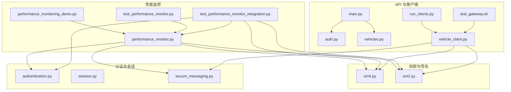
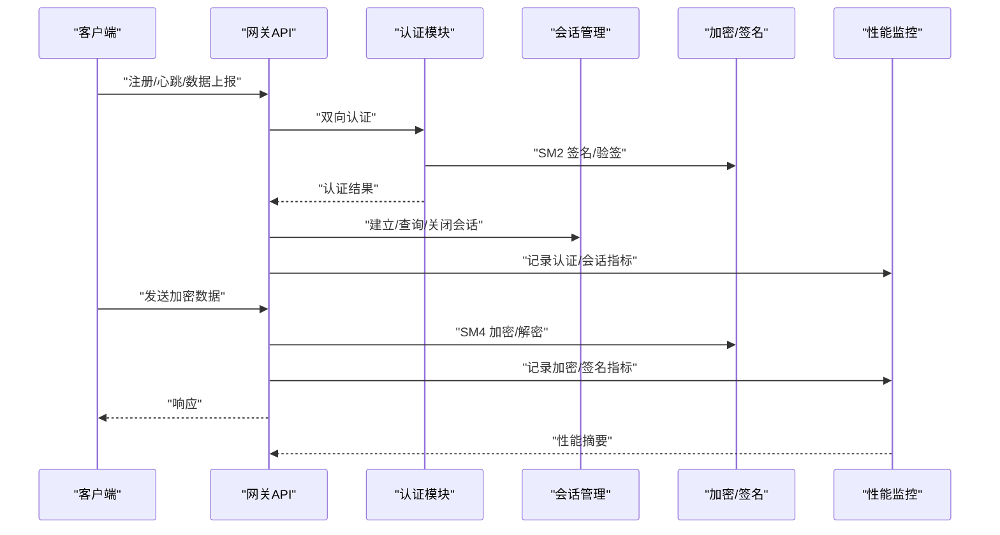
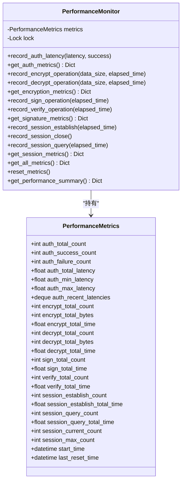
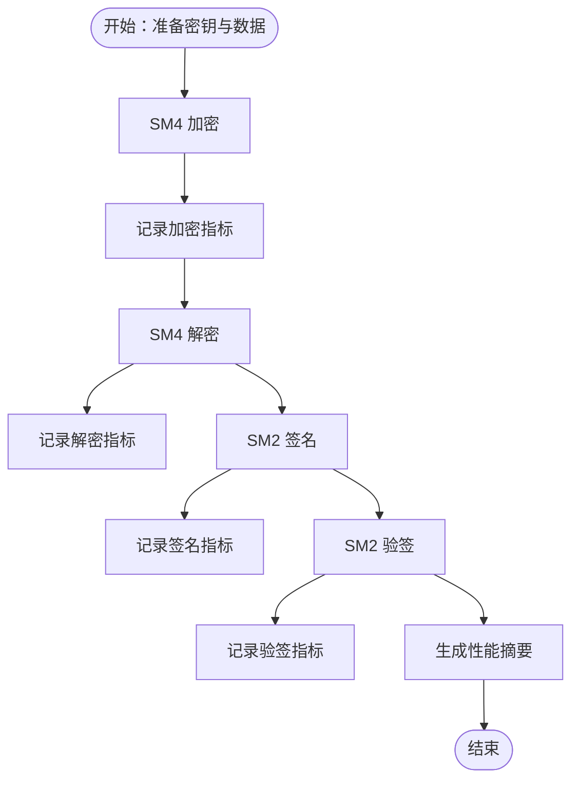
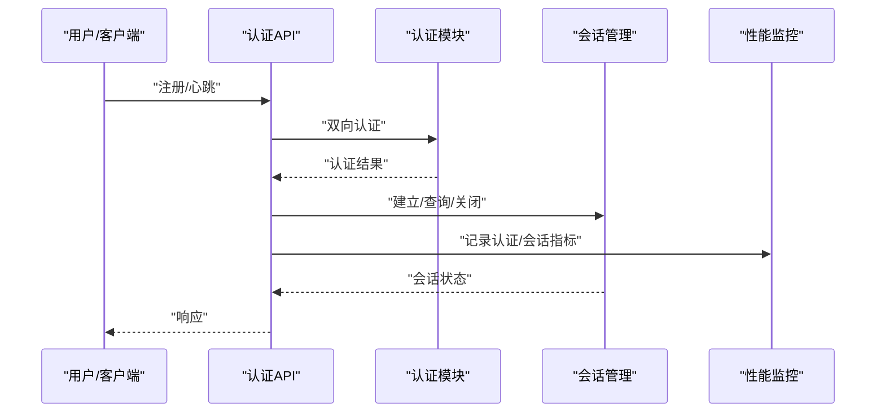
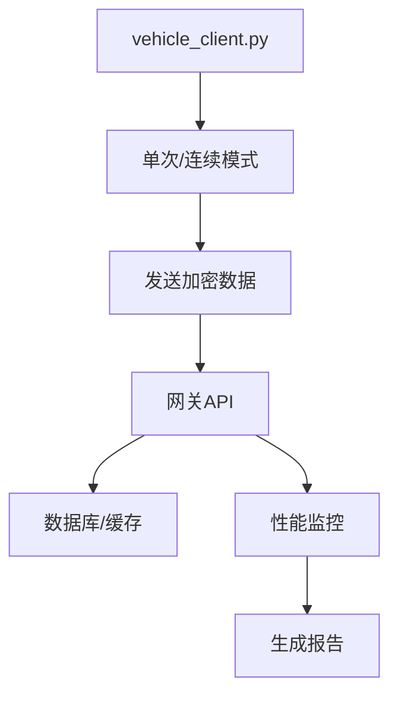
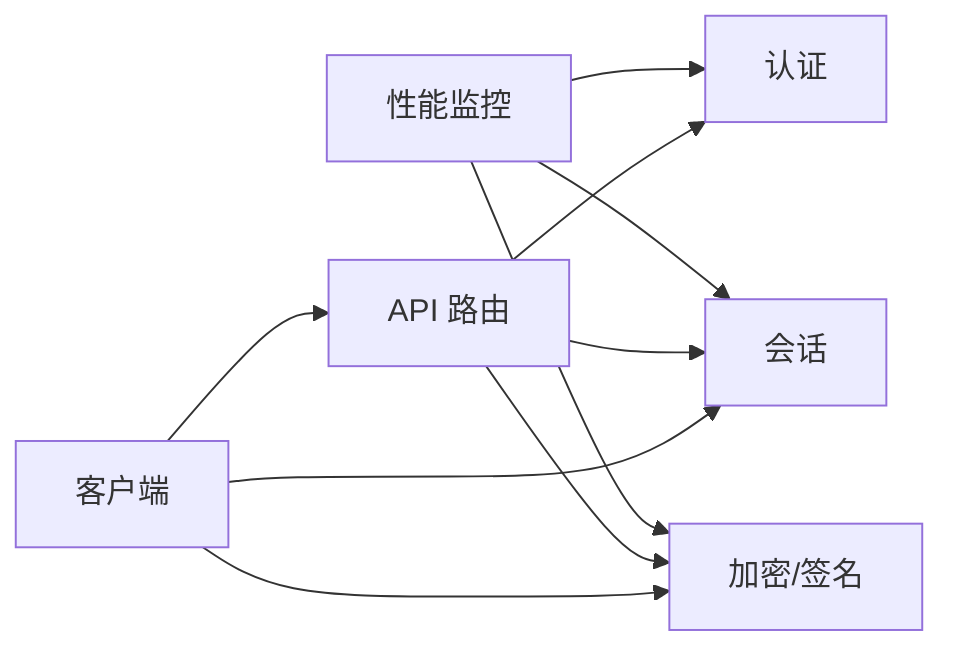

# 性能测试

<cite>
**本文引用的文件**
- [performance_monitor.py](file://src/performance_monitor.py)
- [performance_monitoring_demo.py](file://examples/performance_monitoring_demo.py)
- [test_performance_monitor.py](file://tests/test_performance_monitor.py)
- [test_performance_monitor_integration.py](file://tests/test_performance_monitor_integration.py)
- [sm4.py](file://src/crypto/sm4.py)
- [sm2.py](file://src/crypto/sm2.py)
- [authentication.py](file://src/authentication.py)
- [session.py](file://src/models/session.py)
- [vehicle_client.py](file://client/vehicle_client.py)
- [run_clients.py](file://client/run_clients.py)
- [test_gateway.sh](file://scripts/test_gateway.sh)
- [main.py](file://src/api/main.py)
- [vehicles.py](file://src/api/routes/vehicles.py)
- [auth.py](file://src/api/routes/auth.py)
- [secure_messaging.py](file://src/secure_messaging.py)
</cite>

## 目录
1. [引言](#引言)
2. [项目结构](#项目结构)
3. [核心组件](#核心组件)
4. [架构总览](#架构总览)
5. [详细组件分析](#详细组件分析)
6. [依赖分析](#依赖分析)
7. [性能考虑](#性能考虑)
8. [故障排查指南](#故障排查指南)
9. [结论](#结论)
10. [附录](#附录)

## 引言
本文件面向车联网安全通信网关的性能测试，围绕响应时间、吞吐量、并发用户数与资源利用率等关键指标，系统阐述负载测试、压力测试与稳定性测试的实施方案；介绍性能测试工具（如 ab、wrk、JMeter）的使用要点；给出性能基准测试的设置与执行流程；涵盖加密算法与网络传输性能测试方法；并提供性能瓶颈分析与优化建议及性能测试报告生成与分析方法。

## 项目结构
本项目采用模块化设计，核心性能监控能力集中在性能监控模块，配合加密算法模块、认证与会话管理模块、API 路由与客户端工具，形成完整的测试与验证闭环。

**图表来源**
- [performance_monitor.py:1-613](file://src/performance_monitor.py#L1-L613)
- [performance_monitoring_demo.py:1-255](file://examples/performance_monitoring_demo.py#L1-L255)
- [test_performance_monitor.py:1-483](file://tests/test_performance_monitor.py#L1-L483)
- [test_performance_monitor_integration.py:1-380](file://tests/test_performance_monitor_integration.py#L1-L380)
- [sm4.py:1-189](file://src/crypto/sm4.py#L1-L189)
- [sm2.py:1-265](file://src/crypto/sm2.py#L1-L265)
- [authentication.py:1-662](file://src/authentication.py#L1-L662)
- [session.py:1-104](file://src/models/session.py#L1-L104)
- [secure_messaging.py:1-249](file://src/secure_messaging.py#L1-L249)
- [main.py:1-108](file://src/api/main.py#L1-L108)
- [vehicles.py:1-447](file://src/api/routes/vehicles.py#L1-L447)
- [auth.py:1-685](file://src/api/routes/auth.py#L1-L685)
- [vehicle_client.py:1-809](file://client/vehicle_client.py#L1-L809)
- [run_clients.py:1-289](file://client/run_clients.py#L1-L289)
- [test_gateway.sh:1-115](file://scripts/test_gateway.sh#L1-L115)

**章节来源**
- [performance_monitor.py:1-613](file://src/performance_monitor.py#L1-L613)
- [performance_monitoring_demo.py:1-255](file://examples/performance_monitoring_demo.py#L1-L255)
- [test_performance_monitor.py:1-483](file://tests/test_performance_monitor.py#L1-L483)
- [test_performance_monitor_integration.py:1-380](file://tests/test_performance_monitor_integration.py#L1-L380)
- [sm4.py:1-189](file://src/crypto/sm4.py#L1-L189)
- [sm2.py:1-265](file://src/crypto/sm2.py#L1-L265)
- [authentication.py:1-662](file://src/authentication.py#L1-L662)
- [session.py:1-104](file://src/models/session.py#L1-L104)
- [secure_messaging.py:1-249](file://src/secure_messaging.py#L1-L249)
- [main.py:1-108](file://src/api/main.py#L1-L108)
- [vehicles.py:1-447](file://src/api/routes/vehicles.py#L1-L447)
- [auth.py:1-685](file://src/api/routes/auth.py#L1-L685)
- [vehicle_client.py:1-809](file://client/vehicle_client.py#L1-L809)
- [run_clients.py:1-289](file://client/run_clients.py#L1-L289)
- [test_gateway.sh:1-115](file://scripts/test_gateway.sh#L1-L115)

## 核心组件
- 性能监控模块：提供认证、加密解密、签名验签、会话管理的性能指标采集与汇总，支持线程安全与装饰器/上下文管理器两种埋点方式。
- 加密与签名模块：SM4 对称加密/解密、SM2 数字签名/验签，为性能测试提供真实算法负载。
- 认证与会话模块：双向认证、会话建立/查询/关闭，支撑高并发场景下的会话管理性能评估。
- API 与客户端：提供 REST API 与多客户端工具，支持批量并发测试与自动化脚本。
- 测试与演示：单元测试与集成测试覆盖性能指标计算与埋点正确性；演示脚本展示监控器使用方式。

**章节来源**
- [performance_monitor.py:54-422](file://src/performance_monitor.py#L54-L422)
- [sm4.py:49-189](file://src/crypto/sm4.py#L49-L189)
- [sm2.py:135-265](file://src/crypto/sm2.py#L135-L265)
- [authentication.py:196-481](file://src/authentication.py#L196-L481)
- [session.py:9-104](file://src/models/session.py#L9-L104)
- [vehicle_client.py:1-809](file://client/vehicle_client.py#L1-L809)
- [run_clients.py:1-289](file://client/run_clients.py#L1-L289)
- [test_performance_monitor.py:1-483](file://tests/test_performance_monitor.py#L1-L483)
- [test_performance_monitor_integration.py:1-380](file://tests/test_performance_monitor_integration.py#L1-L380)

## 架构总览
性能测试贯穿“客户端-网关-API-数据库/缓存”的链路，性能监控模块在关键路径上埋点，采集认证延迟、加解密吞吐、签名验签速率、会话并发与查询延迟等指标，最终输出统一的性能摘要与达标状态。

**图表来源**
- [auth.py:70-230](file://src/api/routes/auth.py#L70-L230)
- [vehicles.py:332-540](file://src/api/routes/vehicles.py#L332-L540)
- [authentication.py:196-481](file://src/authentication.py#L196-L481)
- [secure_messaging.py:17-249](file://src/secure_messaging.py#L17-L249)
- [performance_monitor.py:68-422](file://src/performance_monitor.py#L68-L422)

## 详细组件分析

### 性能监控模块
- 指标维度
  - 认证：总次数、成功/失败、总延迟、最小/最大延迟、TPS、是否满足延迟与吞吐要求。
  - 加密解密：次数、总字节、吞吐量(MB/s)、1KB 平均加密时间、是否满足吞吐与延迟要求。
  - 签名验签：次数、每秒操作数、是否满足速率要求。
  - 会话管理：当前/最大并发、建立/查询次数与平均耗时、是否满足并发与延迟要求。
- 埋点方式
  - 装饰器：@monitor_auth_performance、@monitor_encrypt_performance、@monitor_decrypt_performance、@monitor_sign_performance、@monitor_verify_performance。
  - 上下文管理器：with monitor_session_establish()/monitor_session_query()。
- 线程安全：内部使用锁保护指标累加与读取。
- 输出：单次指标查询与全量性能摘要，包含达标状态。

**图表来源**
- [performance_monitor.py:14-422](file://src/performance_monitor.py#L14-L422)

**章节来源**
- [performance_monitor.py:54-422](file://src/performance_monitor.py#L54-L422)
- [test_performance_monitor.py:19-364](file://tests/test_performance_monitor.py#L19-L364)
- [test_performance_monitor_integration.py:27-380](file://tests/test_performance_monitor_integration.py#L27-L380)

### 加密与签名性能测试
- SM4 加密/解密：通过装饰器监控吞吐量与 1KB 平均耗时；结合单元测试验证吞吐与延迟阈值。
- SM2 签名/验签：通过装饰器监控每秒操作数；结合单元测试验证速率阈值。
- 基准：SM4/SM2 性能受硬件与实现库影响，测试中以足够数据量与操作次数满足阈值即可。

**图表来源**
- [performance_monitor.py:139-267](file://src/performance_monitor.py#L139-L267)
- [sm4.py:49-189](file://src/crypto/sm4.py#L49-L189)
- [sm2.py:135-265](file://src/crypto/sm2.py#L135-L265)
- [test_performance_monitor_integration.py:35-119](file://tests/test_performance_monitor_integration.py#L35-L119)

**章节来源**
- [sm4.py:49-189](file://src/crypto/sm4.py#L49-L189)
- [sm2.py:135-265](file://src/crypto/sm2.py#L135-L265)
- [test_performance_monitor_integration.py:35-119](file://tests/test_performance_monitor_integration.py#L35-L119)

### 认证与会话性能测试
- 认证延迟：通过装饰器监控认证耗时与成功率；结合单元测试验证延迟与 TPS 要求。
- 会话并发：通过上下文管理器监控会话建立/查询耗时；结合单元测试验证并发与延迟要求。
- 会话生命周期：建立、心跳、关闭流程均纳入监控，确保高并发下的稳定性。

**图表来源**
- [auth.py:70-230](file://src/api/routes/auth.py#L70-L230)
- [authentication.py:196-481](file://src/authentication.py#L196-L481)
- [session.py:37-104](file://src/models/session.py#L37-L104)
- [performance_monitor.py:68-422](file://src/performance_monitor.py#L68-L422)

**章节来源**
- [authentication.py:196-481](file://src/authentication.py#L196-L481)
- [session.py:37-104](file://src/models/session.py#L37-L104)
- [test_performance_monitor_integration.py:147-246](file://tests/test_performance_monitor_integration.py#L147-L246)

### 网络传输性能测试
- 客户端工具：支持单次与连续模式，可配置发送间隔与迭代次数；便于构造稳定流量。
- 多客户端编排：通过容器化脚本批量启动多个客户端，模拟高并发接入。
- API 路由：注册/心跳/数据上报接口具备性能监控埋点，可评估 API 层吞吐与延迟。

**图表来源**
- [vehicle_client.py:603-800](file://client/vehicle_client.py#L603-L800)
- [run_clients.py:62-107](file://client/run_clients.py#L62-L107)
- [auth.py:332-540](file://src/api/routes/auth.py#L332-L540)
- [performance_monitor.py:68-422](file://src/performance_monitor.py#L68-L422)

**章节来源**
- [vehicle_client.py:603-800](file://client/vehicle_client.py#L603-L800)
- [run_clients.py:62-107](file://client/run_clients.py#L62-L107)
- [auth.py:332-540](file://src/api/routes/auth.py#L332-L540)

## 依赖分析
- 组件耦合
  - 性能监控模块与加密/认证/会话模块松耦合，通过装饰器与上下文管理器注入，便于扩展与复用。
  - API 路由与客户端工具依赖加密/会话模块与性能监控模块，形成测试闭环。
- 外部依赖
  - 数据库与缓存（PostgreSQL/Redis）影响会话与数据持久化性能，需独立压测与容量规划。
  - 网络与容器编排影响客户端并发规模与延迟。

**图表来源**
- [performance_monitor.py:54-422](file://src/performance_monitor.py#L54-L422)
- [auth.py:70-230](file://src/api/routes/auth.py#L70-L230)
- [vehicles.py:38-182](file://src/api/routes/vehicles.py#L38-L182)
- [vehicle_client.py:1-809](file://client/vehicle_client.py#L1-L809)

**章节来源**
- [performance_monitor.py:54-422](file://src/performance_monitor.py#L54-L422)
- [auth.py:70-230](file://src/api/routes/auth.py#L70-L230)
- [vehicles.py:38-182](file://src/api/routes/vehicles.py#L38-L182)
- [vehicle_client.py:1-809](file://client/vehicle_client.py#L1-L809)

## 性能考虑
- 指标阈值
  - 认证延迟：<500ms；TPS≥100。
  - 加密/解密吞吐：≥100 MB/s；1KB 平均加密时间：<10ms。
  - 签名/验签速率：签名≥1000 次/秒；验签≥2000 次/秒。
  - 会话并发：最大并发≥10000；查询延迟<5ms；建立延迟<100ms。
- 资源利用率
  - CPU：加密/签名密集型，关注峰值与平均占用率。
  - 内存：会话与消息缓冲，关注 GC 与碎片。
  - 网络：带宽与连接数上限，关注队头阻塞与拥塞控制。
  - 存储：数据库写入与索引，关注 WAL 与 checkpoint。
  - 缓存：Redis 命中率与过期策略，关注热点与淘汰。

## 故障排查指南
- 性能监控未生效
  - 检查装饰器/上下文管理器是否正确包裹目标函数。
  - 确认监控器实例与重置逻辑，避免跨测试污染。
- 指标异常
  - 认证延迟异常：检查网络抖动、数据库/缓存延迟、会话过期。
  - 加密/解密吞吐低：检查 CPU 负载、加密算法实现、数据块大小。
  - 签名/验签速率低：检查 CPU 密集度、密钥长度与随机数生成。
- 并发问题
  - 线程安全：确认使用内置锁；避免外部竞争条件。
  - 会话冲突：检查会话映射与清理策略。

**章节来源**
- [test_performance_monitor.py:338-483](file://tests/test_performance_monitor.py#L338-L483)
- [test_performance_monitor_integration.py:283-380](file://tests/test_performance_monitor_integration.py#L283-L380)

## 结论
通过性能监控模块与加密/认证/会话模块的协同，结合 API 与客户端工具，可系统化开展负载、压力与稳定性测试。依据明确的指标阈值与达标状态，能够快速定位瓶颈并指导优化，确保网关在高并发场景下的稳定性与性能表现。

## 附录

### 性能测试目标与指标定义
- 响应时间：认证、会话查询/建立、API 路由处理。
- 吞吐量：TPS、加密/解密吞吐（MB/s）、签名/验签速率（次/秒）。
- 并发用户数：最大并发会话数、同时在线车辆数。
- 资源利用率：CPU、内存、网络、存储、缓存。

### 测试实施方法
- 负载测试
  - 逐步增加并发客户端数量，观察响应时间与吞吐变化，识别拐点。
  - 使用脚本批量启动客户端，持续一段时间以评估稳定性。
- 压力测试
  - 超额负载运行，观察系统崩溃点与恢复能力。
  - 关注错误率、超时率与资源耗尽告警。
- 稳定性测试
  - 长时间高负载运行，监测指标漂移与资源泄漏。
  - 定期检查数据库/缓存健康状态与慢查询。

### 性能测试工具使用
- ab/wrk：对 API 路由进行并发压测，采集响应时间分布与吞吐。
- JMeter：构建复杂场景（注册→认证→心跳→数据上报），支持分布式执行。
- 客户端脚本：run_clients.py 支持多容器并发，适合大规模接入测试。
- 自动化脚本：test_gateway.sh 提供一键健康检查与数据传输测试。

**章节来源**
- [run_clients.py:62-107](file://client/run_clients.py#L62-L107)
- [test_gateway.sh:1-115](file://scripts/test_gateway.sh#L1-L115)

### 性能基准测试设置与执行流程
- 环境准备
  - 部署网关与数据库/缓存，配置 API 认证令牌。
  - 启动性能监控器，确保埋点生效。
- 基准执行
  - 单客户端预热，确认链路正常。
  - 多客户端并发执行，记录指标与达标状态。
- 报告生成
  - 汇总认证延迟、吞吐、并发与资源利用率。
  - 输出达标状态与建议。

**章节来源**
- [performance_monitoring_demo.py:1-255](file://examples/performance_monitoring_demo.py#L1-L255)
- [test_performance_monitor.py:261-321](file://tests/test_performance_monitor.py#L261-L321)

### 加密算法性能测试方法
- SM4：固定数据块大小与操作次数，统计吞吐与 1KB 平均耗时。
- SM2：固定数据大小，统计签名/验签速率，验证阈值。
- 阈值校验：参考单元测试中的断言逻辑，确保满足要求。

**章节来源**
- [test_performance_monitor.py:88-191](file://tests/test_performance_monitor.py#L88-L191)
- [test_performance_monitor_integration.py:35-119](file://tests/test_performance_monitor_integration.py#L35-L119)

### 网络传输性能测试方法
- 客户端模式：单次/连续模式，配置发送间隔与迭代次数。
- 多客户端：容器化批量启动，模拟大规模并发接入。
- API 路由：注册/心跳/数据上报接口的吞吐与延迟监控。

**章节来源**
- [vehicle_client.py:603-800](file://client/vehicle_client.py#L603-L800)
- [run_clients.py:62-107](file://client/run_clients.py#L62-L107)
- [auth.py:332-540](file://src/api/routes/auth.py#L332-L540)

### 性能瓶颈分析与优化建议
- 瓶颈识别
  - CPU：加密/签名密集，优先优化算法实现或启用硬件加速。
  - I/O：数据库写入与索引，优化写入批次与索引策略。
  - 网络：连接数与带宽，调整连接池与限流策略。
  - 缓存：命中率不足，优化键设计与过期策略。
- 优化建议
  - 异步化：将阻塞操作异步化，提升并发。
  - 连接池：复用数据库/缓存连接，降低握手开销。
  - 批处理：合并小数据包，减少系统调用。
  - 负载均衡：多实例部署，分摊压力。

### 性能测试报告生成与分析
- 指标汇总：认证延迟/TPS、加密/解密吞吐、签名/验签速率、并发与延迟、资源利用率。
- 达标状态：逐项比对阈值，输出总体达标情况。
- 分析方法：对比不同并发下的指标变化，定位拐点与异常波动；结合日志与监控告警进行根因分析。

**章节来源**
- [performance_monitor.py:351-422](file://src/performance_monitor.py#L351-L422)
- [test_performance_monitor.py:280-321](file://tests/test_performance_monitor.py#L280-L321)