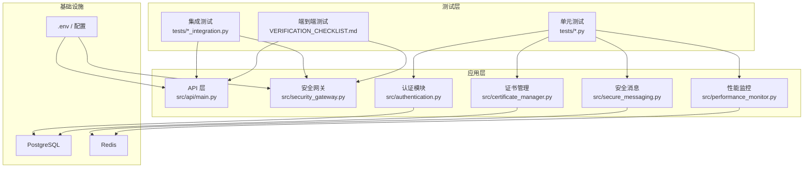
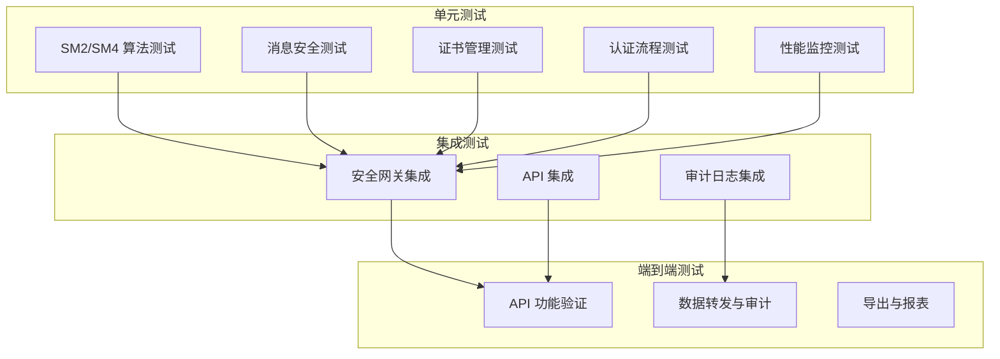
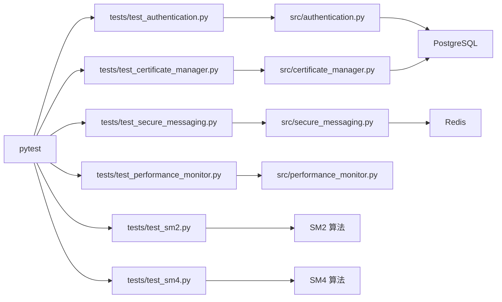

# 测试与质量保证

<cite>
**本文引用的文件**
- [tests/conftest.py](file://tests/conftest.py)
- [tests/test_api.py](file://tests/test_api.py)
- [tests/test_authentication.py](file://tests/test_authentication.py)
- [tests/test_security_gateway.py](file://tests/test_security_gateway.py)
- [tests/test_secure_messaging.py](file://tests/test_secure_messaging.py)
- [tests/test_performance_monitor.py](file://tests/test_performance_monitor.py)
- [tests/test_certificate_manager.py](file://tests/test_certificate_manager.py)
- [tests/test_sm2.py](file://tests/test_sm2.py)
- [tests/test_sm4.py](file://tests/test_sm4.py)
- [requirements.txt](file://requirements.txt)
- [README.md](file://README.md)
- [VERIFICATION_CHECKLIST.md](file://VERIFICATION_CHECKLIST.md)
- [src/security_gateway.py](file://src/security_gateway.py)
- [src/authentication.py](file://src/authentication.py)
- [src/secure_messaging.py](file://src/secure_messaging.py)
</cite>

## 目录
1. [引言](#引言)
2. [项目结构](#项目结构)
3. [核心组件](#核心组件)
4. [架构总览](#架构总览)
5. [详细组件分析](#详细组件分析)
6. [依赖分析](#依赖分析)
7. [性能考虑](#性能考虑)
8. [故障排查指南](#故障排查指南)
9. [结论](#结论)
10. [附录](#附录)

## 引言
本文件面向车联网安全通信网关项目的测试与质量保证，系统化阐述测试策略、测试金字塔结构、pytest配置与使用、各模块测试用例设计与覆盖率目标、性能与压力测试方法、测试数据与环境管理、持续集成与自动化流程、测试报告与质量度量标准，并为测试工程师与开发者提供可操作的测试开发参考。

## 项目结构
项目采用“模块化+分层”的组织方式，核心代码位于src目录，测试代码集中在tests目录，依赖与运行环境通过requirements.txt与README进行约束与说明。测试覆盖了API、认证、消息安全、证书管理、性能监控等关键领域，形成完整的测试金字塔。

图示来源
- [tests/test_authentication.py](file://tests/test_authentication.py)
- [tests/test_secure_messaging.py](file://tests/test_secure_messaging.py)
- [tests/test_certificate_manager.py](file://tests/test_certificate_manager.py)
- [tests/test_performance_monitor.py](file://tests/test_performance_monitor.py)
- [tests/test_security_gateway.py](file://tests/test_security_gateway.py)
- [src/security_gateway.py](file://src/security_gateway.py)
- [src/authentication.py](file://src/authentication.py)
- [src/secure_messaging.py](file://src/secure_messaging.py)

章节来源
- [README.md](file://README.md)
- [requirements.txt](file://requirements.txt)

## 核心组件
- 测试框架与工具：pytest、pytest-asyncio、hypothesis、httpx、dotenv
- 关键模块：
  - 安全网关（证书颁发/验证/撤销、双向认证、会话管理、安全消息）
  - 认证模块（挑战-响应、会话建立/关闭、冲突处理、过期清理）
  - 安全消息（SM4加密/解密、SM2签名/验签、防重放nonce、时间戳）
  - 证书管理（SM2证书颁发、验证、撤销、CRL）
  - 性能监控（认证/加解密/签名/会话等指标采集与统计）

章节来源
- [requirements.txt](file://requirements.txt)
- [src/security_gateway.py](file://src/security_gateway.py)
- [src/authentication.py](file://src/authentication.py)
- [src/secure_messaging.py](file://src/secure_messaging.py)

## 架构总览
测试金字塔自底向上分为：
- 单元测试：覆盖算法与原子功能（SM2/SM4、消息构造/验证、证书颁发/验证、认证流程）
- 集成测试：覆盖模块间协作（安全网关与数据库/缓存交互、API与业务逻辑）
- 端到端测试：覆盖真实场景（API可用性、审计日志、数据转发、导出）

图示来源
- [tests/test_sm2.py](file://tests/test_sm2.py)
- [tests/test_sm4.py](file://tests/test_sm4.py)
- [tests/test_secure_messaging.py](file://tests/test_secure_messaging.py)
- [tests/test_certificate_manager.py](file://tests/test_certificate_manager.py)
- [tests/test_authentication.py](file://tests/test_authentication.py)
- [tests/test_performance_monitor.py](file://tests/test_performance_monitor.py)
- [tests/test_security_gateway.py](file://tests/test_security_gateway.py)
- [tests/test_api.py](file://tests/test_api.py)
- [VERIFICATION_CHECKLIST.md](file://VERIFICATION_CHECKLIST.md)

## 详细组件分析

### pytest 配置与使用
- 全局fixture与Mock：
  - 自动注入Redis内存Mock，统一替换真实Redis连接，便于单元测试隔离
  - 提供PostgreSQL/Redis测试配置，确保测试数据库与缓存独立
- 测试运行：
  - 支持命令行直接运行单测文件，也支持pytest主程序批量执行
  - 结合dotenv加载测试环境变量，确保配置一致性

章节来源
- [tests/conftest.py](file://tests/conftest.py)

### API 测试（单元/集成）
- 覆盖端点：根路径、健康检查、受保护资源访问控制
- 认证与鉴权：Bearer Token校验、未授权访问拦截
- 数据接口：在线车辆、实时指标、证书列表、安全策略读写

章节来源
- [tests/test_api.py](file://tests/test_api.py)

### 认证模块测试
- 挑战-响应：挑战值长度/唯一性/类型校验；响应签名验证与错误分支
- 车端/网关认证：证书有效性、过期/撤销/签名无效等边界
- 双向认证：车云双方证书验证、会话令牌签发、会话密钥生成
- 会话管理：建立/关闭/冲突处理/过期清理
- 会话冲突策略：拒绝新会话/终止旧会话

章节来源
- [tests/test_authentication.py](file://tests/test_authentication.py)
- [src/authentication.py](file://src/authentication.py)

### 安全网关测试
- 初始化：密钥长度校验、安全存储启用/禁用
- 证书管理：颁发/验证/撤销/状态查询
- 认证与会话：认证成功/失败、会话建立/终止/清理
- 安全消息：发送/接收、篡改检测、重放攻击防护
- 数据转发：车端数据到云端、云端响应回传、审计日志记录
- 大负载与多包：大载荷转发、多包并发转发
- 完整流程：从连接到转发再到审计日志核验

章节来源
- [tests/test_security_gateway.py](file://tests/test_security_gateway.py)
- [src/security_gateway.py](file://src/security_gateway.py)

### 安全消息测试
- 安全传输：nonce长度、时间戳、加密载荷、签名长度、消息头
- 验签与解密：正确性、重放攻击检测、nonce标记
- 防重放：Redis记录nonce，重复使用触发重放检测

章节来源
- [tests/test_secure_messaging.py](file://tests/test_secure_messaging.py)
- [src/secure_messaging.py](file://src/secure_messaging.py)

### 证书管理测试
- 唯一序列号：长度、十六进制、唯一性
- DN创建：格式、特殊字符
- 扩展创建：默认keyUsage/extendedKeyUsage
- TBS编码：字节序列、确定性
- 颁发：版本/有效期/签名/数据库写入
- 验证：有效/过期/未生效/撤销/签名无效/格式错误
- 撤销：幂等、原因、审计日志、CRL一致性

章节来源
- [tests/test_certificate_manager.py](file://tests/test_certificate_manager.py)

### 国密算法测试
- SM2：密钥对长度/唯一性、签名长度/验签正确性、篡改检测
- SM4：密钥长度（16/32）、加密长度（16倍数）、解密正确性、错误密钥/损坏密文处理

章节来源
- [tests/test_sm2.py](file://tests/test_sm2.py)
- [tests/test_sm4.py](file://tests/test_sm4.py)

### 性能监控测试
- 认证延迟：总数/成功/失败/平均/最小/最大/TPS/延迟达标
- 加解密吞吐：加密/解密字节数/耗时/速率/1KB延迟达标
- 签名/验签：次数/速率/达标
- 会话：建立/关闭/查询延迟、并发会话跟踪
- 装饰器与上下文：自动埋点、线程安全

章节来源
- [tests/test_performance_monitor.py](file://tests/test_performance_monitor.py)

## 依赖分析
- 测试依赖与运行环境：
  - gmssl、psycopg2-binary、redis、fastapi、uvicorn、pydantic、pytest、httpx、hypothesis、python-dotenv、cryptography、requests
- 模块耦合与内聚：
  - 认证模块与数据库/缓存耦合明确，通过RedisConfig/PostgreSQLConfig注入
  - 安全消息依赖SM2/SM4与Redis，具备清晰的输入输出契约
  - 安全网关作为编排器，聚合证书、认证、消息、审计、性能等子模块

图示来源
- [requirements.txt](file://requirements.txt)
- [tests/test_authentication.py](file://tests/test_authentication.py)
- [tests/test_secure_messaging.py](file://tests/test_secure_messaging.py)
- [tests/test_certificate_manager.py](file://tests/test_certificate_manager.py)
- [tests/test_performance_monitor.py](file://tests/test_performance_monitor.py)
- [tests/test_sm2.py](file://tests/test_sm2.py)
- [tests/test_sm4.py](file://tests/test_sm4.py)
- [src/authentication.py](file://src/authentication.py)
- [src/secure_messaging.py](file://src/secure_messaging.py)

章节来源
- [requirements.txt](file://requirements.txt)

## 性能考虑
- 性能指标与达标项：
  - 认证延迟：<500ms；TPS可观测
  - 加解密吞吐：满足业务带宽需求；1KB加密延迟<10ms
  - 签名/验签：QPS达标（签名≥1000/s，验签≥2000/s）
  - 会话：建立延迟<100ms，查询延迟<5ms；并发会话数跟踪
- 压力测试建议：
  - 使用hypothesis生成大量随机输入，覆盖边界与异常路径
  - 使用httpx或pytest-asyncio进行异步接口压测
  - 基于性能监控测试中的装饰器/上下文，对关键路径进行埋点
- 资源隔离：
  - Redis内存Mock避免真实缓存抖动
  - PostgreSQL测试库与生产隔离，避免数据污染

章节来源
- [tests/test_performance_monitor.py](file://tests/test_performance_monitor.py)
- [requirements.txt](file://requirements.txt)

## 故障排查指南
- API可用性与鉴权：
  - 未授权访问返回403；受保护端点需Bearer Token
  - 健康检查/status应返回healthy
- 审计日志：
  - 生成测试数据后，数据库审计日志数量应增加
  - API支持按车辆ID/事件类型/操作结果过滤，支持JSON/CSV导出
- 数据转发：
  - 成功转发应返回包含签名与nonce的响应，且可被车端解密
  - 篡改载荷应触发签名验证失败或“篡改”提示
- 环境与依赖：
  - 确认PostgreSQL/Redis可达，.env配置正确
  - 依赖版本与requirements一致

章节来源
- [tests/test_api.py](file://tests/test_api.py)
- [VERIFICATION_CHECKLIST.md](file://VERIFICATION_CHECKLIST.md)
- [README.md](file://README.md)

## 结论
本项目已建立完善的测试体系：以pytest为核心，覆盖算法、模块、集成与端到端场景，结合性能监控与防重放机制，保障车联网安全通信网关在真实场景下的可靠性与安全性。建议持续完善覆盖率与回归用例，强化自动化流水线与质量门禁。

## 附录

### 测试金字塔与用例设计要点
- 单元测试（算法与原子功能）
  - SM2/SM4：长度校验、正确性、错误处理、往返一致性
  - 安全消息：nonce/时间戳/加密/签名/重放检测
  - 证书管理：序列号/DN/TBS/颁发/验证/撤销
  - 认证流程：挑战/响应/会话/冲突/清理
  - 性能监控：指标采集/统计/达标判定
- 集成测试（模块协作）
  - 安全网关：证书/认证/消息/审计/性能串联
  - API：路由/鉴权/数据一致性
- 端到端测试（真实场景）
  - 审计日志：生成/查询/导出
  - 数据转发：车端到云端/响应回传
  - 性能与稳定性：并发、大载荷、异常恢复

### 覆盖率与质量度量
- 建议覆盖率目标：
  - 关键算法与核心业务逻辑≥80%
  - API与安全流程≥70%
- 质量度量：
  - 单元测试通过率、集成测试通过率、端到端验收通过率
  - 性能指标达标率、P95/P99延迟、吞吐量
  - 审计日志完整性与可查询性

### 测试数据与环境管理
- 测试数据：
  - 使用Mock/内存Redis，避免真实数据污染
  - 通过fixtures生成稳定、可复现的密钥/证书/消息
- 环境配置：
  - .env示例与requirements.txt确保本地/CI环境一致
  - CI中使用独立PostgreSQL/Redis实例或容器

### 持续集成与自动化
- 建议流水线阶段：
  - 代码检出 → 依赖安装 → 单元测试 → 集成测试 → 性能回归 → 端到端验收 → 构建镜像/制品
- 触发策略：
  - PR触发单元/集成测试；主干推送触发全量回归与端到端

### 测试报告
- 单元/集成报告：pytest-html或JUnit XML
- 端到端报告：基于VERIFICATION_CHECKLIST逐项打点
- 性能报告：性能监控指标汇总与趋势图