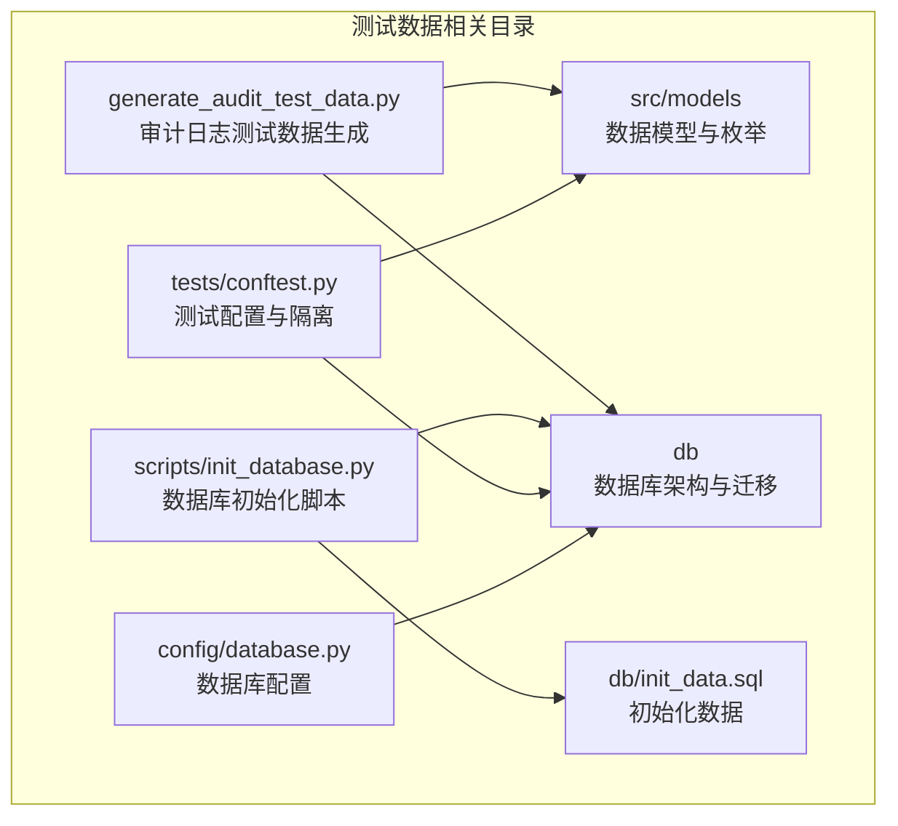
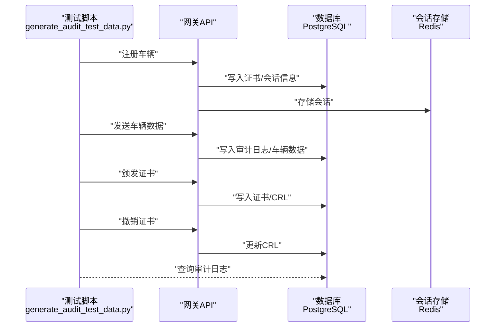
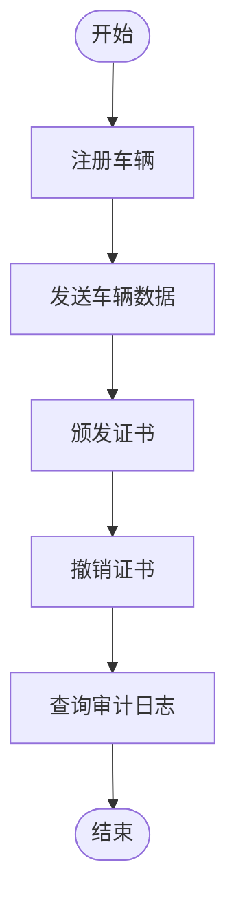
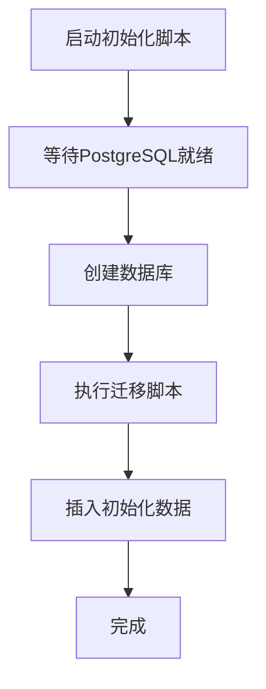
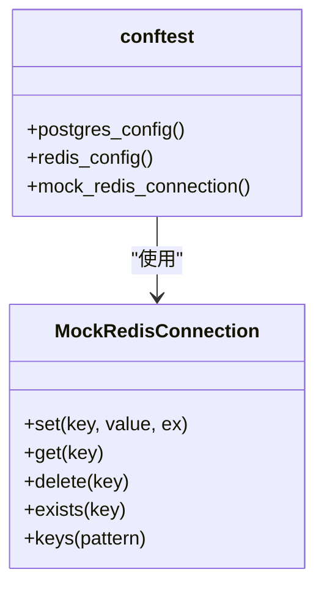
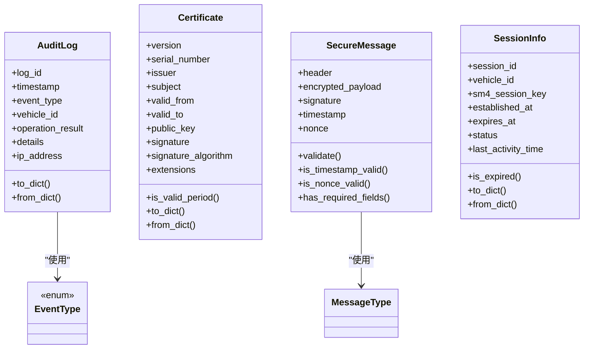
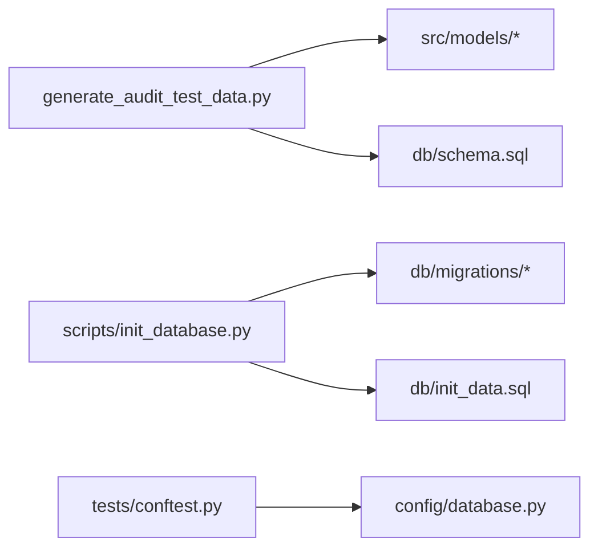

# 测试数据管理

<cite>
**本文引用的文件**
- [README.md](file://README.md)
- [generate_audit_test_data.py](file://generate_audit_test_data.py)
- [scripts/init_database.py](file://scripts/init_database.py)
- [db/schema.sql](file://db/schema.sql)
- [db/init_data.sql](file://db/init_data.sql)
- [db/migrations/001_initial_schema.sql](file://db/migrations/001_initial_schema.sql)
- [db/migrations/002_vehicle_data_table.sql](file://db/migrations/002_vehicle_data_table.sql)
- [src/models/audit.py](file://src/models/audit.py)
- [src/models/certificate.py](file://src/models/certificate.py)
- [src/models/message.py](file://src/models/message.py)
- [src/models/session.py](file://src/models/session.py)
- [src/models/enums.py](file://src/models/enums.py)
- [config/database.py](file://config/database.py)
- [tests/conftest.py](file://tests/conftest.py)
</cite>

## 目录
1. [简介](#简介)
2. [项目结构](#项目结构)
3. [核心组件](#核心组件)
4. [架构总览](#架构总览)
5. [详细组件分析](#详细组件分析)
6. [依赖关系分析](#依赖关系分析)
7. [性能考量](#性能考量)
8. [故障排查指南](#故障排查指南)
9. [结论](#结论)
10. [附录](#附录)

## 简介
本文件面向车联网安全通信网关系统的测试数据管理，围绕测试数据的生成策略、数据模型设计、生命周期管理、隐私与安全处理、模板与脚本使用、版本控制与变更管理、共享与复用机制、质量保证与验证方法，以及环境隔离与切换策略进行系统化说明。目标是帮助测试团队高效、规范地准备与维护测试数据，确保测试过程稳定、可重复、可追溯。

## 项目结构
本项目采用分层与按功能域组织的结构：源代码位于 src，数据库脚本位于 db，测试脚本与工具位于 scripts，前端位于 web，测试用例位于 tests。测试数据相关的关键位置如下：
- 数据模型与枚举：src/models（审计、证书、消息、会话、枚举）
- 数据库架构与迁移：db/schema.sql、db/migrations/*.sql
- 初始化数据：db/init_data.sql
- 测试数据生成脚本：generate_audit_test_data.py
- 数据库初始化脚本：scripts/init_database.py
- 测试配置与隔离：tests/conftest.py
- 数据库配置：config/database.py

图表来源
- [generate_audit_test_data.py](file://generate_audit_test_data.py)
- [scripts/init_database.py](file://scripts/init_database.py)
- [db/schema.sql](file://db/schema.sql)
- [db/init_data.sql](file://db/init_data.sql)
- [src/models/audit.py](file://src/models/audit.py)
- [src/models/enums.py](file://src/models/enums.py)
- [tests/conftest.py](file://tests/conftest.py)
- [config/database.py](file://config/database.py)

章节来源
- [README.md](file://README.md)
- [db/schema.sql](file://db/schema.sql)
- [db/init_data.sql](file://db/init_data.sql)
- [db/migrations/001_initial_schema.sql](file://db/migrations/001_initial_schema.sql)
- [db/migrations/002_vehicle_data_table.sql](file://db/migrations/002_vehicle_data_table.sql)
- [generate_audit_test_data.py](file://generate_audit_test_data.py)
- [scripts/init_database.py](file://scripts/init_database.py)
- [tests/conftest.py](file://tests/conftest.py)
- [config/database.py](file://config/database.py)

## 核心组件
- 审计日志模型与事件类型：用于生成与验证审计事件，支持认证、数据传输、证书操作等事件类型的测试覆盖。
- 证书模型与扩展：用于生成测试证书与撤销列表，支撑证书颁发与撤销场景的测试。
- 安全报文模型：用于构造带时间戳、nonce、SM4加密载荷与SM2签名的安全报文，验证防重放与完整性。
- 会话模型：用于生成会话ID、会话密钥与令牌，支撑认证流程与会话管理测试。
- 数据库架构与迁移：提供证书、CRL、审计日志、车辆数据等表结构与索引，支持测试数据持久化与查询。
- 初始化脚本与数据：提供默认CA证书与安全策略配置，便于快速搭建测试环境。
- 测试配置与隔离：通过内存Redis模拟器与独立数据库实例，确保测试互不干扰。

章节来源
- [src/models/audit.py](file://src/models/audit.py)
- [src/models/certificate.py](file://src/models/certificate.py)
- [src/models/message.py](file://src/models/message.py)
- [src/models/session.py](file://src/models/session.py)
- [src/models/enums.py](file://src/models/enums.py)
- [db/schema.sql](file://db/schema.sql)
- [db/init_data.sql](file://db/init_data.sql)
- [tests/conftest.py](file://tests/conftest.py)

## 架构总览
下图展示测试数据生成与使用的整体流程：测试脚本通过API触发认证注册、数据上报、证书颁发与撤销；后端根据业务逻辑生成审计日志；数据库持久化证书、CRL、审计日志与车辆数据；测试脚本与测试配置共同保障环境隔离与可重复性。

图表来源
- [generate_audit_test_data.py](file://generate_audit_test_data.py)
- [db/schema.sql](file://db/schema.sql)
- [db/migrations/001_initial_schema.sql](file://db/migrations/001_initial_schema.sql)
- [db/migrations/002_vehicle_data_table.sql](file://db/migrations/002_vehicle_data_table.sql)

## 详细组件分析

### 审计日志测试数据生成
- 生成策略
  - 通过API依次执行：注册车辆（生成认证成功日志）、发送车辆数据（生成数据传输日志）、颁发证书（生成证书操作日志）、撤销证书（生成证书撤销日志）。
  - 使用统一的鉴权头与固定令牌，确保请求可被网关接受。
- 数据模型与约束
  - 审计日志模型包含事件类型、车辆ID、结果、详情与IP地址等字段，并对详情长度进行截断处理。
  - 数据库层面通过唯一索引与事件类型索引提升查询效率。
- 生命周期管理
  - 生成阶段：脚本按顺序调用API，逐步产生测试数据。
  - 清理阶段：可结合数据库迁移中的清理函数或手动SQL删除历史数据。
- 隐私与安全
  - 测试数据中避免使用真实敏感信息；如需模拟，建议使用脱敏或占位符。
  - 通过独立测试数据库与内存Redis，降低泄露风险。

图表来源
- [generate_audit_test_data.py](file://generate_audit_test_data.py)
- [src/models/audit.py](file://src/models/audit.py)
- [db/schema.sql](file://db/schema.sql)

章节来源
- [generate_audit_test_data.py](file://generate_audit_test_data.py)
- [src/models/audit.py](file://src/models/audit.py)
- [db/schema.sql](file://db/schema.sql)

### 数据库初始化与迁移
- 初始化脚本
  - 自动等待PostgreSQL可用、创建数据库、执行迁移脚本与插入初始化数据。
  - 支持通过环境变量配置数据库连接参数。
- 迁移与架构
  - 初始架构包含证书、CRL、审计日志表及索引。
  - 车辆数据迁移包含丰富传感器字段与清理函数，支持定期清理旧数据。
- 生命周期管理
  - 创建：执行初始化脚本与迁移。
  - 更新：新增迁移文件，保持版本有序递增。
  - 清理：利用迁移中提供的清理函数或手动SQL。
  - 归档：通过备份策略与只读副本实现历史数据归档。

图表来源
- [scripts/init_database.py](file://scripts/init_database.py)
- [db/migrations/001_initial_schema.sql](file://db/migrations/001_initial_schema.sql)
- [db/migrations/002_vehicle_data_table.sql](file://db/migrations/002_vehicle_data_table.sql)
- [db/init_data.sql](file://db/init_data.sql)

章节来源
- [scripts/init_database.py](file://scripts/init_database.py)
- [db/schema.sql](file://db/schema.sql)
- [db/init_data.sql](file://db/init_data.sql)
- [db/migrations/001_initial_schema.sql](file://db/migrations/001_initial_schema.sql)
- [db/migrations/002_vehicle_data_table.sql](file://db/migrations/002_vehicle_data_table.sql)

### 测试配置与环境隔离
- 内存Redis模拟器
  - 通过MockRedisConnection在测试期间拦截真实Redis调用，使用内存字典存储键值，便于快速清理与重置。
- 独立数据库实例
  - 测试配置提供独立的测试数据库名称与Redis数据库编号，避免与开发/生产环境冲突。
- 自动化清理
  - 在每个测试前后清空内存存储，确保测试间无状态污染。

图表来源
- [tests/conftest.py](file://tests/conftest.py)

章节来源
- [tests/conftest.py](file://tests/conftest.py)
- [config/database.py](file://config/database.py)

### 数据模型与验证要点
- 审计日志模型
  - 字段校验与序列化/反序列化，确保与数据库字段一致。
- 证书模型
  - 有效期校验、签名算法约束、扩展字段序列化。
- 安全报文模型
  - 时间戳容差、nonce长度、加密载荷与签名非空校验。
- 会话模型
  - 会话ID长度、会话密钥位数、状态与过期时间一致性。

图表来源
- [src/models/audit.py](file://src/models/audit.py)
- [src/models/certificate.py](file://src/models/certificate.py)
- [src/models/message.py](file://src/models/message.py)
- [src/models/session.py](file://src/models/session.py)
- [src/models/enums.py](file://src/models/enums.py)

章节来源
- [src/models/audit.py](file://src/models/audit.py)
- [src/models/certificate.py](file://src/models/certificate.py)
- [src/models/message.py](file://src/models/message.py)
- [src/models/session.py](file://src/models/session.py)
- [src/models/enums.py](file://src/models/enums.py)

## 依赖关系分析
- 测试脚本依赖数据模型与数据库架构，确保生成的数据与表结构一致。
- 初始化脚本依赖数据库迁移与初始化数据，确保测试环境具备基础数据。
- 测试配置依赖数据库配置，确保测试使用独立的数据库与Redis实例。

图表来源
- [generate_audit_test_data.py](file://generate_audit_test_data.py)
- [src/models/audit.py](file://src/models/audit.py)
- [src/models/certificate.py](file://src/models/certificate.py)
- [src/models/message.py](file://src/models/message.py)
- [src/models/session.py](file://src/models/session.py)
- [db/schema.sql](file://db/schema.sql)
- [db/migrations/001_initial_schema.sql](file://db/migrations/001_initial_schema.sql)
- [db/migrations/002_vehicle_data_table.sql](file://db/migrations/002_vehicle_data_table.sql)
- [db/init_data.sql](file://db/init_data.sql)
- [scripts/init_database.py](file://scripts/init_database.py)
- [tests/conftest.py](file://tests/conftest.py)
- [config/database.py](file://config/database.py)

章节来源
- [generate_audit_test_data.py](file://generate_audit_test_data.py)
- [scripts/init_database.py](file://scripts/init_database.py)
- [db/schema.sql](file://db/schema.sql)
- [db/init_data.sql](file://db/init_data.sql)
- [db/migrations/001_initial_schema.sql](file://db/migrations/001_initial_schema.sql)
- [db/migrations/002_vehicle_data_table.sql](file://db/migrations/002_vehicle_data_table.sql)
- [tests/conftest.py](file://tests/conftest.py)
- [config/database.py](file://config/database.py)

## 性能考量
- 索引设计：审计日志与证书表均建立多维索引，提升查询效率；车辆数据表建立复合索引与视图，支持高频查询。
- 清理策略：车辆数据提供清理函数，定期删除旧数据，避免表膨胀影响性能。
- 测试隔离：内存Redis与独立数据库减少并发竞争，提升测试稳定性与可重复性。

章节来源
- [db/schema.sql](file://db/schema.sql)
- [db/migrations/002_vehicle_data_table.sql](file://db/migrations/002_vehicle_data_table.sql)
- [tests/conftest.py](file://tests/conftest.py)

## 故障排查指南
- 数据库初始化失败
  - 检查PostgreSQL可达性与凭据；确认迁移脚本与初始化数据路径正确。
- 测试数据未生成
  - 确认测试脚本的API端点、鉴权头与令牌配置；检查服务端日志与网络连通性。
- 审计日志缺失
  - 核对事件类型枚举与数据库约束；确认业务流程已触发相应事件。
- 会话与Redis相关问题
  - 检查内存Redis模拟器是否正确注入；确认测试前后清理逻辑生效。

章节来源
- [scripts/init_database.py](file://scripts/init_database.py)
- [generate_audit_test_data.py](file://generate_audit_test_data.py)
- [src/models/enums.py](file://src/models/enums.py)
- [tests/conftest.py](file://tests/conftest.py)

## 结论
通过规范化的测试数据生成策略、清晰的数据模型与数据库架构、严格的生命周期管理与环境隔离机制，本项目能够高效、安全地支撑车联网安全通信网关的测试工作。建议在后续迭代中持续完善版本控制与变更管理流程，强化自动化验证与质量门禁，进一步提升测试数据的可维护性与可复用性。

## 附录

### 测试数据模板与使用指南
- 审计日志测试数据模板
  - 事件类型：认证成功、数据传输、证书颁发、证书撤销等。
  - 关键字段：log_id、timestamp、event_type、vehicle_id、operation_result、details、ip_address。
  - 生成步骤：先注册车辆，再发送数据，最后颁发与撤销证书。
- 证书测试数据模板
  - 字段：serial_number、issuer、subject、valid_from、valid_to、public_key、signature、signature_algorithm、extensions。
  - 用途：支撑证书颁发、验证与撤销测试。
- 车辆数据模板
  - 字段：vehicle_id、timestamp、state、GPS、运动、燃油、温度、电池、诊断、raw_data。
  - 用途：支撑数据上报与查询测试。

章节来源
- [src/models/audit.py](file://src/models/audit.py)
- [src/models/certificate.py](file://src/models/certificate.py)
- [db/migrations/002_vehicle_data_table.sql](file://db/migrations/002_vehicle_data_table.sql)

### 版本控制与变更管理
- 迁移文件命名：按顺序编号，确保迁移链路可追踪。
- 初始化数据：仅用于开发测试，生产环境禁止使用。
- 变更流程：新增迁移文件后，同步更新初始化脚本与测试脚本，确保测试数据与架构一致。

章节来源
- [db/migrations/001_initial_schema.sql](file://db/migrations/001_initial_schema.sql)
- [db/migrations/002_vehicle_data_table.sql](file://db/migrations/002_vehicle_data_table.sql)
- [db/init_data.sql](file://db/init_data.sql)
- [scripts/init_database.py](file://scripts/init_database.py)

### 隐私保护与安全处理
- 测试数据最小化：仅包含必要字段，避免真实敏感信息。
- 环境隔离：测试数据库与Redis与开发/生产环境分离。
- 清理策略：定期清理测试数据，防止长期留存。

章节来源
- [tests/conftest.py](file://tests/conftest.py)
- [db/migrations/002_vehicle_data_table.sql](file://db/migrations/002_vehicle_data_table.sql)

### 共享与复用机制
- 数据模型复用：审计、证书、消息、会话模型在测试脚本与API中统一使用。
- 配置复用：数据库配置类支持从环境变量加载，便于不同环境复用。
- 测试夹具：Redis与数据库配置作为测试夹具，跨用例共享。

章节来源
- [src/models/audit.py](file://src/models/audit.py)
- [src/models/certificate.py](file://src/models/certificate.py)
- [src/models/message.py](file://src/models/message.py)
- [src/models/session.py](file://src/models/session.py)
- [config/database.py](file://config/database.py)
- [tests/conftest.py](file://tests/conftest.py)

### 质量保证与验证方法
- 单元测试：针对数据模型的序列化/反序列化与校验逻辑进行验证。
- 集成测试：通过API端到端验证审计日志生成与查询。
- 自动化脚本：初始化脚本与测试脚本自动化执行，减少人工干预。

章节来源
- [src/models/audit.py](file://src/models/audit.py)
- [src/models/certificate.py](file://src/models/certificate.py)
- [src/models/message.py](file://src/models/message.py)
- [src/models/session.py](file://src/models/session.py)
- [generate_audit_test_data.py](file://generate_audit_test_data.py)
- [scripts/init_database.py](file://scripts/init_database.py)

### 环境隔离与切换策略
- 独立数据库：测试使用独立数据库名称，避免与开发/生产混淆。
- 独立Redis：测试使用独立数据库编号，配合内存模拟器实现快速清理。
- 环境变量：通过环境变量切换数据库与Redis配置，支持多环境部署。

章节来源
- [tests/conftest.py](file://tests/conftest.py)
- [config/database.py](file://config/database.py)