# 测试自动化

<cite>
**本文引用的文件**
- [tests/conftest.py](file://tests/conftest.py)
- [tests/test_api.py](file://tests/test_api.py)
- [tests/test_authentication.py](file://tests/test_authentication.py)
- [tests/test_security_gateway.py](file://tests/test_security_gateway.py)
- [tests/test_certificate_manager.py](file://tests/test_certificate_manager.py)
- [tests/test_secure_messaging.py](file://tests/test_secure_messaging.py)
- [tests/test_performance_monitor.py](file://tests/test_performance_monitor.py)
- [scripts/init_database.py](file://scripts/init_database.py)
- [scripts/init_database.sh](file://scripts/init_database.sh)
- [generate_audit_test_data.py](file://generate_audit_test_data.py)
- [test_auth_failure_lockout.py](file://test_auth_failure_lockout.py)
</cite>

## 目录
1. [引言](#引言)
2. [项目结构](#项目结构)
3. [核心组件](#核心组件)
4. [架构总览](#架构总览)
5. [详细组件分析](#详细组件分析)
6. [依赖分析](#依赖分析)
7. [性能考量](#性能考量)
8. [故障排查指南](#故障排查指南)
9. [结论](#结论)
10. [附录](#附录)

## 引言
本文件面向车联网安全通信网关的测试自动化，系统化阐述CI/CD流水线中的测试自动化配置与执行策略、pytest框架配置与参数化测试实践、测试环境自动化搭建与清理、测试脚本编写规范与最佳实践、测试报告生成与发布流程、测试数据自动生成与管理、并行测试执行与结果聚合、以及测试覆盖率统计与质量门禁设置方法。文档以仓库现有测试与脚本为基础，结合实际代码结构给出可落地的实施建议。

## 项目结构
测试相关代码主要集中在 tests 目录，覆盖API、认证、证书管理、安全报文、性能监控等模块；环境初始化脚本位于 scripts 目录；审计日志测试数据生成与认证失败锁定测试分别位于根目录下的独立脚本。

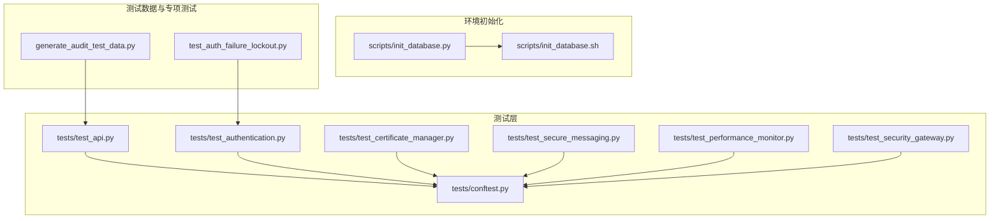

**图表来源**
- [tests/test_api.py:1-101](file://tests/test_api.py#L1-L101)
- [tests/test_authentication.py:1-520](file://tests/test_authentication.py#L1-L520)
- [tests/test_certificate_manager.py:1-758](file://tests/test_certificate_manager.py#L1-L758)
- [tests/test_secure_messaging.py:1-183](file://tests/test_secure_messaging.py#L1-L183)
- [tests/test_performance_monitor.py:1-483](file://tests/test_performance_monitor.py#L1-L483)
- [tests/test_security_gateway.py:1-1154](file://tests/test_security_gateway.py#L1-L1154)
- [tests/conftest.py:1-95](file://tests/conftest.py#L1-L95)
- [scripts/init_database.py:1-151](file://scripts/init_database.py#L1-L151)
- [scripts/init_database.sh:1-45](file://scripts/init_database.sh#L1-L45)
- [generate_audit_test_data.py:1-206](file://generate_audit_test_data.py#L1-L206)
- [test_auth_failure_lockout.py:1-193](file://test_auth_failure_lockout.py#L1-L193)

**章节来源**
- [tests/conftest.py:1-95](file://tests/conftest.py#L1-L95)
- [tests/test_api.py:1-101](file://tests/test_api.py#L1-L101)
- [scripts/init_database.py:1-151](file://scripts/init_database.py#L1-L151)
- [scripts/init_database.sh:1-45](file://scripts/init_database.sh#L1-L45)
- [generate_audit_test_data.py:1-206](file://generate_audit_test_data.py#L1-L206)
- [test_auth_failure_lockout.py:1-193](file://test_auth_failure_lockout.py#L1-L193)

## 核心组件
- pytest配置与夹具
  - 全局Redis内存模拟与自动打补丁，统一替换真实Redis连接，便于所有测试隔离执行。
  - 提供PostgreSQL与Redis测试配置夹具，确保测试数据库与缓存环境可控。
- API测试
  - FastAPI TestClient驱动，覆盖根路径、健康检查、鉴权保护、业务接口等。
- 认证与会话测试
  - 挑战/响应、车端/网关认证、双向认证、会话建立/关闭/冲突处理、过期清理等。
- 证书管理测试
  - 序列号生成、DN构造、扩展字段、TBS编码、颁发/验证/撤销全流程。
- 安全报文测试
  - 加密传输、验签解密、重放攻击检测与nonce标记。
- 性能监控测试
  - 认证延迟、TPS、加解密吞吐、签名/验签速率、会话建立/查询延迟、并发会话跟踪。
- 环境初始化
  - Python与Shell两套数据库初始化脚本，支持等待PostgreSQL就绪、创建数据库、执行迁移、注入初始数据。
- 测试数据与专项测试
  - 审计日志测试数据生成脚本、认证失败锁定专项测试脚本。

**章节来源**
- [tests/conftest.py:1-95](file://tests/conftest.py#L1-L95)
- [tests/test_api.py:1-101](file://tests/test_api.py#L1-L101)
- [tests/test_authentication.py:1-520](file://tests/test_authentication.py#L1-L520)
- [tests/test_certificate_manager.py:1-758](file://tests/test_certificate_manager.py#L1-L758)
- [tests/test_secure_messaging.py:1-183](file://tests/test_secure_messaging.py#L1-L183)
- [tests/test_performance_monitor.py:1-483](file://tests/test_performance_monitor.py#L1-L483)
- [scripts/init_database.py:1-151](file://scripts/init_database.py#L1-L151)
- [scripts/init_database.sh:1-45](file://scripts/init_database.sh#L1-L45)
- [generate_audit_test_data.py:1-206](file://generate_audit_test_data.py#L1-L206)
- [test_auth_failure_lockout.py:1-193](file://test_auth_failure_lockout.py#L1-L193)

## 架构总览
测试自动化围绕pytest生态构建，通过conftest集中配置Redis打补丁、数据库/缓存配置夹具，并由各模块测试文件组织具体用例。环境初始化脚本负责在CI容器中准备PostgreSQL与Redis，确保测试可重复执行。

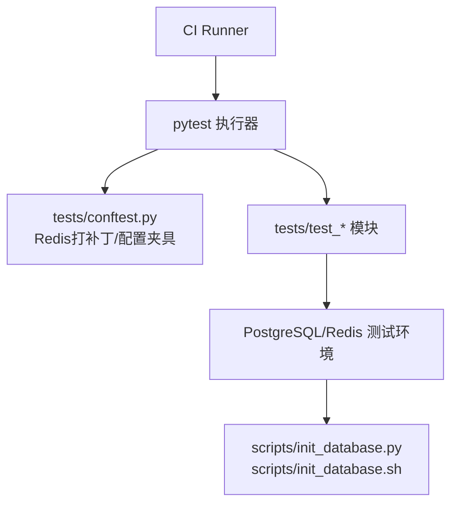

**图表来源**
- [tests/conftest.py:1-95](file://tests/conftest.py#L1-L95)
- [tests/test_api.py:1-101](file://tests/test_api.py#L1-L101)
- [tests/test_authentication.py:1-520](file://tests/test_authentication.py#L1-L520)
- [tests/test_certificate_manager.py:1-758](file://tests/test_certificate_manager.py#L1-L758)
- [tests/test_secure_messaging.py:1-183](file://tests/test_secure_messaging.py#L1-L183)
- [tests/test_performance_monitor.py:1-483](file://tests/test_performance_monitor.py#L1-L483)
- [scripts/init_database.py:1-151](file://scripts/init_database.py#L1-L151)
- [scripts/init_database.sh:1-45](file://scripts/init_database.sh#L1-L45)

## 详细组件分析

### pytest配置与夹具（conftest）
- 自动打补丁
  - 通过MockRedisConnection模拟Redis行为，清空内存store并在每个测试前后清理，避免跨用例污染。
  - 对src.db.redis_client与src.secure_messaging中的RedisConnection进行替换，保证测试隔离。
- 配置夹具
  - 提供PostgreSQLConfig与RedisConfig夹具，便于测试读取数据库/缓存配置。
- 作用范围
  - autouse=True确保所有测试均应用Redis打补丁与环境清理。

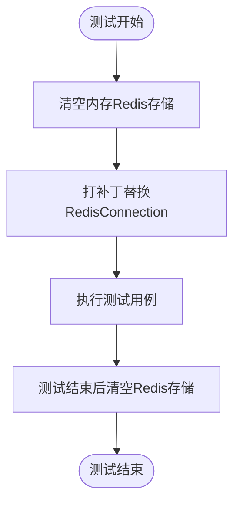

**图表来源**
- [tests/conftest.py:82-95](file://tests/conftest.py#L82-L95)

**章节来源**
- [tests/conftest.py:1-95](file://tests/conftest.py#L1-L95)

### API测试（test_api）
- 覆盖点
  - 根路径与健康检查、未授权访问拦截、受保护接口（在线车辆、实时指标、证书列表、安全策略）。
- 断言策略
  - 对可能的200/500响应进行断言，体现数据库未就绪场景。
- 执行方式
  - 直接运行pytest或作为模块入口执行。

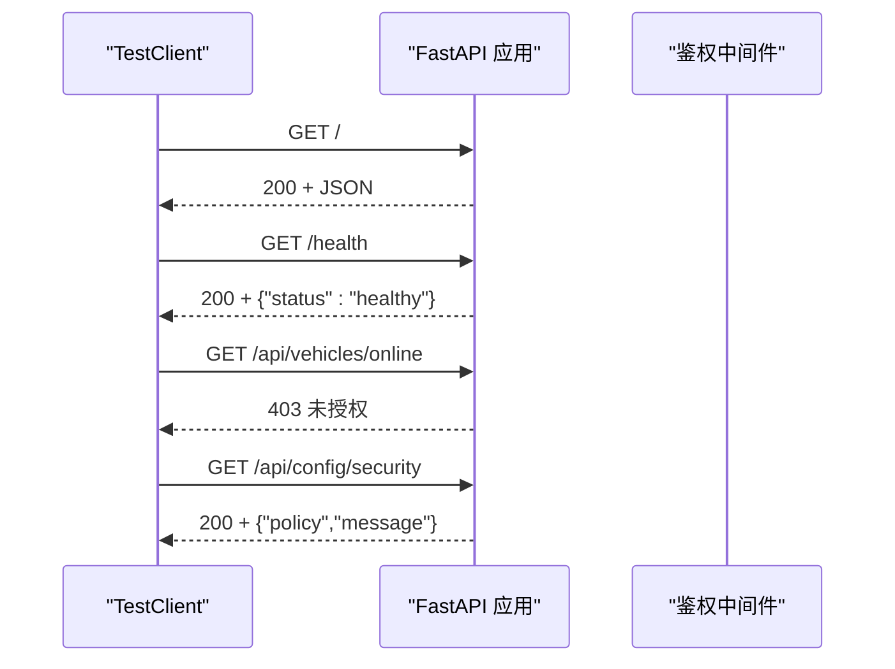

**图表来源**
- [tests/test_api.py:13-97](file://tests/test_api.py#L13-L97)

**章节来源**
- [tests/test_api.py:1-101](file://tests/test_api.py#L1-L101)

### 认证与会话测试（test_authentication）
- 挑战/响应
  - 长度校验、唯一性、类型校验、错误输入异常。
- 车端/网关认证
  - 证书有效性、过期/未生效/签名错误等边界条件。
- 双向认证
  - 成功与失败场景、会话密钥长度约束、令牌校验。
- 会话生命周期
  - 建立、关闭、冲突处理（拒绝新/终止旧）、过期清理。
- 参数化与边界
  - 大量断言覆盖SM2/SM4密钥长度、时间戳容忍、并发策略等。

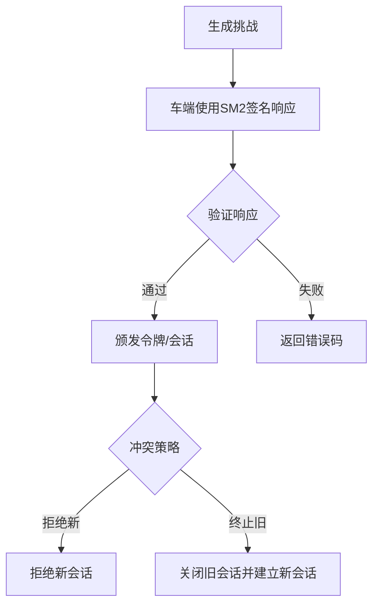

**图表来源**
- [tests/test_authentication.py:25-520](file://tests/test_authentication.py#L25-L520)

**章节来源**
- [tests/test_authentication.py:1-520](file://tests/test_authentication.py#L1-L520)

### 证书管理测试（test_certificate_manager）
- 功能覆盖
  - 唯一序列号、DN构造、扩展字段、TBS编码确定性、颁发/验证/撤销全流程。
- 质量保障
  - 格式校验（长度、算法、公钥）、撤销幂等、审计日志记录、异常路径覆盖。

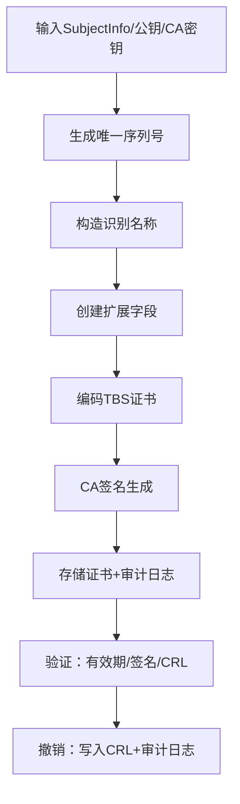

**图表来源**
- [tests/test_certificate_manager.py:118-758](file://tests/test_certificate_manager.py#L118-L758)

**章节来源**
- [tests/test_certificate_manager.py:1-758](file://tests/test_certificate_manager.py#L1-L758)

### 安全报文测试（test_secure_messaging）
- 功能覆盖
  - 加密传输、验签解密、nonce重放检测、nonce标记。
- 安全性验证
  - 重放攻击检测与nonce去重机制。

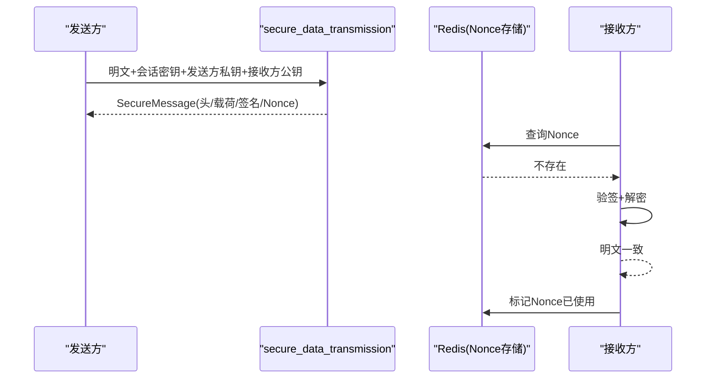

**图表来源**
- [tests/test_secure_messaging.py:13-183](file://tests/test_secure_messaging.py#L13-L183)

**章节来源**
- [tests/test_secure_messaging.py:1-183](file://tests/test_secure_messaging.py#L1-L183)

### 性能监控测试（test_performance_monitor）
- 指标维度
  - 认证延迟/TPS、加解密吞吐/1KB延迟、签名/验签速率、会话建立/查询延迟、并发会话跟踪。
- 装饰器与上下文
  - 提供装饰器与上下文管理器对关键路径进行性能埋点。
- 线程安全
  - 并发写入场景下的计数一致性验证。

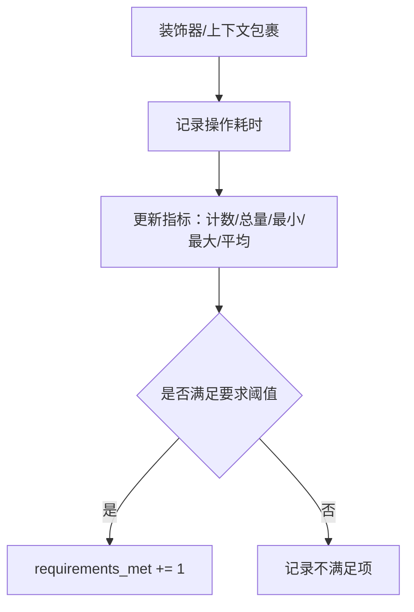

**图表来源**
- [tests/test_performance_monitor.py:19-483](file://tests/test_performance_monitor.py#L19-L483)

**章节来源**
- [tests/test_performance_monitor.py:1-483](file://tests/test_performance_monitor.py#L1-L483)

### 网关集成测试（test_security_gateway）
- 场景覆盖
  - 初始化校验、证书颁发/验证/撤销、认证流程、会话管理、安全报文收发、数据转发、审计日志、大包与多次转发、篡改检测。
- 流程验证
  - 完整的车端认证-会话建立-加密传输-响应下发-会话终止闭环。

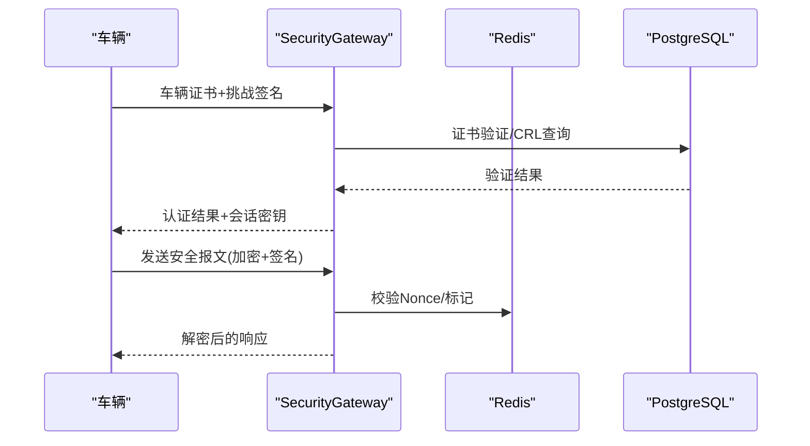

**图表来源**
- [tests/test_security_gateway.py:425-750](file://tests/test_security_gateway.py#L425-L750)

**章节来源**
- [tests/test_security_gateway.py:1-1154](file://tests/test_security_gateway.py#L1-L1154)

### 环境初始化（scripts）
- Python脚本
  - 等待PostgreSQL就绪、创建数据库、执行迁移、插入初始数据。
- Shell脚本
  - 等待PostgreSQL、创建数据库、顺序执行SQL迁移、插入初始数据。
- CI集成
  - 建议在CI容器启动后先执行初始化脚本，再运行pytest。

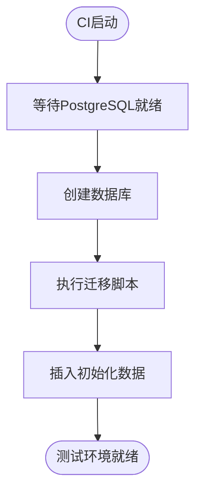

**图表来源**
- [scripts/init_database.py:14-147](file://scripts/init_database.py#L14-L147)
- [scripts/init_database.sh:19-44](file://scripts/init_database.sh#L19-L44)

**章节来源**
- [scripts/init_database.py:1-151](file://scripts/init_database.py#L1-L151)
- [scripts/init_database.sh:1-45](file://scripts/init_database.sh#L1-L45)

### 测试数据与专项测试
- 审计日志测试数据生成
  - 注册车辆、发送车辆数据、颁发/撤销证书，生成多类审计事件。
- 认证失败锁定专项测试
  - 更新安全策略、模拟失败、检查锁定、等待解锁后恢复。

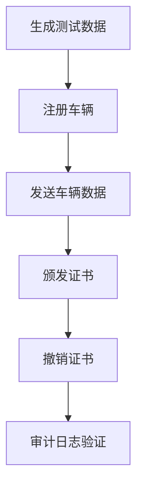

**图表来源**
- [generate_audit_test_data.py:156-203](file://generate_audit_test_data.py#L156-L203)
- [test_auth_failure_lockout.py:117-183](file://test_auth_failure_lockout.py#L117-L183)

**章节来源**
- [generate_audit_test_data.py:1-206](file://generate_audit_test_data.py#L1-L206)
- [test_auth_failure_lockout.py:1-193](file://test_auth_failure_lockout.py#L1-L193)

## 依赖分析
- 测试耦合
  - conftest集中管理Redis打补丁，降低各模块对底层依赖的感知。
  - 多模块共享PostgreSQL/Redis配置夹具，减少重复配置。
- 外部依赖
  - FastAPI TestClient、PostgreSQL、Redis、SM2/SM4密码学库。
- 循环依赖
  - 未发现模块间循环导入；测试夹具仅提供配置与Mock，不引入业务逻辑。

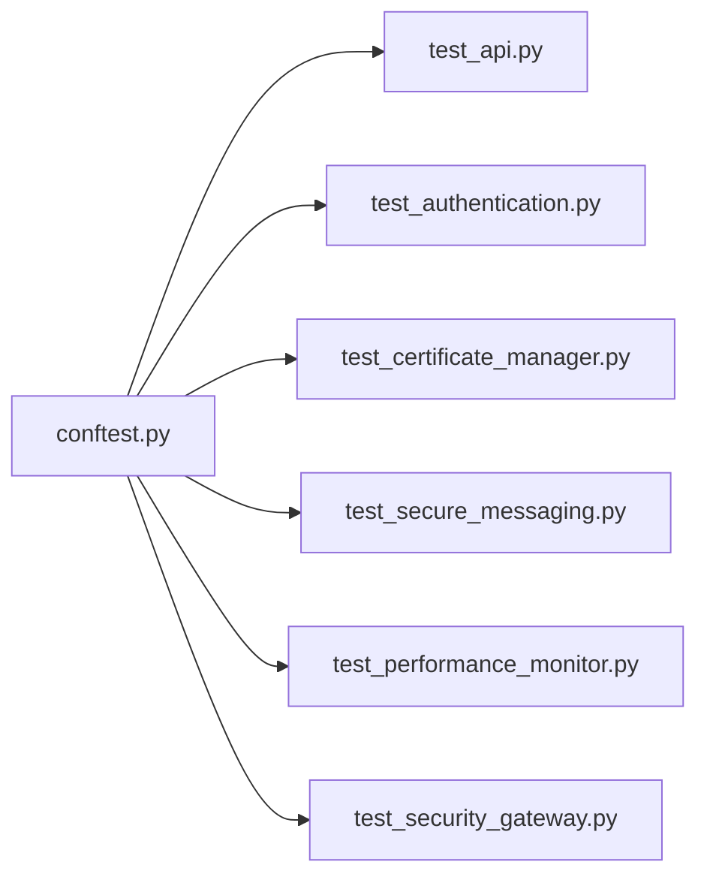

**图表来源**
- [tests/conftest.py:1-95](file://tests/conftest.py#L1-L95)
- [tests/test_api.py:1-101](file://tests/test_api.py#L1-L101)
- [tests/test_authentication.py:1-520](file://tests/test_authentication.py#L1-L520)
- [tests/test_certificate_manager.py:1-758](file://tests/test_certificate_manager.py#L1-L758)
- [tests/test_secure_messaging.py:1-183](file://tests/test_secure_messaging.py#L1-L183)
- [tests/test_performance_monitor.py:1-483](file://tests/test_performance_monitor.py#L1-L483)
- [tests/test_security_gateway.py:1-1154](file://tests/test_security_gateway.py#L1-L1154)

**章节来源**
- [tests/conftest.py:1-95](file://tests/conftest.py#L1-L95)

## 性能考量
- 测试执行效率
  - 使用内存Redis与自动打补丁避免真实网络IO，提升测试速度。
  - 通过装饰器/上下文管理器对关键路径进行轻量埋点，避免重复代码。
- 资源占用
  - 测试结束后清理Redis存储，防止内存泄漏。
- 并发与稳定性
  - 性能监控测试覆盖线程安全，建议在CI中限制并发度以避免资源争用。

[本节为通用指导，无需特定文件来源]

## 故障排查指南
- 数据库未就绪
  - 现象：测试连接PostgreSQL失败或迁移执行异常。
  - 排查：确认初始化脚本已执行，等待机制生效；检查环境变量与网络连通性。
- Redis打补丁未生效
  - 现象：测试仍使用真实Redis导致失败。
  - 排查：确认conftest中patch路径与实际导入路径一致；检查autouse夹具是否加载。
- 认证失败锁定
  - 现象：注册接口返回403。
  - 排查：通过数据库检查auth_failure_records表；确认策略阈值与锁定时间；等待解锁后重试。
- 审计日志为空
  - 现象：查询不到审计事件。
  - 排查：使用generate_audit_test_data.py生成测试数据；确认审计日志模块正常工作。

**章节来源**
- [scripts/init_database.py:14-147](file://scripts/init_database.py#L14-L147)
- [scripts/init_database.sh:19-44](file://scripts/init_database.sh#L19-L44)
- [tests/conftest.py:82-95](file://tests/conftest.py#L82-L95)
- [test_auth_failure_lockout.py:100-164](file://test_auth_failure_lockout.py#L100-L164)
- [generate_audit_test_data.py:156-203](file://generate_audit_test_data.py#L156-L203)

## 结论
本项目测试自动化以pytest为核心，配合集中式夹具与环境初始化脚本，实现了高内聚、低耦合的测试体系。通过覆盖认证、证书、报文、性能与网关集成等关键领域，结合Redis打补丁与数据库迁移，确保了测试的可重复性与稳定性。建议在CI中完善并行执行、覆盖率统计与质量门禁，持续提升测试效率与质量。

[本节为总结，无需特定文件来源]

## 附录

### CI/CD流水线中的测试自动化配置与执行策略
- 触发与阶段
  - Push/PR触发测试；分阶段执行：环境准备、数据库初始化、pytest执行、报告与工件归档。
- 并行策略
  - 按模块拆分pytest子集并行执行；限制Redis/数据库连接数，避免竞争。
- 资源管理
  - 使用容器编排启动PostgreSQL/Redis；测试结束后回收资源。
- 报告与工件
  - 生成pytest XML/JUnit报告；上传测试日志与覆盖率文件。

[本节为通用指导，无需特定文件来源]

### pytest配置与参数化测试
- 配置
  - 使用conftest集中管理夹具与打补丁；通过pytest.ini或命令行参数控制输出与并发。
- 参数化
  - 使用pytest.mark.parametrize覆盖不同输入组合；对SM2/SM4密钥长度、会话策略、CRL状态等进行参数化。

[本节为通用指导，无需特定文件来源]

### 测试环境自动化搭建与清理
- 搭建
  - 初始化脚本等待数据库就绪、执行迁移、注入初始数据；确保测试前置条件满足。
- 清理
  - 测试结束后清理Redis存储与临时数据；数据库可选回滚迁移或重建测试库。

**章节来源**
- [scripts/init_database.py:14-147](file://scripts/init_database.py#L14-L147)
- [scripts/init_database.sh:19-44](file://scripts/init_database.sh#L19-L44)
- [tests/conftest.py:82-95](file://tests/conftest.py#L82-L95)

### 测试脚本编写规范与最佳实践
- 命名与组织
  - 测试文件以test_前缀，类名以Test开头，方法以test_开头；按功能模块划分。
- 断言与异常
  - 明确断言目标与错误信息；对异常输入使用pytest.raises精确捕获。
- Mock与夹具
  - 优先使用夹具提供配置；对第三方依赖使用Mock/打补丁。
- 可重复性
  - 固定随机种子、清理全局状态、避免外部时钟依赖。

[本节为通用指导，无需特定文件来源]

### 自动化测试报告生成与发布
- 报告格式
  - 使用pytest-html或JUnit XML；在CI中归档为Artifacts。
- 发布渠道
  - 与测试平台集成，或上传至制品库/测试管理平台。

[本节为通用指导，无需特定文件来源]

### 测试数据自动生成与管理
- 自动生成
  - 使用generate_audit_test_data.py批量生成注册、数据传输、证书颁发/撤销事件。
- 管理策略
  - 分离测试数据与生产数据；使用独立数据库/命名空间；定期清理。

**章节来源**
- [generate_audit_test_data.py:1-206](file://generate_audit_test_data.py#L1-L206)

### 并行测试执行与结果聚合
- 并行
  - 使用pytest-xdist按模块拆分；限制并发以避免资源争用。
- 聚合
  - 合并XML/JUnit报告；统一展示通过率、失败用例与耗时分布。

[本节为通用指导，无需特定文件来源]

### 测试覆盖率统计与质量门禁
- 覆盖率
  - 使用pytest-cov统计分支/行覆盖率；生成HTML报告。
- 门禁
  - 设定最低覆盖率阈值；失败即阻断CI；对关键模块强制达标。

[本节为通用指导，无需特定文件来源]