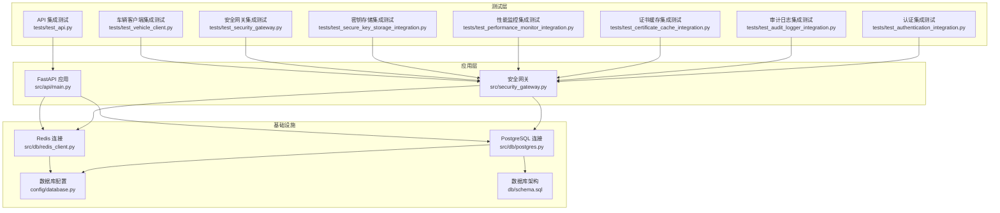
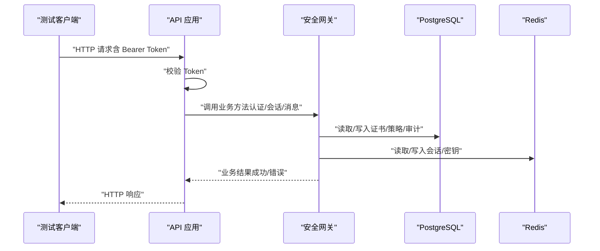
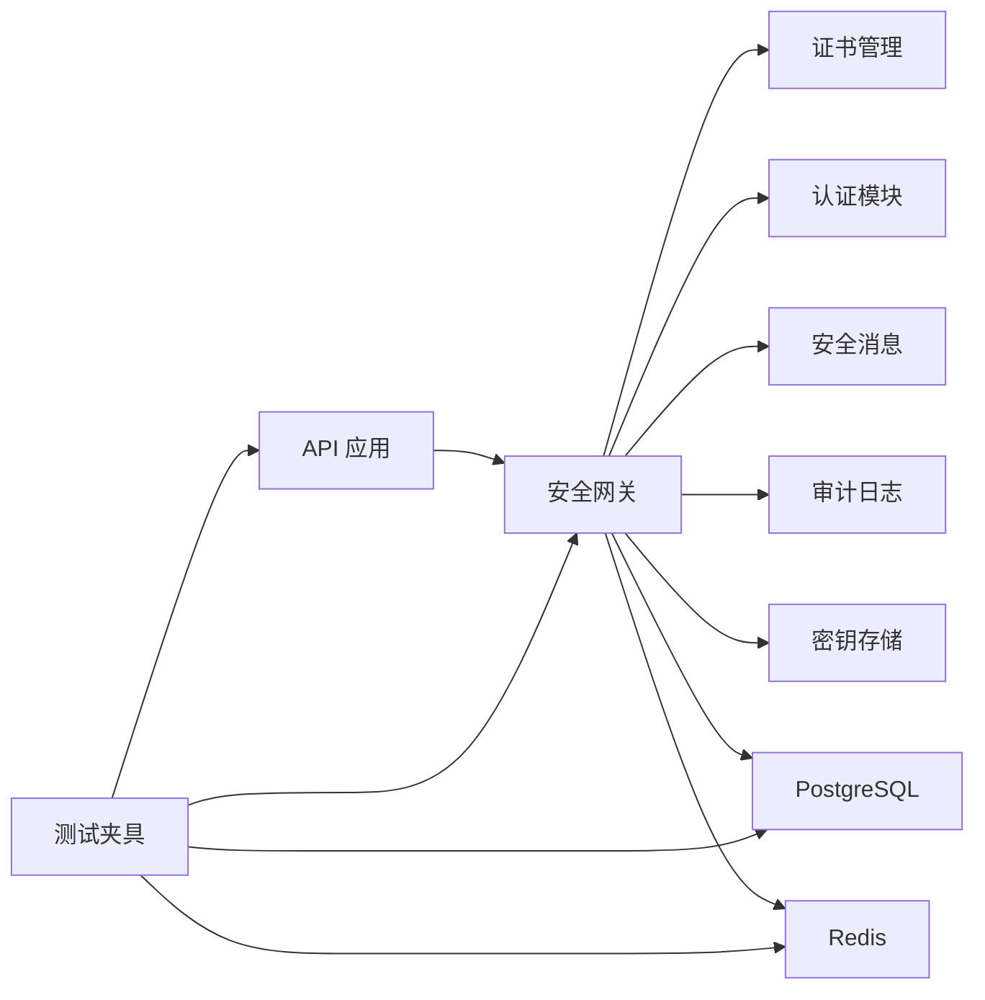

# 集成测试

<cite>
**本文引用的文件**
- [tests/conftest.py](file://tests/conftest.py)
- [tests/test_api.py](file://tests/test_api.py)
- [tests/test_authentication_integration.py](file://tests/test_authentication_integration.py)
- [tests/test_audit_logger_integration.py](file://tests/test_audit_logger_integration.py)
- [tests/test_certificate_cache_integration.py](file://tests/test_certificate_cache_integration.py)
- [tests/test_performance_monitor_integration.py](file://tests/test_performance_monitor_integration.py)
- [tests/test_secure_key_storage_integration.py](file://tests/test_secure_key_storage_integration.py)
- [tests/test_security_gateway.py](file://tests/test_security_gateway.py)
- [tests/test_vehicle_client.py](file://tests/test_vehicle_client.py)
- [src/api/main.py](file://src/api/main.py)
- [config/database.py](file://config/database.py)
- [src/db/postgres.py](file://src/db/postgres.py)
- [src/db/redis_client.py](file://src/db/redis_client.py)
- [src/security_gateway.py](file://src/security_gateway.py)
- [db/schema.sql](file://db/schema.sql)
- [db/init_data.sql](file://db/init_data.sql)
</cite>

## 目录
1. [简介](#简介)
2. [项目结构](#项目结构)
3. [核心组件](#核心组件)
4. [架构总览](#架构总览)
5. [详细组件分析](#详细组件分析)
6. [依赖分析](#依赖分析)
7. [性能考虑](#性能考虑)
8. [故障排查指南](#故障排查指南)
9. [结论](#结论)
10. [附录](#附录)

## 简介
本文件面向车联网安全通信网关的集成测试，系统化阐述模块间集成测试的设计思路与实施方法，覆盖API接口集成测试、数据库集成测试、外部服务集成测试与端到端业务流程测试。文档提供测试环境搭建与配置要点（测试数据库、Redis缓存、外部依赖服务模拟），并给出完整的测试用例设计与执行流程，包含跨模块数据流验证与错误处理、故障注入测试方法。

## 项目结构
项目采用分层与功能域结合的组织方式：
- src：核心业务模块（API、安全网关、证书管理、认证、消息、审计、密钥存储等）
- tests：各类单元与集成测试
- db：数据库架构与初始化脚本
- config：数据库与Redis配置
- client：车辆侧客户端示例
- web：前端管理界面（与后端API交互）

图表来源
- [tests/test_api.py:1-101](file://tests/test_api.py#L1-L101)
- [src/api/main.py:1-108](file://src/api/main.py#L1-L108)
- [src/security_gateway.py:1-800](file://src/security_gateway.py#L1-L800)
- [src/db/postgres.py:1-53](file://src/db/postgres.py#L1-L53)
- [src/db/redis_client.py:1-79](file://src/db/redis_client.py#L1-L79)
- [config/database.py:1-50](file://config/database.py#L1-L50)
- [db/schema.sql:1-104](file://db/schema.sql#L1-L104)

章节来源
- [tests/test_api.py:1-101](file://tests/test_api.py#L1-L101)
- [src/api/main.py:1-108](file://src/api/main.py#L1-L108)
- [src/security_gateway.py:1-800](file://src/security_gateway.py#L1-L800)
- [src/db/postgres.py:1-53](file://src/db/postgres.py#L1-L53)
- [src/db/redis_client.py:1-79](file://src/db/redis_client.py#L1-L79)
- [config/database.py:1-50](file://config/database.py#L1-L50)
- [db/schema.sql:1-104](file://db/schema.sql#L1-L104)

## 核心组件
- API 层：提供RESTful接口，统一认证与路由注册，便于端到端测试与外部依赖模拟。
- 安全网关：集成证书管理、双向认证、会话管理、安全消息传输与审计日志，是跨模块数据流的核心枢纽。
- 数据库层：PostgreSQL连接封装，配合初始化脚本与索引，支撑证书、审计日志、策略等持久化。
- 缓存层：Redis连接封装，支持会话状态、密钥与临时数据存储。
- 测试夹具与Mock：集中于tests/conftest.py，提供内存Redis、配置注入与自动Mock，降低外部依赖耦合。

章节来源
- [src/api/main.py:1-108](file://src/api/main.py#L1-L108)
- [src/security_gateway.py:1-800](file://src/security_gateway.py#L1-L800)
- [src/db/postgres.py:1-53](file://src/db/postgres.py#L1-L53)
- [src/db/redis_client.py:1-79](file://src/db/redis_client.py#L1-L79)
- [tests/conftest.py:1-95](file://tests/conftest.py#L1-L95)

## 架构总览
集成测试关注模块间协作与数据流一致性，重点验证：
- API到业务逻辑链路（认证、会话、消息）
- 数据库写入与查询（证书、审计日志、策略）
- 缓存读写与会话生命周期
- 审计日志贯穿关键事件（认证、数据传输、证书操作）
- 性能监控指标与要求达标

图表来源
- [src/api/main.py:49-74](file://src/api/main.py#L49-L74)
- [src/security_gateway.py:353-438](file://src/security_gateway.py#L353-L438)
- [src/db/postgres.py:32-45](file://src/db/postgres.py#L32-L45)
- [src/db/redis_client.py:31-49](file://src/db/redis_client.py#L31-L49)

## 详细组件分析

### API 接口集成测试
- 目标：验证API路由、认证中间件、健康检查与典型端点行为。
- 关键点：
  - Bearer Token 校验（开发环境使用环境变量令牌）
  - 未授权访问返回403
  - 认证后访问受保护端点（在线车辆、实时指标、证书列表、安全策略）
- 测试策略：
  - 使用FastAPI TestClient发起HTTP请求
  - 断言状态码与响应结构
  - 针对数据库未就绪场景断言200/500两种可能

章节来源
- [tests/test_api.py:13-97](file://tests/test_api.py#L13-L97)
- [src/api/main.py:49-74](file://src/api/main.py#L49-L74)

### 数据库集成测试
- 目标：验证PostgreSQL连接、表结构、索引与查询/更新语义。
- 关键点：
  - PostgreSQLConfig.from_env()从环境变量加载配置
  - PostgreSQLConnection封装连接、查询与更新
  - schema.sql定义证书、审计日志、策略等表及索引
  - init_data.sql初始化示例CA与默认安全策略
- 测试策略：
  - 使用真实PostgreSQL（或容器化实例）
  - 验证DDL创建与索引存在
  - 执行CRUD操作并断言结果

章节来源
- [config/database.py:17-30](file://config/database.py#L17-L30)
- [src/db/postgres.py:16-45](file://src/db/postgres.py#L16-L45)
- [db/schema.sql:3-18](file://db/schema.sql#L3-L18)
- [db/schema.sql:36-47](file://db/schema.sql#L36-L47)
- [db/schema.sql:64-81](file://db/schema.sql#L64-L81)
- [db/init_data.sql:8-30](file://db/init_data.sql#L8-L30)
- [db/init_data.sql:42-58](file://db/init_data.sql#L42-L58)

### 外部服务集成测试（Redis与证书缓存）
- 目标：验证Redis连接、键值操作与证书验证缓存。
- 关键点：
  - RedisConfig.from_env()加载配置
  - RedisConnection封装set/get/delete/exists/scan_keys
  - 证书验证缓存命中、禁用缓存、过期与撤销缓存失效
- 测试策略：
  - 使用内存Redis（tests/conftest.py中MockRedisConnection）
  - 断言缓存命中率与性能提升
  - 断言撤销/过期导致的缓存失效

章节来源
- [src/db/redis_client.py:15-71](file://src/db/redis_client.py#L15-L71)
- [config/database.py:41-49](file://config/database.py#L41-L49)
- [tests/conftest.py:16-56](file://tests/conftest.py#L16-L56)
- [tests/test_certificate_cache_integration.py:66-93](file://tests/test_certificate_cache_integration.py#L66-L93)
- [tests/test_certificate_cache_integration.py:113-150](file://tests/test_certificate_cache_integration.py#L113-L150)
- [tests/test_certificate_cache_integration.py:152-172](file://tests/test_certificate_cache_integration.py#L152-L172)

### 身份认证与会话管理集成测试
- 目标：验证证书颁发、双向认证、会话建立/关闭与冲突处理。
- 关键点：
  - 伪造CA密钥对与证书，模拟验证流程
  - 会话建立后Redis存储会话信息
  - 会话冲突策略（拒绝新会话/终止旧会话）
- 测试策略：
  - 使用patch替换数据库与CRL查询
  - 断言认证成功、会话密钥长度、会话关闭成功

章节来源
- [tests/test_authentication_integration.py:25-111](file://tests/test_authentication_integration.py#L25-L111)
- [tests/test_authentication_integration.py:113-170](file://tests/test_authentication_integration.py#L113-L170)
- [tests/test_authentication_integration.py:172-205](file://tests/test_authentication_integration.py#L172-L205)
- [tests/test_authentication_integration.py:207-273](file://tests/test_authentication_integration.py#L207-L273)
- [tests/test_authentication_integration.py:275-331](file://tests/test_authentication_integration.py#L275-L331)

### 审计日志集成测试
- 目标：验证审计日志记录与查询的完整性与时序。
- 关键点：
  - AuditLogger封装数据库写入与查询
  - 支持按时间、车辆、事件类型、结果过滤
  - 结果按时间倒序排列
- 测试策略：
  - 使用Mock数据库连接模拟插入/查询
  - 断言过滤条件与排序行为

章节来源
- [tests/test_audit_logger_integration.py:87-152](file://tests/test_audit_logger_integration.py#L87-L152)
- [tests/test_audit_logger_integration.py:154-183](file://tests/test_audit_logger_integration.py#L154-L183)
- [tests/test_audit_logger_integration.py:184-213](file://tests/test_audit_logger_integration.py#L184-L213)
- [tests/test_audit_logger_integration.py:215-233](file://tests/test_audit_logger_integration.py#L215-L233)
- [tests/test_audit_logger_integration.py:235-251](file://tests/test_audit_logger_integration.py#L235-L251)

### 性能监控集成测试
- 目标：验证SM2/SM4与会话管理的性能指标采集与汇总。
- 关键点：
  - 装饰器与上下文管理器追踪加解密、签名验签、认证、会话建立/查询
  - 汇总指标包含吞吐量、延迟、并发会话数等
- 测试策略：
  - 多线程并发操作验证指标准确性
  - 断言满足性能要求（如认证延迟、吞吐量、并发会话等）

章节来源
- [tests/test_performance_monitor_integration.py:35-77](file://tests/test_performance_monitor_integration.py#L35-L77)
- [tests/test_performance_monitor_integration.py:79-118](file://tests/test_performance_monitor_integration.py#L79-L118)
- [tests/test_performance_monitor_integration.py:121-168](file://tests/test_performance_monitor_integration.py#L121-L168)
- [tests/test_performance_monitor_integration.py:170-245](file://tests/test_performance_monitor_integration.py#L170-L245)
- [tests/test_performance_monitor_integration.py:247-380](file://tests/test_performance_monitor_integration.py#L247-L380)

### 安全密钥存储集成测试
- 目标：验证CA私钥、会话密钥的安全存储与轮换、安全清除。
- 关键点：
  - 会话建立时密钥写入安全存储
  - 会话关闭时安全清除
  - 自动轮换机制与密钥ID保持
- 测试策略：
  - 断言密钥元数据、轮换前后差异
  - 断言密钥不以明文形式暴露

章节来源
- [tests/test_secure_key_storage_integration.py:22-70](file://tests/test_secure_key_storage_integration.py#L22-L70)
- [tests/test_secure_key_storage_integration.py:72-120](file://tests/test_secure_key_storage_integration.py#L72-L120)
- [tests/test_secure_key_storage_integration.py:122-171](file://tests/test_secure_key_storage_integration.py#L122-L171)
- [tests/test_secure_key_storage_integration.py:173-214](file://tests/test_secure_key_storage_integration.py#L173-L214)
- [tests/test_secure_key_storage_integration.py:216-265](file://tests/test_secure_key_storage_integration.py#L216-L265)
- [tests/test_secure_key_storage_integration.py:267-320](file://tests/test_secure_key_storage_integration.py#L267-L320)
- [tests/test_secure_key_storage_integration.py:321-358](file://tests/test_secure_key_storage_integration.py#L321-L358)

### 安全网关端到端集成测试
- 目标：验证完整业务流程（证书颁发、认证、会话、消息、审计、性能）。
- 关键点：
  - handle_vehicle_connection完整流程（证书验证→双向认证→会话建立→审计）
  - 安全数据转发（车→云→车）与错误处理（篡改、过期会话）
  - 审计日志覆盖数据转发、响应、错误等事件
- 测试策略：
  - 使用真实密钥对与Mock数据库/CRL
  - 断言流程成功与失败分支
  - 断言审计日志包含会话ID与事件类型

章节来源
- [tests/test_security_gateway.py:428-462](file://tests/test_security_gateway.py#L428-L462)
- [tests/test_security_gateway.py:468-504](file://tests/test_security_gateway.py#L468-L504)
- [tests/test_security_gateway.py:535-573](file://tests/test_security_gateway.py#L535-L573)
- [tests/test_security_gateway.py:593-646](file://tests/test_security_gateway.py#L593-L646)
- [tests/test_security_gateway.py:648-690](file://tests/test_security_gateway.py#L648-L690)
- [tests/test_security_gateway.py:691-750](file://tests/test_security_gateway.py#L691-L750)
- [tests/test_security_gateway.py:751-786](file://tests/test_security_gateway.py#L751-L786)
- [tests/test_security_gateway.py:788-800](file://tests/test_security_gateway.py#L788-L800)

### 车辆客户端集成测试
- 目标：验证客户端离线工作流（密钥生成、模拟证书、数据采集、安全发送）。
- 关键点：
  - 未建立会话时发送数据应抛出运行时错误
  - 成功会话后可构造安全报文
- 测试策略：
  - 断言报文字段（载荷、签名、nonce、头信息）
  - 断言错误路径的行为

章节来源
- [tests/test_vehicle_client.py:97-129](file://tests/test_vehicle_client.py#L97-L129)
- [tests/test_vehicle_client.py:137-166](file://tests/test_vehicle_client.py#L137-L166)

## 依赖分析
- 模块耦合：
  - API依赖安全网关与数据库/缓存
  - 安全网关依赖证书管理、认证、消息、审计、密钥存储、数据库与缓存
  - 测试通过conftest.py集中Mock外部依赖，降低耦合
- 外部依赖：
  - PostgreSQL（数据库）
  - Redis（缓存）
  - 环境变量（API_TOKEN、数据库与Redis配置）

图表来源
- [src/api/main.py:94-102](file://src/api/main.py#L94-L102)
- [src/security_gateway.py:8-34](file://src/security_gateway.py#L8-L34)
- [tests/conftest.py:82-91](file://tests/conftest.py#L82-L91)

章节来源
- [src/api/main.py:94-102](file://src/api/main.py#L94-L102)
- [src/security_gateway.py:8-34](file://src/security_gateway.py#L8-L34)
- [tests/conftest.py:82-91](file://tests/conftest.py#L82-L91)

## 性能考虑
- 性能监控覆盖：
  - 加解密吞吐量、签名验签速率、认证延迟、会话建立/查询延迟
  - 并发会话与查询延迟
- 测试建议：
  - 使用多线程并发执行加解密/签名操作
  - 通过断言指标阈值验证性能要求达标
  - 关注缓存命中对验证性能的提升

章节来源
- [tests/test_performance_monitor_integration.py:247-380](file://tests/test_performance_monitor_integration.py#L247-L380)

## 故障排查指南
- 认证失败与证书问题：
  - 过期证书、撤销证书、签名无效证书的验证与缓存行为
  - 审计日志记录失败事件与错误详情
- 会话与消息：
  - 会话关闭后密钥安全清除
  - 消息篡改、重放攻击、时间戳过期的检测与审计
- 数据库与缓存：
  - 索引缺失导致查询缓慢
  - Redis键扫描与过期策略

章节来源
- [tests/test_authentication_integration.py:113-170](file://tests/test_authentication_integration.py#L113-L170)
- [tests/test_audit_logger_integration.py:215-233](file://tests/test_audit_logger_integration.py#L215-L233)
- [tests/test_secure_key_storage_integration.py:122-171](file://tests/test_secure_key_storage_integration.py#L122-L171)
- [tests/test_security_gateway.py:648-690](file://tests/test_security_gateway.py#L648-L690)
- [db/schema.sql:49-53](file://db/schema.sql#L49-L53)

## 结论
本集成测试方案围绕API、数据库、缓存与核心业务模块构建了完整的验证体系，覆盖端到端业务流程与跨模块数据流。通过集中Mock与真实数据库/缓存的组合，既能快速验证功能，又能评估性能与可靠性。建议在CI中持续运行，并结合故障注入与压力测试进一步完善质量保障。

## 附录

### 测试环境搭建与配置
- 数据库（PostgreSQL）
  - 使用config/database.py加载配置
  - 初始化schema.sql与init_data.sql
- 缓存（Redis）
  - 使用config/database.py加载配置
  - tests/conftest.py提供内存Redis Mock
- API认证
  - 使用环境变量API_TOKEN进行Bearer Token校验

章节来源
- [config/database.py:17-30](file://config/database.py#L17-L30)
- [config/database.py:41-49](file://config/database.py#L41-L49)
- [db/schema.sql:1-104](file://db/schema.sql#L1-L104)
- [db/init_data.sql:1-61](file://db/init_data.sql#L1-L61)
- [tests/conftest.py:82-91](file://tests/conftest.py#L82-L91)
- [src/api/main.py:61-74](file://src/api/main.py#L61-L74)

### 集成测试用例设计与执行流程
- API接口测试
  - 步骤：启动API → 使用TestClient访问端点 → 断言状态码与响应结构
  - 关键断言：未授权403、认证后200/500、安全策略与证书端点
- 数据库测试
  - 步骤：准备PostgreSQL → 执行schema.sql → 插入init_data.sql → 执行CRUD
  - 关键断言：表存在、索引存在、查询结果符合过滤条件
- 缓存测试
  - 步骤：Redis连接 → 写入/读取/删除键 → 断言缓存命中与失效
- 认证与会话测试
  - 步骤：生成密钥对 → 颁发/验证证书 → 双向认证 → 建立/关闭会话
  - 关键断言：会话密钥长度、冲突策略、审计日志
- 审计日志测试
  - 步骤：记录多种事件 → 查询并断言过滤与排序
- 性能监控测试
  - 步骤：并发执行加解密/签名 → 汇总指标 → 断言阈值
- 安全网关端到端测试
  - 步骤：证书颁发 → 认证 → 会话 → 数据转发 → 审计日志
  - 关键断言：篡改检测、过期会话拒绝、日志包含会话ID
- 车辆客户端测试
  - 步骤：生成密钥对 → 模拟证书 → 采集数据 → 发送安全报文
  - 关键断言：报文字段与错误路径

章节来源
- [tests/test_api.py:13-97](file://tests/test_api.py#L13-L97)
- [db/schema.sql:1-104](file://db/schema.sql#L1-L104)
- [db/init_data.sql:1-61](file://db/init_data.sql#L1-L61)
- [tests/test_authentication_integration.py:25-111](file://tests/test_authentication_integration.py#L25-L111)
- [tests/test_audit_logger_integration.py:87-152](file://tests/test_audit_logger_integration.py#L87-L152)
- [tests/test_performance_monitor_integration.py:35-77](file://tests/test_performance_monitor_integration.py#L35-L77)
- [tests/test_security_gateway.py:428-462](file://tests/test_security_gateway.py#L428-L462)
- [tests/test_vehicle_client.py:97-129](file://tests/test_vehicle_client.py#L97-L129)