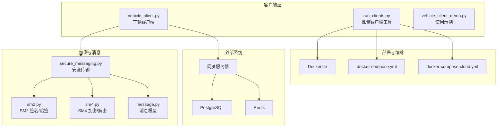
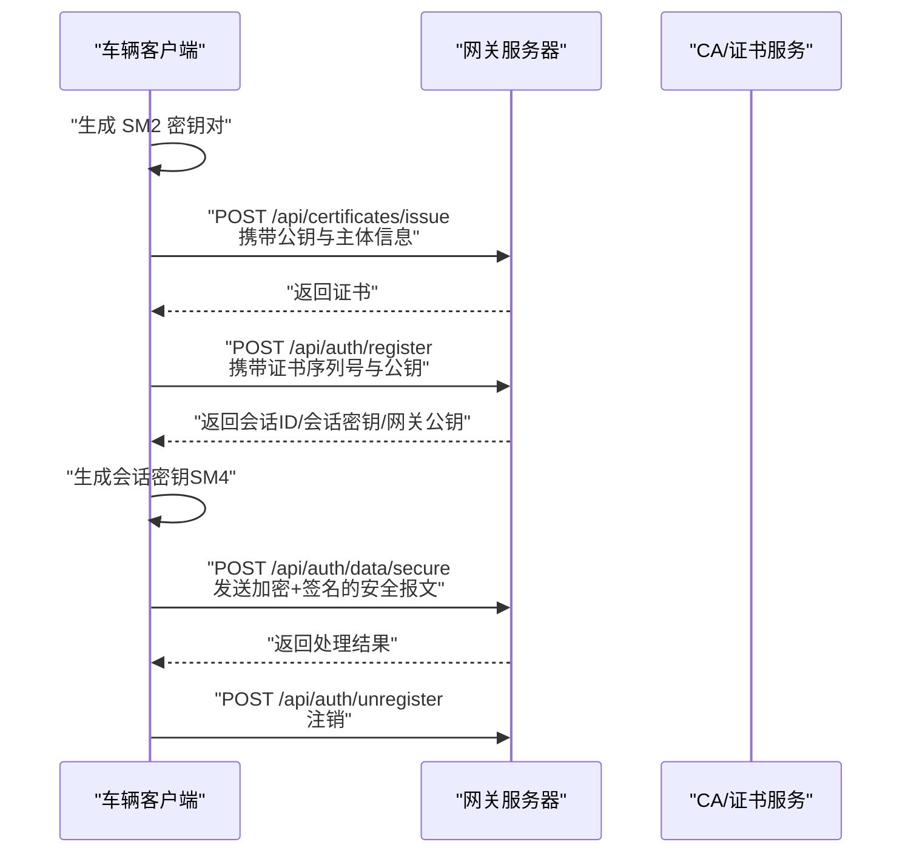
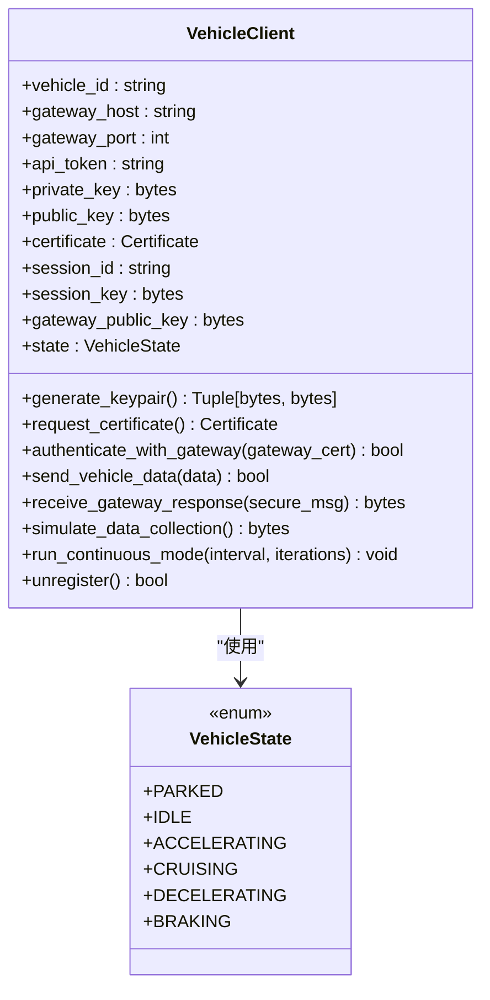
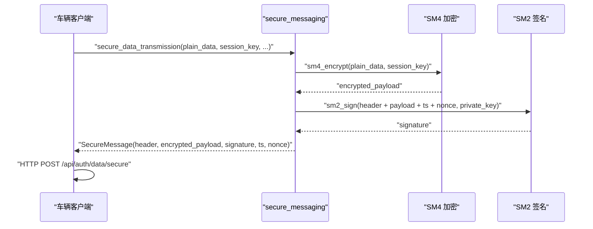
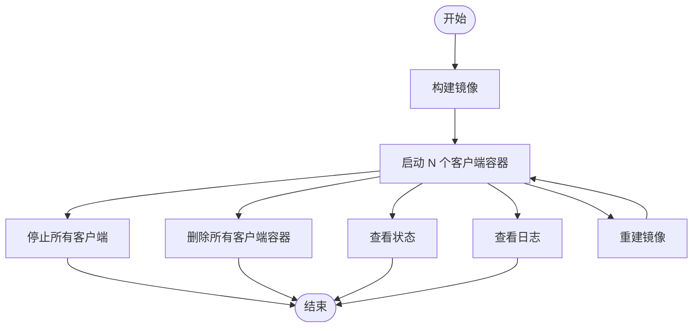
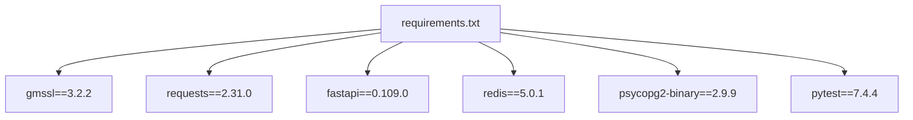

# 车辆客户端

<cite>
**本文档引用的文件**
- [vehicle_client.py](file://client/vehicle_client.py)
- [run_clients.py](file://client/run_clients.py)
- [README.md](file://client/README.md)
- [MULTI_CLIENT_GUIDE.md](file://client/MULTI_CLIENT_GUIDE.md)
- [QUICK_START.md](file://client/QUICK_START.md)
- [Dockerfile](file://client/Dockerfile)
- [docker-compose.yml](file://client/docker-compose.yml)
- [docker-compose-cloud.yml](file://client/docker-compose-cloud.yml)
- [sm2.py](file://src/crypto/sm2.py)
- [sm4.py](file://src/crypto/sm4.py)
- [message.py](file://src/models/message.py)
- [secure_messaging.py](file://src/secure_messaging.py)
- [requirements.txt](file://requirements.txt)
- [vehicle_client_demo.py](file://examples/vehicle_client_demo.py)
</cite>

## 目录
1. [简介](#简介)
2. [项目结构](#项目结构)
3. [核心组件](#核心组件)
4. [架构总览](#架构总览)
5. [详细组件分析](#详细组件分析)
6. [依赖分析](#依赖分析)
7. [性能考虑](#性能考虑)
8. [故障排查指南](#故障排查指南)
9. [结论](#结论)
10. [附录](#附录)

## 简介
本文件面向车辆厂商与系统集成商，提供车联网安全通信网关“车辆客户端”的综合技术文档。内容涵盖：
- vehicle_client.py 的实现与使用方法：连接建立、认证流程、数据传输、状态机与模拟数据。
- 批量客户端运行工具 run_clients.py 的功能与配置选项。
- 完整的客户端部署与配置指南（本地、Docker、Docker Compose、云网关）。
- 客户端与网关服务器的通信协议与数据格式。
- 错误处理与重连机制说明。
- 性能测试与负载模拟工具使用方法。
- 客户端集成与自定义开发指南。

## 项目结构
客户端相关的核心文件与部署配置如下：
- 客户端核心：client/vehicle_client.py
- 批量运行工具：client/run_clients.py
- 文档与指南：client/README.md、client/MULTI_CLIENT_GUIDE.md、client/QUICK_START.md
- 部署与编排：client/Dockerfile、client/docker-compose.yml、client/docker-compose-cloud.yml
- 加密与消息模型：src/crypto/sm2.py、src/crypto/sm4.py、src/models/message.py、src/secure_messaging.py
- 依赖清单：requirements.txt
- 示例：examples/vehicle_client_demo.py

图表来源
- [vehicle_client.py:1-809](file://client/vehicle_client.py#L1-L809)
- [run_clients.py:1-289](file://client/run_clients.py#L1-L289)
- [Dockerfile:1-41](file://client/Dockerfile#L1-L41)
- [docker-compose.yml:1-123](file://client/docker-compose.yml#L1-L123)
- [docker-compose-cloud.yml:1-33](file://client/docker-compose-cloud.yml#L1-L33)
- [sm2.py:1-265](file://src/crypto/sm2.py#L1-L265)
- [sm4.py:1-189](file://src/crypto/sm4.py#L1-L189)
- [message.py:1-200](file://src/models/message.py#L1-L200)
- [secure_messaging.py:1-249](file://src/secure_messaging.py#L1-L249)

章节来源
- [README.md:1-351](file://client/README.md#L1-L351)
- [MULTI_CLIENT_GUIDE.md:1-347](file://client/MULTI_CLIENT_GUIDE.md#L1-L347)
- [QUICK_START.md:1-99](file://client/QUICK_START.md#L1-L99)

## 核心组件
- 车辆客户端 VehicleClient：负责密钥生成、证书申请、双向认证、会话管理、安全数据传输、模拟数据采集与连续运行模式。
- 批量客户端工具 run_clients.py：封装 Docker 镜像构建、容器启动/停止/状态查询/日志查看等运维能力，支持大规模并发测试。
- 加密与消息模块：SM2/SM4 国密算法实现与安全报文模型，保障数据机密性、完整性与抗抵赖。
- 部署与编排：Dockerfile、docker-compose.yml、docker-compose-cloud.yml 提供本地与云端网关的便捷部署方案。

章节来源
- [vehicle_client.py:41-104](file://client/vehicle_client.py#L41-L104)
- [run_clients.py:62-107](file://client/run_clients.py#L62-L107)
- [sm2.py:93-132](file://src/crypto/sm2.py#L93-L132)
- [sm4.py:11-46](file://src/crypto/sm4.py#L11-L46)
- [message.py:9-77](file://src/models/message.py#L9-L77)
- [secure_messaging.py:17-68](file://src/secure_messaging.py#L17-L68)

## 架构总览
车辆客户端通过 HTTP API 与网关交互，不直接访问数据库或 Redis，确保部署简单与安全隔离。核心交互链路如下：

图表来源
- [vehicle_client.py:118-191](file://client/vehicle_client.py#L118-L191)
- [vehicle_client.py:726-774](file://client/vehicle_client.py#L726-L774)
- [vehicle_client.py:242-317](file://client/vehicle_client.py#L242-L317)
- [vehicle_client.py:567-601](file://client/vehicle_client.py#L567-L601)

## 详细组件分析

### 车辆客户端 VehicleClient 类
VehicleClient 是客户端的核心类，提供以下关键能力：
- 密钥对生成：基于 SM2 算法生成 32 字节私钥与 64 字节公钥。
- 证书申请：向网关发起证书申请，若网络不可用则回退到模拟证书。
- 双向认证：通过网关认证接口获取会话密钥与网关公钥。
- 会话管理：维护 session_id、session_key、gateway_public_key。
- 安全数据传输：使用 SM4 加密与 SM2 签名，构造安全报文并通过 HTTP API 发送。
- 模拟数据采集：根据车辆状态机动态生成 GPS、动力、温度、电池、诊断等数据。
- 连续运行模式：支持定时发送与优雅退出（注销）。

图表来源
- [vehicle_client.py:41-104](file://client/vehicle_client.py#L41-L104)
- [vehicle_client.py:31-39](file://client/vehicle_client.py#L31-L39)

章节来源
- [vehicle_client.py:105-116](file://client/vehicle_client.py#L105-L116)
- [vehicle_client.py:118-191](file://client/vehicle_client.py#L118-L191)
- [vehicle_client.py:192-241](file://client/vehicle_client.py#L192-L241)
- [vehicle_client.py:242-317](file://client/vehicle_client.py#L242-L317)
- [vehicle_client.py:362-566](file://client/vehicle_client.py#L362-L566)
- [vehicle_client.py:603-645](file://client/vehicle_client.py#L603-L645)
- [vehicle_client.py:567-601](file://client/vehicle_client.py#L567-L601)

### 安全数据传输流程
安全传输由 secure_messaging 模块实现，核心步骤：
- 生成 16 字节随机 nonce 与时间戳。
- 使用会话密钥（SM4）加密业务数据。
- 构造待签名数据（消息头、加密载荷、时间戳、nonce）。
- 使用发送方私钥（SM2）签名。
- 将 SecureMessage 通过 HTTP API 发送到网关。

图表来源
- [secure_messaging.py:17-68](file://src/secure_messaging.py#L17-L68)
- [sm4.py:49-108](file://src/crypto/sm4.py#L49-L108)
- [sm2.py:135-204](file://src/crypto/sm2.py#L135-L204)
- [message.py:80-130](file://src/models/message.py#L80-L130)

章节来源
- [secure_messaging.py:17-142](file://src/secure_messaging.py#L17-L142)
- [message.py:80-200](file://src/models/message.py#L80-L200)

### 批量客户端运行工具 run_clients.py
run_clients.py 提供一键构建镜像、启动/停止/查看状态/查看日志/重建镜像等能力，并支持大规模并发测试：
- 构建镜像：基于项目根目录构建 client/Dockerfile。
- 启动客户端：通过 Docker 以 host 网络模式启动多个容器，支持自定义 Gateway 地址、端口、运行模式、发送间隔与车辆 ID 前缀。
- 管理命令：查看状态、查看日志、停止、删除、重建镜像。
- 性能测试：支持启动数十甚至上百个客户端进行压力测试。

图表来源
- [run_clients.py:43-107](file://client/run_clients.py#L43-L107)
- [run_clients.py:110-145](file://client/run_clients.py#L110-L145)
- [run_clients.py:147-179](file://client/run_clients.py#L147-L179)
- [run_clients.py:181-285](file://client/run_clients.py#L181-L285)

章节来源
- [run_clients.py:62-107](file://client/run_clients.py#L62-L107)
- [run_clients.py:110-179](file://client/run_clients.py#L110-L179)
- [run_clients.py:181-285](file://client/run_clients.py#L181-L285)

### 部署与配置指南
- 本地运行：安装依赖后设置环境变量，直接运行 vehicle_client.py；支持单次与连续模式。
- Docker 运行：从项目根目录构建镜像，使用 --network host 或自定义网络；通过环境变量配置 Gateway 地址与端口。
- Docker Compose：提供本地网关+数据库+Redis+客户端的完整栈；或提供连接云端网关的客户端配置。
- 云网关：docker-compose-cloud.yml 通过环境变量配置云端 Gateway 地址与端口，支持 scale 扩展。

章节来源
- [README.md:66-117](file://client/README.md#L66-L117)
- [README.md:237-246](file://client/README.md#L237-L246)
- [QUICK_START.md:10-43](file://client/QUICK_START.md#L10-L43)
- [docker-compose.yml:10-58](file://client/docker-compose.yml#L10-L58)
- [docker-compose-cloud.yml:12-32](file://client/docker-compose-cloud.yml#L12-L32)
- [Dockerfile:28-41](file://client/Dockerfile#L28-L41)

### 通信协议与数据格式
- HTTP API：
  - 证书申请：POST /api/certificates/issue
  - 注册上线：POST /api/auth/register
  - 认证：POST /api/auth/authenticate
  - 数据传输：POST /api/auth/data/secure
  - 注销：POST /api/auth/unregister
- 安全报文格式（SecureMessage）：
  - header：版本、消息类型、发送方、接收方、会话ID
  - encrypted_payload：SM4 加密后的业务数据
  - signature：SM2 签名
  - timestamp：时间戳（±5 分钟容差）
  - nonce：16 字节随机数（防重放）

章节来源
- [vehicle_client.py:135-156](file://client/vehicle_client.py#L135-L156)
- [vehicle_client.py:726-774](file://client/vehicle_client.py#L726-L774)
- [vehicle_client.py:288-297](file://client/vehicle_client.py#L288-L297)
- [message.py:80-130](file://src/models/message.py#L80-L130)

### 错误处理与重连机制
- 证书申请失败：若网络不可用，回退到模拟证书继续离线模式。
- 认证失败：打印错误并返回 False，不阻断后续流程。
- 数据传输异常：捕获异常并打印堆栈，返回 False。
- 连续模式优雅退出：捕获键盘中断与异常，自动注销车辆。
- 防重放：时间戳容差与 16 字节 nonce，结合 Redis 标记（网关侧）。

章节来源
- [vehicle_client.py:157-164](file://client/vehicle_client.py#L157-L164)
- [vehicle_client.py:235-240](file://client/vehicle_client.py#L235-L240)
- [vehicle_client.py:310-317](file://client/vehicle_client.py#L310-L317)
- [vehicle_client.py:637-644](file://client/vehicle_client.py#L637-L644)
- [secure_messaging.py:205-212](file://src/secure_messaging.py#L205-L212)

### 性能测试与负载模拟
- 单客户端：通过 vehicle_client.py 的 --mode continuous 与 --interval 控制发送频率。
- 多客户端：run_clients.py 支持 --num、--interval、--gateway、--port、--mode、--prefix 等参数组合。
- Docker Compose：通过 scale 扩展客户端数量，便于大规模并发测试。
- 监控：查看容器状态、日志与 Gateway 审计日志与指标。

章节来源
- [README.md:290-313](file://client/README.md#L290-L313)
- [MULTI_CLIENT_GUIDE.md:200-226](file://client/MULTI_CLIENT_GUIDE.md#L200-L226)
- [docker-compose-cloud.yml:12-32](file://client/docker-compose-cloud.yml#L12-L32)

### 客户端集成与自定义开发指南
- 添加新传感器数据：修改 vehicle_client.py 的 simulate_data_collection() 方法。
- 自定义认证流程：修改 authenticate_with_gateway() 方法。
- 自定义发送频率与重连策略：调整 run_continuous_mode() 与异常处理逻辑。
- 扩展批量工具：run_clients.py 支持自定义前缀、模式与间隔，便于分批测试。

章节来源
- [README.md:315-341](file://client/README.md#L315-L341)
- [MULTI_CLIENT_GUIDE.md:287-328](file://client/MULTI_CLIENT_GUIDE.md#L287-L328)
- [vehicle_client.py:362-566](file://client/vehicle_client.py#L362-L566)

## 依赖分析
- Python 依赖：gmssl（国密）、requests（HTTP）、fastapi/uvicorn（服务端）、pytest（测试）、redis、psycopg2、pydantic、cryptography、python-dotenv 等。
- 客户端依赖：gmssl 用于 SM2/SM4；requests 用于与网关交互；Docker 用于容器化部署。

图表来源
- [requirements.txt:1-25](file://requirements.txt#L1-L25)

章节来源
- [requirements.txt:1-25](file://requirements.txt#L1-L25)

## 性能考虑
- 加密开销：SM2/SM4 加密与签名带来 CPU 开销，建议在批量测试时适当增加发送间隔或减少客户端数量。
- 网络延迟：HTTP 请求与 TLS 握手影响端到端时延，建议使用 host 网络模式减少 NAT/NAT 穿越开销。
- 内存与资源：每个客户端进程占用一定内存与 CPU，大规模并发时需监控宿主机资源。
- 会话复用：尽量复用会话与密钥，避免频繁注册/注销带来的额外开销。

## 故障排查指南
- 证书申请失败：确认网关服务运行、网络连通、API Token 正确。
- 认证失败：检查证书有效性、CA 公钥配置、审计日志。
- 数据传输失败：检查会话密钥、网关公钥、会话未过期、签名验证。
- 客户端无法连接 Gateway：检查 Gateway 地址与端口、防火墙、Pod/容器健康状态。
- 客户端启动失败：查看容器日志、确认镜像构建成功、环境变量配置正确。
- 清理与重试：使用 run_clients.py 的 stop/remove/status/logs 命令进行运维。

章节来源
- [README.md:255-289](file://client/README.md#L255-L289)
- [MULTI_CLIENT_GUIDE.md:228-286](file://client/MULTI_CLIENT_GUIDE.md#L228-L286)

## 结论
本文档系统性地阐述了车辆客户端的设计与实现、部署与运维、通信协议与数据格式、错误处理与重连机制、性能测试与负载模拟，以及集成与自定义开发要点。通过 vehicle_client.py 与 run_clients.py，车辆厂商与集成商可以快速搭建稳定、安全、可扩展的车联网数据采集与传输体系。

## 附录
- 示例脚本：examples/vehicle_client_demo.py 展示单次、连续与多客户端并发传输示例。
- 快速开始：client/QUICK_START.md 提供三种启动方式与常见问题解答。
- 多客户端指南：client/MULTI_CLIENT_GUIDE.md 提供参数详解与监控方法。

章节来源
- [vehicle_client_demo.py:15-123](file://examples/vehicle_client_demo.py#L15-L123)
- [QUICK_START.md:1-99](file://client/QUICK_START.md#L1-L99)
- [MULTI_CLIENT_GUIDE.md:1-347](file://client/MULTI_CLIENT_GUIDE.md#L1-L347)