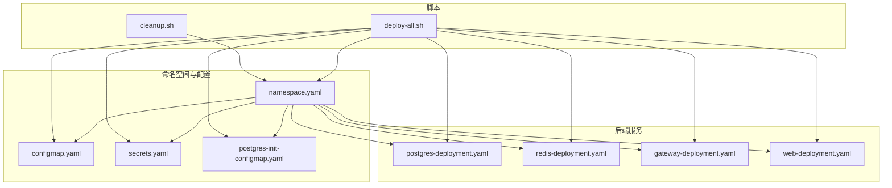
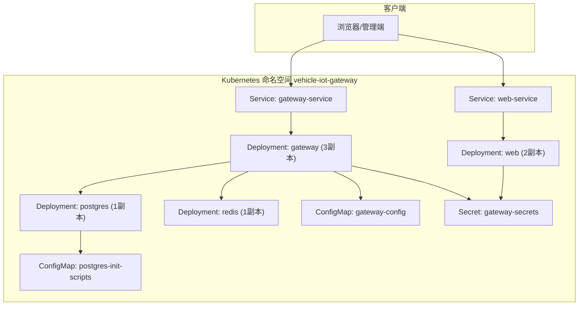
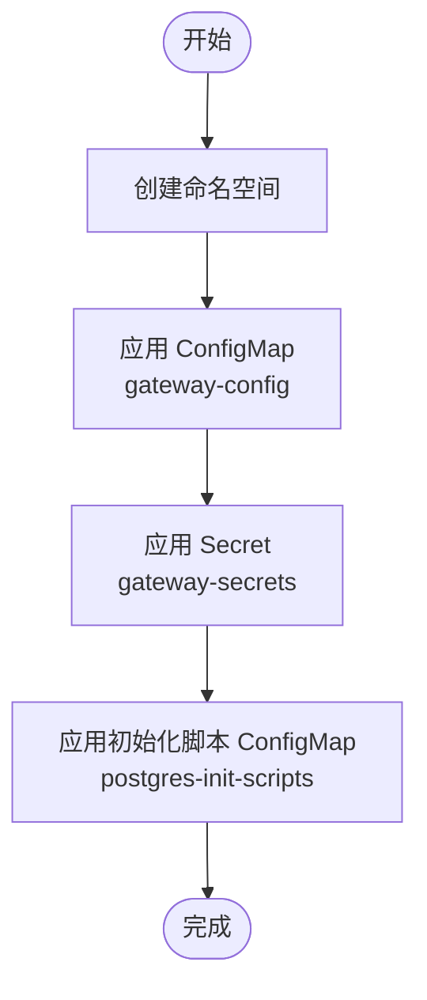
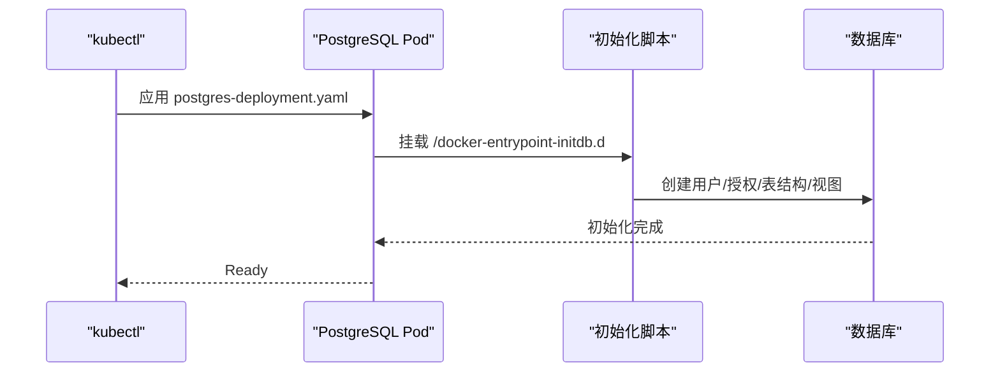
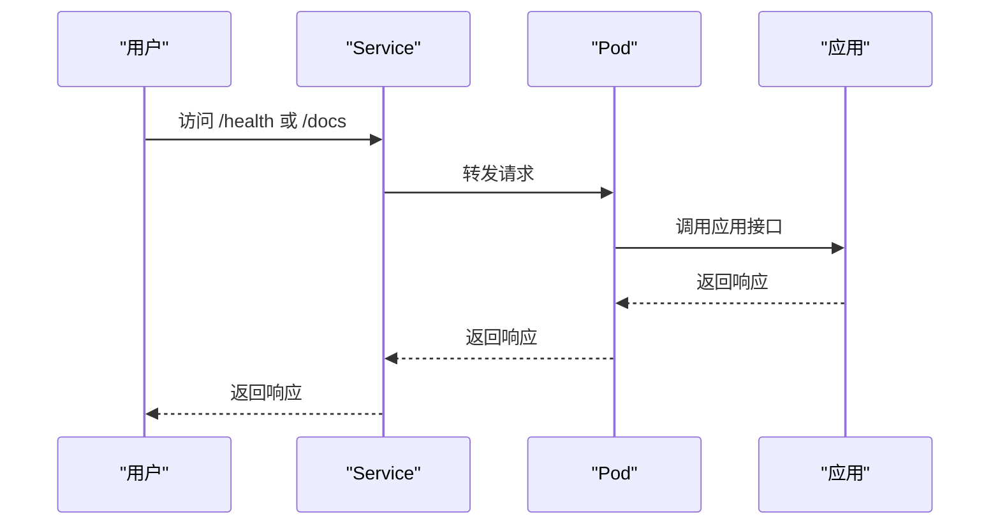
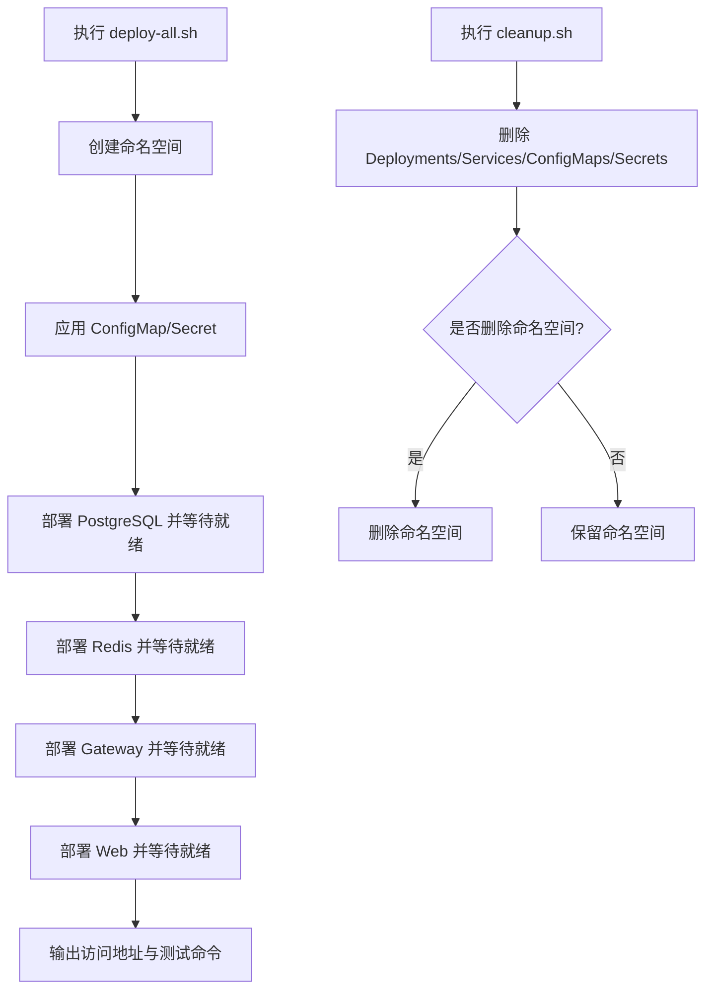
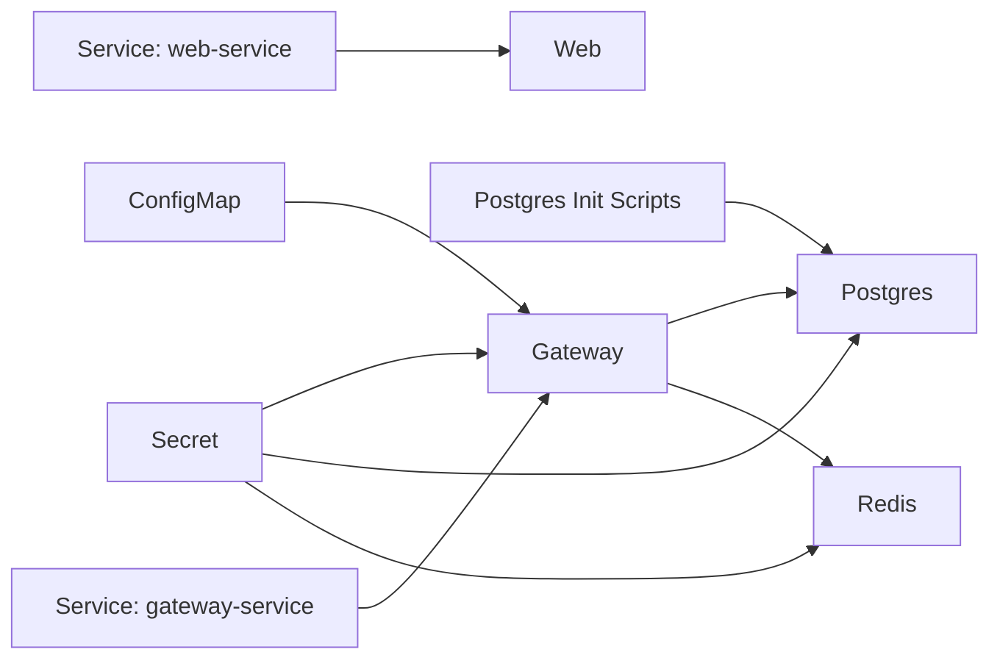
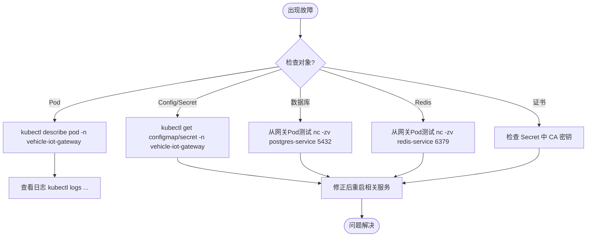

# Kubernetes集群部署

<cite>
**本文引用的文件**
- [deployment/kubernetes/README.md](file://deployment/kubernetes/README.md)
- [deployment/kubernetes/deploy-all.sh](file://deployment/kubernetes/deploy-all.sh)
- [deployment/kubernetes/cleanup.sh](file://deployment/kubernetes/cleanup.sh)
- [deployment/kubernetes/namespace.yaml](file://deployment/kubernetes/namespace.yaml)
- [deployment/kubernetes/configmap.yaml](file://deployment/kubernetes/configmap.yaml)
- [deployment/kubernetes/secrets.yaml](file://deployment/kubernetes/secrets.yaml)
- [deployment/kubernetes/postgres-init-configmap.yaml](file://deployment/kubernetes/postgres-init-configmap.yaml)
- [deployment/kubernetes/gateway-deployment.yaml](file://deployment/kubernetes/gateway-deployment.yaml)
- [deployment/kubernetes/web-deployment.yaml](file://deployment/kubernetes/web-deployment.yaml)
- [deployment/kubernetes/postgres-deployment.yaml](file://deployment/kubernetes/postgres-deployment.yaml)
- [deployment/kubernetes/redis-deployment.yaml](file://deployment/kubernetes/redis-deployment.yaml)
- [docs/NO_PVC_DEPLOYMENT.md](file://docs/NO_PVC_DEPLOYMENT.md)
- [docs/DEPLOYMENT.md](file://docs/DEPLOYMENT.md)
- [docs/TROUBLESHOOTING.md](file://docs/TROUBLESHOOTING.md)
- [scripts/init_database.sh](file://scripts/init_database.sh)
- [scripts/generate_ca_keys.py](file://scripts/generate_ca_keys.py)
</cite>

## 目录
1. [简介](#简介)
2. [项目结构](#项目结构)
3. [核心组件](#核心组件)
4. [架构总览](#架构总览)
5. [详细组件分析](#详细组件分析)
6. [依赖关系分析](#依赖关系分析)
7. [性能考量](#性能考量)
8. [故障排除指南](#故障排除指南)
9. [结论](#结论)
10. [附录](#附录)

## 简介
本指南面向在Kubernetes集群中部署车联网安全通信网关的运维人员与工程师，提供从命名空间到应用、数据库、缓存、服务发现与负载均衡、自动扩缩容、监控与健康检查，以及故障排除与应急响应的完整实践说明。当前仓库采用Kubernetes原生清单与一键脚本，结合ConfigMap与Secret进行配置与敏感信息管理；数据库与缓存采用emptyDir临时存储，适合测试与开发场景。

## 项目结构
Kubernetes部署相关的核心文件位于 deployment/kubernetes 目录，包含命名空间、配置、密钥、数据库与缓存初始化脚本、应用部署与服务定义、以及一键部署与清理脚本。配套文档位于 docs 目录，涵盖无PVC部署说明、部署指南与故障排查等。

**图表来源**
- [deployment/kubernetes/namespace.yaml:1-7](file://deployment/kubernetes/namespace.yaml#L1-L7)
- [deployment/kubernetes/configmap.yaml:1-17](file://deployment/kubernetes/configmap.yaml#L1-L17)
- [deployment/kubernetes/secrets.yaml:1-20](file://deployment/kubernetes/secrets.yaml#L1-L20)
- [deployment/kubernetes/postgres-init-configmap.yaml:1-319](file://deployment/kubernetes/postgres-init-configmap.yaml#L1-L319)
- [deployment/kubernetes/postgres-deployment.yaml:1-77](file://deployment/kubernetes/postgres-deployment.yaml#L1-L77)
- [deployment/kubernetes/redis-deployment.yaml:1-64](file://deployment/kubernetes/redis-deployment.yaml#L1-L64)
- [deployment/kubernetes/gateway-deployment.yaml:1-132](file://deployment/kubernetes/gateway-deployment.yaml#L1-L132)
- [deployment/kubernetes/web-deployment.yaml:1-63](file://deployment/kubernetes/web-deployment.yaml#L1-L63)
- [deployment/kubernetes/deploy-all.sh:1-175](file://deployment/kubernetes/deploy-all.sh#L1-L175)
- [deployment/kubernetes/cleanup.sh:1-72](file://deployment/kubernetes/cleanup.sh#L1-L72)

**章节来源**
- [deployment/kubernetes/README.md:1-333](file://deployment/kubernetes/README.md#L1-L333)
- [deployment/kubernetes/deploy-all.sh:1-175](file://deployment/kubernetes/deploy-all.sh#L1-L175)

## 核心组件
- 命名空间：集中隔离资源，便于权限与配额管理。
- ConfigMap：集中存放数据库地址、端口、缓存参数、API端口等非敏感配置。
- Secret：存放数据库用户密码、Redis密码、CA密钥（十六进制）、API Token等敏感信息。
- 初始化脚本：PostgreSQL启动时自动执行，创建应用用户、授予权限、初始化表结构与视图、插入默认安全策略。
- 数据库（PostgreSQL）与缓存（Redis）：以Deployment形式部署，使用emptyDir临时存储，适合测试环境。
- 网关应用（Gateway）：多副本Deployment，提供健康检查探针，通过Service对外暴露。
- Web界面：前端管理界面，通过NodePort或Ingress暴露。

**章节来源**
- [deployment/kubernetes/namespace.yaml:1-7](file://deployment/kubernetes/namespace.yaml#L1-L7)
- [deployment/kubernetes/configmap.yaml:1-17](file://deployment/kubernetes/configmap.yaml#L1-L17)
- [deployment/kubernetes/secrets.yaml:1-20](file://deployment/kubernetes/secrets.yaml#L1-L20)
- [deployment/kubernetes/postgres-init-configmap.yaml:1-319](file://deployment/kubernetes/postgres-init-configmap.yaml#L1-L319)
- [deployment/kubernetes/postgres-deployment.yaml:1-77](file://deployment/kubernetes/postgres-deployment.yaml#L1-L77)
- [deployment/kubernetes/redis-deployment.yaml:1-64](file://deployment/kubernetes/redis-deployment.yaml#L1-L64)
- [deployment/kubernetes/gateway-deployment.yaml:1-132](file://deployment/kubernetes/gateway-deployment.yaml#L1-L132)
- [deployment/kubernetes/web-deployment.yaml:1-63](file://deployment/kubernetes/web-deployment.yaml#L1-L63)

## 架构总览
下图展示Kubernetes中的服务拓扑与流量走向：Gateway通过Service暴露，Web通过NodePort或Ingress暴露；Gateway与PostgreSQL、Redis通过ClusterIP服务进行内部通信；PostgreSQL使用ConfigMap挂载初始化脚本，Redis使用密码认证。

**图表来源**
- [deployment/kubernetes/gateway-deployment.yaml:120-132](file://deployment/kubernetes/gateway-deployment.yaml#L120-L132)
- [deployment/kubernetes/web-deployment.yaml:50-63](file://deployment/kubernetes/web-deployment.yaml#L50-L63)
- [deployment/kubernetes/postgres-deployment.yaml:65-77](file://deployment/kubernetes/postgres-deployment.yaml#L65-L77)
- [deployment/kubernetes/redis-deployment.yaml:52-64](file://deployment/kubernetes/redis-deployment.yaml#L52-L64)
- [deployment/kubernetes/configmap.yaml:1-17](file://deployment/kubernetes/configmap.yaml#L1-L17)
- [deployment/kubernetes/secrets.yaml:1-20](file://deployment/kubernetes/secrets.yaml#L1-L20)
- [deployment/kubernetes/postgres-init-configmap.yaml:1-319](file://deployment/kubernetes/postgres-init-configmap.yaml#L1-L319)

## 详细组件分析

### 命名空间与配置管理
- 命名空间：统一资源隔离，便于权限控制与资源统计。
- ConfigMap：集中管理数据库连接参数、缓存参数、API端口等，支持热更新。
- Secret：集中管理数据库密码、Redis密码、CA密钥、API Token等敏感信息，支持滚动更新。

**图表来源**
- [deployment/kubernetes/namespace.yaml:1-7](file://deployment/kubernetes/namespace.yaml#L1-L7)
- [deployment/kubernetes/configmap.yaml:1-17](file://deployment/kubernetes/configmap.yaml#L1-L17)
- [deployment/kubernetes/secrets.yaml:1-20](file://deployment/kubernetes/secrets.yaml#L1-L20)
- [deployment/kubernetes/postgres-init-configmap.yaml:1-319](file://deployment/kubernetes/postgres-init-configmap.yaml#L1-L319)

**章节来源**
- [deployment/kubernetes/namespace.yaml:1-7](file://deployment/kubernetes/namespace.yaml#L1-L7)
- [deployment/kubernetes/configmap.yaml:1-17](file://deployment/kubernetes/configmap.yaml#L1-L17)
- [deployment/kubernetes/secrets.yaml:1-20](file://deployment/kubernetes/secrets.yaml#L1-L20)
- [deployment/kubernetes/postgres-init-configmap.yaml:1-319](file://deployment/kubernetes/postgres-init-configmap.yaml#L1-L319)

### 数据库与缓存部署
- PostgreSQL：单副本，emptyDir临时存储，启动时挂载初始化脚本，自动创建应用用户与表结构。
- Redis：单副本，emptyDir临时存储，使用密码认证，适合缓存场景。

**图表来源**
- [deployment/kubernetes/postgres-deployment.yaml:1-77](file://deployment/kubernetes/postgres-deployment.yaml#L1-L77)
- [deployment/kubernetes/postgres-init-configmap.yaml:1-319](file://deployment/kubernetes/postgres-init-configmap.yaml#L1-L319)

**章节来源**
- [deployment/kubernetes/postgres-deployment.yaml:1-77](file://deployment/kubernetes/postgres-deployment.yaml#L1-L77)
- [deployment/kubernetes/redis-deployment.yaml:1-64](file://deployment/kubernetes/redis-deployment.yaml#L1-L64)
- [docs/NO_PVC_DEPLOYMENT.md:1-324](file://docs/NO_PVC_DEPLOYMENT.md#L1-L324)

### 网关与Web服务
- 网关：多副本Deployment，通过Service暴露，内置健康检查探针；使用ConfigMap与Secret注入配置。
- Web：前端管理界面，通过NodePort或Ingress暴露，内置健康检查探针。

**图表来源**
- [deployment/kubernetes/gateway-deployment.yaml:97-108](file://deployment/kubernetes/gateway-deployment.yaml#L97-L108)
- [deployment/kubernetes/web-deployment.yaml:30-41](file://deployment/kubernetes/web-deployment.yaml#L30-L41)

**章节来源**
- [deployment/kubernetes/gateway-deployment.yaml:1-132](file://deployment/kubernetes/gateway-deployment.yaml#L1-L132)
- [deployment/kubernetes/web-deployment.yaml:1-63](file://deployment/kubernetes/web-deployment.yaml#L1-L63)

### 一键部署与清理
- 一键部署脚本：按顺序创建命名空间、应用ConfigMap/Secret、部署PostgreSQL/Redis、等待就绪、部署网关与Web、输出访问地址与测试命令。
- 一键清理脚本：删除所有Deployments/Services/ConfigMaps/Secrets，可选择删除命名空间。

**图表来源**
- [deployment/kubernetes/deploy-all.sh:1-175](file://deployment/kubernetes/deploy-all.sh#L1-L175)
- [deployment/kubernetes/cleanup.sh:1-72](file://deployment/kubernetes/cleanup.sh#L1-L72)

**章节来源**
- [deployment/kubernetes/deploy-all.sh:1-175](file://deployment/kubernetes/deploy-all.sh#L1-L175)
- [deployment/kubernetes/cleanup.sh:1-72](file://deployment/kubernetes/cleanup.sh#L1-L72)

## 依赖关系分析
- 网关依赖：PostgreSQL（数据库）、Redis（缓存）、ConfigMap（配置）、Secret（密钥）。
- 数据库与缓存依赖：ConfigMap（初始化脚本/环境变量）、Secret（密码/密钥）。
- 服务发现：通过ClusterIP服务名进行内部通信（例如 gateway-service、postgres-service、redis-service）。
- 负载均衡：Gateway与Web通过Service暴露，Gateway使用LoadBalancer，Web使用NodePort。

**图表来源**
- [deployment/kubernetes/gateway-deployment.yaml:21-96](file://deployment/kubernetes/gateway-deployment.yaml#L21-L96)
- [deployment/kubernetes/postgres-deployment.yaml:21-41](file://deployment/kubernetes/postgres-deployment.yaml#L21-L41)
- [deployment/kubernetes/redis-deployment.yaml:25-33](file://deployment/kubernetes/redis-deployment.yaml#L25-L33)
- [deployment/kubernetes/configmap.yaml:1-17](file://deployment/kubernetes/configmap.yaml#L1-L17)
- [deployment/kubernetes/secrets.yaml:1-20](file://deployment/kubernetes/secrets.yaml#L1-L20)
- [deployment/kubernetes/postgres-init-configmap.yaml:1-319](file://deployment/kubernetes/postgres-init-configmap.yaml#L1-L319)

**章节来源**
- [deployment/kubernetes/gateway-deployment.yaml:1-132](file://deployment/kubernetes/gateway-deployment.yaml#L1-L132)
- [deployment/kubernetes/postgres-deployment.yaml:1-77](file://deployment/kubernetes/postgres-deployment.yaml#L1-L77)
- [deployment/kubernetes/redis-deployment.yaml:1-64](file://deployment/kubernetes/redis-deployment.yaml#L1-L64)

## 性能考量
- emptyDir临时存储：部署简单、启动快，但Pod重启后数据丢失，适合测试与开发。
- 资源限制：网关与Web均配置了requests/limits，建议根据实际负载调整。
- 健康检查：livenessProbe与readinessProbe确保Pod健康与流量接入时机。
- 自动扩缩容：当前未配置HPA，建议在生产环境基于CPU/自定义指标配置HPA。

**章节来源**
- [docs/NO_PVC_DEPLOYMENT.md:71-174](file://docs/NO_PVC_DEPLOYMENT.md#L71-L174)
- [deployment/kubernetes/gateway-deployment.yaml:109-116](file://deployment/kubernetes/gateway-deployment.yaml#L109-L116)
- [deployment/kubernetes/web-deployment.yaml:42-48](file://deployment/kubernetes/web-deployment.yaml#L42-L48)

## 故障排除指南
- Pod无法启动：查看Pod描述、事件与日志，检查ConfigMap/Secret是否存在，确认初始化脚本是否执行成功。
- 数据库连接失败：从网关Pod内测试到postgres-service:5432连通性，检查PostgreSQL服务状态与凭据。
- 证书申请失败：检查Secret中CA密钥是否正确，参考CA密钥配置文档。
- 数据持久化：当前使用emptyDir，Pod重启后数据丢失，测试完成后可迁移到独立PostgreSQL实例。
- 常用命令：查看日志、进入容器、重启Rollout、扩缩容、更新配置等。

**图表来源**
- [deployment/kubernetes/README.md:234-333](file://deployment/kubernetes/README.md#L234-L333)

**章节来源**
- [deployment/kubernetes/README.md:234-333](file://deployment/kubernetes/README.md#L234-L333)
- [docs/TROUBLESHOOTING.md:1-399](file://docs/TROUBLESHOOTING.md#L1-L399)

## 结论
本指南提供了在Kubernetes中部署车联网安全通信网关的完整路径：从命名空间与配置管理，到数据库与缓存初始化，再到应用部署与服务暴露。当前配置适合测试与开发场景，若需生产环境，建议替换为持久化存储、引入Ingress与TLS、配置HPA与监控告警，并加强安全与备份策略。

## 附录

### 一键部署脚本使用说明
- 执行步骤：赋予执行权限后依次创建命名空间、应用ConfigMap/Secret、部署PostgreSQL/Redis并等待就绪、部署网关与Web、输出访问地址与测试命令。
- 参数配置：通过ConfigMap与Secret进行，无需修改镜像版本，直接应用即可。

**章节来源**
- [deployment/kubernetes/deploy-all.sh:1-175](file://deployment/kubernetes/deploy-all.sh#L1-L175)
- [deployment/kubernetes/README.md:5-124](file://deployment/kubernetes/README.md#L5-L124)

### 数据库初始化与数据持久化策略
- 初始化脚本：PostgreSQL启动时自动执行，创建应用用户、授权、表结构、视图与默认安全策略。
- 持久化策略：当前使用emptyDir，适合测试；生产建议迁移到独立PostgreSQL实例或使用PVC。

**章节来源**
- [deployment/kubernetes/postgres-init-configmap.yaml:1-319](file://deployment/kubernetes/postgres-init-configmap.yaml#L1-L319)
- [docs/NO_PVC_DEPLOYMENT.md:1-324](file://docs/NO_PVC_DEPLOYMENT.md#L1-L324)

### 服务发现、负载均衡与自动扩缩容
- 服务发现：通过ClusterIP服务名进行内部通信（gateway-service、postgres-service、redis-service）。
- 负载均衡：Gateway使用LoadBalancer，Web使用NodePort；可按需改为Ingress。
- 自动扩缩容：当前未配置HPA，建议基于CPU/自定义指标配置。

**章节来源**
- [deployment/kubernetes/gateway-deployment.yaml:120-132](file://deployment/kubernetes/gateway-deployment.yaml#L120-L132)
- [deployment/kubernetes/web-deployment.yaml:50-63](file://deployment/kubernetes/web-deployment.yaml#L50-L63)

### 集群监控与健康检查
- 健康检查：网关与Web均配置livenessProbe与readinessProbe，建议结合Prometheus/Grafana进行指标采集。
- 日志：通过kubectl logs查看各组件日志，定位问题。

**章节来源**
- [deployment/kubernetes/gateway-deployment.yaml:97-108](file://deployment/kubernetes/gateway-deployment.yaml#L97-L108)
- [deployment/kubernetes/web-deployment.yaml:30-41](file://deployment/kubernetes/web-deployment.yaml#L30-L41)
- [deployment/kubernetes/README.md:149-186](file://deployment/kubernetes/README.md#L149-L186)

### 应急响应流程
- 立即评估：确认故障范围（Pod、网络、存储、密钥）。
- 快速恢复：重启相关Deployment、回滚至稳定版本、恢复Secret与ConfigMap。
- 根因分析：查看审计日志与数据库记录，定位问题根因。
- 预防改进：完善监控告警、备份策略与变更流程。

**章节来源**
- [docs/TROUBLESHOOTING.md:1-399](file://docs/TROUBLESHOOTING.md#L1-L399)
- [docs/DEPLOYMENT.md:228-295](file://docs/DEPLOYMENT.md#L228-L295)