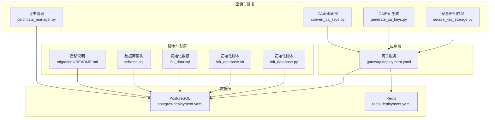
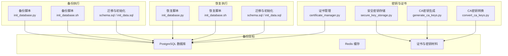
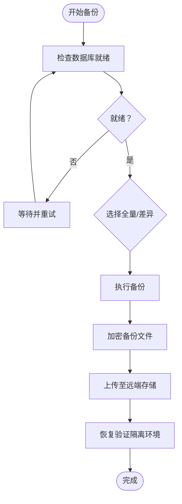
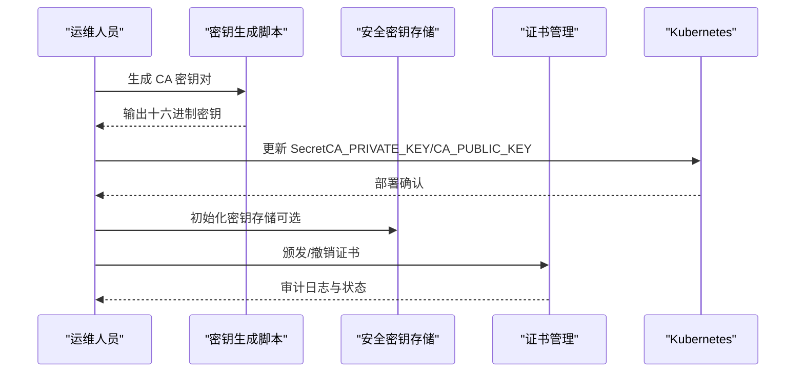
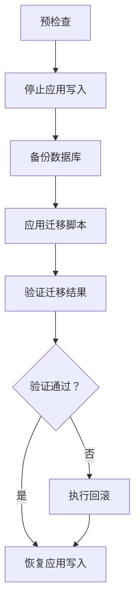
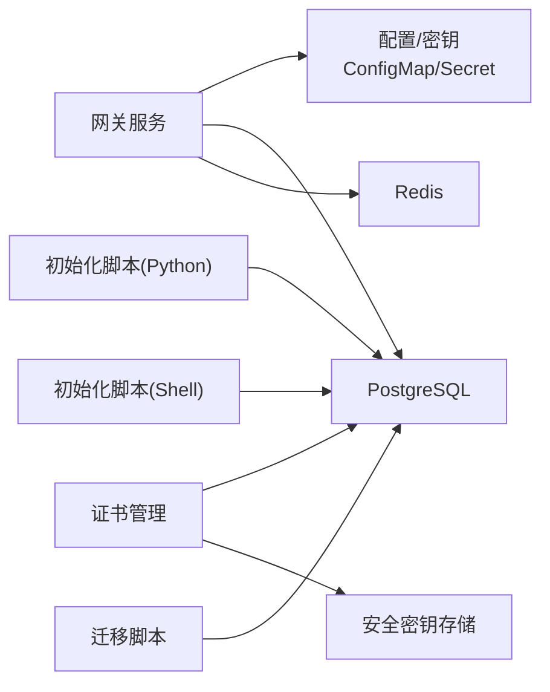

# 备份与恢复

<cite>
**本文引用的文件**
- [config/database.py](file://config/database.py)
- [src/db/postgres.py](file://src/db/postgres.py)
- [scripts/init_database.py](file://scripts/init_database.py)
- [scripts/init_database.sh](file://scripts/init_database.sh)
- [db/schema.sql](file://db/schema.sql)
- [src/certificate_manager.py](file://src/certificate_manager.py)
- [src/secure_key_storage.py](file://src/secure_key_storage.py)
- [deployment/kubernetes/gateway-deployment.yaml](file://deployment/kubernetes/gateway-deployment.yaml)
- [deployment/kubernetes/postgres-deployment.yaml](file://deployment/kubernetes/postgres-deployment.yaml)
- [deployment/kubernetes/redis-deployment.yaml](file://deployment/kubernetes/redis-deployment.yaml)
- [scripts/generate_ca_keys.py](file://scripts/generate_ca_keys.py)
- [scripts/convert_ca_keys.py](file://scripts/convert_ca_keys.py)
- [db/migrations/README.md](file://db/migrations/README.md)
- [db/init_data.sql](file://db/init_data.sql)
</cite>

## 目录
1. [简介](#简介)
2. [项目结构](#项目结构)
3. [核心组件](#核心组件)
4. [架构总览](#架构总览)
5. [详细组件分析](#详细组件分析)
6. [依赖分析](#依赖分析)
7. [性能考虑](#性能考虑)
8. [故障排查指南](#故障排查指南)
9. [结论](#结论)
10. [附录](#附录)

## 简介
本指南面向车联网安全通信网关的运维与安全部署团队，提供一套完整的备份与灾难恢复方案，涵盖数据库备份策略、自动化备份脚本配置、证书与密钥的备份保护机制、数据迁移与升级流程、灾难恢复计划与业务连续性保障、备份验证与恢复测试方法，以及针对数据损坏、硬件故障、自然灾害等场景的恢复策略。同时给出数据安全管理与合规性建议。

## 项目结构
本项目采用分层与功能模块化组织方式：
- 配置层：数据库连接配置（PostgreSQL/Redis）
- 数据访问层：PostgreSQL 连接封装
- 业务层：证书管理、密钥安全存储、安全策略管理
- 部署层：Kubernetes 部署清单（网关、PostgreSQL、Redis）
- 脚本层：数据库初始化与迁移、CA 密钥生成与转换
- 数据层：数据库架构定义、迁移脚本、初始化数据

图表来源
- [deployment/kubernetes/gateway-deployment.yaml:1-132](file://deployment/kubernetes/gateway-deployment.yaml#L1-L132)
- [deployment/kubernetes/postgres-deployment.yaml:1-77](file://deployment/kubernetes/postgres-deployment.yaml#L1-L77)
- [deployment/kubernetes/redis-deployment.yaml:1-64](file://deployment/kubernetes/redis-deployment.yaml#L1-L64)
- [scripts/init_database.py:1-151](file://scripts/init_database.py#L1-L151)
- [scripts/init_database.sh:1-45](file://scripts/init_database.sh#L1-L45)
- [db/schema.sql:1-104](file://db/schema.sql#L1-L104)
- [db/migrations/README.md:1-32](file://db/migrations/README.md#L1-L32)
- [db/init_data.sql:1-61](file://db/init_data.sql#L1-L61)
- [src/certificate_manager.py:1-734](file://src/certificate_manager.py#L1-L734)
- [src/secure_key_storage.py:1-380](file://src/secure_key_storage.py#L1-L380)
- [scripts/generate_ca_keys.py:1-126](file://scripts/generate_ca_keys.py#L1-L126)
- [scripts/convert_ca_keys.py:1-149](file://scripts/convert_ca_keys.py#L1-L149)

章节来源
- [config/database.py:1-50](file://config/database.py#L1-L50)
- [src/db/postgres.py:1-53](file://src/db/postgres.py#L1-L53)
- [scripts/init_database.py:1-151](file://scripts/init_database.py#L1-L151)
- [scripts/init_database.sh:1-45](file://scripts/init_database.sh#L1-L45)
- [db/schema.sql:1-104](file://db/schema.sql#L1-L104)
- [db/migrations/README.md:1-32](file://db/migrations/README.md#L1-L32)
- [db/init_data.sql:1-61](file://db/init_data.sql#L1-L61)
- [src/certificate_manager.py:1-734](file://src/certificate_manager.py#L1-L734)
- [src/secure_key_storage.py:1-380](file://src/secure_key_storage.py#L1-L380)
- [scripts/generate_ca_keys.py:1-126](file://scripts/generate_ca_keys.py#L1-L126)
- [scripts/convert_ca_keys.py:1-149](file://scripts/convert_ca_keys.py#L1-L149)
- [deployment/kubernetes/gateway-deployment.yaml:1-132](file://deployment/kubernetes/gateway-deployment.yaml#L1-L132)
- [deployment/kubernetes/postgres-deployment.yaml:1-77](file://deployment/kubernetes/postgres-deployment.yaml#L1-L77)
- [deployment/kubernetes/redis-deployment.yaml:1-64](file://deployment/kubernetes/redis-deployment.yaml#L1-L64)

## 核心组件
- 数据库配置与连接
  - PostgreSQL/Redis 配置从环境变量加载，支持容器化部署与外部化配置。
  - PostgreSQL 连接封装提供查询、更新、上下文管理能力。
- 数据库初始化与迁移
  - Python/Shell 双版本初始化脚本，支持等待数据库就绪、创建数据库、执行迁移、注入初始化数据。
  - 迁移脚本与回滚说明清晰，便于版本演进与回退。
- 证书与密钥管理
  - 证书颁发、验证、撤销与 CRL 维护；审计日志记录关键操作。
  - 安全密钥存储模拟 HSM 功能，支持密钥存储、轮换、安全清除与自动轮换线程。
- Kubernetes 部署
  - 网关、PostgreSQL、Redis 三组件部署，Secret/ConfigMap 管理敏感配置与非敏感配置分离。

章节来源
- [config/database.py:1-50](file://config/database.py#L1-L50)
- [src/db/postgres.py:1-53](file://src/db/postgres.py#L1-L53)
- [scripts/init_database.py:1-151](file://scripts/init_database.py#L1-L151)
- [scripts/init_database.sh:1-45](file://scripts/init_database.sh#L1-L45)
- [db/migrations/README.md:1-32](file://db/migrations/README.md#L1-L32)
- [src/certificate_manager.py:1-734](file://src/certificate_manager.py#L1-L734)
- [src/secure_key_storage.py:1-380](file://src/secure_key_storage.py#L1-L380)
- [deployment/kubernetes/gateway-deployment.yaml:1-132](file://deployment/kubernetes/gateway-deployment.yaml#L1-L132)
- [deployment/kubernetes/postgres-deployment.yaml:1-77](file://deployment/kubernetes/postgres-deployment.yaml#L1-L77)
- [deployment/kubernetes/redis-deployment.yaml:1-64](file://deployment/kubernetes/redis-deployment.yaml#L1-L64)

## 架构总览
下图展示备份与恢复相关的数据流与组件交互，强调数据库、密钥存储与部署配置之间的关系。

图表来源
- [scripts/init_database.py:1-151](file://scripts/init_database.py#L1-L151)
- [scripts/init_database.sh:1-45](file://scripts/init_database.sh#L1-L45)
- [db/schema.sql:1-104](file://db/schema.sql#L1-L104)
- [db/init_data.sql:1-61](file://db/init_data.sql#L1-L61)
- [src/secure_key_storage.py:1-380](file://src/secure_key_storage.py#L1-L380)
- [src/certificate_manager.py:1-734](file://src/certificate_manager.py#L1-L734)
- [scripts/generate_ca_keys.py:1-126](file://scripts/generate_ca_keys.py#L1-L126)
- [scripts/convert_ca_keys.py:1-149](file://scripts/convert_ca_keys.py#L1-L149)

## 详细组件分析

### 数据库备份策略与自动化脚本
- 备份策略
  - 全量备份：每日一次，保留最近7天全量备份。
  - 增量/差异备份：每小时一次，保留最近24小时增量。
  - 归档日志：开启 WAL 归档，支持时间点恢复（PITR）。
  - 多地冗余：至少两个异地副本，周期性校验一致性。
- 自动化脚本配置
  - Python 脚本：等待数据库就绪、创建数据库、执行迁移、注入初始化数据，适合容器内初始化与恢复验证。
  - Shell 脚本：基于 psql 的命令行初始化，适合 CI/CD 与运维脚本集成。
- 备份介质与加密
  - 使用加密磁盘或对象存储（S3/GCS），传输与静态均加密。
  - 备份文件命名规范：YYYYMMDD_HHMM_database_name.ext，包含校验和与元数据。
- 备份验证
  - 恢复演练：定期在隔离环境进行恢复测试，验证备份完整性与可恢复性。
  - 校验清单：校验数据库表数量、关键表行数、迁移版本号、初始化数据存在性。

图表来源
- [scripts/init_database.py:14-34](file://scripts/init_database.py#L14-L34)
- [scripts/init_database.sh:19-26](file://scripts/init_database.sh#L19-L26)

章节来源
- [scripts/init_database.py:1-151](file://scripts/init_database.py#L1-L151)
- [scripts/init_database.sh:1-45](file://scripts/init_database.sh#L1-L45)
- [db/schema.sql:1-104](file://db/schema.sql#L1-L104)
- [db/init_data.sql:1-61](file://db/init_data.sql#L1-L61)
- [db/migrations/README.md:1-32](file://db/migrations/README.md#L1-L32)

### 证书与密钥的备份保护机制
- 密钥生命周期
  - 生成：使用 SM2 算法生成 CA 密钥对，导出十六进制格式供 Kubernetes Secret 使用。
  - 存储：安全密钥存储模块模拟 HSM，密钥以受控方式存储与轮换。
  - 轮换：自动轮换线程按配置间隔轮换密钥，旧密钥安全清除。
  - 撤销：证书撤销通过 CRL 实施，配合缓存失效与审计记录。
- 备份保护
  - CA 私钥与会话密钥分别存储，最小权限访问。
  - 密钥导入/导出流程需双人复核与审计日志记录。
  - 密钥材料加密存储，访问日志与告警联动。
- 配置注入
  - 通过 Kubernetes Secrets 注入 CA 私钥与公钥，网关容器读取环境变量。

图表来源
- [scripts/generate_ca_keys.py:1-126](file://scripts/generate_ca_keys.py#L1-L126)
- [scripts/convert_ca_keys.py:1-149](file://scripts/convert_ca_keys.py#L1-L149)
- [src/secure_key_storage.py:1-380](file://src/secure_key_storage.py#L1-L380)
- [src/certificate_manager.py:1-734](file://src/certificate_manager.py#L1-L734)
- [deployment/kubernetes/gateway-deployment.yaml:82-92](file://deployment/kubernetes/gateway-deployment.yaml#L82-L92)

章节来源
- [scripts/generate_ca_keys.py:1-126](file://scripts/generate_ca_keys.py#L1-L126)
- [scripts/convert_ca_keys.py:1-149](file://scripts/convert_ca_keys.py#L1-L149)
- [src/secure_key_storage.py:1-380](file://src/secure_key_storage.py#L1-L380)
- [src/certificate_manager.py:1-734](file://src/certificate_manager.py#L1-L734)
- [deployment/kubernetes/gateway-deployment.yaml:1-132](file://deployment/kubernetes/gateway-deployment.yaml#L1-L132)

### 数据迁移与升级流程
- 迁移策略
  - 版本化迁移：迁移脚本按序号命名，执行顺序固定。
  - 回滚策略：提供回滚说明，必要时可删除视图/表进行回退。
  - 初始化数据：仅在开发/测试环境注入示例数据，生产环境通过业务流程生成。
- 升级流程
  - 预检查：确认数据库版本、迁移状态、依赖服务健康。
  - 执行迁移：在维护窗口执行迁移脚本，记录日志与校验点。
  - 验证：检查表结构、索引、视图、约束与初始化数据。
  - 回滚准备：保留回滚脚本与备份快照，确保可快速回退。

图表来源
- [db/migrations/README.md:1-32](file://db/migrations/README.md#L1-L32)
- [db/schema.sql:1-104](file://db/schema.sql#L1-L104)
- [db/init_data.sql:1-61](file://db/init_data.sql#L1-L61)
- [scripts/init_database.py:67-95](file://scripts/init_database.py#L67-L95)
- [scripts/init_database.sh:33-42](file://scripts/init_database.sh#L33-L42)

章节来源
- [db/migrations/README.md:1-32](file://db/migrations/README.md#L1-L32)
- [db/schema.sql:1-104](file://db/schema.sql#L1-L104)
- [db/init_data.sql:1-61](file://db/init_data.sql#L1-L61)
- [scripts/init_database.py:67-117](file://scripts/init_database.py#L67-L117)
- [scripts/init_database.sh:33-42](file://scripts/init_database.sh#L33-L42)

### 灾难恢复计划与业务连续性
- 场景划分
  - 数据损坏：通过备份恢复，验证完整性与一致性。
  - 硬件故障：切换到备用节点或异地副本，重建故障节点。
  - 自然灾害：启用异地灾备站点，恢复网络与应用。
- RTO/RPO
  - RTO：应用恢复时间目标，建议小于等于 4 小时。
  - RPO：数据恢复点目标，建议小于等于 15 分钟。
- 业务连续性
  - 多副本部署：网关、数据库、缓存均采用多副本。
  - 灾备演练：每季度进行一次完整演练，记录并改进。
  - 监控告警：数据库、密钥存储、证书状态实时监控。

章节来源
- [deployment/kubernetes/gateway-deployment.yaml:7-8](file://deployment/kubernetes/gateway-deployment.yaml#L7-L8)
- [deployment/kubernetes/postgres-deployment.yaml](file://deployment/kubernetes/postgres-deployment.yaml#L7)
- [deployment/kubernetes/redis-deployment.yaml](file://deployment/kubernetes/redis-deployment.yaml#L7)

### 备份验证与恢复测试
- 验证清单
  - 数据库：表/索引/视图/约束存在，迁移版本正确，初始化数据完整。
  - 证书与密钥：CA 密钥可读取，密钥轮换正常，证书链与 CRL 有效。
  - 应用：服务健康检查通过，认证与加密功能正常。
- 测试方法
  - 隔离环境恢复：使用备份在隔离环境执行恢复脚本，验证业务功能。
  - 抽样校验：对关键表抽样比对，统计行数与关键字段。
  - 性能回归：对比恢复前后性能指标，确保满足 SLA。

章节来源
- [scripts/init_database.py:119-147](file://scripts/init_database.py#L119-L147)
- [scripts/init_database.sh:40-44](file://scripts/init_database.sh#L40-L44)
- [src/certificate_manager.py:432-471](file://src/certificate_manager.py#L432-L471)
- [src/secure_key_storage.py:234-256](file://src/secure_key_storage.py#L234-L256)

### 不同场景下的恢复策略
- 数据损坏
  - 立即切换到最近可用备份，执行恢复脚本，验证完整性。
  - 若涉及迁移，先回滚到上一稳定版本再恢复。
- 硬件故障
  - 启动备用节点，挂载备份卷，恢复数据库与密钥。
  - 更新 DNS/负载均衡，逐步放量。
- 自然灾害
  - 启动异地灾备站点，恢复数据库与应用。
  - 与总部建立应急通道，远程协助恢复。

章节来源
- [scripts/init_database.py:119-147](file://scripts/init_database.py#L119-L147)
- [scripts/init_database.sh:40-44](file://scripts/init_database.sh#L40-L44)
- [db/migrations/README.md:23-31](file://db/migrations/README.md#L23-L31)

### 数据安全管理与合规性指导
- 敏感数据分类
  - 个人身份信息（PII）、凭证、密钥材料、审计日志。
- 访问控制
  - 最小权限原则，职责分离，定期审查访问日志。
- 加密与脱敏
  - 静态与传输加密，密钥材料加密存储，日志脱敏。
- 审计与追溯
  - 审计日志完整、不可抵赖，保留期限符合法规要求。
- 合规框架
  - 参考等级保护、网络安全法、个人信息保护法等要求，制定内部制度与流程。

## 依赖分析
- 组件耦合
  - 网关服务依赖 PostgreSQL 与 Redis，配置来自 ConfigMap/Secret。
  - 证书管理依赖数据库与密钥存储，审计日志贯穿关键操作。
  - 初始化脚本与迁移脚本共同保证数据库一致性。
- 外部依赖
  - PostgreSQL/Redis 容器镜像，Kubernetes API 与存储服务。
- 潜在风险
  - 配置泄露（Secret 管理不当）、密钥轮换失败、迁移回滚复杂。

图表来源
- [deployment/kubernetes/gateway-deployment.yaml:21-92](file://deployment/kubernetes/gateway-deployment.yaml#L21-L92)
- [deployment/kubernetes/postgres-deployment.yaml:21-36](file://deployment/kubernetes/postgres-deployment.yaml#L21-L36)
- [deployment/kubernetes/redis-deployment.yaml:25-30](file://deployment/kubernetes/redis-deployment.yaml#L25-L30)
- [src/certificate_manager.py:14-17](file://src/certificate_manager.py#L14-L17)
- [src/secure_key_storage.py:27-44](file://src/secure_key_storage.py#L27-L44)
- [scripts/init_database.py:119-147](file://scripts/init_database.py#L119-L147)
- [scripts/init_database.sh:19-44](file://scripts/init_database.sh#L19-L44)

章节来源
- [deployment/kubernetes/gateway-deployment.yaml:1-132](file://deployment/kubernetes/gateway-deployment.yaml#L1-L132)
- [deployment/kubernetes/postgres-deployment.yaml:1-77](file://deployment/kubernetes/postgres-deployment.yaml#L1-L77)
- [deployment/kubernetes/redis-deployment.yaml:1-64](file://deployment/kubernetes/redis-deployment.yaml#L1-L64)
- [src/certificate_manager.py:1-734](file://src/certificate_manager.py#L1-L734)
- [src/secure_key_storage.py:1-380](file://src/secure_key_storage.py#L1-L380)
- [scripts/init_database.py:1-151](file://scripts/init_database.py#L1-L151)
- [scripts/init_database.sh:1-45](file://scripts/init_database.sh#L1-L45)

## 性能考虑
- 备份性能
  - 并行备份与压缩，选择低峰时段执行。
  - 使用增量备份减少带宽与存储压力。
- 恢复性能
  - 预热数据库与应用，优先恢复关键表与索引。
  - 使用 SSD 或高性能存储加速恢复。
- 监控与调优
  - 监控备份/恢复任务耗时与资源占用，持续优化。

## 故障排查指南
- 数据库初始化失败
  - 检查环境变量与网络连通性，确认数据库就绪后再执行。
  - 查看迁移脚本与初始化数据执行日志。
- 证书与密钥异常
  - 核对 Kubernetes Secret 内容与权限，确认密钥轮换线程运行状态。
  - 检查证书有效性与 CRL 状态，必要时重新颁发。
- 恢复验证失败
  - 在隔离环境重放恢复脚本，逐项比对表结构与数据。
  - 关注审计日志中的错误事件，定位具体失败点。

章节来源
- [scripts/init_database.py:128-147](file://scripts/init_database.py#L128-L147)
- [scripts/init_database.sh:19-26](file://scripts/init_database.sh#L19-L26)
- [src/certificate_manager.py:334-430](file://src/certificate_manager.py#L334-L430)
- [src/secure_key_storage.py:234-256](file://src/secure_key_storage.py#L234-L256)

## 结论
本指南提供了从备份策略、自动化脚本、密钥与证书保护、迁移升级、灾难恢复到合规管理的完整实践路径。建议结合企业安全与合规要求，细化流程、强化演练、完善监控与告警，确保系统在各种异常场景下仍能保持业务连续性与数据安全。

## 附录
- 关键文件速览
  - 数据库配置与连接：[config/database.py:1-50](file://config/database.py#L1-L50)、[src/db/postgres.py:1-53](file://src/db/postgres.py#L1-L53)
  - 初始化与迁移：[scripts/init_database.py:1-151](file://scripts/init_database.py#L1-L151)、[scripts/init_database.sh:1-45](file://scripts/init_database.sh#L1-L45)、[db/migrations/README.md:1-32](file://db/migrations/README.md#L1-L32)
  - 数据架构与初始化数据：[db/schema.sql:1-104](file://db/schema.sql#L1-L104)、[db/init_data.sql:1-61](file://db/init_data.sql#L1-L61)
  - 证书与密钥：[src/certificate_manager.py:1-734](file://src/certificate_manager.py#L1-L734)、[src/secure_key_storage.py:1-380](file://src/secure_key_storage.py#L1-L380)、[scripts/generate_ca_keys.py:1-126](file://scripts/generate_ca_keys.py#L1-L126)、[scripts/convert_ca_keys.py:1-149](file://scripts/convert_ca_keys.py#L1-L149)
  - 部署配置：[deployment/kubernetes/gateway-deployment.yaml:1-132](file://deployment/kubernetes/gateway-deployment.yaml#L1-L132)、[deployment/kubernetes/postgres-deployment.yaml:1-77](file://deployment/kubernetes/postgres-deployment.yaml#L1-L77)、[deployment/kubernetes/redis-deployment.yaml:1-64](file://deployment/kubernetes/redis-deployment.yaml#L1-L64)