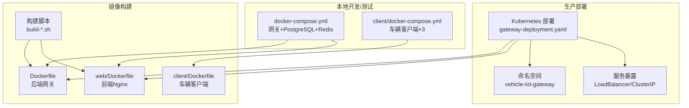
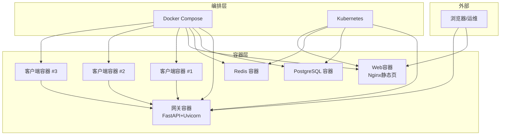
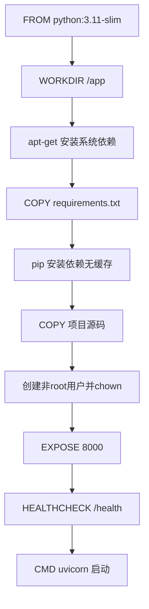
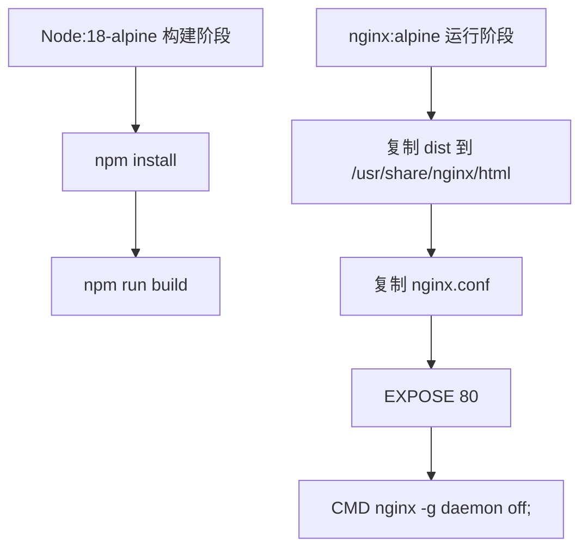
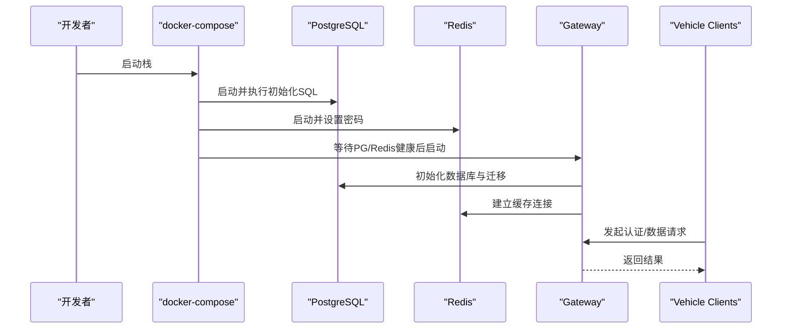
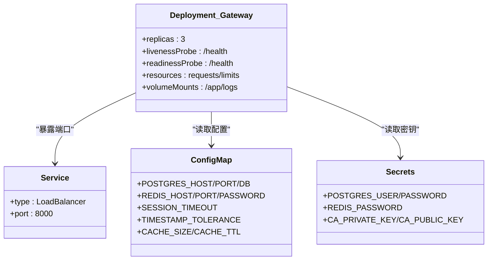
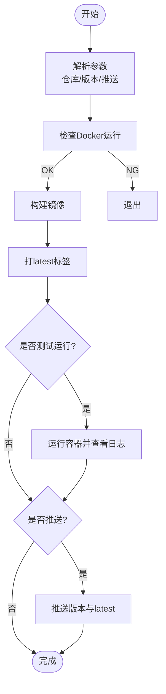
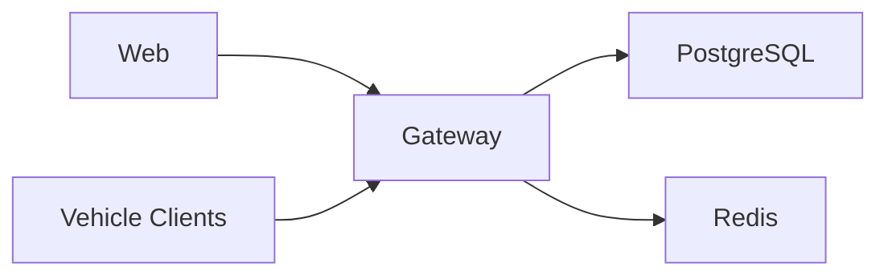

# 容器化与Docker部署

<cite>
**本文引用的文件**   
- [Dockerfile](file://Dockerfile)
- [docker-compose.yml](file://docker-compose.yml)
- [client/Dockerfile](file://client/Dockerfile)
- [web/Dockerfile](file://web/Dockerfile)
- [client/docker-compose.yml](file://client/docker-compose.yml)
- [build-all-images.sh](file://build-all-images.sh)
- [build-and-push.sh](file://build-and-push.sh)
- [build-web.sh](file://build-web.sh)
- [requirements.txt](file://requirements.txt)
- [deployment/kubernetes/gateway-deployment.yaml](file://deployment/kubernetes/gateway-deployment.yaml)
- [BUILD_AND_PUSH_IMAGE.md](file://BUILD_AND_PUSH_IMAGE.md)
- [COMPLETE_BUILD_GUIDE.md](file://COMPLETE_BUILD_GUIDE.md)
- [DEPLOYMENT_WITH_FIXES.md](file://DEPLOYMENT_WITH_FIXES.md)
- [docs/TROUBLESHOOTING.md](file://docs/TROUBLESHOOTING.md)
- [scripts/init_database.sh](file://scripts/init_database.sh)
</cite>

## 目录
1. [简介](#简介)
2. [项目结构](#项目结构)
3. [核心组件](#核心组件)
4. [架构总览](#架构总览)
5. [详细组件分析](#详细组件分析)
6. [依赖分析](#依赖分析)
7. [性能考虑](#性能考虑)
8. [故障排除指南](#故障排除指南)
9. [结论](#结论)
10. [附录](#附录)

## 简介
本指南面向车联网安全通信网关的容器化部署，覆盖Docker镜像构建（含多阶段优化）、Docker Compose编排、生产与开发环境差异策略、容器安全与资源限制、镜像推送与版本管理最佳实践，以及部署后的故障排除与性能优化建议。目标是帮助读者以一致、可重复且安全的方式完成从本地开发到生产集群的全链路部署。

## 项目结构
本项目包含后端网关、Web前端、数据库与缓存服务，以及Kubernetes与Docker Compose两种编排方式。核心文件分布如下：
- 后端镜像：根目录Dockerfile与requirements.txt
- Web镜像：web/Dockerfile与nginx.conf
- 客户端镜像：client/Dockerfile
- 编排：根目录docker-compose.yml与client/docker-compose.yml
- Kubernetes：deployment/kubernetes/*.yaml
- 构建与推送：build-all-images.sh、build-and-push.sh、build-web.sh
- 数据库初始化：scripts/init_database.sh
- 文档：BUILD_AND_PUSH_IMAGE.md、COMPLETE_BUILD_GUIDE.md、DEPLOYMENT_WITH_FIXES.md、docs/TROUBLESHOOTING.md

**图表来源**
- [docker-compose.yml:1-95](file://docker-compose.yml#L1-L95)
- [client/docker-compose.yml:1-123](file://client/docker-compose.yml#L1-L123)
- [deployment/kubernetes/gateway-deployment.yaml:1-132](file://deployment/kubernetes/gateway-deployment.yaml#L1-L132)
- [Dockerfile:1-35](file://Dockerfile#L1-L35)
- [web/Dockerfile:1-34](file://web/Dockerfile#L1-L34)
- [client/Dockerfile:1-41](file://client/Dockerfile#L1-L41)
- [build-all-images.sh:1-198](file://build-all-images.sh#L1-L198)

**章节来源**
- [docker-compose.yml:1-95](file://docker-compose.yml#L1-L95)
- [client/docker-compose.yml:1-123](file://client/docker-compose.yml#L1-L123)
- [deployment/kubernetes/gateway-deployment.yaml:1-132](file://deployment/kubernetes/gateway-deployment.yaml#L1-L132)
- [Dockerfile:1-35](file://Dockerfile#L1-L35)
- [web/Dockerfile:1-34](file://web/Dockerfile#L1-L34)
- [client/Dockerfile:1-41](file://client/Dockerfile#L1-L41)
- [build-all-images.sh:1-198](file://build-all-images.sh#L1-L198)

## 核心组件
- 后端网关镜像（Gateway）
  - 基于精简基础镜像，安装PostgreSQL客户端与系统依赖，使用非root用户运行，暴露健康检查与API端口。
  - 关键点：使用健康检查保障容器存活；以非root用户降低权限风险；通过环境变量注入数据库、缓存与安全配置。
- Web前端镜像（Web）
  - 多阶段构建：第一阶段Node打包，第二阶段Nginx提供静态服务，体积小、启动快。
- 车辆客户端镜像（Client）
  - 从根目录构建，设置Python入口点与默认参数，便于批量运行多个客户端。
- 编排与网络
  - docker-compose定义网关、PostgreSQL、Redis三服务，使用自定义桥接网络隔离。
  - Kubernetes部署定义副本数、探针、资源配额与服务暴露策略。
- 构建与推送
  - 提供统一脚本，支持参数化仓库、版本与自动推送；包含颜色化输出与交互确认。

**章节来源**
- [Dockerfile:1-35](file://Dockerfile#L1-L35)
- [web/Dockerfile:1-34](file://web/Dockerfile#L1-L34)
- [client/Dockerfile:1-41](file://client/Dockerfile#L1-L41)
- [docker-compose.yml:1-95](file://docker-compose.yml#L1-L95)
- [deployment/kubernetes/gateway-deployment.yaml:1-132](file://deployment/kubernetes/gateway-deployment.yaml#L1-L132)
- [build-all-images.sh:1-198](file://build-all-images.sh#L1-L198)

## 架构总览
下图展示容器化部署的总体架构：后端网关作为API中心，依赖PostgreSQL与Redis；Web前端提供管理界面；车辆客户端通过网关进行认证与数据传输；Kubernetes与Docker Compose分别用于生产与本地测试场景。

**图表来源**
- [docker-compose.yml:1-95](file://docker-compose.yml#L1-L95)
- [client/docker-compose.yml:1-123](file://client/docker-compose.yml#L1-L123)
- [deployment/kubernetes/gateway-deployment.yaml:1-132](file://deployment/kubernetes/gateway-deployment.yaml#L1-L132)

## 详细组件分析

### 后端网关镜像（Dockerfile）
- 分层优化
  - 系统依赖安装后清理包缓存，减少镜像体积。
  - 使用非root用户运行，降低权限风险。
  - 健康检查基于HTTP端点，便于编排自动恢复。
- 运行参数
  - 暴露API端口，使用Uvicorn启动服务，绑定0.0.0.0以便外部访问。
- 依赖管理
  - 通过requirements.txt集中声明，避免散落依赖导致镜像膨胀。

**图表来源**
- [Dockerfile:1-35](file://Dockerfile#L1-L35)
- [requirements.txt:1-25](file://requirements.txt#L1-L25)

**章节来源**
- [Dockerfile:1-35](file://Dockerfile#L1-L35)
- [requirements.txt:1-25](file://requirements.txt#L1-L25)

### Web前端镜像（web/Dockerfile）
- 多阶段构建
  - 阶段1：Node安装依赖并打包构建。
  - 阶段2：Nginx仅承载dist静态资源，镜像体积小。
- 配置
  - 复制Nginx配置文件，暴露80端口，常驻进程启动。

**图表来源**
- [web/Dockerfile:1-34](file://web/Dockerfile#L1-L34)

**章节来源**
- [web/Dockerfile:1-34](file://web/Dockerfile#L1-L34)

### 车辆客户端镜像（client/Dockerfile）
- 构建上下文
  - 从项目根目录构建，复制src/config/client目录至镜像。
- 运行行为
  - 设置环境变量默认指向网关主机与端口。
  - 入口点为Python脚本，支持命令行参数控制模式与间隔。

**章节来源**
- [client/Dockerfile:1-41](file://client/Dockerfile#L1-L41)

### Docker Compose编排（本地/测试）
- 服务定义
  - postgres：初始化SQL挂载、健康检查、持久卷。
  - redis：密码保护、健康检查、持久卷。
  - gateway：依赖数据库与缓存健康，挂载密钥与日志目录，暴露API端口。
- 网络与存储
  - 自定义桥接网络隔离服务；命名卷持久化数据库与缓存数据。
- 客户端编排
  - client/docker-compose.yml定义三个客户端容器，均依赖网关健康。

**图表来源**
- [docker-compose.yml:1-95](file://docker-compose.yml#L1-L95)
- [client/docker-compose.yml:1-123](file://client/docker-compose.yml#L1-L123)
- [scripts/init_database.sh:1-45](file://scripts/init_database.sh#L1-L45)

**章节来源**
- [docker-compose.yml:1-95](file://docker-compose.yml#L1-L95)
- [client/docker-compose.yml:1-123](file://client/docker-compose.yml#L1-L123)
- [scripts/init_database.sh:1-45](file://scripts/init_database.sh#L1-L45)

### Kubernetes部署（生产）
- 部署与服务
  - Deployment定义副本数、探针、资源请求/限制、卷挂载。
  - Service以负载均衡方式暴露API端口。
- 配置与密钥
  - ConfigMap与Secrets分离配置与敏感信息，Gateway通过环境变量读取。
- 可扩展性
  - 副本数可横向扩展；探针保障健康与就绪；资源限制防止资源争用。

**图表来源**
- [deployment/kubernetes/gateway-deployment.yaml:1-132](file://deployment/kubernetes/gateway-deployment.yaml#L1-L132)

**章节来源**
- [deployment/kubernetes/gateway-deployment.yaml:1-132](file://deployment/kubernetes/gateway-deployment.yaml#L1-L132)

### 构建与推送（脚本化）
- build-all-images.sh
  - 支持统一构建网关与Web镜像，自动打latest标签，可交互或自动推送。
- build-and-push.sh
  - 单独构建网关镜像，包含测试运行与推送流程。
- build-web.sh
  - 单独构建Web镜像，包含测试与推送流程。
- 最佳实践
  - 使用语义化版本或Git哈希作为镜像标签；开启BuildKit加速；并行构建提升效率；推送前先本地验证。

**图表来源**
- [build-all-images.sh:1-198](file://build-all-images.sh#L1-L198)
- [build-and-push.sh:1-231](file://build-and-push.sh#L1-L231)
- [build-web.sh:1-250](file://build-web.sh#L1-L250)

**章节来源**
- [build-all-images.sh:1-198](file://build-all-images.sh#L1-L198)
- [build-and-push.sh:1-231](file://build-and-push.sh#L1-L231)
- [build-web.sh:1-250](file://build-web.sh#L1-L250)
- [BUILD_AND_PUSH_IMAGE.md:1-572](file://BUILD_AND_PUSH_IMAGE.md#L1-L572)
- [COMPLETE_BUILD_GUIDE.md:1-472](file://COMPLETE_BUILD_GUIDE.md#L1-L472)

## 依赖分析
- 组件耦合
  - 网关对数据库与缓存存在强依赖，编排中通过健康检查与depends_on保证启动顺序。
  - Web与网关通过API端口通信，Kubernetes中通过Service暴露。
- 外部依赖
  - PostgreSQL与Redis版本与兼容性需关注；Nginx版本与Node版本影响构建稳定性。
- 循环依赖
  - 当前编排无循环依赖；若引入反向代理或共享卷需谨慎设计。

**图表来源**
- [docker-compose.yml:1-95](file://docker-compose.yml#L1-L95)
- [client/docker-compose.yml:1-123](file://client/docker-compose.yml#L1-L123)
- [deployment/kubernetes/gateway-deployment.yaml:1-132](file://deployment/kubernetes/gateway-deployment.yaml#L1-L132)

**章节来源**
- [docker-compose.yml:1-95](file://docker-compose.yml#L1-L95)
- [client/docker-compose.yml:1-123](file://client/docker-compose.yml#L1-L123)
- [deployment/kubernetes/gateway-deployment.yaml:1-132](file://deployment/kubernetes/gateway-deployment.yaml#L1-L132)

## 性能考虑
- 镜像体积与启动速度
  - 使用精简基础镜像与多阶段构建，显著降低镜像体积与启动时间。
  - Web镜像采用Nginx承载静态资源，避免Node常驻带来的资源占用。
- 运行时性能
  - Kubernetes中为网关设置合理的CPU与内存请求/限制，避免资源争用。
  - 启用探针与副本数横向扩展，提高可用性与吞吐。
- 数据库与缓存
  - 通过健康检查与持久卷保障数据库与缓存稳定；合理配置连接池与索引提升查询性能。
- 网络与I/O
  - 使用桥接网络隔离服务；挂载日志目录便于持久化与审计。

**章节来源**
- [web/Dockerfile:1-34](file://web/Dockerfile#L1-L34)
- [deployment/kubernetes/gateway-deployment.yaml:1-132](file://deployment/kubernetes/gateway-deployment.yaml#L1-L132)
- [DEPLOYMENT_WITH_FIXES.md:299-327](file://DEPLOYMENT_WITH_FIXES.md#L299-L327)

## 故障排除指南
- 数据库连接失败
  - 检查PostgreSQL服务状态、端口开放、环境变量与日志；确认用户权限与网络连通。
- Redis连接失败
  - 检查Redis服务状态、密码配置与日志；确认requirepass设置与网络连通。
- 认证失败/证书问题
  - 检查证书有效性、撤销列表与CA密钥；查看审计日志定位失败原因。
- 签名验证失败/重放攻击
  - 核对签名算法（SM2）、Nonce追踪与时间戳容差；检查系统时间同步。
- 会话过期/内存泄漏
  - 检查会话超时配置、Redis内存与驱逐策略；监控内存使用并清理过期数据。
- API无响应
  - 检查服务状态、进程监听、资源限制与错误日志；必要时增加资源或重启服务。
- 日志分析
  - 使用关键字统计与聚合查询定位高频错误类型；结合数据库审计日志分析。

**章节来源**
- [docs/TROUBLESHOOTING.md:1-399](file://docs/TROUBLESHOOTING.md#L1-L399)
- [DEPLOYMENT_WITH_FIXES.md:262-399](file://DEPLOYMENT_WITH_FIXES.md#L262-L399)

## 结论
通过多阶段构建与精简基础镜像，本项目在保证功能完整性的同时有效控制了镜像体积与启动时间。Docker Compose适用于本地开发与演示，Kubernetes则提供了生产级的高可用与弹性扩展能力。配合完善的构建脚本、健康检查与资源限制，能够实现稳定、可观测且易于维护的容器化部署。

## 附录

### 开发环境与生产环境差异策略
- 开发环境
  - 使用Docker Compose快速搭建；挂载源码与日志目录便于调试；暴露更多端口便于联调。
- 生产环境
  - 使用Kubernetes部署；通过ConfigMap与Secrets管理配置与密钥；设置副本数与探针；启用资源限制与持久化存储。

**章节来源**
- [docker-compose.yml:1-95](file://docker-compose.yml#L1-L95)
- [deployment/kubernetes/gateway-deployment.yaml:1-132](file://deployment/kubernetes/gateway-deployment.yaml#L1-L132)

### 容器安全与资源限制
- 安全
  - 非root用户运行；最小权限原则；密钥与敏感信息通过Secrets管理；健康检查与探针保障可用性。
- 资源
  - Kubernetes中设置requests/limits；Docker Compose中可通过运行时参数限制CPU/内存（如需要）。

**章节来源**
- [Dockerfile:22-24](file://Dockerfile#L22-L24)
- [deployment/kubernetes/gateway-deployment.yaml:109-116](file://deployment/kubernetes/gateway-deployment.yaml#L109-L116)

### 镜像推送与版本管理最佳实践
- 标签策略
  - 使用语义化版本与Git哈希；同时保留latest标签用于快速回滚。
- 推送流程
  - 构建后先本地验证，再推送；私有仓库需配置镜像拉取密钥。
- CI/CD
  - 可参考文档中的GitHub Actions示例，实现自动化构建与推送。

**章节来源**
- [BUILD_AND_PUSH_IMAGE.md:461-477](file://BUILD_AND_PUSH_IMAGE.md#L461-L477)
- [COMPLETE_BUILD_GUIDE.md:340-375](file://COMPLETE_BUILD_GUIDE.md#L340-L375)