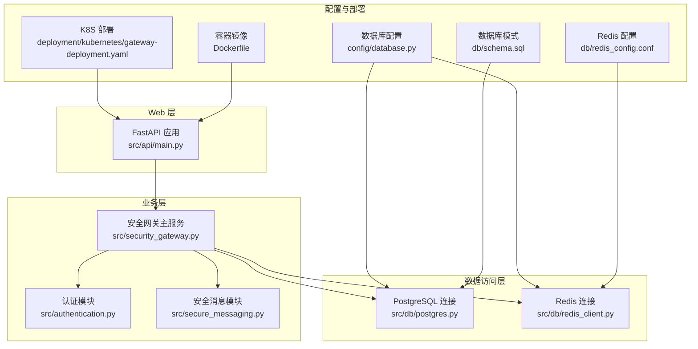
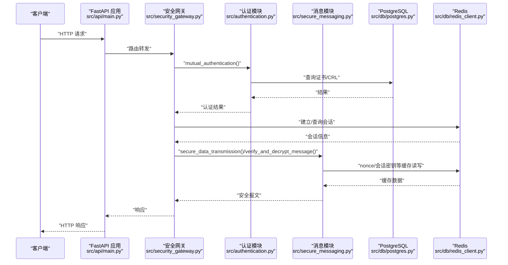
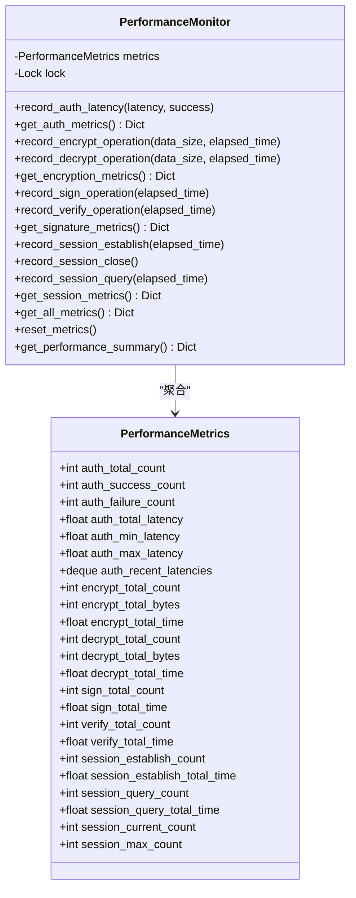
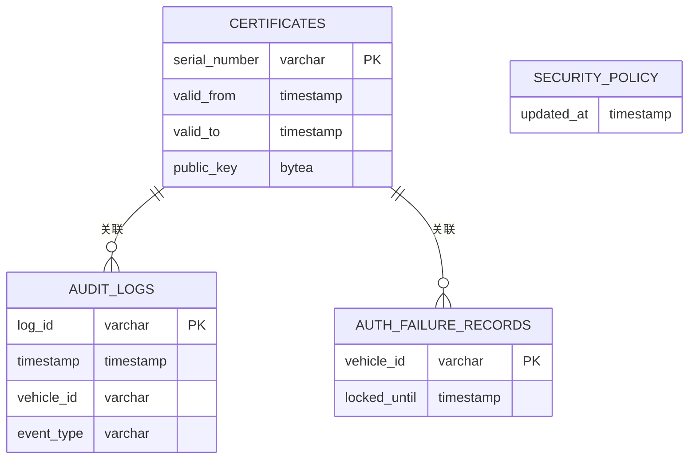
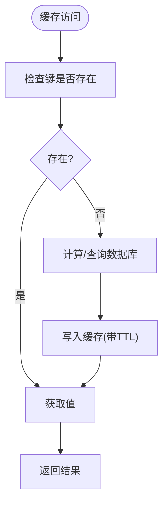
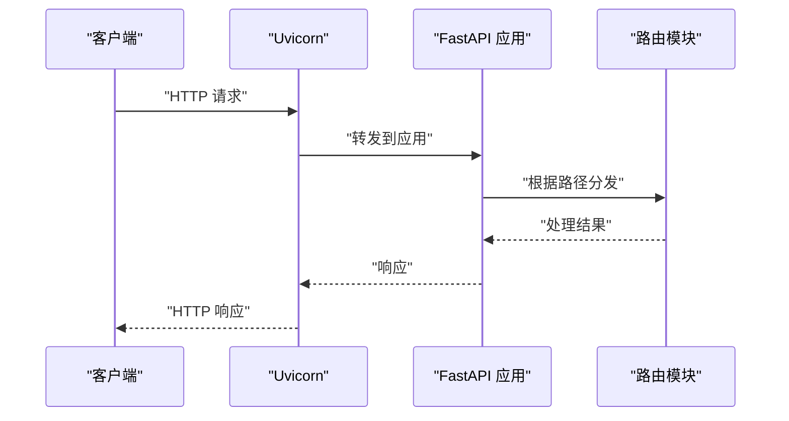
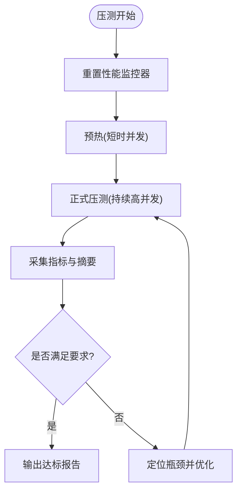
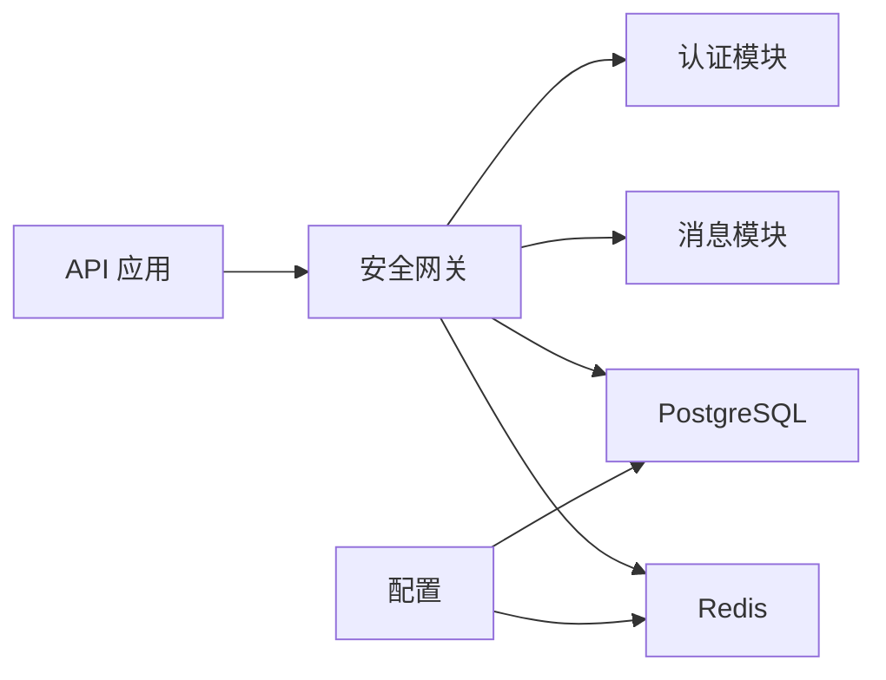

# 性能调优

<cite>
**本文引用的文件**
- [performance_monitor.py](file://src/performance_monitor.py)
- [performance_monitoring_demo.py](file://examples/performance_monitoring_demo.py)
- [test_performance_monitor.py](file://tests/test_performance_monitor.py)
- [task_15.3_implementation_summary.md](file://docs/task_15.3_implementation_summary.md)
- [postgres.py](file://src/db/postgres.py)
- [redis_client.py](file://src/db/redis_client.py)
- [schema.sql](file://db/schema.sql)
- [redis_config.conf](file://db/redis_config.conf)
- [database.py](file://config/database.py)
- [main.py](file://src/api/main.py)
- [Dockerfile](file://Dockerfile)
- [gateway-deployment.yaml](file://deployment/kubernetes/gateway-deployment.yaml)
- [run_api_server.py](file://examples/run_api_server.py)
- [security_gateway.py](file://src/security_gateway.py)
- [authentication.py](file://src/authentication.py)
- [secure_messaging.py](file://src/secure_messaging.py)
</cite>

## 目录
1. [简介](#简介)
2. [项目结构](#项目结构)
3. [核心组件](#核心组件)
4. [架构总览](#架构总览)
5. [详细组件分析](#详细组件分析)
6. [依赖分析](#依赖分析)
7. [性能考虑](#性能考虑)
8. [故障排查指南](#故障排查指南)
9. [结论](#结论)
10. [附录](#附录)

## 简介
本指南面向车联网安全通信网关的性能调优，围绕系统性能瓶颈识别与分析、数据库查询优化与索引策略、Redis 缓存性能与连接池配置、Web 服务器与 API 服务优化、并发处理与资源利用率优化、性能与压力测试实施以及高并发场景下的架构优化建议展开。文档以仓库现有实现为基础，结合性能监控模块、数据库与缓存配置、Kubernetes 部署与容器镜像等关键文件，给出可落地的优化方案与最佳实践。

## 项目结构
系统由以下关键层次构成：
- Web API 层：FastAPI 应用，提供 RESTful 接口与健康检查。
- 业务逻辑层：安全网关主服务、认证、消息加解密与签名验签、审计日志。
- 数据访问层：PostgreSQL 连接管理器、Redis 连接管理器。
- 配置与部署：数据库模式、Redis 配置、Kubernetes 部署与容器镜像。
- 监控与测试：性能监控模块、性能演示脚本、单元测试。

图表来源
- [main.py:13-107](file://src/api/main.py#L13-L107)
- [security_gateway.py:37-128](file://src/security_gateway.py#L37-L128)
- [authentication.py:1-200](file://src/authentication.py#L1-L200)
- [secure_messaging.py:1-200](file://src/secure_messaging.py#L1-L200)
- [postgres.py:9-53](file://src/db/postgres.py#L9-L53)
- [redis_client.py:8-79](file://src/db/redis_client.py#L8-L79)
- [database.py:8-50](file://config/database.py#L8-L50)
- [schema.sql:1-104](file://db/schema.sql#L1-L104)
- [redis_config.conf:1-44](file://db/redis_config.conf#L1-L44)
- [gateway-deployment.yaml:1-132](file://deployment/kubernetes/gateway-deployment.yaml#L1-L132)
- [Dockerfile:1-34](file://Dockerfile#L1-L34)

章节来源
- [main.py:13-107](file://src/api/main.py#L13-L107)
- [security_gateway.py:37-128](file://src/security_gateway.py#L37-L128)
- [postgres.py:9-53](file://src/db/postgres.py#L9-L53)
- [redis_client.py:8-79](file://src/db/redis_client.py#L8-L79)
- [database.py:8-50](file://config/database.py#L8-L50)
- [schema.sql:1-104](file://db/schema.sql#L1-L104)
- [redis_config.conf:1-44](file://db/redis_config.conf#L1-L44)
- [gateway-deployment.yaml:1-132](file://deployment/kubernetes/gateway-deployment.yaml#L1-L132)
- [Dockerfile:1-34](file://Dockerfile#L1-L34)

## 核心组件
- 性能监控模块：提供认证、加密/解密、签名/验签、会话管理的性能指标采集与汇总，并内置装饰器与上下文管理器便于埋点。
- 数据库层：PostgreSQL 连接管理器封装查询与更新，支持上下文管理与游标工厂；数据库模式定义了证书、审计日志、安全策略等表及索引。
- 缓存层：Redis 连接管理器封装常用键值操作与扫描；Redis 配置文件定义持久化、内存策略、慢查询阈值与客户端上限。
- Web/API 层：FastAPI 应用，注册路由并提供健康检查；Dockerfile 暴露 8000 端口并以 uvicorn 启动。
- Kubernetes 部署：多副本部署、健康探针、资源请求/限制、环境变量注入。

章节来源
- [performance_monitor.py:14-421](file://src/performance_monitor.py#L14-L421)
- [postgres.py:9-53](file://src/db/postgres.py#L9-L53)
- [redis_client.py:8-79](file://src/db/redis_client.py#L8-L79)
- [schema.sql:1-104](file://db/schema.sql#L1-L104)
- [redis_config.conf:1-44](file://db/redis_config.conf#L1-L44)
- [main.py:13-107](file://src/api/main.py#L13-L107)
- [Dockerfile:1-34](file://Dockerfile#L1-L34)
- [gateway-deployment.yaml:1-132](file://deployment/kubernetes/gateway-deployment.yaml#L1-L132)

## 架构总览
下图展示从 API 到业务、再到数据库与缓存的整体调用链路，以及性能监控的埋点位置。

图表来源
- [main.py:94-102](file://src/api/main.py#L94-L102)
- [security_gateway.py:289-438](file://src/security_gateway.py#L289-L438)
- [authentication.py:196-200](file://src/authentication.py#L196-L200)
- [secure_messaging.py:17-142](file://src/secure_messaging.py#L17-L142)
- [postgres.py:32-45](file://src/db/postgres.py#L32-L45)
- [redis_client.py:31-49](file://src/db/redis_client.py#L31-L49)

## 详细组件分析

### 性能监控模块
- 功能要点
  - 认证延迟与 TPS、加密/解密吞吐量与 1KB 延迟、签名/验签速率、会话并发与查询/建立延迟。
  - 线程安全的指标累加与采样队列，支持重置与综合摘要。
  - 装饰器与上下文管理器自动埋点，便于在认证、加密、会话等关键路径插入监控。
- 性能要求映射
  - 认证延迟 < 500ms、TPS ≥ 100、SM4 吞吐量 ≥ 100 MB/s、1KB 加密延迟 < 10ms、SM2 签名 ≥ 1000 次/秒、SM2 验签 ≥ 2000 次/秒、并发会话 ≥ 10,000、会话查询 < 5ms、会话建立 < 100ms。
- 使用建议
  - 在认证、会话建立/查询、消息加解密、签名/验签的关键路径使用装饰器或上下文管理器埋点。
  - 定期重置监控器进行压测周期统计，输出综合摘要判断是否满足全部要求。

图表来源
- [performance_monitor.py:14-421](file://src/performance_monitor.py#L14-L421)

章节来源
- [performance_monitor.py:14-421](file://src/performance_monitor.py#L14-L421)
- [performance_monitoring_demo.py:1-255](file://examples/performance_monitoring_demo.py#L1-L255)
- [test_performance_monitor.py:1-483](file://tests/test_performance_monitor.py#L1-L483)
- [task_15.3_implementation_summary.md:197-236](file://docs/task_15.3_implementation_summary.md#L197-L236)

### 数据库查询优化与索引策略
- 现状与索引
  - 证书表：按序列号与有效期区间建立索引，支持快速查找与范围查询。
  - 审计日志表：按 log_id、timestamp、vehicle_id、event_type 建立索引，支撑审计查询与过滤。
  - 安全策略与认证失败记录：按更新时间、锁定截止时间等建立索引，提升策略查询与失败锁定判定效率。
- 查询优化建议
  - 使用 EXPLAIN/ANALYZE 分析慢查询，优先利用现有索引覆盖常见过滤字段（如 vehicle_id、event_type、timestamp）。
  - 对高频聚合查询（如按天统计审计事件）考虑物化视图或定期汇总表。
  - 控制返回字段与分页，避免 SELECT * 与一次性返回大量明细。
  - 将热点配置（如安全策略）缓存至内存，减少频繁读取数据库。
- 连接与事务
  - 使用连接池（建议在生产环境引入连接池库），避免频繁创建/销毁连接。
  - 将批量写入合并为事务，减少网络往返与锁竞争。

图表来源
- [schema.sql:3-104](file://db/schema.sql#L3-L104)

章节来源
- [schema.sql:1-104](file://db/schema.sql#L1-L104)
- [postgres.py:9-53](file://src/db/postgres.py#L9-L53)

### Redis 缓存性能调优与连接池配置
- 现状与配置
  - Redis 配置文件定义 bind/port、保护模式、密码、持久化策略、内存上限与淘汰策略、慢查询阈值、最大客户端数等。
  - 连接管理器提供 set/get/delete/exists/scan 等常用操作。
- 缓存优化建议
  - 合理设置 maxmemory 与 maxmemory-policy（LRU/LFU），结合业务特征选择合适淘汰策略。
  - 为不同用途划分数据库索引（会话、缓存、Nonce 追踪），避免键冲突与扫描开销。
  - 使用管道（pipeline）批量写入，降低 RTT；对热点键设置 TTL，避免无限增长。
  - 启用慢查询日志（slowlog-log-slower-than）定位慢操作，结合 scan/count 输出排查大键。
- 连接池与客户端
  - 在应用侧引入连接池（如 redis-py 的连接池），复用连接，减少握手成本。
  - 配置合适的超时与重试策略，避免阻塞导致的资源耗尽。

图表来源
- [redis_client.py:31-71](file://src/db/redis_client.py#L31-L71)
- [redis_config.conf:1-44](file://db/redis_config.conf#L1-L44)

章节来源
- [redis_client.py:8-79](file://src/db/redis_client.py#L8-L79)
- [redis_config.conf:1-44](file://db/redis_config.conf#L1-L44)

### Web 服务器与 API 服务优化
- FastAPI 与 Uvicorn
  - Dockerfile 暴露 8000 端口并以 uvicorn 启动应用；健康检查端点 /health 提供存活探测。
  - 生产环境建议启用 Gunicorn + Uvicorn 子进程模式，提高并发与稳定性。
- CORS 与认证
  - CORS 允许跨域访问；API 认证使用 Bearer Token（当前简化为环境变量校验，生产需替换为 JWT 等强认证）。
- 路由与中间件
  - 路由按功能模块拆分，便于独立扩展与监控；可增加请求限流、压缩与日志中间件。

图表来源
- [Dockerfile:26-34](file://Dockerfile#L26-L34)
- [main.py:13-107](file://src/api/main.py#L13-L107)

章节来源
- [Dockerfile:1-34](file://Dockerfile#L1-L34)
- [main.py:13-107](file://src/api/main.py#L13-L107)
- [run_api_server.py:1-48](file://examples/run_api_server.py#L1-L48)

### 并发处理与资源利用率优化
- 多副本与水平扩展
  - K8S 部署采用多副本（replicas: 3），配合 Service 暴露服务，提升可用性与吞吐。
  - 健康探针（liveness/readiness）保障滚动升级与自愈能力。
- 资源限制与请求
  - CPU/内存 requests/limits 设定，避免资源争抢；根据压测结果动态调整。
- 会话与缓存
  - 会话建立/查询延迟要求严格，需优化 Redis 访问路径与键设计；对热点会话信息做本地缓存。
- 算法与密钥
  - 国密算法（SM2/SM4）性能受密钥长度与硬件加速影响，建议在支持的平台上启用加速或优化实现。

章节来源
- [gateway-deployment.yaml:1-132](file://deployment/kubernetes/gateway-deployment.yaml#L1-L132)
- [performance_monitor.py:308-347](file://src/performance_monitor.py#L308-L347)

### 性能测试与压力测试实施
- 性能监控埋点
  - 使用装饰器与上下文管理器在认证、加密/解密、签名/验签、会话建立/查询等路径自动采集指标。
- 压测流程
  - 准备阶段：重置性能监控器，准备测试数据与脚本。
  - 执行阶段：并发发起认证、消息传输、会话查询等操作，持续一定时长。
  - 统计阶段：获取认证/加密/签名/会话指标与综合摘要，评估是否满足性能要求。
- 示例与测试
  - 性能演示脚本提供认证、加密/解密、签名/验签、会话管理的演示与指标输出。
  - 单元测试覆盖指标计算、装饰器行为、线程安全与摘要生成。

图表来源
- [performance_monitoring_demo.py:209-255](file://examples/performance_monitoring_demo.py#L209-L255)
- [test_performance_monitor.py:280-331](file://tests/test_performance_monitor.py#L280-L331)

章节来源
- [performance_monitoring_demo.py:1-255](file://examples/performance_monitoring_demo.py#L1-L255)
- [test_performance_monitor.py:1-483](file://tests/test_performance_monitor.py#L1-L483)

## 依赖分析
- 组件耦合
  - 安全网关主服务依赖认证、消息、数据库与缓存模块；认证与消息模块进一步依赖数据库与缓存。
  - API 层仅负责路由与鉴权，业务逻辑集中在网关服务中，职责清晰。
- 外部依赖
  - PostgreSQL 与 Redis 作为外部依赖，连接配置来自环境变量；K8S 通过 ConfigMap/Secret 注入。
- 潜在风险
  - 数据库连接未使用连接池，可能成为瓶颈；建议引入连接池库。
  - Redis 未配置连接池，建议在应用侧启用连接池以提升吞吐。

图表来源
- [security_gateway.py:37-128](file://src/security_gateway.py#L37-L128)
- [database.py:8-50](file://config/database.py#L8-L50)

章节来源
- [security_gateway.py:37-128](file://src/security_gateway.py#L37-L128)
- [database.py:8-50](file://config/database.py#L8-L50)

## 性能考虑
- 认证与会话
  - 通过装饰器与上下文管理器记录认证延迟与会话建立/查询耗时，确保满足延迟与并发要求。
  - 会话密钥与敏感信息建议存储于安全隔离区，避免明文驻留内存。
- 加密/解密与签名/验签
  - 监控吞吐量与 1KB 延迟，确保满足 GB 级别的数据处理能力与毫秒级延迟。
  - 对签名/验签速率进行基准测试，确保满足高并发场景下的验证需求。
- 数据库与缓存
  - 利用现有索引覆盖高频查询字段；对热点数据进行缓存，减少数据库压力。
  - Redis 配置需结合业务峰值 QPS 调整 maxclients 与内存策略。
- Web 与容器
  - 生产环境启用 Gunicorn + Uvicorn 子进程模式；K8S 资源配额与探针配置需与压测结果匹配。

## 故障排查指南
- 性能监控
  - 使用性能演示脚本与单元测试验证指标采集与计算逻辑；若指标异常，检查装饰器/上下文管理器是否正确包裹目标函数。
- 数据库
  - 使用 EXPLAIN/ANALYZE 分析慢查询；核对索引是否命中；关注审计日志与证书查询的热点字段。
- 缓存
  - 启用慢查询日志定位慢操作；检查键空间大小与淘汰策略；确认 scan/count 输出是否异常。
- API 与容器
  - 检查健康探针与日志；确认端口暴露与容器镜像构建；核对 K8S 资源限制与副本数。

章节来源
- [performance_monitoring_demo.py:1-255](file://examples/performance_monitoring_demo.py#L1-L255)
- [test_performance_monitor.py:1-483](file://tests/test_performance_monitor.py#L1-L483)
- [redis_config.conf:32-44](file://db/redis_config.conf#L32-L44)
- [Dockerfile:29-34](file://Dockerfile#L29-L34)
- [gateway-deployment.yaml:97-108](file://deployment/kubernetes/gateway-deployment.yaml#L97-L108)

## 结论
通过性能监控模块的自动化埋点、数据库索引与查询优化、Redis 缓存与连接池配置、Web 服务器与容器资源的精细化调优，以及系统化的性能与压力测试流程，车联网安全通信网关可在高并发场景下稳定运行并满足严格的性能要求。建议在生产环境中引入连接池、Gunicorn 子进程模式与更完善的认证机制，并持续以监控数据驱动优化迭代。

## 附录
- 性能要求对照表（来自实现文档）
  - 认证延迟 < 500ms、TPS ≥ 100、SM4 吞吐量 ≥ 100 MB/s、1KB 加密延迟 < 10ms、SM2 签名 ≥ 1000 次/秒、SM2 验签 ≥ 2000 次/秒、并发会话 ≥ 10,000、会话查询 < 5ms、会话建立 < 100ms。

章节来源
- [task_15.3_implementation_summary.md:197-236](file://docs/task_15.3_implementation_summary.md#L197-L236)