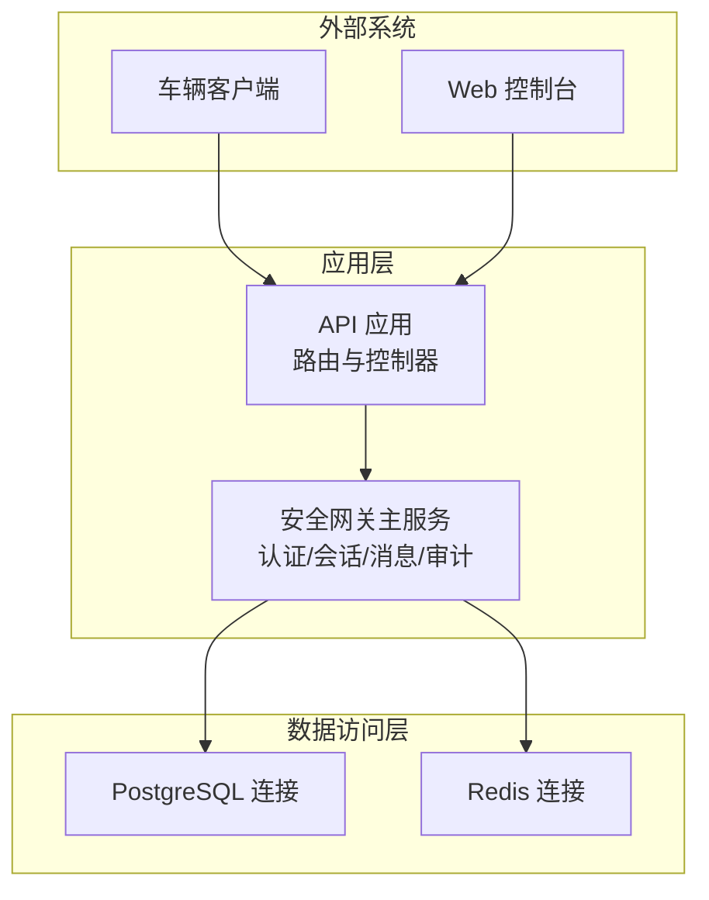
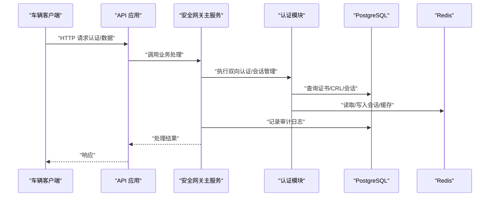
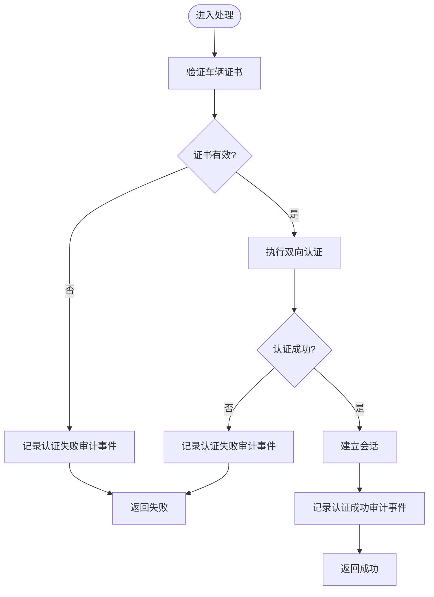
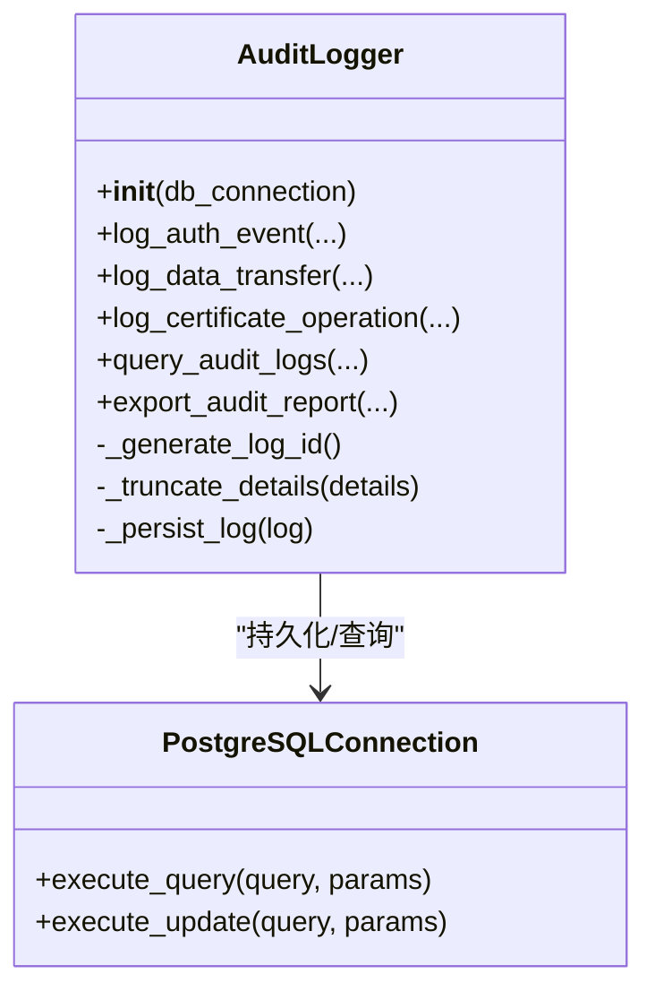
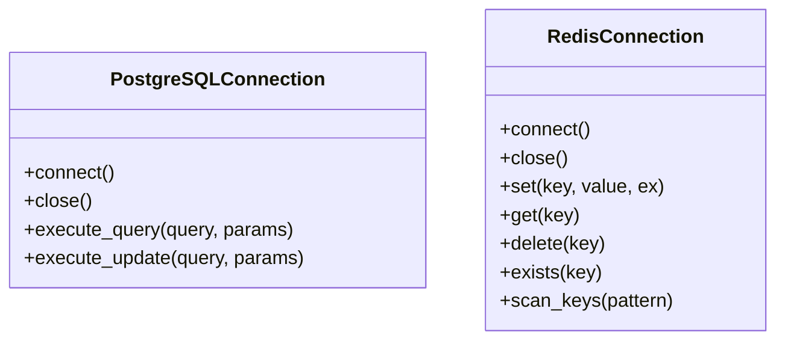
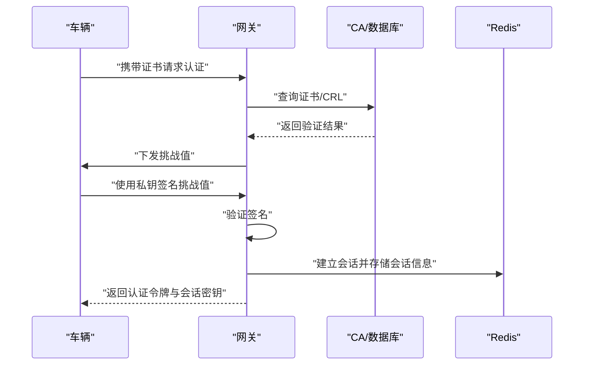
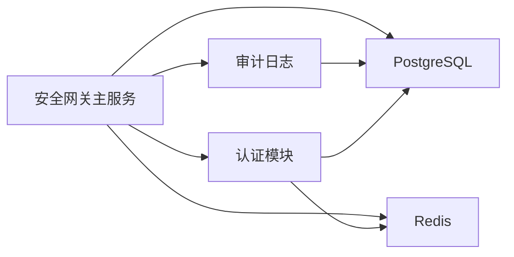

# 故障排除指南

<cite>
**本文引用的文件**
- [故障排查指南](file://docs/TROUBLESHOOTING.md)
- [问题诊断报告](file://diagnose_issues.md)
- [深度诊断审计日志API问题](file://deep_diagnose.sh)
- [运维手册](file://docs/OPERATIONS.md)
- [部署指南](file://docs/DEPLOYMENT.md)
- [安全网关主服务类](file://src/security_gateway.py)
- [审计日志记录功能](file://src/audit_logger.py)
- [PostgreSQL 数据库连接](file://src/db/postgres.py)
- [Redis 客户端连接](file://src/db/redis_client.py)
- [身份认证模块](file://src/authentication.py)
- [快速测试脚本](file://scripts/test_gateway.sh)
- [重启网关脚本](file://restart_gateway.sh)
- [数据库初始化脚本](file://scripts/init_database.sh)
</cite>

## 目录
1. [简介](#简介)
2. [项目结构](#项目结构)
3. [核心组件](#核心组件)
4. [架构总览](#架构总览)
5. [详细组件分析](#详细组件分析)
6. [依赖分析](#依赖分析)
7. [性能考虑](#性能考虑)
8. [故障排除指南](#故障排除指南)
9. [结论](#结论)
10. [附录](#附录)

## 简介
本指南面向车联网安全通信网关的运维与开发团队，提供系统化的故障诊断与排错流程，覆盖网络连接、数据库连接、证书验证、会话与重放攻击防护、API 服务可用性、性能与资源耗尽、日志分析与审计、以及应急响应与快速恢复操作。文档基于仓库中的故障排查、运维手册、部署指南与核心源码进行整理，确保读者能够快速定位问题并采取标准化处置措施。

## 项目结构
系统采用分层架构，包含：
- API 层：FastAPI 应用与路由
- 业务层：安全网关主服务、认证、会话、消息加解密、证书管理、策略管理
- 数据访问层：PostgreSQL 与 Redis 连接封装
- 审计与监控：审计日志记录、指标导出、健康检查
- 运维与部署：Kubernetes 部署清单、初始化脚本、运维手册

**图表来源**
- [安全网关主服务类:37-128](file://src/security_gateway.py#L37-L128)
- [PostgreSQL 数据库连接:9-53](file://src/db/postgres.py#L9-L53)
- [Redis 客户端连接:8-79](file://src/db/redis_client.py#L8-L79)

**章节来源**
- [部署指南:1-295](file://docs/DEPLOYMENT.md#L1-L295)

## 核心组件
- 安全网关主服务：负责证书颁发/验证/撤销、双向认证、会话建立与清理、安全消息收发与审计日志记录。
- 审计日志：统一记录认证、数据传输、证书操作事件，支持查询与导出。
- 数据库连接：PostgreSQL 连接管理器，提供查询与更新能力。
- Redis 连接：会话与缓存存储，支持键扫描与过期管理。
- 认证模块：实现挑战-响应、SM2/SM4 算法、会话冲突处理与过期清理。

**章节来源**
- [安全网关主服务类:37-128](file://src/security_gateway.py#L37-L128)
- [审计日志记录功能:26-242](file://src/audit_logger.py#L26-L242)
- [PostgreSQL 数据库连接:9-53](file://src/db/postgres.py#L9-L53)
- [Redis 客户端连接:8-79](file://src/db/redis_client.py#L8-L79)
- [身份认证模块:90-364](file://src/authentication.py#L90-L364)

## 架构总览
下图展示从车辆到网关的关键交互路径，以及审计日志与数据库/缓存的关系。

**图表来源**
- [安全网关主服务类:289-438](file://src/security_gateway.py#L289-L438)
- [身份认证模块:196-364](file://src/authentication.py#L196-L364)
- [审计日志记录功能:58-135](file://src/audit_logger.py#L58-L135)
- [PostgreSQL 数据库连接:32-45](file://src/db/postgres.py#L32-L45)
- [Redis 客户端连接:31-49](file://src/db/redis_client.py#L31-L49)

## 详细组件分析

### 组件A：安全网关主服务
- 职责：证书生命周期管理、双向认证、会话建立与清理、安全消息收发、审计日志记录。
- 关键流程：车辆接入 → 证书验证 → 双向认证 → 会话建立 → 安全消息收发 → 审计记录。
- 错误处理：针对签名验证失败、重放攻击、会话过期、解密失败等场景记录审计事件并抛出明确错误。

**图表来源**
- [安全网关主服务类:384-438](file://src/security_gateway.py#L384-L438)
- [审计日志记录功能:90-135](file://src/audit_logger.py#L90-L135)

**章节来源**
- [安全网关主服务类:289-438](file://src/security_gateway.py#L289-L438)

### 组件B：审计日志记录器
- 功能：生成唯一日志 ID、截断详细信息、持久化到 PostgreSQL、查询与导出。
- 关键点：查询时对无效事件类型的容错处理；支持按时间、事件类型、结果过滤。

**图表来源**
- [审计日志记录功能:26-242](file://src/audit_logger.py#L26-L242)
- [PostgreSQL 数据库连接:9-53](file://src/db/postgres.py#L9-L53)

**章节来源**
- [审计日志记录功能:243-466](file://src/audit_logger.py#L243-L466)

### 组件C：数据库与缓存连接
- PostgreSQL：提供查询与更新接口，支持连接复用与游标工厂。
- Redis：提供键值操作、扫描、过期管理，用于会话与缓存。

**图表来源**
- [PostgreSQL 数据库连接:9-53](file://src/db/postgres.py#L9-L53)
- [Redis 客户端连接:8-79](file://src/db/redis_client.py#L8-L79)

**章节来源**
- [PostgreSQL 数据库连接:16-45](file://src/db/postgres.py#L16-L45)
- [Redis 客户端连接:15-71](file://src/db/redis_client.py#L15-L71)

### 组件D：认证与会话管理
- 双向认证：挑战-响应、SM2 签名验证、网关签发认证令牌。
- 会话管理：会话建立、冲突处理、过期清理、安全密钥存储。

**图表来源**
- [身份认证模块:196-364](file://src/authentication.py#L196-L364)
- [Redis 客户端连接:447-480](file://src/db/redis_client.py#L447-L480)

**章节来源**
- [身份认证模块:366-481](file://src/authentication.py#L366-L481)

## 依赖分析
- 安全网关主服务依赖认证模块、消息模块、数据库与缓存连接、审计日志。
- 审计日志依赖数据库连接。
- 认证模块依赖数据库与缓存连接、证书管理与加密模块。
- 运维脚本依赖容器编排与数据库初始化脚本。

**图表来源**
- [安全网关主服务类:8-34](file://src/security_gateway.py#L8-L34)
- [审计日志记录功能:22-23](file://src/audit_logger.py#L22-L23)
- [身份认证模块:16-21](file://src/authentication.py#L16-L21)

**章节来源**
- [安全网关主服务类:1-128](file://src/security_gateway.py#L1-L128)
- [审计日志记录功能:1-480](file://src/audit_logger.py#L1-L480)
- [身份认证模块:1-662](file://src/authentication.py#L1-L662)

## 性能考虑
- 数据库性能：关注活跃连接数、慢查询、表大小；定期执行维护与索引优化。
- Redis 性能：监控内存使用、慢查询日志、命令监控；合理设置 maxmemory 与驱逐策略。
- 应用性能：启用证书验证缓存、连接池、工作进程数与压缩；必要时水平扩展。
- 资源监控：容器资源使用、系统负载、网络延迟。

**章节来源**
- [运维手册:183-237](file://docs/OPERATIONS.md#L183-L237)
- [部署指南:272-291](file://docs/DEPLOYMENT.md#L272-L291)

## 故障排除指南

### 一、标准化健康检查与问题定位流程
- 健康检查：访问 /health 确认服务可用。
- 服务状态：查看容器/Pod 状态与日志。
- 端口监听：确认服务端口已监听。
- 资源限制：检查容器资源配额与使用情况。

**章节来源**
- [运维手册:47-58](file://docs/OPERATIONS.md#L47-L58)
- [快速测试脚本:26-44](file://scripts/test_gateway.sh#L26-L44)

### 二、网络连接与服务可用性
- API 无响应：检查服务状态、进程状态、端口监听、错误日志、资源限制。
- 健康检查失败：核对配置、依赖服务状态、日志输出。

**章节来源**
- [故障排查指南:334-364](file://docs/TROUBLESHOOTING.md#L334-L364)
- [运维手册:47-58](file://docs/OPERATIONS.md#L47-L58)

### 三、数据库连接问题
- 症状：连接错误提示。
- 排查：检查服务状态、端口开放、连接测试、环境变量、日志。
- 解决：确保服务运行、配置正确、防火墙放行、用户权限正确。

**章节来源**
- [故障排查指南:5-46](file://docs/TROUBLESHOOTING.md#L5-L46)
- [数据库初始化脚本:19-44](file://scripts/init_database.sh#L19-L44)

### 四、Redis 连接问题
- 症状：连接错误。
- 排查：检查服务状态、连接测试、日志、密码配置。
- 解决：启动服务、校验密码、检查配置。

**章节来源**
- [故障排查指南:47-83](file://docs/TROUBLESHOOTING.md#L47-L83)

### 五、认证与证书相关问题
- 认证失败：检查证书有效性、撤销状态、签名验证、CA 密钥。
- 签名验证失败：检查数据完整性、公钥匹配、算法一致性。
- 重放攻击检测：检查 Nonce 追踪、系统时间同步、时间戳容差。
- 会话过期：检查会话配置、Redis 内存与持久化、清理日志。

**章节来源**
- [故障排查指南:84-236](file://docs/TROUBLESHOOTING.md#L84-L236)
- [安全网关主服务类:628-720](file://src/security_gateway.py#L628-L720)
- [身份认证模块:554-596](file://src/authentication.py#L554-L596)

### 六、审计日志问题
- 症状：Web 端审计日志查询为空或异常。
- 排查：检查数据库中事件类型、最近日志详情、直接查询与 API 响应、无效事件类型。
- 解决：在关键操作添加审计日志记录；修复无效事件类型；重启应用以应用修复。

**章节来源**
- [问题诊断报告:57-122](file://diagnose_issues.md#L57-L122)
- [深度诊断审计日志API问题:10-124](file://deep_diagnose.sh#L10-L124)
- [重启网关脚本:1-13](file://restart_gateway.sh#L1-L13)

### 七、API 服务无响应
- 排查：服务状态、进程状态、端口监听、错误日志、资源限制。
- 解决：重启服务、增加资源限制、检查死锁或阻塞、启用请求超时。

**章节来源**
- [故障排查指南:334-364](file://docs/TROUBLESHOOTING.md#L334-L364)

### 八、性能下降与资源耗尽
- 排查：系统资源、数据库活跃连接、Redis 延迟、应用日志、网络延迟。
- 解决：扩容、优化查询、启用缓存、清理过期数据。

**章节来源**
- [故障排查指南:238-276](file://docs/TROUBLESHOOTING.md#L238-L276)
- [运维手册:183-237](file://docs/OPERATIONS.md#L183-L237)

### 九、内存泄漏与资源占用
- 排查：监控容器内存、Python 进程、Redis 内存、会话数量。
- 解决：检查会话清理、Redis maxmemory 策略、数据库连接、重启释放内存。

**章节来源**
- [故障排查指南:277-304](file://docs/TROUBLESHOOTING.md#L277-L304)

### 十、证书缓存问题
- 症状：撤销证书仍被接受、证书更新未生效。
- 排查：缓存 TTL、清空缓存、查看缓存命中率。
- 解决：手动清空缓存、调整 TTL、实现缓存失效通知。

**章节来源**
- [故障排查指南:306-333](file://docs/TROUBLESHOOTING.md#L306-L333)

### 十一、应急响应与快速恢复
- 快速恢复：重启服务、回滚版本、恢复备份、通知车辆重新认证。
- 常用命令：Rollout 重启、回滚历史查看、备份与恢复脚本。

**章节来源**
- [运维手册:326-355](file://docs/OPERATIONS.md#L326-L355)
- [重启网关脚本:1-13](file://restart_gateway.sh#L1-L13)

### 十二、日志分析与错误排查技巧
- 关键字：INVALID_CERTIFICATE、SIGNATURE_VERIFICATION_FAILED、SESSION_EXPIRED、REPLAY_ATTACK_DETECTED、DECRYPTION_FAILED、CA_SERVICE_UNAVAILABLE。
- 聚合统计：按错误类型统计、认证失败趋势分析。
- 审计日志：查询与导出，支持 JSON/CSV。

**章节来源**
- [故障排查指南:365-390](file://docs/TROUBLESHOOTING.md#L365-L390)
- [审计日志记录功能:337-465](file://src/audit_logger.py#L337-L465)

### 十三、问题分类与优先级处理
- 高优先级：启用数据传输加密（安全核心）。
- 中优先级：修复审计日志功能（合规）。
- 低优先级：完善安全配置持久化（运维）。

**章节来源**
- [问题诊断报告:221-226](file://diagnose_issues.md#L221-L226)

## 结论
本指南提供了从架构到组件、从日常运维到应急响应的完整故障排除路径。建议在日常巡检中结合健康检查、性能监控与日志聚合，提前发现并处理潜在问题；在发生故障时，按照标准化流程快速定位根因并实施修复，确保系统稳定与安全。

## 附录
- 常用运维命令与脚本参考：
  - 健康检查与测试：[快速测试脚本:26-115](file://scripts/test_gateway.sh#L26-L115)
  - 重启服务：[重启网关脚本:1-13](file://restart_gateway.sh#L1-L13)
  - 数据库初始化：[数据库初始化脚本:19-44](file://scripts/init_database.sh#L19-L44)
  - 审计日志诊断：[深度诊断审计日志API问题:10-124](file://deep_diagnose.sh#L10-L124)
- 运维与部署参考：
  - [运维手册:1-392](file://docs/OPERATIONS.md#L1-L392)
  - [部署指南:1-295](file://docs/DEPLOYMENT.md#L1-L295)