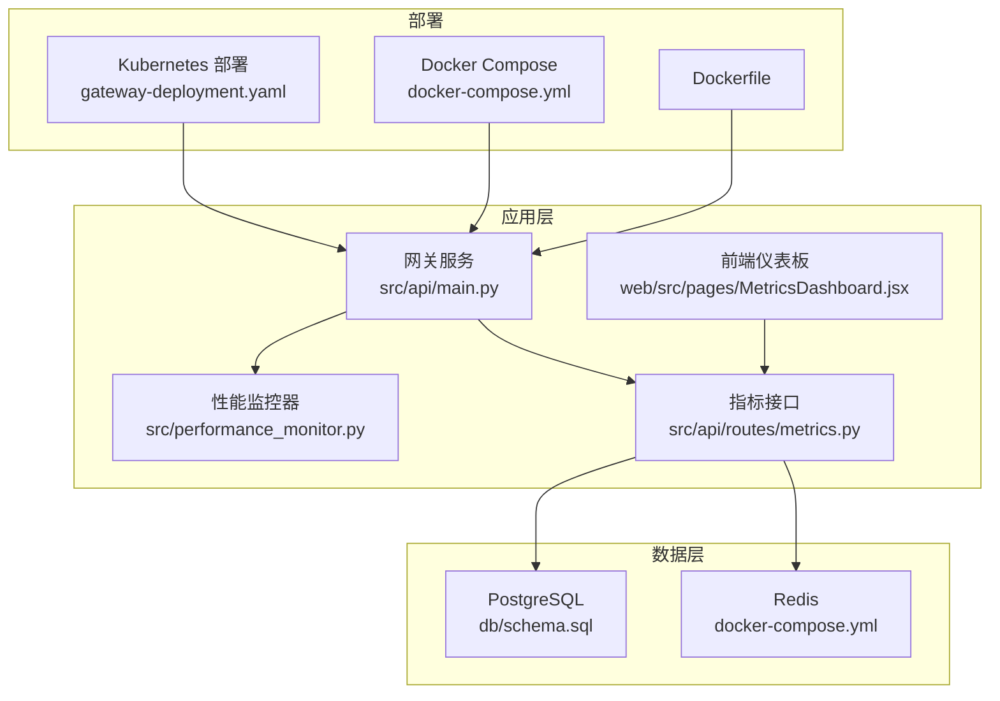
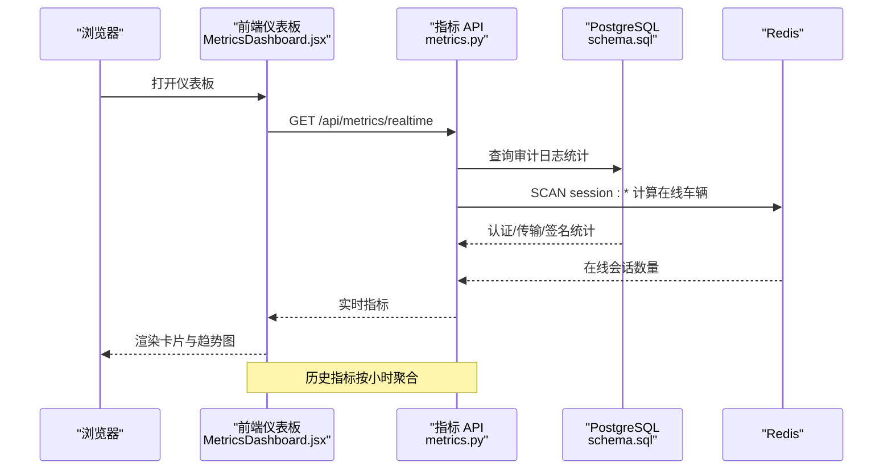
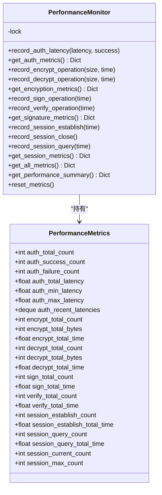
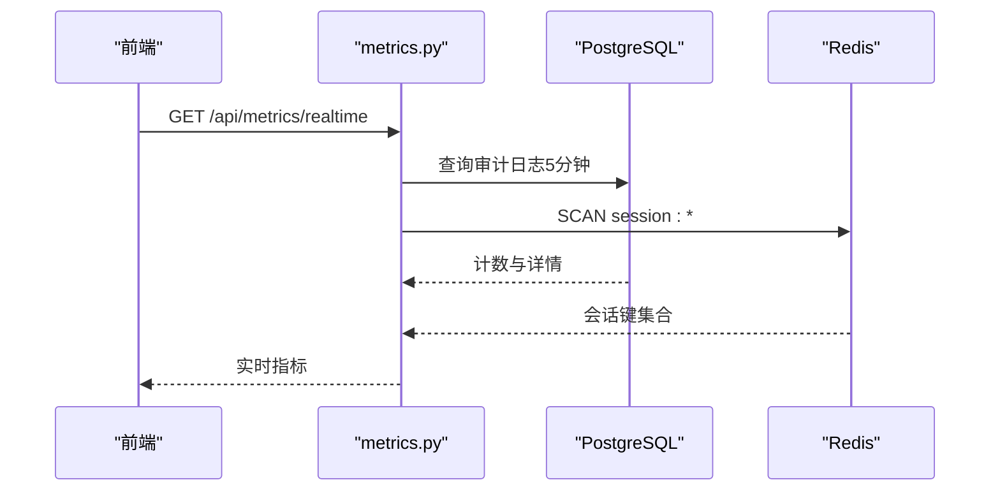
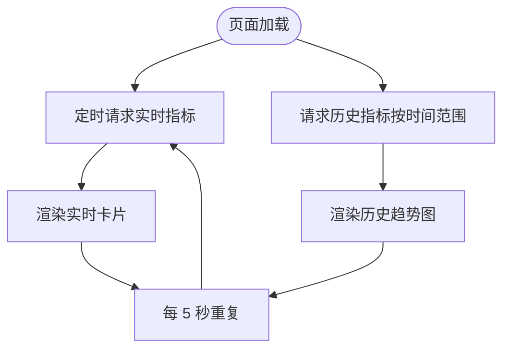
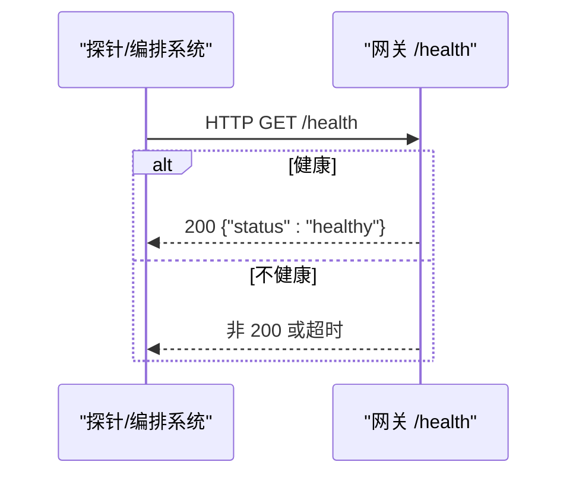
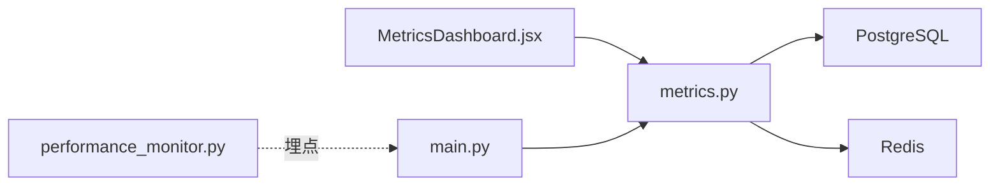

# 监控与告警

<cite>
**本文引用的文件**
- [performance_monitor.py](file://src/performance_monitor.py)
- [metrics.py](file://src/api/routes/metrics.py)
- [MetricsDashboard.jsx](file://web/src/pages/MetricsDashboard.jsx)
- [metrics.js](file://web/src/api/metrics.js)
- [audit_logger.py](file://src/audit_logger.py)
- [audit.py](file://src/models/audit.py)
- [schema.sql](file://db/schema.sql)
- [main.py](file://src/api/main.py)
- [gateway-deployment.yaml](file://deployment/kubernetes/gateway-deployment.yaml)
- [docker-compose.yml](file://docker-compose.yml)
- [Dockerfile](file://Dockerfile)
- [performance_monitoring_demo.py](file://examples/performance_monitoring_demo.py)
</cite>

## 目录
1. [简介](#简介)
2. [项目结构](#项目结构)
3. [核心组件](#核心组件)
4. [架构总览](#架构总览)
5. [详细组件分析](#详细组件分析)
6. [依赖分析](#依赖分析)
7. [性能考量](#性能考量)
8. [故障排查指南](#故障排查指南)
9. [结论](#结论)
10. [附录](#附录)

## 简介
本指南面向车联网安全通信网关的运维与开发团队，系统阐述监控与告警体系的设计与落地，覆盖性能指标采集、监控数据展示、日志聚合与分析、系统健康检查与故障自愈、以及监控数据的存储与保留策略。文档结合仓库现有实现，给出可操作的配置建议与最佳实践。

## 项目结构
围绕监控与告警的关键目录与文件如下：
- 性能监控核心：src/performance_monitor.py
- 指标 API：src/api/routes/metrics.py
- 前端仪表板：web/src/pages/MetricsDashboard.jsx 及 web/src/api/metrics.js
- 审计日志与数据库：src/audit_logger.py、src/models/audit.py、db/schema.sql
- API 入口与健康检查：src/api/main.py
- 部署与容器化：deployment/kubernetes/gateway-deployment.yaml、docker-compose.yml、Dockerfile
- 示例：examples/performance_monitoring_demo.py



**图表来源**
- [main.py:87-90](file://src/api/main.py#L87-L90)
- [performance_monitor.py:54-66](file://src/performance_monitor.py#L54-L66)
- [metrics.py:39-148](file://src/api/routes/metrics.py#L39-L148)
- [MetricsDashboard.jsx:12-58](file://web/src/pages/MetricsDashboard.jsx#L12-L58)
- [gateway-deployment.yaml:97-108](file://deployment/kubernetes/gateway-deployment.yaml#L97-L108)
- [docker-compose.yml:79-83](file://docker-compose.yml#L79-L83)
- [Dockerfile:29-31](file://Dockerfile#L29-L31)

**章节来源**
- [main.py:87-90](file://src/api/main.py#L87-L90)
- [performance_monitor.py:54-66](file://src/performance_monitor.py#L54-L66)
- [metrics.py:39-148](file://src/api/routes/metrics.py#L39-L148)
- [MetricsDashboard.jsx:12-58](file://web/src/pages/MetricsDashboard.jsx#L12-L58)
- [gateway-deployment.yaml:97-108](file://deployment/kubernetes/gateway-deployment.yaml#L97-L108)
- [docker-compose.yml:79-83](file://docker-compose.yml#L79-L83)
- [Dockerfile:29-31](file://Dockerfile#L29-L31)

## 核心组件
- 性能监控器：提供认证、加密/解密、签名/验签、会话管理的指标采集与汇总，并内置阈值判定。
- 指标 API：提供实时与历史安全指标查询，聚合审计日志与 Redis 会话键统计。
- 前端仪表板：定时拉取指标并以折线图展示趋势，支持时间范围切换。
- 审计日志：统一记录认证、数据传输、证书等事件，支撑安全分析与合规审计。
- 健康检查与部署：容器内健康检查、K8s 就绪/存活探针、Compose 健康检查，保障故障自愈。

**章节来源**
- [performance_monitor.py:54-66](file://src/performance_monitor.py#L54-L66)
- [metrics.py:39-148](file://src/api/routes/metrics.py#L39-L148)
- [MetricsDashboard.jsx:12-58](file://web/src/pages/MetricsDashboard.jsx#L12-L58)
- [audit_logger.py:26-36](file://src/audit_logger.py#L26-L36)
- [schema.sql:36-54](file://db/schema.sql#L36-L54)

## 架构总览
下图展示监控与告警在系统中的位置与交互：



**图表来源**
- [MetricsDashboard.jsx:12-58](file://web/src/pages/MetricsDashboard.jsx#L12-L58)
- [metrics.py:39-148](file://src/api/routes/metrics.py#L39-L148)
- [schema.sql:36-54](file://db/schema.sql#L36-L54)

## 详细组件分析

### 性能监控器（PerformanceMonitor）
- 功能要点
  - 线程安全的指标累加与滑动窗口统计
  - 认证延迟、TPS、会话建立/查询延迟、并发会话数
  - 加密/解密吞吐量、1KB 平均耗时；签名/验签每秒操作数
  - 自带阈值判定，输出“是否满足全部要求”的摘要
- 关键阈值（来自实现）
  - 认证平均延迟 < 500ms
  - 认证 TPS ≥ 100
  - 加密/解密吞吐量 ≥ 100 MB/s
  - 1KB 平均加密时间 < 10ms
  - 签名次数/秒 ≥ 1000
  - 验签次数/秒 ≥ 2000
  - 最大并发会话数 ≥ 10000
  - 会话查询延迟 < 5ms
  - 会话建立延迟 < 100ms
- 使用方式
  - 装饰器/上下文管理器自动埋点
  - 提供 get_all_metrics 与 get_performance_summary 输出完整报告



**图表来源**
- [performance_monitor.py:14-52](file://src/performance_monitor.py#L14-L52)
- [performance_monitor.py:54-421](file://src/performance_monitor.py#L54-L421)

**章节来源**
- [performance_monitor.py:54-421](file://src/performance_monitor.py#L54-L421)

### 指标 API（/api/metrics）
- 实时指标
  - 在线车辆数：通过 Redis 键扫描 session:* 计算
  - 认证成功率：近 5 分钟审计日志中成功/失败计数
  - 认证失败次数、数据传输量（简化实现按条目估算）、签名失败次数、安全异常次数
- 历史指标
  - 按小时聚合，返回时间段内的认证成功率等
- 认证与鉴权
  - 依赖 HTTP Bearer 令牌校验，令牌来自环境变量



**图表来源**
- [metrics.py:39-148](file://src/api/routes/metrics.py#L39-L148)
- [main.py:49-74](file://src/api/main.py#L49-L74)

**章节来源**
- [metrics.py:39-148](file://src/api/routes/metrics.py#L39-L148)
- [main.py:49-74](file://src/api/main.py#L49-L74)

### 前端仪表板（MetricsDashboard.jsx）
- 功能
  - 实时卡片：在线车辆、认证成功率、认证失败次数、数据传输量、签名失败次数、安全异常次数
  - 历史趋势：认证成功率、认证失败、安全异常折线图
  - 自动轮询：每 5 秒刷新实时指标
  - 时间范围：1h/6h/24h/7d 切换
- 数据来源
  - web/src/api/metrics.js 调用 /api/metrics/realtime 与 /api/metrics/history



**图表来源**
- [MetricsDashboard.jsx:12-58](file://web/src/pages/MetricsDashboard.jsx#L12-L58)
- [metrics.js:3-16](file://web/src/api/metrics.js#L3-L16)

**章节来源**
- [MetricsDashboard.jsx:12-58](file://web/src/pages/MetricsDashboard.jsx#L12-L58)
- [metrics.js:3-16](file://web/src/api/metrics.js#L3-L16)

### 审计日志与数据库
- 审计日志模型与持久化
  - 审计日志表包含 log_id、timestamp、event_type、vehicle_id、operation_result、details、ip_address
  - details 长度限制 1024 字符
  - 提供查询与导出（JSON/CSV）
- 数据库架构
  - 审计日志表与索引
  - 证书与 CRL 视图
  - 安全策略配置表与认证失败记录表

```mermaid
erDiagram
AUDIT_LOGS {
int id PK
varchar log_id UK
timestamp timestamp
varchar event_type
varchar vehicle_id
boolean operation_result
text details CK
varchar ip_address
timestamp created_at
}
CERTIFICATES {
int id PK
varchar serial_number UK
int version
text issuer
text subject
timestamp valid_from
timestamp valid_to
bytea public_key
bytea signature
varchar signature_algorithm
jsonb extensions
timestamp created_at
}
CERTIFICATE_REVOCATION_LIST {
int id PK
varchar serial_number FK
timestamp revoked_at
text reason
}
VALID_CERTIFICATES_VIEW {
note "由 CERTIFICATES LEFT JOIN CRL 生成的有效证书视图"
}
AUDIT_LOGS ||--o{ VALID_CERTIFICATES_VIEW : "不直接关联"
CERTIFICATES ||--o{ CERTIFICATE_REVOCATION_LIST : "一对多"
```

**图表来源**
- [audit.py:9-26](file://src/models/audit.py#L9-L26)
- [audit_logger.py:58-89](file://src/audit_logger.py#L58-L89)
- [schema.sql:36-62](file://db/schema.sql#L36-L62)

**章节来源**
- [audit_logger.py:26-36](file://src/audit_logger.py#L26-L36)
- [audit.py:9-26](file://src/models/audit.py#L9-L26)
- [schema.sql:36-62](file://db/schema.sql#L36-L62)

### 健康检查与故障自愈
- 容器内健康检查
  - Dockerfile 中 HEALTHCHECK 调用 /health
  - main.py 提供 /health 健康端点
- Kubernetes 探针
  - livenessProbe/readinessProbe 指向 /health
  - 3 副本 Deployment，具备滚动更新与自愈能力
- Docker Compose 健康检查
  - postgres/redis/gateway 健康检查配置，确保依赖可用后再启动应用



**图表来源**
- [Dockerfile:29-31](file://Dockerfile#L29-L31)
- [main.py:87-90](file://src/api/main.py#L87-L90)
- [gateway-deployment.yaml:97-108](file://deployment/kubernetes/gateway-deployment.yaml#L97-L108)
- [docker-compose.yml:79-83](file://docker-compose.yml#L79-L83)

**章节来源**
- [Dockerfile:29-31](file://Dockerfile#L29-L31)
- [main.py:87-90](file://src/api/main.py#L87-L90)
- [gateway-deployment.yaml:97-108](file://deployment/kubernetes/gateway-deployment.yaml#L97-L108)
- [docker-compose.yml:79-83](file://docker-compose.yml#L79-L83)

## 依赖分析
- 组件耦合
  - 指标 API 依赖 PostgreSQL 与 Redis 进行统计
  - 前端通过 metrics.js 调用指标 API
  - 性能监控器独立于 API，可通过装饰器/上下文管理器被业务逻辑埋点
- 外部依赖
  - PostgreSQL：审计日志存储
  - Redis：会话键空间用于在线车辆统计
  - FastAPI：指标 API 与健康检查
  - Recharts：前端趋势图展示



**图表来源**
- [metrics.py:12-16](file://src/api/routes/metrics.py#L12-L16)
- [MetricsDashboard.jsx:1-10](file://web/src/pages/MetricsDashboard.jsx#L1-L10)
- [main.py:94-102](file://src/api/main.py#L94-L102)
- [performance_monitor.py:448-613](file://src/performance_monitor.py#L448-L613)

**章节来源**
- [metrics.py:12-16](file://src/api/routes/metrics.py#L12-L16)
- [MetricsDashboard.jsx:1-10](file://web/src/pages/MetricsDashboard.jsx#L1-L10)
- [main.py:94-102](file://src/api/main.py#L94-L102)
- [performance_monitor.py:448-613](file://src/performance_monitor.py#L448-L613)

## 性能考量
- 指标计算复杂度
  - 认证/会话：滑动窗口与累计计数，O(1) 更新，查询 O(1)
  - 加密/解密/签名/验签：累计字节与时长，O(1) 更新，查询 O(1)
  - Redis SCAN：线性扫描，建议控制键数量或使用前缀隔离
- 存储与索引
  - 审计日志表已建立多列索引，适合按时间、事件类型、车辆 ID 查询
  - 建议为高频查询字段（如 event_type、timestamp）保持索引
- 前端轮询
  - 每 5 秒一次实时指标请求，建议根据集群规模调整频率，避免抖动

**章节来源**
- [performance_monitor.py:54-421](file://src/performance_monitor.py#L54-L421)
- [metrics.py:55-148](file://src/api/routes/metrics.py#L55-L148)
- [schema.sql:49-54](file://db/schema.sql#L49-L54)

## 故障排查指南
- 指标为空或为 0
  - 检查 PostgreSQL 连接与审计日志写入是否正常
  - 检查 Redis 连接与 session:* 键是否存在
- 认证成功率异常
  - 查看审计日志中 AUTHENTICATION_SUCCESS/AUTHENTICATION_FAILURE 的比例
  - 关注 SIGNATURE_FAILED 与认证失败的关联
- 前端无法加载
  - 确认 /api/metrics/* 路由可达且返回 200
  - 检查 /health 是否健康
- 健康检查失败
  - 查看容器日志与探针返回码
  - 检查数据库/缓存连通性

**章节来源**
- [metrics.py:144-148](file://src/api/routes/metrics.py#L144-L148)
- [main.py:87-90](file://src/api/main.py#L87-L90)
- [audit_logger.py:82-88](file://src/audit_logger.py#L82-L88)

## 结论
本项目已具备完善的监控与告警基础：性能监控器提供细粒度指标与阈值判断，指标 API 聚合审计与缓存数据形成可视化仪表板，健康检查与容器化部署保障了系统自愈能力。建议在此基础上补充 Prometheus 指标导出、Grafana 仪表板、日志聚合与告警规则，形成闭环的可观测性体系。

## 附录

### 关键性能指标与阈值（来自实现）
- 认证
  - 平均延迟 < 500ms
  - TPS ≥ 100
- 加密/解密
  - 吞吐量 ≥ 100 MB/s
  - 1KB 平均加密时间 < 10ms
- 签名/验签
  - 签名次数/秒 ≥ 1000
  - 验签次数/秒 ≥ 2000
- 会话
  - 最大并发会话数 ≥ 10000
  - 查询延迟 < 5ms
  - 建立延迟 < 100ms

**章节来源**
- [performance_monitor.py:121-135](file://src/performance_monitor.py#L121-L135)
- [performance_monitor.py:188-208](file://src/performance_monitor.py#L188-L208)
- [performance_monitor.py:254-267](file://src/performance_monitor.py#L254-L267)
- [performance_monitor.py:329-347](file://src/performance_monitor.py#L329-L347)

### 监控数据展示（前端）
- 实时卡片：在线车辆、认证成功率、认证失败次数、数据传输量、签名失败次数、安全异常次数
- 历史趋势：按小时聚合的认证成功率、认证失败、安全异常
- 时间范围：1h/6h/24h/7d

**章节来源**
- [MetricsDashboard.jsx:75-156](file://web/src/pages/MetricsDashboard.jsx#L75-L156)
- [metrics.js:3-16](file://web/src/api/metrics.js#L3-L16)

### 日志聚合与分析建议
- 结构化日志
  - 将审计日志 details 字段标准化，便于后续检索与分析
- 日志采集
  - 使用集中式日志系统（如 ELK/EFK）采集容器 stdout/stderr
- 报表与告警
  - 基于审计日志构建认证失败、签名失败、证书变更等告警规则
  - 与指标面板联动，定位异常时段与事件

**章节来源**
- [audit_logger.py:45-56](file://src/audit_logger.py#L45-L56)
- [audit.py:27-31](file://src/models/audit.py#L27-L31)

### 系统健康检查与故障自愈
- 健康端点：/health
- 探针：K8s livenessProbe/readinessProbe 与 Docker Compose/容器 HEALTHCHECK
- 自愈：副本数与滚动更新策略，健康检查失败自动重启

**章节来源**
- [main.py:87-90](file://src/api/main.py#L87-L90)
- [gateway-deployment.yaml:97-108](file://deployment/kubernetes/gateway-deployment.yaml#L97-L108)
- [docker-compose.yml:79-83](file://docker-compose.yml#L79-L83)
- [Dockerfile:29-31](file://Dockerfile#L29-L31)

### 监控数据的存储与保留策略
- 审计日志
  - 建议按月/季度归档，保留期依据法规与审计要求设定
  - 对高频查询字段建立索引，定期维护与重建
- 指标与时序数据
  - 若引入时序数据库（如 InfluxDB/Prometheus），建议短期热数据（15-30 天）+长期冷数据分层存储
- 日志保留
  - 容器日志与应用日志按容量与时间策略轮转清理

**章节来源**
- [schema.sql:49-54](file://db/schema.sql#L49-L54)

### 运维最佳实践
- 指标埋点
  - 使用装饰器/上下文管理器统一埋点，避免散落的计时代码
- 阈值治理
  - 将阈值固化为配置项，支持动态调整与灰度发布
- 告警分级
  - 业务级（认证失败率）、平台级（CPU/内存/磁盘）、基础设施级（数据库/缓存）
- 可观测性闭环
  - 指标 → 日志 → 链路追踪（可选）→ 告警 → 回溯 → 优化

**章节来源**
- [performance_monitoring_demo.py:29-255](file://examples/performance_monitoring_demo.py#L29-L255)