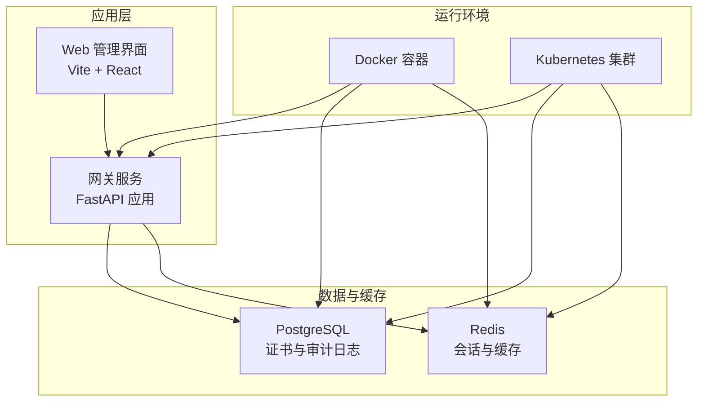
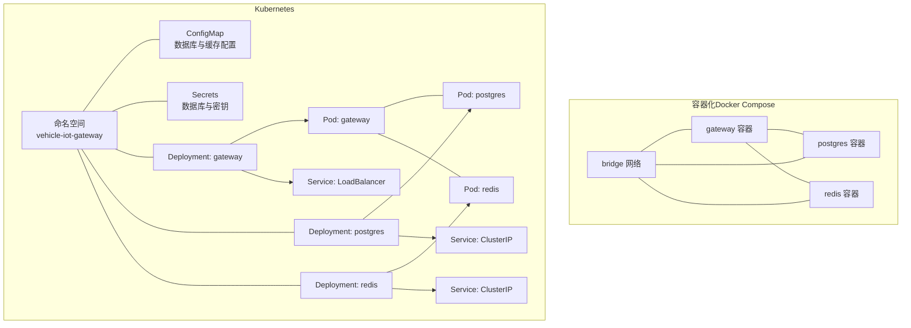
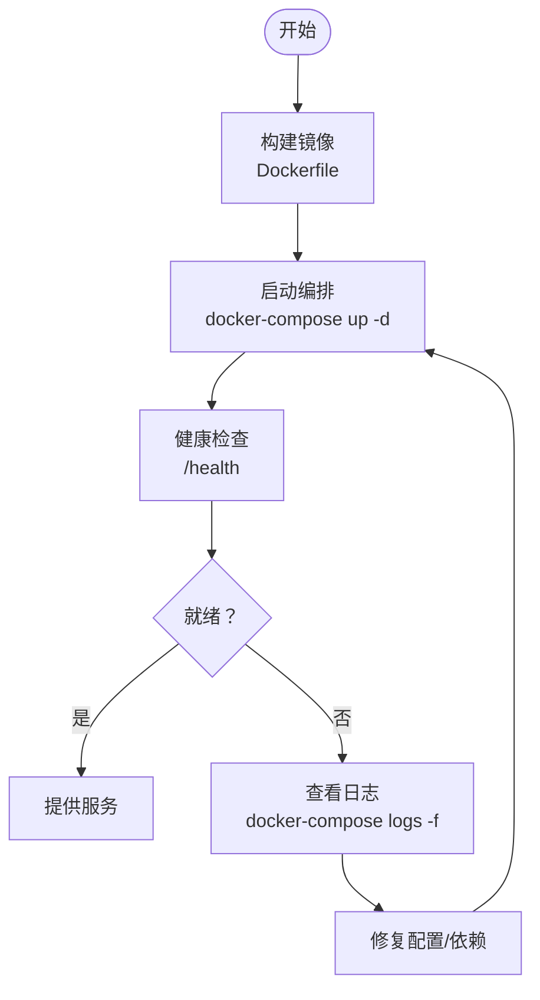
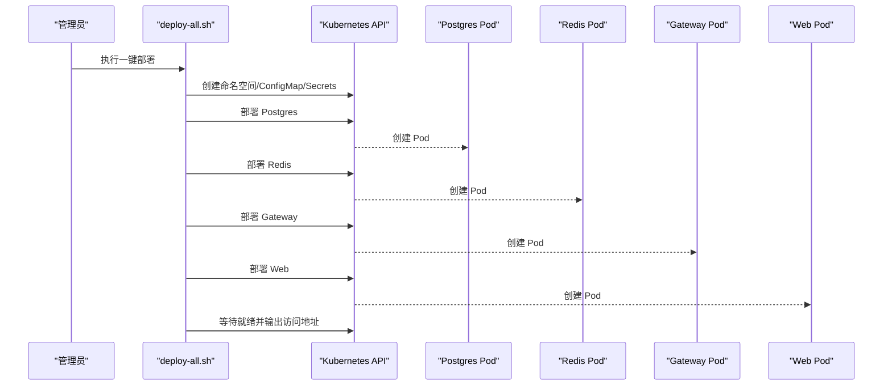
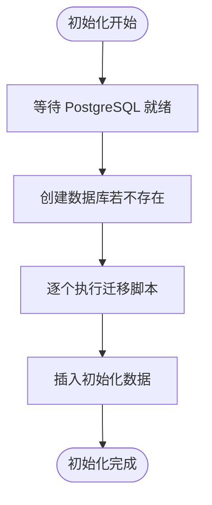
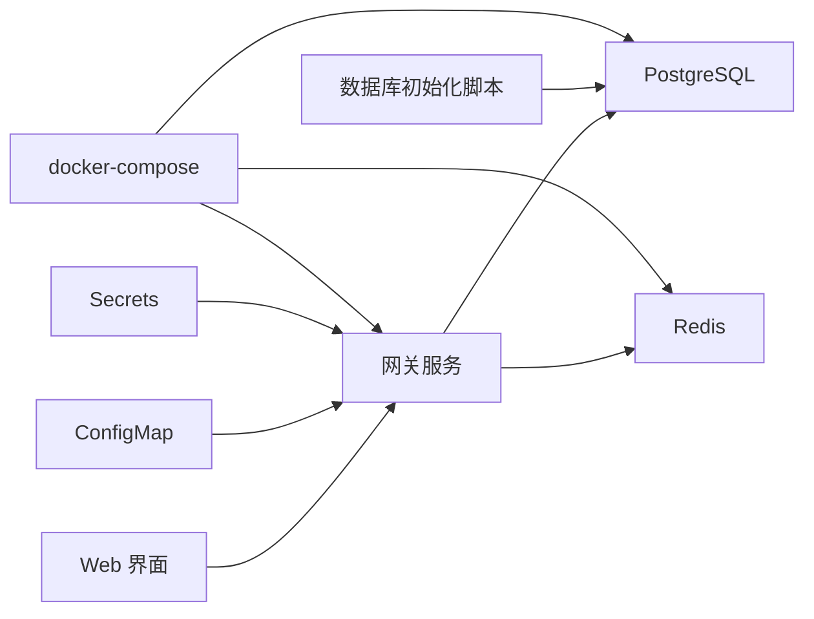

# 部署与运维

<cite>
**本文引用的文件**
- [README.md](file://README.md)
- [DEPLOYMENT.md](file://docs/DEPLOYMENT.md)
- [OPERATIONS.md](file://docs/OPERATIONS.md)
- [docker-compose.yml](file://docker-compose.yml)
- [Dockerfile](file://Dockerfile)
- [namespace.yaml](file://deployment/kubernetes/namespace.yaml)
- [configmap.yaml](file://deployment/kubernetes/configmap.yaml)
- [secrets.yaml](file://deployment/kubernetes/secrets.yaml)
- [gateway-deployment.yaml](file://deployment/kubernetes/gateway-deployment.yaml)
- [deploy-all.sh](file://deployment/kubenetes/deploy-all.sh)
- [init_database.sh](file://scripts/init_database.sh)
</cite>

## 目录
1. [简介](#简介)
2. [项目结构](#项目结构)
3. [核心组件](#核心组件)
4. [架构总览](#架构总览)
5. [详细组件分析](#详细组件分析)
6. [依赖关系分析](#依赖关系分析)
7. [性能考虑](#性能考虑)
8. [故障排除指南](#故障排除指南)
9. [结论](#结论)
10. [附录](#附录)

## 简介
本指南面向DevOps工程师与系统管理员，提供车联网安全通信网关的完整部署与运维方案，覆盖Docker容器化部署、Kubernetes集群部署、CI/CD自动化、监控与日志、备份与灾难恢复、性能调优与容量规划，以及故障排除与应急响应流程。

## 项目结构
项目采用多模块组织，核心包括：
- 应用服务：基于FastAPI的网关API，负责证书管理、身份认证、加密签名与审计日志。
- 数据存储：PostgreSQL（证书与审计日志）、Redis（会话与缓存）。
- 部署工具：Docker镜像构建、docker-compose编排、Kubernetes清单与一键部署脚本。
- 运维文档：部署、操作、故障排除等运维手册。

图表来源
- [docker-compose.yml:1-95](file://docker-compose.yml#L1-L95)
- [Dockerfile:1-35](file://Dockerfile#L1-L35)
- [gateway-deployment.yaml:1-132](file://deployment/kubernetes/gateway-deployment.yaml#L1-L132)

章节来源
- [README.md:1-148](file://README.md#L1-L148)
- [DEPLOYMENT.md:1-295](file://docs/DEPLOYMENT.md#L1-L295)

## 核心组件
- 网关服务：提供健康检查、认证、证书管理、审计日志、会话管理、性能指标等接口。
- PostgreSQL：存储证书与审计日志，支持初始化脚本与迁移。
- Redis：存储会话信息与缓存，支持密码认证与持久化配置。
- Web界面：提供仪表盘、证书管理、审计日志与指标可视化。
- 部署与编排：Docker镜像、docker-compose、Kubernetes资源清单与一键部署脚本。

章节来源
- [DEPLOYMENT.md:161-191](file://docs/DEPLOYMENT.md#L161-L191)
- [docker-compose.yml:42-86](file://docker-compose.yml#L42-L86)
- [Dockerfile:1-35](file://Dockerfile#L1-L35)

## 架构总览
下图展示容器化与Kubernetes两种部署形态下的组件交互与数据流向。

图表来源
- [docker-compose.yml:1-95](file://docker-compose.yml#L1-L95)
- [namespace.yaml:1-7](file://deployment/kubernetes/namespace.yaml#L1-L7)
- [configmap.yaml:1-17](file://deployment/kubernetes/configmap.yaml#L1-L17)
- [secrets.yaml:1-20](file://deployment/kubernetes/secrets.yaml#L1-L20)
- [gateway-deployment.yaml:1-132](file://deployment/kubernetes/gateway-deployment.yaml#L1-L132)

## 详细组件分析

### Docker 容器化部署
- 镜像构建：基于精简基础镜像，安装系统依赖，复制项目文件，创建非root用户，暴露API端口，配置健康检查，以uvicorn启动应用。
- 编排服务：PostgreSQL、Redis、网关三服务通过bridge网络互联；网关挂载密钥与日志目录，设置环境变量与健康检查。
- 最佳实践：
  - 使用独立网络隔离服务。
  - 明确健康检查与重启策略。
  - 将敏感配置通过只读卷挂载密钥，避免硬编码在镜像中。
  - 使用外部卷持久化数据库与Redis数据。

图表来源
- [Dockerfile:1-35](file://Dockerfile#L1-L35)
- [docker-compose.yml:42-86](file://docker-compose.yml#L42-L86)

章节来源
- [Dockerfile:1-35](file://Dockerfile#L1-L35)
- [docker-compose.yml:1-95](file://docker-compose.yml#L1-L95)
- [DEPLOYMENT.md:19-77](file://docs/DEPLOYMENT.md#L19-L77)

### Kubernetes 集群部署
- 命名空间与资源配置：创建命名空间vehicle-iot-gateway，定义ConfigMap与Secrets，分别注入数据库与缓存配置及密钥。
- 网关部署：Deployment包含探针、资源请求与限制、环境变量从ConfigMap与Secrets注入，Service为LoadBalancer类型对外暴露。
- 一键部署脚本：按顺序创建命名空间、ConfigMap、Secrets、PostgreSQL、Redis、网关与Web界面，等待各Pod就绪并输出访问地址与测试命令。
- 最佳实践：
  - 使用ConfigMap与Secrets分离配置与密钥。
  - 为每个组件设置合理的资源请求与限制。
  - 使用探针保障健康与就绪状态。
  - 通过Service暴露服务，结合Ingress实现外部访问。

图表来源
- [deploy-all.sh:1-175](file://deployment/kubernetes/deploy-all.sh#L1-L175)
- [namespace.yaml:1-7](file://deployment/kubernetes/namespace.yaml#L1-L7)
- [configmap.yaml:1-17](file://deployment/kubernetes/configmap.yaml#L1-L17)
- [secrets.yaml:1-20](file://deployment/kubernetes/secrets.yaml#L1-L20)
- [gateway-deployment.yaml:1-132](file://deployment/kubernetes/gateway-deployment.yaml#L1-L132)

章节来源
- [namespace.yaml:1-7](file://deployment/kubernetes/namespace.yaml#L1-L7)
- [configmap.yaml:1-17](file://deployment/kubernetes/configmap.yaml#L1-L17)
- [secrets.yaml:1-20](file://deployment/kubernetes/secrets.yaml#L1-L20)
- [gateway-deployment.yaml:1-132](file://deployment/kubernetes/gateway-deployment.yaml#L1-L132)
- [deploy-all.sh:1-175](file://deployment/kubernetes/deploy-all.sh#L1-L175)

### 数据库初始化与迁移
- 初始化脚本：等待PostgreSQL可用后，创建数据库、执行迁移脚本、插入初始化数据。
- 迁移策略：每次新增数据库变更通过SQL迁移脚本维护，确保版本演进可控。

图表来源
- [init_database.sh:1-45](file://scripts/init_database.sh#L1-L45)

章节来源
- [init_database.sh:1-45](file://scripts/init_database.sh#L1-L45)

### CI/CD 流水线与自动化部署
- 镜像构建与推送：提供构建与推送脚本，便于在CI中集成。
- 部署自动化：一键部署脚本可直接在CI中调用，实现从镜像构建到K8s部署的全流程自动化。
- 最佳实践：
  - 在CI中分阶段执行：构建镜像、单元测试、部署验证。
  - 使用Git标签或版本号管理发布版本。
  - 结合滚动更新与回滚策略，确保变更可逆。

章节来源
- [deploy-all.sh:1-175](file://deployment/kubernetes/deploy-all.sh#L1-L175)

### 监控与日志
- 日志位置：
  - 应用日志：容器内应用日志文件。
  - 审计日志：PostgreSQL表。
  - 系统日志：Docker/Kubernetes日志。
- 监控指标：认证成功率/失败率、数据传输量、签名验证失败次数、会话数量、缓存命中率。
- 告警阈值：认证失败率、重放攻击检测、证书即将过期、数据库/Redis连接失败等。

章节来源
- [DEPLOYMENT.md:228-249](file://docs/DEPLOYMENT.md#L228-L249)
- [OPERATIONS.md:183-237](file://docs/OPERATIONS.md#L183-L237)

### 备份与灾难恢复
- PostgreSQL备份与恢复：使用pg_dump/pg_restore进行逻辑备份与恢复。
- Redis备份与恢复：触发SAVE生成RDB快照并备份RDB文件。
- 灾难恢复流程：恢复数据库与密钥，重启服务，验证功能，通知车辆重新认证。
- RTO/RPO目标：恢复时间小于1小时，恢复点小于24小时。

章节来源
- [DEPLOYMENT.md:250-271](file://docs/DEPLOYMENT.md#L250-L271)
- [OPERATIONS.md:377-392](file://docs/OPERATIONS.md#L377-L392)

### 性能调优与容量规划
- PostgreSQL优化：调整共享缓冲、工作内存、启用查询计划缓存、定期VACUUM/ANALYZE。
- Redis优化：设置maxmemory与淘汰策略、连接池、Pipeline批量操作、慢查询日志监控。
- 应用优化：启用证书验证缓存、数据库连接池、合理工作进程数、启用压缩。
- 容量规划：按车辆规模与日志密度估算数据库与Redis容量，评估网络带宽需求。

章节来源
- [DEPLOYMENT.md:272-291](file://docs/DEPLOYMENT.md#L272-L291)
- [OPERATIONS.md:357-376](file://docs/OPERATIONS.md#L357-L376)

### 故障排除与应急响应
- 常见问题定位：查看容器/Pod日志、执行健康检查、验证数据库与Redis连通性。
- 证书与会话：通过API与Redis命令查看活跃会话、清理过期会话、导出审计报告。
- 升级与回滚：Docker Compose拉取镜像并重启；Kubernetes设置镜像并滚动更新，必要时回滚。
- 安全事件：识别失败认证与重放攻击，强制断开可疑车辆会话。

章节来源
- [OPERATIONS.md:28-58](file://docs/OPERATIONS.md#L28-L58)
- [OPERATIONS.md:108-136](file://docs/OPERATIONS.md#L108-L136)
- [OPERATIONS.md:274-324](file://docs/OPERATIONS.md#L274-L324)
- [OPERATIONS.md:326-355](file://docs/OPERATIONS.md#L326-L355)

## 依赖关系分析
- 组件耦合：网关服务依赖PostgreSQL与Redis；Web界面依赖网关API；数据库初始化脚本依赖PostgreSQL。
- 外部依赖：PostgreSQL、Redis、Docker/Kubernetes、GmSSL（用于CA密钥生成）。
- 配置契约：ConfigMap与Secrets为网关提供数据库与密钥配置；docker-compose通过环境变量传递配置。

图表来源
- [gateway-deployment.yaml:1-132](file://deployment/kubernetes/gateway-deployment.yaml#L1-L132)
- [configmap.yaml:1-17](file://deployment/kubernetes/configmap.yaml#L1-L17)
- [secrets.yaml:1-20](file://deployment/kubernetes/secrets.yaml#L1-L20)
- [docker-compose.yml:1-95](file://docker-compose.yml#L1-L95)
- [init_database.sh:1-45](file://scripts/init_database.sh#L1-L45)

章节来源
- [gateway-deployment.yaml:21-91](file://deployment/kubernetes/gateway-deployment.yaml#L21-L91)
- [docker-compose.yml:48-68](file://docker-compose.yml#L48-L68)

## 性能考虑
- 数据库层面：根据系统内存调整shared_buffers与work_mem；启用查询计划缓存；定期维护。
- 缓存与会话：合理设置Redis maxmemory与淘汰策略；使用连接池与Pipeline提升吞吐。
- 应用层面：启用证书缓存、数据库连接池、gzip压缩；根据并发调整工作进程数。
- 网络与带宽：评估单车认证与数据传输开销，预留冗余带宽。

## 故障排除指南
- 服务不可用：检查健康检查端点、查看容器/Pod日志、确认数据库与Redis连通。
- 认证失败：核查时间戳容差、重放攻击检测、会话超时配置。
- 数据库异常：执行初始化脚本、检查迁移是否完整、核对连接参数。
- Redis异常：确认密码、持久化配置、慢查询日志与内存使用情况。

章节来源
- [OPERATIONS.md:28-58](file://docs/OPERATIONS.md#L28-L58)
- [DEPLOYMENT.md:292-295](file://docs/DEPLOYMENT.md#L292-L295)

## 结论
本指南提供了从容器化到Kubernetes的全链路部署与运维实践，涵盖配置、监控、备份、性能与故障处理。建议在生产环境中结合HSM与密钥管理服务、严格的访问控制与审计策略，持续完善CI/CD与自动化运维能力。

## 附录
- 快速验证：使用健康检查端点与API文档页面确认服务可用。
- 常用命令：查看Pod/PVC/日志、扩缩容、滚动更新与回滚。