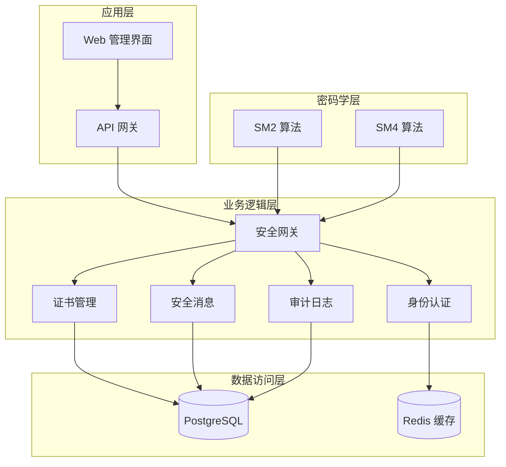
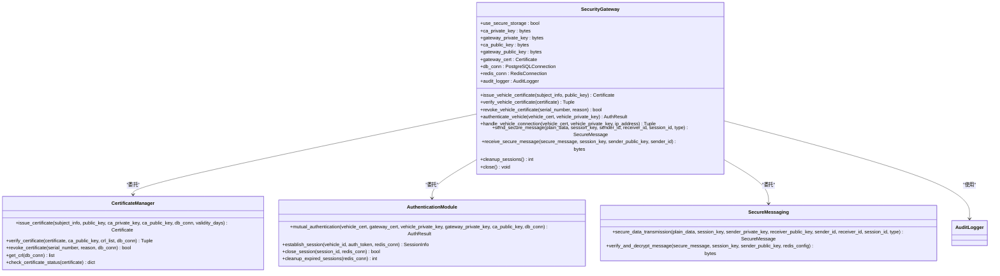
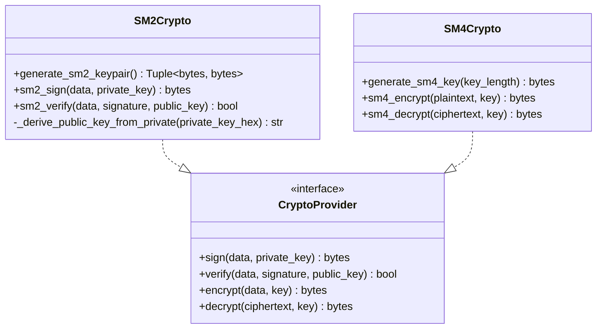
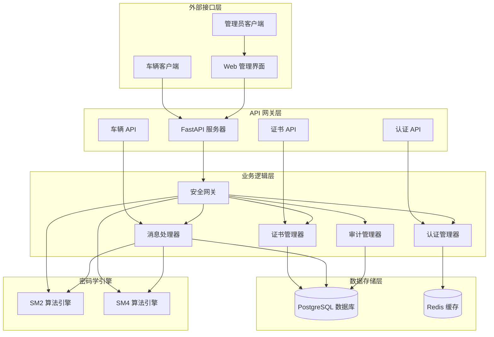
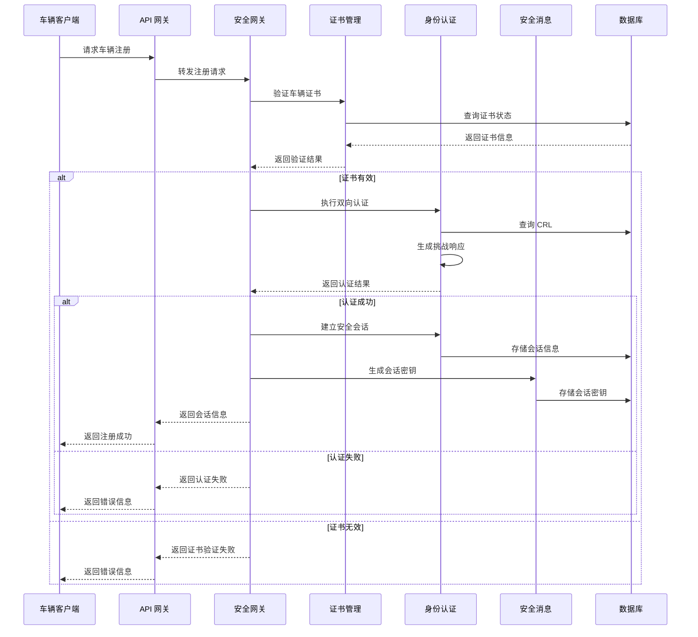
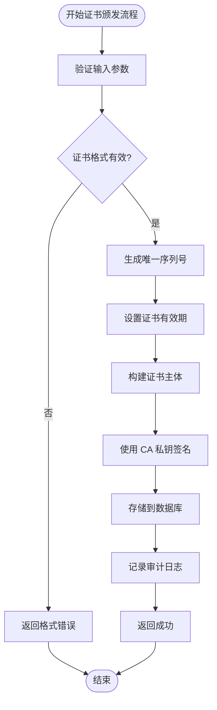
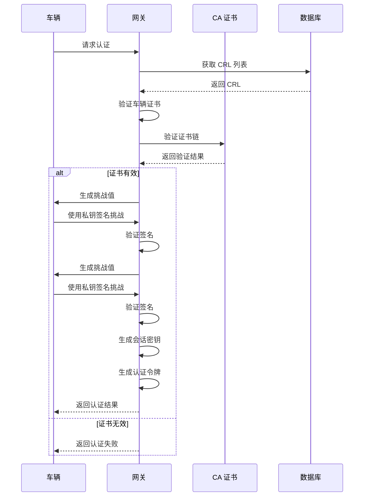
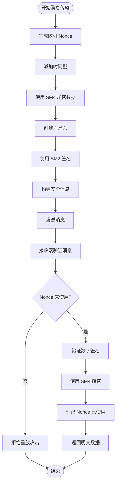
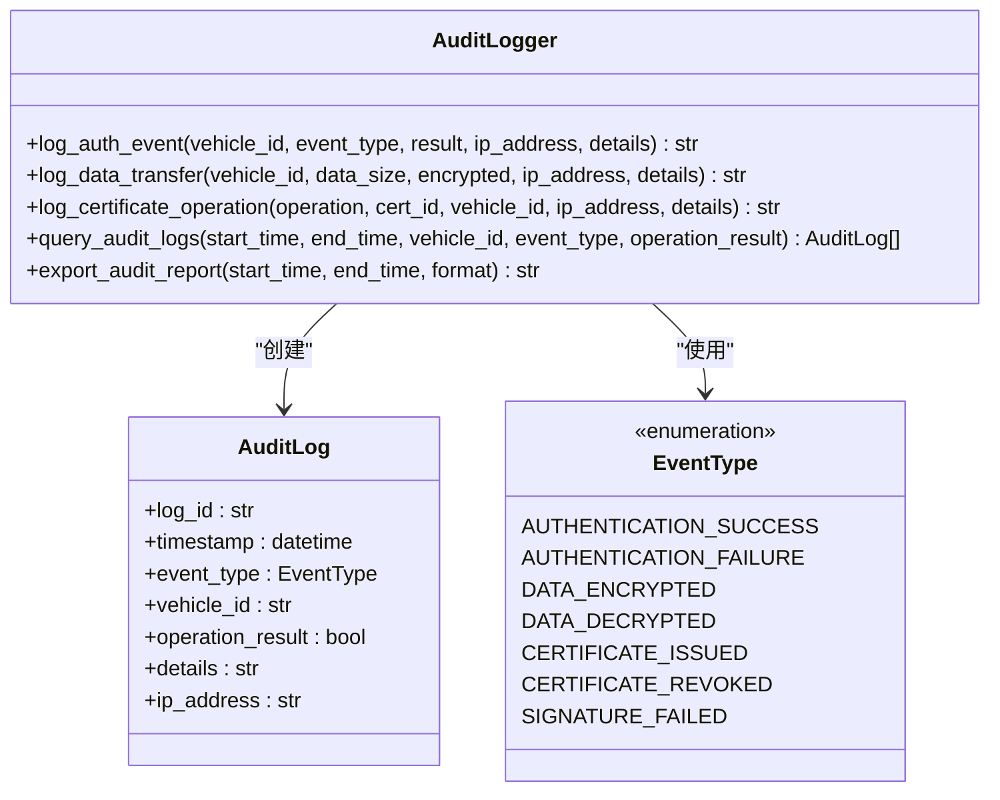
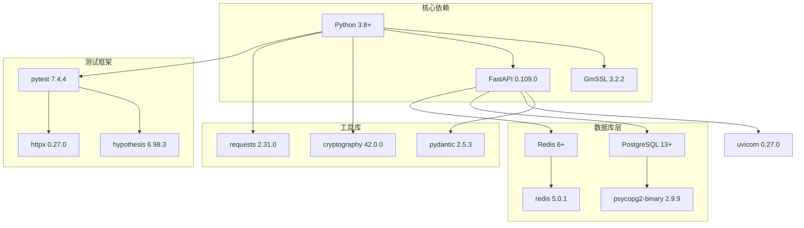

# 项目概述

<cite>
**本文档引用的文件**
- [README.md](file://README.md)
- [requirements.txt](file://requirements.txt)
- [src/security_gateway.py](file://src/security_gateway.py)
- [src/certificate_manager.py](file://src/certificate_manager.py)
- [src/authentication.py](file://src/authentication.py)
- [src/secure_messaging.py](file://src/secure_messaging.py)
- [src/crypto/sm2.py](file://src/crypto/sm2.py)
- [src/crypto/sm4.py](file://src/crypto/sm4.py)
- [src/db/postgres.py](file://src/db/postgres.py)
- [src/audit_logger.py](file://src/audit_logger.py)
- [src/api/main.py](file://src/api/main.py)
- [src/api/routes/auth.py](file://src/api/routes/auth.py)
- [src/api/routes/certificates.py](file://src/api/routes/certificates.py)
</cite>

## 目录
1. [引言](#引言)
2. [项目结构](#项目结构)
3. [核心组件](#核心组件)
4. [架构总览](#架构总览)
5. [详细组件分析](#详细组件分析)
6. [依赖关系分析](#依赖关系分析)
7. [性能考虑](#性能考虑)
8. [故障排除指南](#故障排除指南)
9. [结论](#结论)
10. [附录](#附录)

## 引言

车联网安全通信网关系统是一个基于中国国家标准密码算法（SM2/SM4）构建的端到端安全通信解决方案。该项目旨在为车联网生态系统提供可信的身份认证、机密性保护、完整性保障和可追溯的审计能力，满足国家对关键信息基础设施采用自主可控密码算法的要求。

### 核心价值与目标

系统的核心价值体现在以下几个方面：
- **合规性保障**：完全基于国密算法，符合国家密码管理局的相关规范要求
- **端到端安全**：从车辆到云端的全链路加密通信，确保数据在传输和存储过程中的机密性和完整性
- **双向认证**：实现车端与云侧的相互验证，防止中间人攻击
- **可审计性**：完整的审计日志体系，支持安全事件追踪和合规检查
- **高可用性**：通过会话管理和缓存机制，确保系统的稳定运行

### 应用场景与意义

该系统适用于以下典型场景：
- **智能网联汽车**：车载设备与云端平台的安全通信
- **车队管理系统**：多家车企的统一安全接入平台
- **智慧交通**：城市级车联网基础设施的安全支撑
- **工业物联网**：商用车队的远程监控和管理

在车联网这一新兴领域，网络安全威胁日益复杂，传统的安全方案难以满足严格的合规要求和安全强度需求。本系统通过采用经过国家认证的SM2/SM4算法，为车联网应用提供了符合国家标准的密码学基础。

## 项目结构

项目采用分层架构设计，按照功能职责清晰划分模块：

**图表来源**
- [src/security_gateway.py:37-128](file://src/security_gateway.py#L37-L128)
- [src/api/main.py:13-34](file://src/api/main.py#L13-L34)

### 主要模块职责

- **安全网关**：系统核心控制器，协调各个子模块的工作
- **证书管理**：负责证书的颁发、验证、撤销和状态管理
- **身份认证**：实现车云双向认证和会话管理
- **安全消息**：提供加密传输和数字签名功能
- **审计日志**：记录所有安全相关事件和操作
- **API 网关**：对外提供 RESTful 接口服务

**章节来源**
- [README.md:1-148](file://README.md#L1-L148)

## 核心组件

### 安全网关主控制器

安全网关是整个系统的核心，负责协调各个子模块的协作。它集成了证书管理、身份认证、加密通信和审计日志等功能模块。

**图表来源**
- [src/security_gateway.py:37-800](file://src/security_gateway.py#L37-L800)
- [src/certificate_manager.py:597-734](file://src/certificate_manager.py#L597-L734)
- [src/authentication.py:196-364](file://src/authentication.py#L196-L364)
- [src/secure_messaging.py:17-142](file://src/secure_messaging.py#L17-L142)

### 密码学算法实现

系统实现了完整的国密算法族，包括SM2数字签名算法和SM4对称加密算法。

**图表来源**
- [src/crypto/sm2.py:93-132](file://src/crypto/sm2.py#L93-L132)
- [src/crypto/sm4.py:11-46](file://src/crypto/sm4.py#L11-L46)

**章节来源**
- [src/security_gateway.py:37-128](file://src/security_gateway.py#L37-L128)
- [src/crypto/sm2.py:1-265](file://src/crypto/sm2.py#L1-L265)
- [src/crypto/sm4.py:1-189](file://src/crypto/sm4.py#L1-L189)

## 架构总览

系统采用微服务架构，通过清晰的分层设计实现了高内聚、低耦合的模块化结构。

**图表来源**
- [src/api/main.py:13-108](file://src/api/main.py#L13-L108)
- [src/security_gateway.py:37-128](file://src/security_gateway.py#L37-L128)

### 数据流设计

系统的数据流遵循严格的安全原则，确保每一步操作都有相应的安全保障和审计记录。

**图表来源**
- [src/api/routes/auth.py:70-230](file://src/api/routes/auth.py#L70-L230)
- [src/security_gateway.py:289-438](file://src/security_gateway.py#L289-L438)

## 详细组件分析

### 证书管理系统

证书管理系统是整个安全架构的基础，负责车辆身份的建立和管理。

**图表来源**
- [src/certificate_manager.py:597-734](file://src/certificate_manager.py#L597-L734)

#### 核心功能特性

- **唯一性保证**：使用UUID生成64字符的唯一序列号
- **有效期管理**：支持可配置的证书有效期（默认365天）
- **撤销机制**：完整的证书撤销列表（CRL）管理
- **状态查询**：实时查询证书的有效性状态

**章节来源**
- [src/certificate_manager.py:1-734](file://src/certificate_manager.py#L1-L734)

### 身份认证模块

身份认证模块实现了车云双向认证协议，确保双方身份的真实性和通信的机密性。

**图表来源**
- [src/authentication.py:196-364](file://src/authentication.py#L196-L364)

#### 认证流程特点

- **挑战-响应机制**：使用SM2算法进行数字签名验证
- **会话管理**：基于Redis的高性能会话存储
- **冲突处理**：支持会话冲突检测和处理策略
- **过期清理**：自动清理过期会话，释放系统资源

**章节来源**
- [src/authentication.py:1-662](file://src/authentication.py#L1-L662)

### 安全消息传输

安全消息传输模块提供了端到端的加密通信能力，确保数据在传输过程中的机密性和完整性。

**图表来源**
- [src/secure_messaging.py:17-142](file://src/secure_messaging.py#L17-L142)

#### 安全特性

- **防重放攻击**：Nonce机制确保消息的唯一性
- **时间戳验证**：防止过期消息的处理
- **完整性保护**：数字签名确保数据未被篡改
- **机密性保障**：SM4对称加密保护数据内容

**章节来源**
- [src/secure_messaging.py:1-249](file://src/secure_messaging.py#L1-L249)

### 审计日志系统

审计日志系统提供了完整的安全事件记录和追溯能力，满足合规要求和安全审计需求。

**图表来源**
- [src/audit_logger.py:26-480](file://src/audit_logger.py#L26-L480)

#### 审计能力

- **事件分类**：支持认证、数据传输、证书操作等多种事件类型
- **实时记录**：所有安全相关操作都会被实时记录
- **灵活查询**：支持按时间、车辆、事件类型等多维度查询
- **报告导出**：支持JSON和CSV格式的审计报告导出

**章节来源**
- [src/audit_logger.py:1-480](file://src/audit_logger.py#L1-L480)

## 依赖关系分析

系统的技术栈选择体现了对性能、安全性、可维护性的综合考量。

**图表来源**
- [requirements.txt:1-25](file://requirements.txt#L1-L25)

### 技术栈选择理由

- **Python 3.8+**：现代语法特性，丰富的生态库支持
- **GmSSL**：官方认证的国密算法库，性能优异
- **FastAPI**：高性能异步框架，自动生成API文档
- **PostgreSQL**：企业级关系型数据库，支持复杂查询
- **Redis**：高性能缓存和会话存储
- **pytest**：专业的测试框架，支持异步测试

**章节来源**
- [requirements.txt:1-25](file://requirements.txt#L1-L25)

## 性能考虑

系统在设计时充分考虑了性能优化，采用了多种技术和策略来提升整体性能表现。

### 缓存策略

- **证书验证缓存**：使用LRU缓存机制，缓存验证结果5分钟
- **会话状态缓存**：Redis存储会话信息，支持快速查找
- **Nonce 防重放缓存**：Redis标记已使用Nonce，防止重放攻击

### 并发处理

- **异步API**：FastAPI支持异步处理，提升并发性能
- **连接池管理**：数据库连接池复用，减少连接开销
- **会话并发控制**：Redis原子操作保证会话状态一致性

### 内存管理

- **密钥安全存储**：敏感密钥不长期驻留内存
- **会话密钥轮换**：定期更换会话密钥，降低风险
- **资源及时释放**：所有数据库和网络连接及时关闭

## 故障排除指南

### 常见问题及解决方案

#### 证书相关问题

**问题**：证书验证失败
- 检查证书有效期和撤销状态
- 验证CA公钥配置正确性
- 确认CRL列表同步状态

**问题**：证书颁发失败
- 检查CA私钥配置
- 验证数据库连接状态
- 确认公钥格式正确

#### 认证相关问题

**问题**：双向认证失败
- 检查车辆私钥与证书匹配
- 验证网关公钥配置
- 确认时间同步状态

**问题**：会话建立失败
- 检查Redis连接状态
- 验证会话密钥生成
- 确认会话超时配置

#### 消息传输问题

**问题**：消息解密失败
- 检查会话密钥有效性
- 验证消息签名完整性
- 确认Nonce未被使用

**问题**：重放攻击防护
- 检查Nonce缓存状态
- 验证时间戳有效性
- 确认消息时效性

**章节来源**
- [src/security_gateway.py:603-721](file://src/security_gateway.py#L603-L721)
- [src/authentication.py:554-597](file://src/authentication.py#L554-L597)

## 结论

车联网安全通信网关系统通过采用先进的国密算法和严谨的架构设计，为车联网应用提供了全面的安全保障。系统不仅满足了技术层面的安全要求，更重要的是建立了完善的合规体系和审计能力。

### 主要成就

- **技术先进性**：完全基于SM2/SM4算法，符合国家密码标准
- **架构合理性**：清晰的分层设计，良好的模块化结构
- **功能完整性**：涵盖证书管理、身份认证、加密通信、审计日志的完整安全体系
- **运维友好性**：提供完善的API接口和管理界面

### 未来发展方向

- **性能优化**：进一步优化算法实现，提升处理效率
- **扩展性增强**：支持更多的设备类型和通信协议
- **智能化运维**：引入AI技术进行安全态势感知
- **标准化推进**：参与行业标准制定，推动技术普及

该系统为车联网安全通信提供了一个可靠的参考实现，既适合初学者学习密码学原理，也为有经验的开发者提供了实用的技术方案。

## 附录

### 快速开始指南

1. **环境准备**：安装Python 3.8+和必要的系统依赖
2. **数据库配置**：启动PostgreSQL和Redis服务
3. **依赖安装**：使用requirements.txt安装Python包
4. **配置文件**：设置环境变量和数据库连接
5. **启动服务**：运行API服务器和Web界面

### 开发规范

- **代码风格**：遵循PEP8规范，使用类型注解
- **测试要求**：每个模块至少包含单元测试和集成测试
- **文档标准**：所有公共接口都需要详细的文档注释
- **安全准则**：严格遵守密码学安全最佳实践