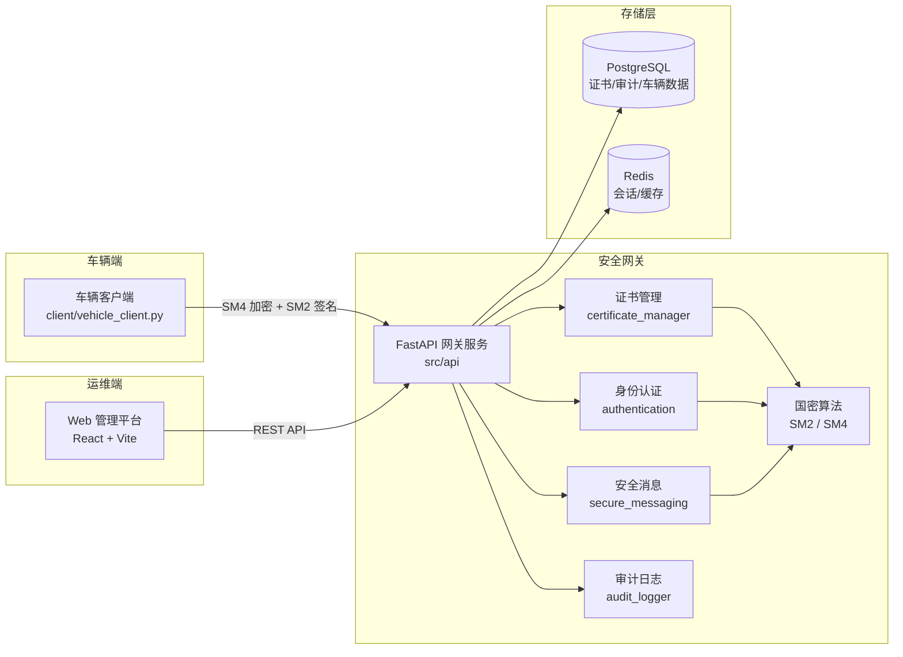
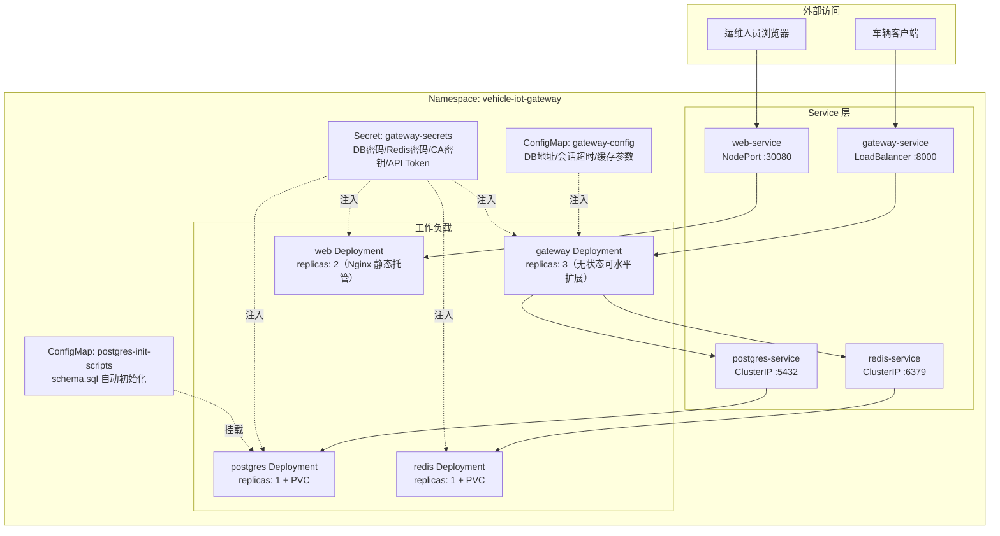
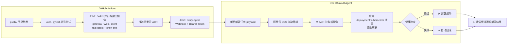

# 车联网安全通信网关系统

基于国密算法（SM2/SM4）的车联网（V2X）安全通信网关，为车辆与云端之间提供**证书管理、双向身份认证、加密签名传输、审计日志**的端到端安全通信能力。

项目采用**云原生架构**：Kubernetes 集群编排 + GitHub Actions CI/CD 流水线 + **OpenClaw AI Agent 自主部署**，实现 `git push` 后从测试、三镜像构建、推送 ACR，到阿里云 ECS 自动开机、K8s 滚动部署、健康检查回滚、微信结果通知的**全自动一键交付闭环**。

## 目录

- [系统架构](#系统架构)
- [Kubernetes 架构设计](#kubernetes-架构设计)
- [CI/CD 与 OpenClaw 一键部署](#cicd-与-openclaw-一键部署)
- [核心功能](#核心功能)
- [项目结构](#项目结构)
- [技术栈](#技术栈)
- [快速开始](#快速开始)
- [Web 管理平台](#web-管理平台)
- [车辆客户端](#车辆客户端)
- [API 概览](#api-概览)
- [测试与验证](#测试与验证)
- [安全特性](#安全特性)
- [文档索引](#文档索引)

## 系统架构



**通信流程**：车辆注册获取 SM2 证书 → 车云双向挑战-响应认证 → 协商 SM4 会话密钥 → 加密 + 签名传输业务数据 → 全程审计留痕。

## Kubernetes 架构设计

生产环境部署在阿里云 ECS 自建 K8s 集群，所有资源收敛在 `vehicle-iot-gateway` 命名空间内，清单位于 `deployment/kubernetes/`：



### 设计要点

| 维度 | 设计 |
|------|------|
| **流量入口** | 网关 API 走 `LoadBalancer`（车辆直连）；Web 控制台走 `NodePort 30080`；数据库/缓存仅 `ClusterIP` 集群内可达，不暴露公网 |
| **高可用** | 网关 3 副本、Web 2 副本，配合 liveness/readiness 探针实现滚动更新零中断 |
| **资源配额** | gateway：requests 250m/256Mi，limits 500m/512Mi；web：100m/128Mi ~ 200m/256Mi，防止资源争抢 |
| **配置分离** | 非敏感参数入 `gateway-config`（ConfigMap），密码与 CA 密钥入 `gateway-secrets`（Secret），镜像与配置完全解耦 |
| **数据初始化** | PostgreSQL 通过 init ConfigMap 挂载 `schema.sql`，Pod 首次启动自动建表，无需人工介入 |
| **持久化** | PostgreSQL / Redis 挂载 PVC，Pod 重建数据不丢（另提供无 PVC 的轻量部署方案，见 [docs/NO_PVC_DEPLOYMENT.md](docs/NO_PVC_DEPLOYMENT.md)） |
| **成本控制** | 按量付费 ECS：新版本推送时由 Agent 自动开机部署，crontab 兜底定时关机，按需付费 |

### 手动部署命令

```bash
cd deployment/kubernetes
./deploy-all.sh      # 一键部署：namespace → secrets → configmap → postgres → redis → gateway → web
./cleanup.sh         # 清理全部资源

# 常用运维命令
kubectl -n vehicle-iot-gateway get pods -o wide
kubectl -n vehicle-iot-gateway logs -f deploy/gateway
kubectl -n vehicle-iot-gateway rollout restart deploy/gateway
```

详见 [deployment/kubernetes/README.md](deployment/kubernetes/README.md) 与 [docs/DEPLOYMENT.md](docs/DEPLOYMENT.md)。

## CI/CD 与 OpenClaw 一键部署

`git push main` 即触发全自动交付流水线（[.github/workflows/ci.yml](.github/workflows/ci.yml)），后半程由 **OpenClaw AI Agent** 接管，自主完成云上部署并通过微信回报结果：



### 流水线设计

| Job | 触发条件 | 职责 |
|-----|----------|------|
| `test` | push / PR / 手动 | Python 3.11 + pip 缓存，运行 pytest 全量测试 |
| `build-and-push` | 仅 push / 手动（PR 不推镜像） | Buildx 构建 gateway/web/client 三镜像，GHA 分 scope 缓存加速，双 tag（`latest` + commit short-sha）推送 ACR |
| `notify-agent` | 构建成功后 | 用 `jq` 构造含镜像清单、commit 信息、K8s 清单路径的 JSON payload，`Bearer Token` 鉴权 POST 到 Agent Webhook，HTTP ≥400 即失败 |

### OpenClaw Agent 自主部署

Agent 收到 Webhook 后按任务指令自主执行，全程无人值守：

1. **ECS 开机**：检测按量付费 ECS 状态，停机则自动启动（省成本的关键）
2. **镜像更新**：从 ACR 拉取 short-sha 版本镜像
3. **K8s 部署**：应用 `deployment/kubernetes/` 清单执行滚动更新
4. **健康检查**：验证 `/health` 端点，失败自动回滚上一版本
5. **结果通知**：通过 `openclaw-weixin` 频道将部署结果推送到微信

### 所需 GitHub Secrets

| Secret | 用途 |
|--------|------|
| `ACR_REGISTRY` / `ACR_NAMESPACE` | 阿里云 ACR 地址与命名空间 |
| `ACR_USERNAME` / `ACR_PASSWORD` | ACR 登录凭证 |
| `AGENT_WEBHOOK_URL` | OpenClaw Agent Webhook 地址 |
| `OPENCLAW_HOOK_TOKEN` | Webhook Bearer Token |
| `OPENCLAW_NOTIFY_TO` | 微信通知接收方 ID |

### 本地镜像构建（不走流水线时）

```bash
./quick-build.sh                                  # 本地快速构建
./build-and-push.sh -r <镜像仓库> -v <版本> -p     # 构建并推送
./build-all-images.sh                             # 构建全部镜像（网关 + Web + 客户端）
```

## 核心功能

### 🔐 证书管理（`src/certificate_manager.py`）
- 基于 SM2 的车辆证书颁发与签发
- 证书验证：有效期、签名链、撤销状态三重校验
- 证书撤销与 CRL（证书撤销列表）管理
- 证书缓存加速（`src/certificate_cache.py`，LRU + TTL）

### 🤝 身份认证（`src/authentication.py`）
- 车云**双向**挑战-响应认证（SM2 签名验证）
- 会话管理：SM4 会话密钥协商，Redis 存储，超时自动失效
- 认证失败锁定策略，防暴力破解

### 📨 安全消息传输（`src/secure_messaging.py`）
- SM4 对称加密/解密业务数据
- SM2 数字签名/验签保证完整性与不可否认性
- 时间戳 + nonce 双重防重放机制

### 📋 审计日志（`src/audit_logger.py`）
- 认证事件、数据传输、证书操作、安全异常全量记录
- 支持按车辆/事件类型/时间范围查询与报告导出

### ⚙️ 其他能力
- **安全策略管理**（`src/security_policy_manager.py`）：会话超时、时间戳容差等策略动态配置
- **密钥安全存储**（`src/secure_key_storage.py`）：CA 私钥加密保管
- **性能监控**（`src/performance_monitor.py`）：延迟/吞吐量指标采集
- **车辆数据上报**：车速、位置、电量等遥测数据加密上报与展示

## 项目结构

```
.
├── src/                        # 网关核心源代码
│   ├── api/                    # FastAPI 应用
│   │   ├── main.py             # 应用入口
│   │   └── routes/             # 路由：auth / certificates / vehicles / audit / config / metrics
│   ├── crypto/                 # 国密算法封装（sm2.py / sm4.py）
│   ├── db/                     # PostgreSQL / Redis 连接管理
│   ├── models/                 # 数据模型（证书/会话/报文/审计/枚举）
│   ├── certificate_manager.py  # 证书生命周期管理
│   ├── certificate_cache.py    # 证书缓存
│   ├── authentication.py       # 双向认证与会话管理
│   ├── secure_messaging.py     # 安全消息加解密与签验签
│   ├── security_gateway.py     # 网关核心编排
│   ├── security_policy_manager.py  # 安全策略管理
│   ├── secure_key_storage.py   # 密钥安全存储
│   ├── audit_logger.py         # 审计日志
│   └── performance_monitor.py  # 性能监控
├── web/                        # Web 管理平台（React 18 + Vite）
│   └── src/pages/              # 车辆监控 / 指标仪表板 / 审计日志 / 证书管理 / 安全配置
├── client/                     # 车辆模拟客户端（支持 Docker 多实例）
├── config/                     # 数据库配置模块
├── db/                         # 数据库脚本（schema.sql / migrations / 初始数据）
├── deployment/kubernetes/      # K8s 部署清单与一键部署脚本
├── scripts/                    # CA 密钥生成、数据库初始化等工具脚本
├── tests/                      # 单元测试与集成测试（pytest）
├── verification_tests/         # 系统验证测试（功能/性能/安全）
├── examples/                   # 功能演示脚本
├── docs/                       # 详细文档（API/部署/运维/排障/任务实现记录）
├── .github/workflows/ci.yml    # GitHub Actions CI 流水线
├── docker-compose.yml          # 一键启动（PostgreSQL + Redis + 网关）
├── Dockerfile                  # 网关镜像构建
└── requirements.txt            # Python 依赖
```

## 技术栈

| 分类 | 技术 | 说明 |
|------|------|------|
| 语言 | Python 3.8+（镜像使用 3.11） | 网关核心实现 |
| 国密算法 | GmSSL 3.2.2 | SM2 椭圆曲线 / SM4 对称加密 |
| Web 框架 | FastAPI 0.109 + Uvicorn | REST API 服务 |
| 数据库 | PostgreSQL 15 | 证书、审计日志、车辆数据持久化 |
| 缓存 | Redis 7 | 会话管理、证书缓存 |
| 前端 | React 18 + Vite + Recharts | 运维管理平台 |
| 测试 | pytest + Hypothesis + httpx | 单元/集成/属性测试 |
| 部署 | Docker / Docker Compose / Kubernetes（阿里云 ECS 自建） | 容器化与集群编排 |
| 镜像仓库 | 阿里云 ACR | 私有镜像托管 |
| CI/CD | GitHub Actions + OpenClaw AI Agent | 自动测试构建 + AI 自主部署 + 微信通知 |

## 快速开始

### 方式一：Docker Compose 一键启动（推荐）

```bash
# 1. 配置环境变量（可选，均有默认值）
cp .env.example .env

# 2. 生成 CA 密钥
python scripts/generate_ca_keys.py

# 3. 一键启动 PostgreSQL + Redis + 网关
docker-compose up -d

# 4. 验证服务
curl http://localhost:8000/health
```

启动后：
- 网关 API：`http://localhost:8000`（Swagger 文档：`http://localhost:8000/docs`）
- PostgreSQL：`localhost:5432`（自动执行 `db/schema.sql` 初始化）
- Redis：`localhost:6379`

### 方式二：本地开发环境

```bash
# 1. 创建并激活虚拟环境
python -m venv venv
venv\Scripts\activate        # Windows
source venv/bin/activate     # Linux/Mac

# 2. 安装依赖
pip install -r requirements.txt

# 3. 配置环境变量
cp .env.example .env

# 4. 初始化数据库
createdb vehicle_iot_gateway
psql -d vehicle_iot_gateway -f db/schema.sql

# 5. 启动 Redis
docker run -d -p 6379:6379 redis:7-alpine

# 6. 启动网关 API 服务
python examples/run_api_server.py
```

### 关键环境变量

| 变量 | 默认值 | 说明 |
|------|--------|------|
| `POSTGRES_HOST/PORT/DB/USER/PASSWORD` | localhost / 5432 / vehicle_iot_gateway / gateway_user / - | PostgreSQL 连接 |
| `REDIS_HOST/PORT/PASSWORD` | localhost / 6379 / - | Redis 连接 |
| `CA_PRIVATE_KEY_PATH` | /app/keys/ca_private.pem | CA 私钥路径 |
| `SESSION_TIMEOUT` | 3600 | 会话超时（秒） |
| `TIMESTAMP_TOLERANCE` | 300 | 防重放时间戳容差（秒） |
| `CACHE_SIZE` / `CACHE_TTL` | 10000 / 300 | 证书缓存容量与 TTL |

完整配置说明见 [.env.example](.env.example) 与 [docs/INSTALLATION.md](docs/INSTALLATION.md)。

## Web 管理平台

位于 `web/` 目录，提供五大运维页面：

| 页面 | 功能 |
|------|------|
| 车辆监控 | 在线车辆列表、连接状态、遥测数据（车速/位置/电量） |
| 安全指标仪表板 | 认证成功率、消息吞吐量、延迟等实时图表 |
| 审计日志 | 事件查询、筛选、导出 |
| 证书管理 | 证书列表、颁发、撤销、CRL 查看 |
| 安全配置 | 会话超时、锁定策略等参数动态调整 |

```bash
cd web
npm install
npm run dev        # 开发模式，默认 http://localhost:5173
npm run build      # 生产构建
```

详见 [web/README.md](web/README.md) 与 [web/QUICKSTART.md](web/QUICKSTART.md)。

## 车辆客户端

位于 `client/` 目录，模拟真实车辆完成**注册 → 认证 → 加密数据上报**全流程：

```bash
# 单客户端运行
python client/vehicle_client.py

# Docker 多客户端模拟（本地网关）
cd client && docker-compose up -d

# 连接云端网关
cd client && docker-compose -f docker-compose-cloud.yml up -d

# 批量启动多客户端
python client/run_clients.py
```

详见 [client/README.md](client/README.md) 与 [client/MULTI_CLIENT_GUIDE.md](client/MULTI_CLIENT_GUIDE.md)。

## API 概览

| 模块 | 路由前缀 | 主要接口 |
|------|----------|----------|
| 认证 | `/api/v1/auth` | 车辆注册、挑战获取、认证响应、会话管理 |
| 证书 | `/api/v1/certificates` | 证书查询、颁发、撤销、CRL |
| 车辆 | `/api/v1/vehicles` | 车辆列表、状态、遥测数据上报与查询 |
| 审计 | `/api/v1/audit` | 日志查询、筛选、报告导出 |
| 配置 | `/api/v1/config` | 安全策略读取与更新 |
| 指标 | `/api/v1/metrics` | 性能与安全指标 |

完整接口文档见 [docs/API.md](docs/API.md)，或启动服务后访问 `/docs`（Swagger UI）。

## 测试与验证

```bash
# 单元测试与集成测试（tests/，26 个测试模块）
pytest tests/ -v

# 系统验证测试（需网关运行中）
python verification_tests/test_functional.py    # 功能验证
python verification_tests/test_performance.py   # 性能验证
python verification_tests/test_security.py      # 安全验证
```

- `tests/`：覆盖证书管理、认证、加密消息、审计、缓存、API 等模块的单元/集成测试，含 Hypothesis 属性测试
- `verification_tests/`：面向运行中系统的端到端验证套件（功能/性能/安全三维度），详见 [verification_tests/README.md](verification_tests/README.md)
- `examples/`：各功能模块的独立演示脚本

## 安全特性

- ✅ **国密合规**：SM2 非对称加密/签名 + SM4 对称加密
- ✅ **双向身份认证**：车云互验，杜绝单向信任
- ✅ **端到端加密**：业务数据全程 SM4 加密传输
- ✅ **完整性保护**：SM2 数字签名验证
- ✅ **防重放攻击**：时间戳容差校验 + nonce 唯一性检查
- ✅ **证书生命周期**：颁发、验证、撤销、CRL 全流程管理
- ✅ **暴力破解防护**：认证失败锁定机制
- ✅ **密钥安全**：CA 私钥加密存储，容器只读挂载
- ✅ **全量审计**：安全事件可追溯、可导出

## 文档索引

| 类别 | 文档 |
|------|------|
| 安装部署 | [docs/INSTALLATION.md](docs/INSTALLATION.md) · [docs/DEPLOYMENT.md](docs/DEPLOYMENT.md) · [QUICKSTART_DOCKER.md](QUICKSTART_DOCKER.md) · [COMPLETE_DEPLOYMENT_GUIDE.md](COMPLETE_DEPLOYMENT_GUIDE.md) |
| K8s 专项 | [deployment/kubernetes/README.md](deployment/kubernetes/README.md) · [docs/K8S_DATABASE_INIT.md](docs/K8S_DATABASE_INIT.md) · [docs/NO_PVC_DEPLOYMENT.md](docs/NO_PVC_DEPLOYMENT.md) · [K8S_ONE_CLICK_DEPLOY_README.md](K8S_ONE_CLICK_DEPLOY_README.md) |
| 运维排障 | [docs/OPERATIONS.md](docs/OPERATIONS.md) · [docs/TROUBLESHOOTING.md](docs/TROUBLESHOOTING.md) |
| API 参考 | [docs/API.md](docs/API.md) |
| CA 密钥 | [docs/CA_KEY_CONFIGURATION.md](docs/CA_KEY_CONFIGURATION.md) |
| 加密传输 | [ENCRYPTED_TRANSMISSION_GUIDE.md](ENCRYPTED_TRANSMISSION_GUIDE.md) |
| 需求与设计 | [.kiro/specs/vehicle-iot-security-gateway/](.kiro/specs/vehicle-iot-security-gateway/)（requirements / design / tasks） |
| 实现记录 | `docs/task_*_implementation_summary.md`（各任务实现总结） |

## 许可证

本项目遵循相关开源许可证。
